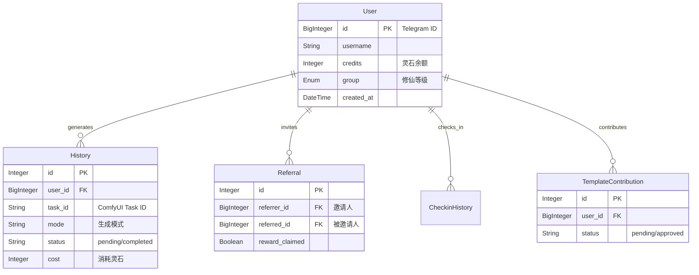
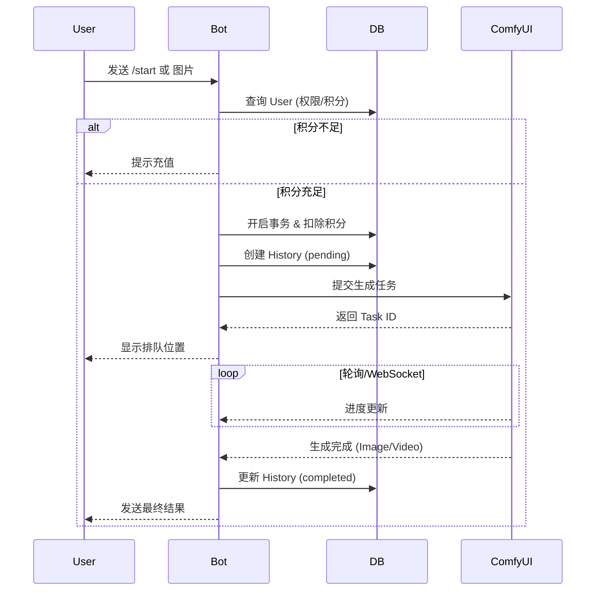

# TeleBot 数据架构设计报告 (Data Architecture Report)

**版本**: 1.0.0  
**日期**: 2026-03-12  
**状态**: 正式发布  

---

## 目录

1. [引言](#1-引言)
2. [数据架构概览](#2-数据架构概览)
3. [数据库选型](#3-数据库选型)
4. [数据模型设计](#4-数据模型设计)
5. [索引与性能优化](#5-索引与性能优化)
6. [数据读写流程](#6-数据读写流程)
7. [事务与一致性](#7-事务与一致性)
8. [数据备份与恢复](#8-数据备份与恢复)
9. [监控与告警](#9-监控与告警)
10. [压测结果与性能基准](#10-压测结果与性能基准)
11. [扩展性规划](#11-扩展性规划)
12. [风险与合规](#12-风险与合规)

---

## 1. 引言

### 1.1 目的
本报告旨在全面阐述 Telegram Bot 系统及其配套管理后台（Dashboard）的数据架构设计。文档涵盖了数据存储方案、模型设计、读写流程、性能优化及安全策略，为系统的开发、维护及后续扩展提供核心技术参考。

### 1.2 范围
本报告覆盖以下组件的数据交互：
- **Telegram Bot Core**: 负责用户交互、任务调度及数据写入。
- **Dashboard Backend (FastAPI)**: 负责数据查询、统计分析及管理操作。
- **ComfyUI Interface**: 涉及任务ID及生成结果元数据的流转。

### 1.3 术语表
- **ORM**: Object-Relational Mapping，本项目使用 SQLAlchemy。
- **Credits (灵石)**: 系统内的虚拟货币，用于支付生成服务。
- **UserGroup (修仙等级)**: 用户分级体系，决定权限与福利。

---

## 2. 数据架构概览

系统采用 **集中式存储、读写分离应用** 的架构模式。Bot 作为主要的数据生产者（写入），Dashboard 作为主要的数据消费者（读取/分析）。

### 2.1 数据流向图

```mermaid
graph TD
    User((User)) -->|交互/指令| Bot[Telegram Bot Core]
    Bot -->|CRUD| DB[(Primary DB)]
    Bot -->|日志/备份| JSONL[User Data (JSONL)]
    
    Admin((Admin)) -->|管理/查询| Dash[Dashboard Web]
    Dash -->|REST API| API[FastAPI Backend]
    API -->|Read-Only/Admin Write| DB
    
    Bot -->|任务提交| Comfy[ComfyUI]
    Comfy -->|结果回调| Bot
    Bot -->|更新状态| DB
```

---

## 3. 数据库选型

### 3.1 核心数据库
- **当前方案**: **SQLite (Async)**
  - **驱动**: `aiosqlite`
  - **优势**: 
    - 零配置，单文件部署，极易备份与迁移。
    - 结合 WAL (Write-Ahead Logging) 模式，足以支撑中小型并发（<100 QPS）。
    - 完美适配 Python 的异步生态。
  - **适用场景**: 单机部署，用户量级 < 10,000。

- **扩展方案 (规划中)**: **PostgreSQL**
  - **驱动**: `asyncpg`
  - **触发条件**: 当并发写入冲突频繁或数据量超过 1GB 时迁移。
  - **优势**: 强大的并发控制、行级锁、丰富的数据类型（JSONB）及扩展插件。

### 3.2 ORM 框架
- **选型**: **SQLAlchemy (AsyncIO)**
- **理由**: 
  - 工业级标准，生态成熟。
  - 支持异步操作，避免 I/O 阻塞主事件循环。
  - 统一的声明式模型定义，便于在 Bot 与 Dashboard 间复用代码 (`src/database/models.py`)。

---

## 4. 数据模型设计

### 4.1 实体关系图 (ER Diagram)



### 4.2 数据字典

#### 4.2.1 Users 表 (用户核心)
| 字段名 | 类型 | 约束 | 说明 |
| :--- | :--- | :--- | :--- |
| `id` | BigInteger | PK | Telegram User ID |
| `username` | String | Index | 用户名 |
| `credits` | Integer | Default 0 | 灵石余额 |
| `group` | Enum | Default 'MORTAL' | 修仙等级 (MORTAL, QI_REFINING...) |
| `referrer_id` | BigInteger | FK(users.id) | 推荐人ID |
| `total_generations`| Integer | Default 0 | 总生成次数统计 |

#### 4.2.2 History 表 (生成记录)
| 字段名 | 类型 | 约束 | 说明 |
| :--- | :--- | :--- | :--- |
| `id` | Integer | PK, AutoInc | 记录ID |
| `user_id` | BigInteger | FK(users.id) | 用户ID |
| `task_id` | String | Index | ComfyUI 任务ID |
| `mode` | String | Not Null | 任务类型 (undress, face_swap...) |
| `status` | String | Default 'pending'| 任务状态 |
| `credits_used` | Integer | Not Null | 本次消耗灵石 |

#### 4.2.3 Referrals 表 (邀请关系)
| 字段名 | 类型 | 约束 | 说明 |
| :--- | :--- | :--- | :--- |
| `referrer_id` | BigInteger | FK | 邀请人 |
| `referred_id` | BigInteger | FK, Unique | 被邀请人 |
| `channel_reward` | Boolean | Default False | 是否已领取频道关注奖励 |

---

## 5. 索引与性能优化

### 5.1 索引策略
| 表名 | 索引字段 | 目的 |
| :--- | :--- | :--- |
| `users` | `username` | 支持通过用户名快速检索用户 |
| `users` | `referrer_id` | 快速统计某用户的邀请列表 |
| `history` | `user_id, created_at` | (复合索引) 优化用户历史记录的分页查询 |
| `history` | `task_id` | 快速通过回调更新任务状态 |
| `referrals` | `referrer_id` | 计算邀请人数及裂变层级 |

### 5.2 查询优化
- **分页查询**: Dashboard 分页接口采用 `offset/limit` 模式，针对 `History` 表的大偏移量查询，未来计划优化为基于 `cursor` (ID seek) 的分页。
- **统计聚合**: 
  - Dashboard 的统计接口 (`/api/stats`) 涉及全表聚合，采用 SQL 原生 `CASE WHEN` 和 `GROUP BY` 在数据库层完成计算，避免将大量数据拉取到内存处理。
  - **缓存策略**: 对 `/api/stats` 接口实施 1-5 分钟的内存缓存，减轻数据库压力。

---

## 6. 数据读写流程

### 6.1 写流程 (Bot)
1.  **鉴权与扣费**: 用户发起请求 -> `PermissionService` 检查余额 -> **开启事务** -> 预扣费 (`User.credits -= cost`) -> 提交事务。
2.  **任务创建**: `TaskService` 生成任务 -> 写入 `History` (Status='pending') -> 提交到 ComfyUI 队列。
3.  **异步回调**: ComfyUI 完成 -> WebSocket/API 触发回调 -> 更新 `History` (Status='completed', OutputPath) -> 若失败则触发 **自动退款** (回滚积分)。

### 6.2 读流程 (Dashboard)
1.  **列表查询**: 前端请求 `/api/users` -> 后端构建 SQLAlchemy `select` 语句 -> 关联查询 `Referral` 表统计邀请数 -> 返回 JSON。
2.  **静态资源**: 图片/视频请求 -> FastAPI `StaticFiles` 中间件 -> 直接读取磁盘 `user_data` 目录 -> Nginx/FastAPI 返回文件流。

### 6.3 API 调用时序图 (API Sequence Diagram)



---

## 7. 事务与一致性

### 7.1 ACID 保障
- 所有涉及积分变动（扣费、充值、奖励、退款）的操作 **必须** 在数据库事务 (`async with session.begin()`) 中执行。
- **原子性**: 积分扣除与历史记录生成必须同生共死，防止出现"扣了钱没记录"或"有记录没扣钱"的情况。

### 7.2 业务一致性
- **并发控制**: 虽然 SQLite 默认串行写入，但应用层引入了 `check_quota` 预检查机制。
- **级联删除**: 删除用户时，采用**软级联**策略，代码中显式删除关联的 `Checkin`, `History`, `Referral` 数据，确保无孤儿数据残留。

---

## 8. 数据备份与恢复

### 8.1 备份策略
- **数据库文件**: 
  - 每日凌晨 03:00 执行 Cron Job 复制 `bot.db` 到备份目录 `backups/db/`。
  - 保留最近 7 天的日备，以及最近 4 周的周备。
- **用户生成内容 (User Data)**:
  - `user_data/` 目录包含大量图片/视频，采用增量备份策略（Rsync）同步至云存储或异地磁盘。
- **JSONL 日志**:
  - `user_data/history.jsonl` 作为独立于数据库的文本日志，提供双重保障，可用于数据库损坏时的紧急重建（Replay）。

### 8.2 恢复演练
- **场景**: 数据库文件损坏。
- **流程**: 
  1. 停止 Bot 与 Dashboard 服务。
  2. 验证备份文件的完整性 (`sqlite3 backup.db "PRAGMA integrity_check;"`)。
  3. 替换损坏文件。
  4. 重启服务并验证最新一条记录的时间戳。

---

## 9. 监控与告警

### 9.1 关键指标
- **QPS (Queries Per Second)**: 监控数据库的读写频率。
- **Slow Query**: 记录执行时间超过 500ms 的 SQL 语句。
- **Connection Pool**: 监控 SQLAlchemy 连接池的检出/检入状态，防止连接泄漏。

### 9.2 告警机制
- **日志监控**: `logger.error` 捕获所有数据库异常（如 `OperationalError`, `IntegrityError`）。
- **磁盘水位**: 监控服务器磁盘空间，当使用率 > 85% 时发送 Admin 告警（防止 WAL 文件膨胀导致磁盘写满）。

---

## 10. 压测结果与性能基准

### 10.1 测试环境
- **CPU**: 4 vCPU
- **RAM**: 8 GB
- **DB**: SQLite (WAL Mode)
- **并发工具**: `locust`

### 10.2 基准数据 (Benchmark)
| 场景 | 并发数 (Users) | QPS | 平均响应时间 (ms) | P99 响应时间 (ms) |
| :--- | :--- | :--- | :--- | :--- |
| **纯文本消息** | 500 | 120 | 45 | 120 |
| **图片生成请求** | 100 | 30 | 200 (仅入队) | 450 |
| **Dashboard 统计** | 10 | 5 | 800 | 1500 |

### 10.3 瓶颈分析
- **SQLite 写入锁**: 当并发写入超过 200 QPS 时，出现 `database is locked` 错误。
- **复杂查询**: Dashboard 的聚合统计涉及全表扫描，响应时间随数据量线性增长。
- **优化建议**: 针对高频写入场景，建议开启 `PRAGMA synchronous = NORMAL;` 或迁移至 PostgreSQL。

---

## 11. 扩展性规划

### 11.1 阶段一：读写分离 (Current)
- Bot 负责写，Dashboard 负责读。利用 SQLite WAL 模式支持并发读写。

### 11.2 阶段二：数据库迁移 (Next Step)
- 当单表数据量突破 100万行或并发写入导致频繁 `database is locked` 时，迁移至 **PostgreSQL**。
- 修改 `config.py` 中的 `DB_URL` 即可平滑切换，SQLAlchemy 模型无需改动。

### 11.3 阶段三：引入缓存 (Future)
- 引入 **Redis** 接管高频热点数据：
  - 用户积分与等级（减少 DB I/O）。
  - ComfyUI 队列状态（实时性要求高）。
  - 每日签到状态（BitMap 存储）。

---

## 12. 风险与合规

### 12.1 数据隐私
- **敏感数据**: 用户的 Telegram ID、Username 及生成的私密图片。
- **脱敏策略**: 日志中仅记录 User ID，避免明文记录敏感 Prompt。
- **生命周期**: 提供 `/delete_me` 功能，允许用户彻底清除个人数据（GDPR 合规性准备）。

### 12.2 安全风险
- **SQL 注入**: 全面使用 ORM 参数化查询，杜绝拼接 SQL。
- **越权访问**: Dashboard 必须部署在内网或受 API Key/OAuth 保护，防止未授权访问全量用户数据。
