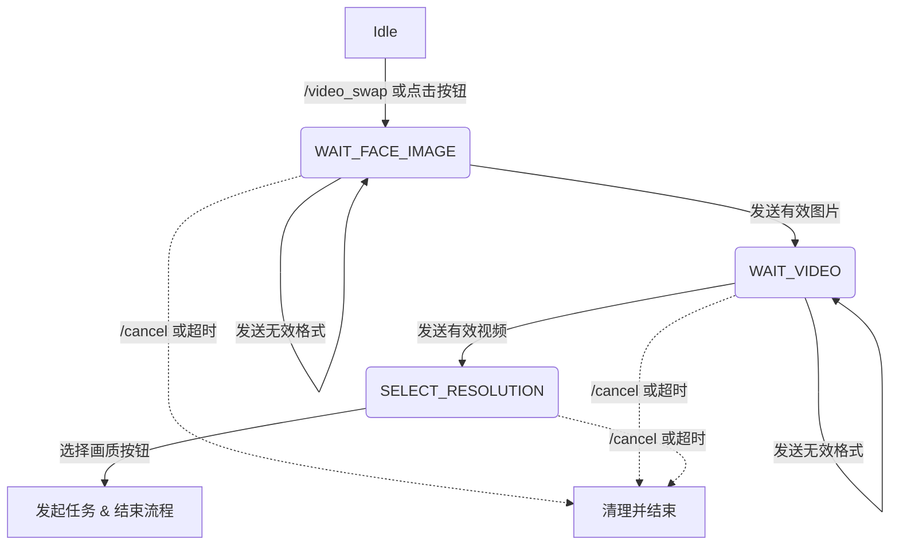
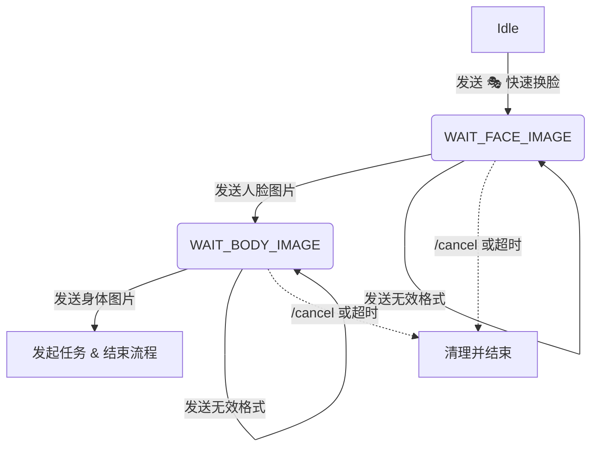
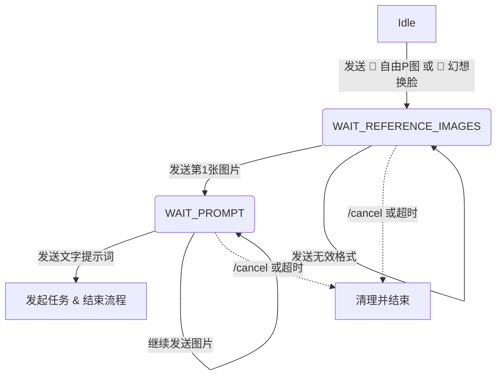
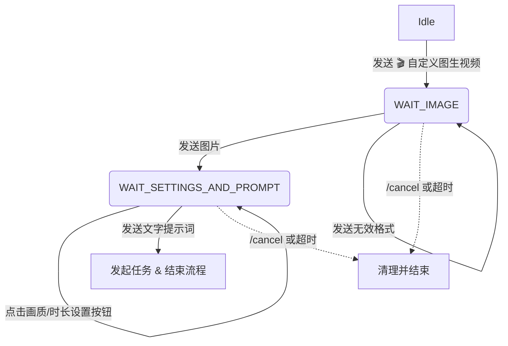
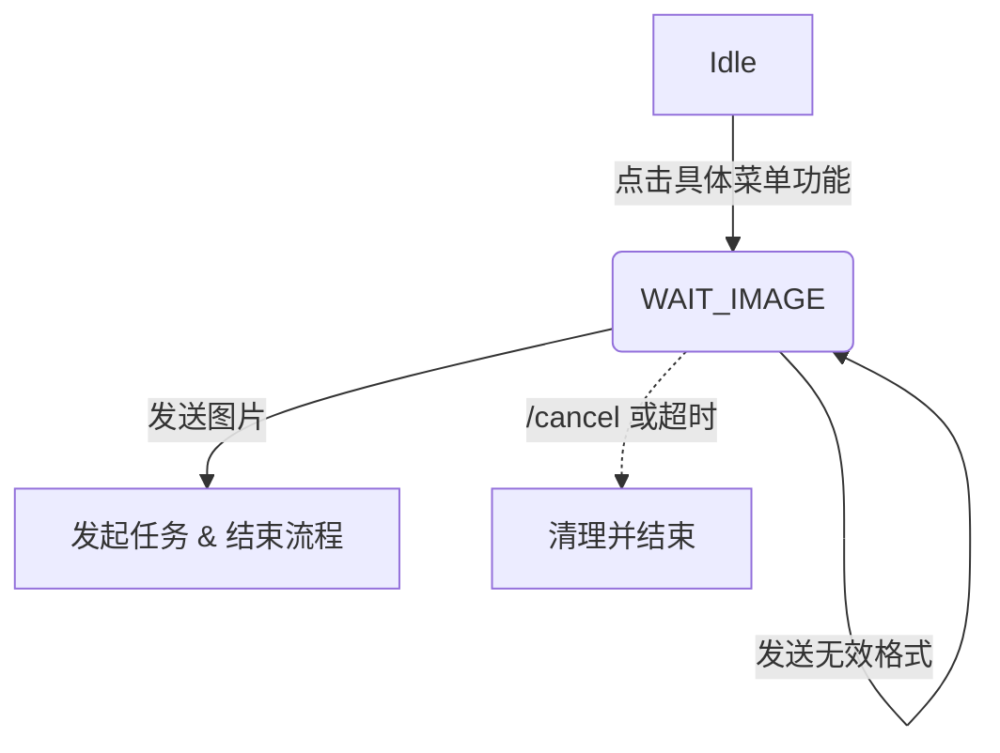
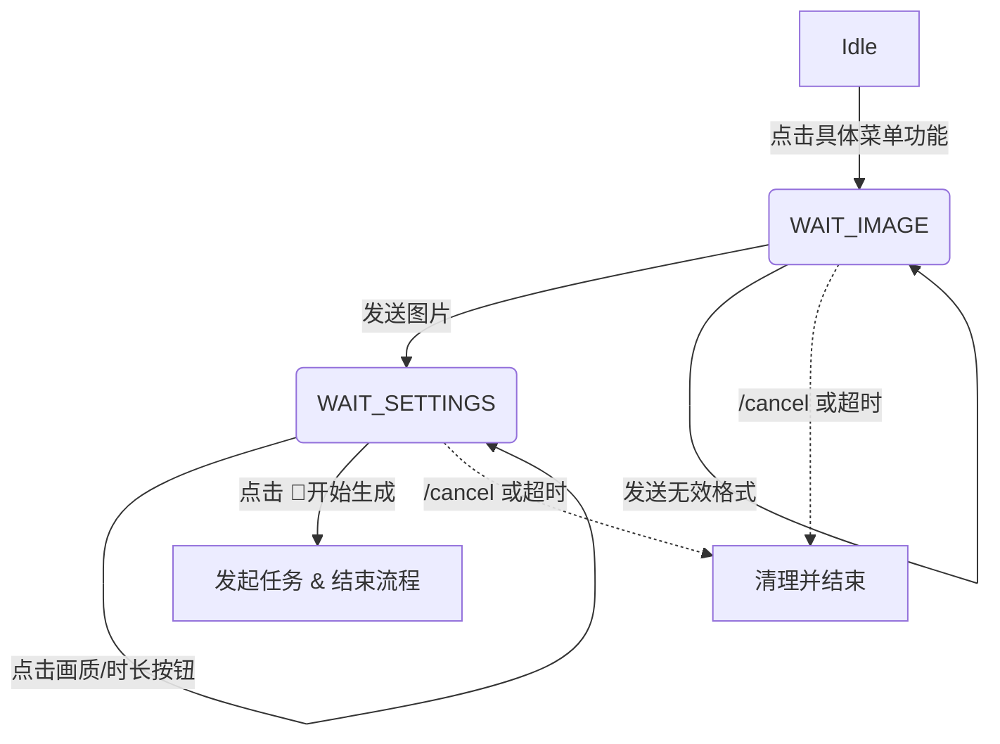

# FSM (有限状态机) 重构指南

本文档描述了如何在 `All_bot` 项目中使用 `telegram.ext.ConversationHandler` 来替代旧版的基于 `mode` 和 `pending_images` 的硬编码状态管理。

## 1. 架构目标

旧版架构（硬编码状态）：
- 痛点：所有状态存储在一个全局字典 `context.user_data['pending_images']` 中。用户跳跃操作、多发文件、超时都会导致状态污染和 Bug。
- 痛点：通过各种 `if/elif mode == XXX` 在同一个 `handle_photo` 中堆砌逻辑，极难维护。

**新版架构（FSM）**：
- 独立隔离：每一个多步流程（如：视频换脸）都有自己独立的 FSM 实例。
- 局部变量：临时文件不再写入全局 `pending_images`，而是写入专属于该流程的字典（如 `context.user_data['face_video_data']`）。一旦流程结束或超时，局部变量连同磁盘文件会被**自动清理**。
- 并发防刷：通过全局锁 `context.user_data['in_conversation']`，防止用户同时进入两个不同的 FSM 流程。

## 2. 状态转移图 (State Diagrams)

目前已完全重构为 FSM 的多步交互功能包括：**视频换脸**、**双人换脸**、**自由P图/幻想换脸**、**自定义图生视频**，以及所有**懒人P图/懒人动图**单步功能。

### 2.1 视频换脸 (Face Video)


### 2.2 双人换脸 (Face Swap)


### 2.3 自由P图 / 幻想换脸 (Edit Image / i2i Pro)


### 2.4 自定义图生视频 (Custom Video)


### 2.5 懒人P图 (单图生图)
包含功能：快速脱衣、快速自慰、随机换脸


### 2.6 懒人动图 (单图生视频)
包含功能：动图传教士、动图后入、口交黑人、脱衣吐舌、特写口交


## 3. 如何新增一个 FSM 流程？

如果你想新增一个类似“多图合并”的功能，请遵循以下步骤：

1. **定义状态常量**：在 `src/handlers/conversation_states.py` 中新增 Enum。
   ```python
   class EditImageState(IntEnum):
       WAIT_REFERENCE_IMAGES = auto()
       WAIT_PROMPT = auto()
   ```

2. **创建处理器文件**：在 `src/handlers/fsm/` 目录下新建 `edit_image_fsm.py`。
   - 实现 `entry_point`，在此处必须校验 `context.user_data.get('in_conversation')`。
   - 实现状态处理函数（接收图片、接收 Prompt）。
   - 实现 `_cleanup_context` 来删除下载到本地的临时文件。
   - 定义 `get_edit_image_fsm_handler()` 工厂函数返回 `ConversationHandler`。

3. **注册到主循环**：在 `bot_conversation.py` (或未来的主入口) 的开头，把新的 FSM 注册进 Application。
   ```python
   # 注意：FSM 必须在基础 MessageHandler 之前注册
   app.add_handler(get_edit_image_fsm_handler())
   app.add_handler(MessageHandler(filters.PHOTO, handle_photo)) # 兜底处理器
   ```

## 4. 故障排查指南

- **Q: 用户提示 "您当前有未完成的交互流程" 且卡死？**
  - **原因**：可能某个 FSM 意外退出时没有调用 `_cleanup_context` 释放锁。
  - **解决**：在数据库或管理后台提供强制清除 `user_data` 的命令，或引导用户手动发送 `/cancel`。
  
- **Q: `/cancel` 没有生效？**
  - **原因**：由于 Telegram 的机制，`ConversationHandler` 的 fallbacks 默认只在对应状态内生效。请确保 `CommandHandler('cancel', cancel_conversation)` 已注册在 fallbacks 中。

- **Q: 新加的 FSM 没有响应用户的图片？**
  - **原因**：可能是注册顺序问题。`ApplicationBuilder` 按顺序匹配 Handler。如果全局的 `MessageHandler(filters.PHOTO)` 写在了 FSM 前面，用户的图片就会被全局处理器拦截。请始终把 FSM 放在前面。

## 5. 测试

我们在 `tests/conversation/` 目录下编写了针对 FSM 的 pytest 用例。
运行测试：
```bash
pytest tests/conversation/ -v --asyncio-mode=auto
```