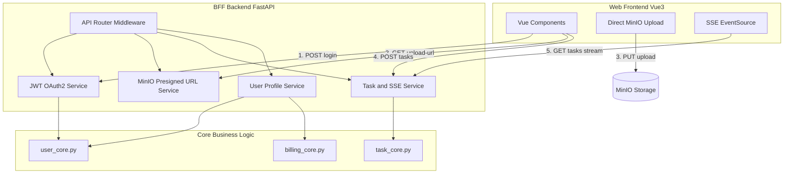
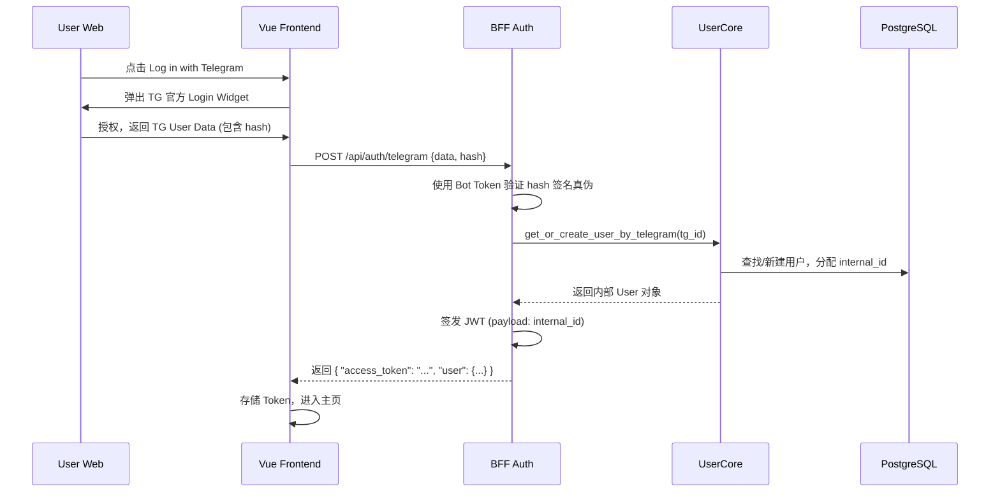
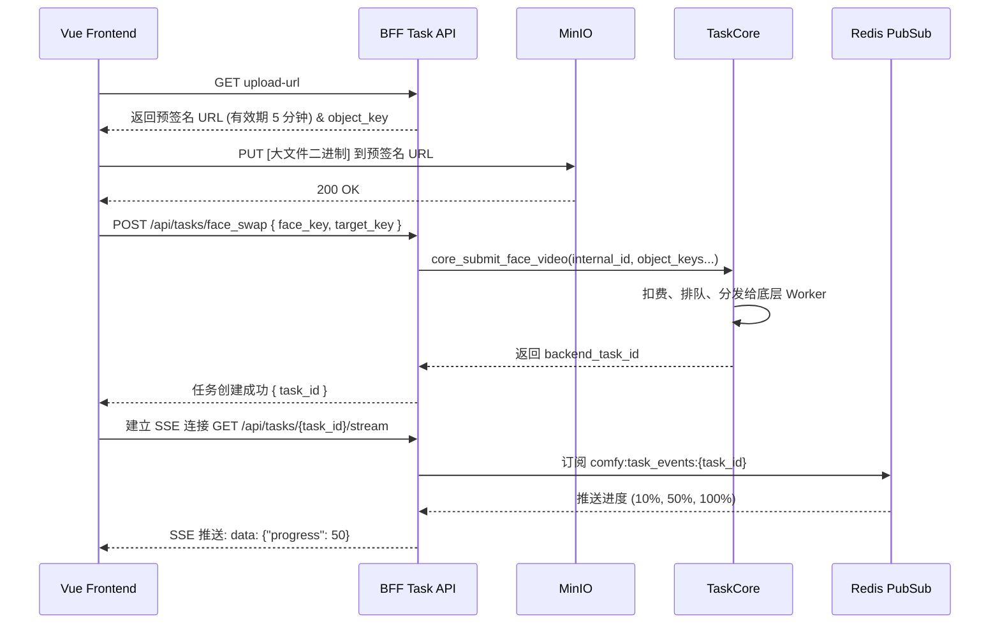

# 阶段二：Web BFF 后端开发与 API 聚合方案

## 📖 阶段概述
阶段一我们已经成功剥离了核心业务逻辑（`src/core/`）并完成了底层数据库多平台 ID 的改造。
本阶段（Phase 2）的核心目标是构建 **Web BFF (Backend for Frontend)** 服务。该服务将基于 FastAPI 框架，作为一个独立的 API 网关，为即将到来的 Vue3 前端提供 RESTful API 和实时状态推送（SSE），同时复用阶段一沉淀的 `src/core/` 业务逻辑。

---

## 🏗️ 1. BFF 架构设计与技术选型

### 1.1 技术选型
*   **Web 框架**：FastAPI (异步、高性能、内置 Swagger 文档)
*   **鉴权方案**：JWT (JSON Web Token) + OAuth2
*   **实时通信**：SSE (Server-Sent Events) 用于前端接收生图进度，轻量且天生支持单向数据流。
*   **文件上传**：MinIO STS (Security Token Service) / Presigned URL 直传机制，避免 BFF 承受大文件流量（特别是视频）。

### 1.2 BFF 系统架构图


---

## 🗂️ 2. 目录结构规划
在项目根目录（或 `src/` 下）新建 `web_api/` 目录，保持与 Telegram Bot 的入口隔离：
```text
All_bot/
├── src/
│   ├── core/              # 阶段一已完成：纯净业务逻辑
│   └── web_api/           # 🌟 本阶段新增：BFF 核心目录
│       ├── main.py        # FastAPI 启动入口
│       ├── dependencies.py# 依赖注入 (获取当前用户、验证 JWT)
│       ├── routers/       # 路由模块
│       │   ├── auth.py    # 登录/注册/OAuth
│       │   ├── users.py   # 用户信息/积分查询
│       │   ├── tasks.py   # 任务提交/进度 SSE
│       │   └── storage.py # MinIO 直传凭证获取
│       ├── schemas/       # Pydantic 校验模型 (Request/Response)
│       └── services/      # BFF 专属服务 (如 Token 签发、Telegram 校验算法)
```

---

## 🔄 3. 核心业务数据流图

### 3.1 登录与鉴权数据流 (Telegram 一键登录示例)


### 3.2 大文件直传与任务提交流程
为了避免 50MB 以上的视频撑爆 FastAPI 的内存，采用**前端直传 MinIO** 的策略。


---

## 📝 4. 接口定义与数据模型说明 (API Spec)

### 4.1 Auth 路由 (`/api/auth`)
*   `POST /telegram`: 接收 Telegram Web App 数据或 Login Widget 签名，返回 JWT。
*   `POST /google`: 接收 Google OAuth Token，换取系统 JWT。

### 4.2 Storage 路由 (`/api/storage`)
*   `GET /presigned-url`:
    *   **Request**: `?filename=test.mp4&content_type=video/mp4`
    *   **Response**: `{ "upload_url": "https://minio.../bot-data/...", "object_key": "bot-data/UUID_test.mp4" }`

### 4.3 Tasks 路由 (`/api/tasks`)
*   `POST /generate`:
    *   **Request** (JSON): `{ "task_type": "face_swap", "inputs": { "face_image": "bot-data/...", "target_image": "bot-data/..." } }`
    *   **Response**: `{ "task_id": "uuid-...", "status": "pending" }`
*   `GET /{task_id}/stream`:
    *   **返回**: `text/event-stream` 格式，实时推送进度、完成状态和最终结果的 MinIO 下载链接。

### 4.4 Users 路由 (`/api/users`)
*   `GET /me`: 获取当前登录用户的灵石余额、会员身份等信息。
*   `GET /history`: 获取历史生成记录（分页）。

---

## 🚀 5. 详细执行子步骤 (优先级排序)

| 步骤 | 任务描述 | 涉及文件/模块 | 优先级 |
| :--- | :--- | :--- | :--- |
| **1. 基建** | 初始化 FastAPI 实例，配置 CORS 跨域（允许前端域名访问），集成现有项目的 Logger 与 DB Session。 | `src/web_api/main.py` | **P0** |
| **2. 鉴权** | 编写 `dependencies.py`，实现 JWT 的签发与校验（提取 `internal_id`）。实现 Telegram Web App 签名验证算法。 | `routers/auth.py`, `dependencies.py` | **P0** |
| **3. 直传** | 封装 MinIO SDK，暴露出生成 Presigned PUT URL 的接口，规定上传目录限制（防越权）。 | `routers/storage.py` | **P0** |
| **4. 核心** | 编写任务提交接口，接收前端传来的 `object_key`，调用 `src/core/task_core.py` 提交任务。 | `routers/tasks.py` | **P0** |
| **5. 推送** | 利用 `asyncio` 和 `sse_starlette` 库，桥接 Redis Pub/Sub，实现前端能监听任务进度的 SSE 接口。 | `routers/tasks.py` | **P1** |
| **6. 用户** | 提供获取个人信息、灵石余额、查询历史生成记录的 RESTful 接口。 | `routers/users.py` | **P1** |

---

## ⚠️ 6. 技术风险点与应对方案

1.  **SSE 连接耗尽风险 (Connection Exhaustion)**
    *   *问题*：FastAPI 默认 worker 并发数有限，大量用户挂起 SSE 连接会导致服务卡死。
    *   *应对*：生产环境使用 Uvicorn + Gunicorn (多 worker 模式)，并在 Nginx 配置 `proxy_buffering off;` 确保 SSE 流畅。限制单个用户的并发 SSE 订阅数。
2.  **MinIO 恶意上传 (Storage Abuse)**
    *   *问题*：接口暴露预签名 URL，可能被恶意刷量传无关大文件。
    *   *应对*：在生成预签名 URL 时，严格限制 `content-length-range`，如图片最大 10MB，视频最大 100MB。配置 MinIO 的 Bucket 生命周期策略 (Lifecycle)，定期清理孤儿文件。
3.  **JWT 密钥泄露与过期**
    *   *问题*：Token 长期有效不安全。
    *   *应对*：设置 `access_token` 过期时间为 2 小时，配合长效 `refresh_token`（或前端无感重新静默调用 TG/Google 登录）刷新凭证。

---

## 🎯 7. 交付物验收标准
1.  **Swagger 文档可用**：访问 `http://localhost:8000/docs` 能看到清晰的接口定义，且可通过 Authorize 按钮注入 Token。
2.  **全链路跑通**：通过 Postman 或 curl 能够完成：`获取Token -> 获取上传URL -> 提交换脸任务 -> 接收SSE进度 -> 获得最终图片` 的完整闭环。
3.  **Core 模块零侵入**：`src/core/` 目录内的代码无须因为 Web BFF 的接入而发生大量修改。
