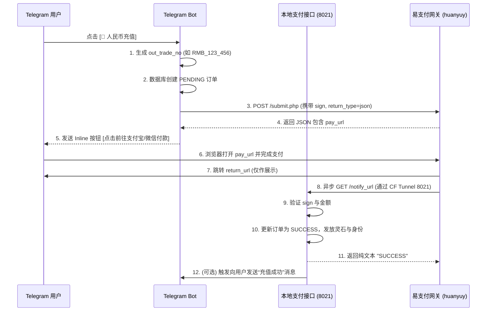

# 支付宝与微信支付（人民币）接入实施方案

## 1. 架构与定位分析

当前系统（All_bot）采用 Telegram Bot + Redis + PostgreSQL + 多后端（Central API / Dashboard）的分布式架构。结合 Cloudflare Tunnel 将 `rmb.aivison.it.com` 映射到本地 `8021` 端口的设计，本次人民币支付的接入应遵循**“前后端分离、统一发货”**的原则。

- **Bot 端（前端）**：仅负责展示支付入口、生成内部订单号、向支付网关发起 POST 请求获取 `pay_url`，并将其以按钮形式发给用户。
- **FastAPI 端（后端）**：监听 `8021` 端口，专门接收支付平台的异步回调（`notify_url`），执行验签与核心发货逻辑。

## 2. 核心交互时序 (Data Flow)

## 3. 数据库与套餐适配分析

当前 `models.py` 中的 `Order` 和 `MembershipPlan` 表需要做少量兼容。
基于要求，**支付宝/微信的套餐（直充与月卡）权益与 Star 充值完全一致，但定价分别为 30元、70元、120元 三个档位。**

1. **套餐定价改造方案**：
   - `MembershipPlan` 目前只有 `price_ton` 和 `price_stars`。
   - **推荐操作**：在 `MembershipPlan` 表中新增 `price_rmb` 字段 (类型 `DECIMAL(10, 2)`)。
   - **数据初始化**：
     - 内门弟子（对应 Star 200档）：`price_rmb = 30.00`
     - 核心弟子（对应 Star 500档）：`price_rmb = 70.00`
     - 真传弟子（对应 Star 1000档）：`price_rmb = 120.00`
     - 直充套餐也按此比例对应设定。

2. **订单号与流水**：
   - `Order.order_id`：复用存生成的 `out_trade_no`（如 `RMB_12345_6789`）。
   - `Order.tx_hash`：复用存易支付的 `trade_no` 以防重复回调。
   - `Order.original_price` 和 `final_price`：直接存人民币金额（30/70/120）。

## 4. 模块拆分与文件落点建议

为了不污染现有代码，建议按以下结构新增和修改文件：

### 4.1 新增支付服务层
创建 `src/services/rmb_payment_service.py`
- 职责：封装与 `huanyuy` 的通信。
- 核心方法：
  - `generate_sign(params: dict, key: str) -> str`
  - `create_payment_url(user_id, plan_id, amount, pay_type="alipay") -> str`
  - `verify_callback_sign(params: dict, key: str) -> bool`

### 4.2 统一发货层 (重构推荐)
创建 `src/services/payment_fulfillment_service.py`
- 职责：将目前分散在 `payment_handler.py` (Stars) 和 `payment_validator.py` (TON) 中的发货逻辑抽取出来。
- 核心方法：`async def fulfill_order(order_id: str, paid_amount: Decimal, external_trade_no: str)`

### 4.3 新增 Webhook 监听端 (8021 端口)
创建 `src/payment_api_server.py`
- 职责：启动一个独立的 FastAPI 实例监听 `8021` 端口（对接 Cloudflare Tunnel）。
- 核心路由：
  - `GET /api/pay/notify/huanyuy`：处理回调，调用发货逻辑，返回 `SUCCESS`。
  - `GET /pay/result`：返回简单的 HTML 支付完成提示页。

### 4.4 修改现有 Bot 入口
修改 `src/handlers/message_handler.py` 和 `src/handlers/callback_handler.py`
- 职责：在充值主菜单新增人民币充值入口，优化层级。
- 逻辑（分级菜单）：
  1. **第一级菜单（支付方式选择）**：在原有的 TON 和 Star 按钮下方，新增 `[💎 人民币充值月卡]` 和 `[💎 人民币直充灵石]`。
  2. **第二级菜单（选择套餐档位）**：
     - 点击 `人民币充值月卡`，显示：
       - `[普通月卡 (内门弟子) - ¥30]`
       - `[高级月卡 (核心弟子) - ¥70]`
       - `[至尊月卡 (真传弟子) - ¥120]`
     - 点击 `人民币直充灵石`，显示对应价位和赠送灵石数：
       - `[¥30 直购 XXX 灵石]`
       - `[¥70 直购 YYY 灵石]`
       - `[¥120 直购 ZZZ 灵石]`
  3. **第三级菜单（选择支付工具）**：
     - 用户选中某个套餐后，提示用户选择支付通道：`[选择支付宝付款]` 或 `[选择微信付款]`。
  4. **第四级菜单（确认并发起支付）**：
     - 用户确认后，Bot 后台调用 `rmb_payment_service` 获取 `pay_url`，并下发带有 `[👉 点击前往付款]` 链接按钮的账单消息。

## 5. 关键红线与防坑指南

1. **绝对不要在 Bot Update 循环中等待支付**：必须使用回调机制。
2. **必须先建单再获取链接**：避免用户支付了但本地没订单记录。
3. **金额双重校验**：回调中必须校验 `money` 参数与本地订单的 `final_price` 是否一致。
4. **幂等性控制**：同一笔 `trade_no` 的回调如果已经处理过（订单已是 `SUCCESS`），必须直接返回 `SUCCESS`，切勿重复发放灵石。
5. **安全性**：`sign` 算法严格按照字典升序拼接，且排除空值和 `sign/sign_type` 字段。
