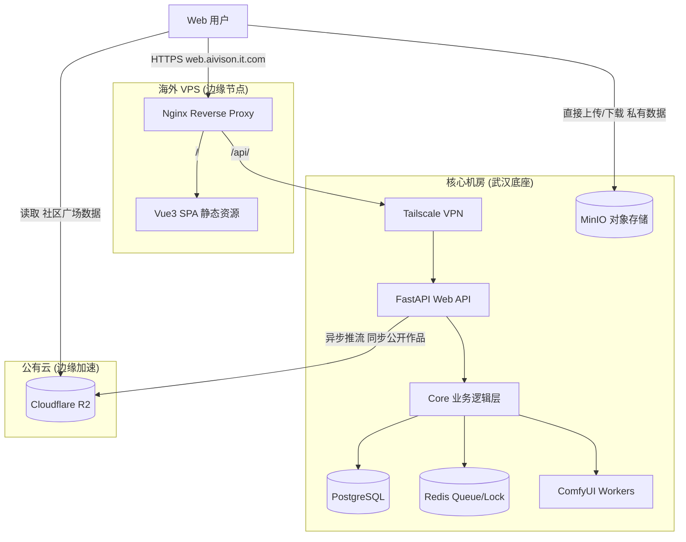

# 修仙主题 AI 创作工作台 (Web 端) 系统架构与运维文档

## 📖 文档概述
本文档是修仙主题 AI 创作平台 Web 端的全景式技术文档。随着系统从单一的 Telegram Bot 成功演进为“多平台 Web + Bot 共存”架构，Web 端已全面重构并独立部署。本文档详细记录了 Web 端的功能特性、分布式架构、核心数据流转以及海外 VPS 边缘节点的最新运维与排障规范。

---

## 🎨 1. 核心功能与 UI/UX 设计 (Features & UX)

### 1.1 主题美学：合欢宗“玄青冷翠”高级感 (High-end Spiritual Theme)
Web 端彻底摒弃了早期的简陋 UI，重构为符合修仙设定的沉浸式高级界面：
- **色彩规范 (Color Palette)**：以玄青 (Slate)、靛蓝 (Indigo) 和冷翠 (Cyan) 为主色调，取代了庸俗的粉色气息，营造出神秘、高级的仙侠氛围。
- **毛玻璃质感 (Glassmorphism)**：全站核心面板（Profile、History、工作台）大量采用 `backdrop-filter: blur` 和半透明背景，实现现代化的高级悬浮感，解决页面由于滚动带来的视觉割裂问题。
- **动态灵气背景 (Canvas Particles)**：在主布局 (`MainLayout.vue`) 注入了基于 HTML5 Canvas 的动态粒子系统，模拟修仙界的“灵气流动”与星空连线特效，性能优异且视觉震撼。

### 1.2 功能模块拓扑 (Feature Modules)
系统功能被严格划分为四大核心模块（侧边栏导航）：
1. **个人中心 (Profile)**：展示用户头像、灵石余额、修仙境界及到期时间，实时从后端 `PermissionService` 拉取并统计累计施法次数、签到天数和邀请人数等真实数据。
2. **自定义功能 (Custom Features)**：包含高阶玩法的入口，如：幻想换脸 (图生图Pro)、视频换脸、自由P图、自定义图生视频等。
3. **懒人功能 (Lazy Features)**：一键式模板生成，如：脱衣吐舌、动图后入等。
4. **历史记录 (History)**：透明化表格展示历史生成记录，支持图片实时预览与视频的内联弹窗播放 (Modal Player)，为节省前端渲染性能和网络带宽，硬性限制仅展示最近 8 条记录。

### 1.3 身份准入机制 (Identity Access Control)
Web 端被定位为**高阶修士专属工作台**，实施了严格的身份准入白名单机制：
- 仅限 **内门弟子、核心弟子、真传弟子** 登录和访问。
- 前端通过全局路由守卫 (`router/index.ts`) 与后端 JWT 签发接口 (`auth.py`) 形成双重拦截，身份不符或身份过期降级的用户将被强制踢出并要求重新验证。

---

## 🏗️ 2. 系统架构设计 (System Architecture)

Web 端采用前后端分离、BFF (Backend For Frontend) 聚合、边缘节点加速的现代分布式架构。

### 2.1 整体架构拓扑


### 2.2 核心组件职责
- **Vue3 SPA (前端)**：基于 Vue 3 + Vite + Tailwind CSS + Ant Design Vue。完全无状态，通过 JWT 与后端通信。页面采用严格的 100vh 布局配合内部滚动，消除了原生滚动条带来的白边伪影。
- **FastAPI BFF (后端)**：Web 专属的聚合 API 层 (`/src/web_api`)。复用底层 `src/core/` 逻辑，提供 RESTful 接口和 SSE 实时推送流。负责并发锁控制、扣费拦截。
- **MinIO (私有存储)**：剥离媒体流量。前后端均通过配置 `assets` 域名直接访问对象存储，不再由 Python 后端代理大文件流。
- **Cloudflare R2 (公有边缘存储)**：作为 MinIO 的公网加速层。专为“社区广场 (Gallery)”等高并发读取场景设计。当作品被推送至排行榜时，由后端异步将 MinIO 的文件同步至 R2，借助全球 CDN 加速海外用户的读取体验。

---

## 🔄 3. 核心数据流转 (Data Flow)

### 3.1 鉴权与会话流 (Auth Flow)
- **机制**：采用 Telegram Widget 登录实现免密无缝接入。
- **流程**：
  1. 前端加载 Telegram Widget (`@qqchuchu_bot`)，用户点击授权。
  2. 拦截回调，向 BFF `/api/auth/telegram` 发送包含 hash 签名的用户信息。
  3. BFF 使用 `.env` 中的 `BOT_TOKEN` (HMAC-SHA256) 验证数据防伪造。
  4. **身份白名单校验**：BFF 调用 `permission_service` 实时计算用户身份，拒绝外门弟子和凡人访问。
  5. 验证通过后，将 Telegram ID 映射为内部 `internal_user_id`，签发 JWT Access Token 返回前端进行持久化存储。

### 3.2 大文件直传流 (Presigned Upload Flow)
为了彻底解决大视频上传导致后端 OOM 或 Nginx 413 错误，实现了直传机制：
1. 前端向 BFF 请求上传凭证：`GET /api/storage/presigned-url?filename=xxx.mp4`
2. BFF 调用 MinIO SDK 生成带有过期时间、限定 Bucket (`bot-data`) 的 PUT URL。**注意**：BFF 层已强制注入 `_region_map` 离线签名，防止 SDK 发起 `?location=` 网络请求卡死主线程。
3. 前端使用 Axios 直接向 MinIO 发起 PUT 请求上传文件。
4. 上传成功后，前端仅将 MinIO Object Key (例如 `bot-data/12345/inputs/xxx.mp4`) 提交给 BFF 进行生图任务排队。

### 3.3 任务派发与 SSE 状态流 (Task & SSE Flow)
1. **任务提交**：BFF 校验 JWT、检查余额、获取单用户并发锁 (`ActiveTasksTable`)，向 Redis 队列推入任务，返回 `task_id`。
2. **SSE 建立**：前端立刻请求 `/api/tasks/{task_id}/stream` 建立 Server-Sent Events 长连接。
3. **竞态防御预检**：BFF 在进入 Redis Pub/Sub 监听前，先主动查询一次任务状态，防止任务瞬间完成导致前端错过事件死锁等待。
4. **状态推送**：Worker 状态更新通过 Redis Pub/Sub 广播，BFF 实时推送 `queuePos` (排队位置)、`progress` 给前端。
5. **幽灵锁释放**：借助 FastAPI `BackgroundTasks`，即使前端意外断开 SSE，BFF 依然在后台等待任务结束信号并可靠释放并发锁，防止用户队列卡死。

### 3.4 社区广场与 R2 边缘加速流 (Gallery & R2 Sync Flow)
由于社区广场（排行榜）涉及大量海外用户的并发读取，如果直接暴露国内的 MinIO 节点会导致带宽打满和加载极慢。系统设计了异步的 R2 兜底机制：
1. 当用户将私有生成记录公开到排行榜时，后端会触发 `async_copy_to_r2`。
2. StorageService 开启一个守护线程（避免阻塞 FastAPI 主循环），从本地 MinIO 将文件流式读取并转存至 Cloudflare R2 数据桶中。
3. Web 端或 Telegram Bot 的排行榜在渲染媒体时，会优先下发绑定的 R2 边缘加速域名，从而彻底释放武汉底座的上行带宽压力。

---

## 🛠️ 4. 运维与部署规范 (Operations & Deployment)

### 4.1 域名与网络规划
为实现动静分离与合规，系统采用双域名策略，并引入 R2 加速层：
- **Web 主域名**：`https://web.aivison.it.com` (托管前端 SPA，代理 `/api/` 流量)。前端变量：`VITE_API_BASE_URL=/api`。
- **私有存储域名**：`https://assets.aivison.it.com` (解析至武汉 MinIO，用于用户私有图库/历史记录)。前端变量：`VITE_STORAGE_URL`。
- **公共加速域名 (R2)**：作为系统级图片（模板）或社区广场作品的分发 CDN，提升全网加载速度。

### 4.2 Nginx 反向代理配置 (边缘节点)
在海外 VPS 上，Nginx 必须严格按照以下规则配置，以避免 API 路由截断或 404：
```nginx
server {
    listen 443 ssl;
    server_name web.aivison.it.com;

    # 1. 托管前端静态资源
    location / {
        root /root/dist;
        index index.html;
        try_files $uri $uri/ /index.html; # Vue History 模式必备
    }

    # 2. 代理 BFF API (严禁在 proxy_pass 末尾加斜杠 /)
    location /api/ {
        proxy_pass http://<武汉底座_Tailscale_IP>:8000;
        proxy_set_header Host $host;
        proxy_set_header X-Real-IP $remote_addr;
        
        # SSE 长连接必备配置
        proxy_set_header Connection '';
        proxy_http_version 1.1;
        chunked_transfer_encoding off;
        proxy_buffering off;
        proxy_cache off;
    }
}
```

### 4.3 前端自动化部署 (Frontend Deploy)
前端项目 (`/frontend`) 实现了基于 NPM Script 和 SCP 的一键部署：
1. **环境要求**：本地必须具备访问 VPS 的 SSH 私钥 (`frontend/ssh_key/id_rsa.pem`)，且权限必须严格限制为 `600` (`chmod 600 id_rsa.pem`)，否则 SSH 会拒绝连接。
2. **构建与推送**：
   执行 `npm run deploy`，脚本将自动完成 Vite 打包，并通过 `scp` 将 `dist/` 目录同步覆盖至 VPS 的 `/root/dist`。

### 4.4 后端容器管理 (Docker Build)
当更新了 `src/web_api/` 等后端代码后，**必须**附加 `--build` 参数强制重建容器，否则新代码不会在容器内生效，导致接口依然返回旧数据：
```bash
# 在宿主机项目根目录执行
docker-compose -f deploy/docker-compose.yml up -d --build web-api
```

### 4.5 MinIO 存储高可用与排障 (Storage O&M)
MinIO 是 Web 端重度依赖的底座，常见排障指南如下：

1. **公开访问权限 (403 AccessDenied)**：
   如果前端历史记录中图片/视频无法加载，说明 MinIO 的 Bucket 权限未正确开放。前往 MinIO Console，将 `bot-data` Bucket 的 Access Policy 设置为 `Public`。
2. **瞬时 503 报错与历史记录加载超时 (RequestTimeout)**：
   - **现象**：前端上传报错 503 (`A timeout occurred while trying to lock a resource`)，且引发连锁反应导致历史记录接口卡死长达 30 秒超时。
   - **根因**：并发执行繁重的视频生成或模型加载任务时，底层 NVMe 硬盘 IO 拥堵，导致 MinIO 健康检查失败并**强制将硬盘下线 (taking drive /data offline)**。此时 MinIO 会拒绝任何锁请求。若后端 SDK 未配置离线签名，其内部的同步网络请求会阻塞整个 FastAPI 事件循环 (Event Loop)，导致所有 Web API 瘫痪。
   - **修复方案**：代码层面已通过注入 `self.client._region_map[MINIO_BUCKET] = "us-east-1"` 解决事件循环阻塞问题。对于 MinIO 本身的硬盘掉线，直接重启容器即可恢复：`docker restart minio-server`。如果该现象频繁发生，需考虑升级高 IOPS 企业级磁盘。

### 4.6 Web 端权限与路由守卫 (Auth Guard)
- **异常现象**：用户处于登录状态，但在页面跳转时突然被踢回登录页，或控制台报错“权限不足”。
- **排障指南**：
  1. 检查用户的身份是否已到期（降级为外门弟子）。
  2. 检查 `frontend/src/router/index.ts` 中的全局路由守卫拦截逻辑。前端会每次比对 `authStore.user.current_identity`，不符时将主动清除本地 Token 防御越权访问。

---
*本文档为修仙主题 AI 创作工作台 Web 端的最新架构定稿（已涵盖防阻塞的高可用重构），后续的二次开发与排障请严格遵循本文档所描述的数据流与运维规范。*