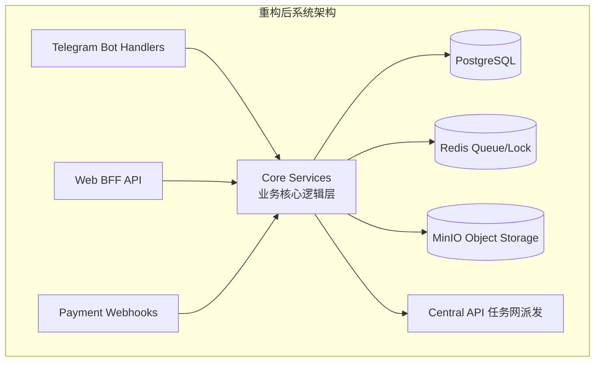
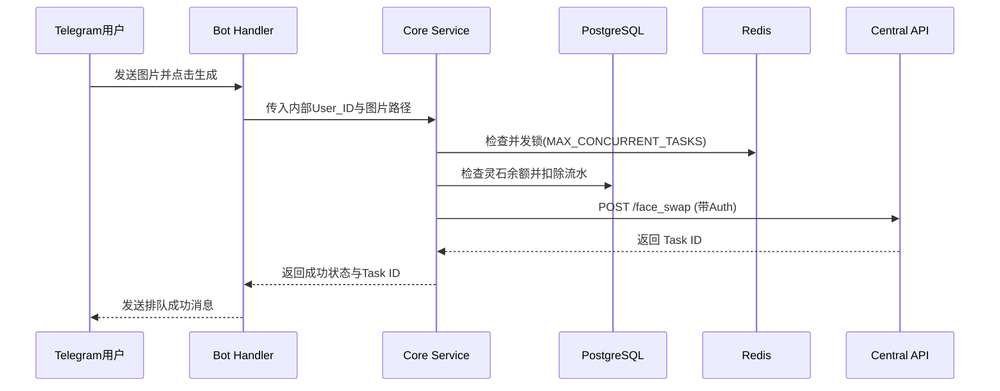
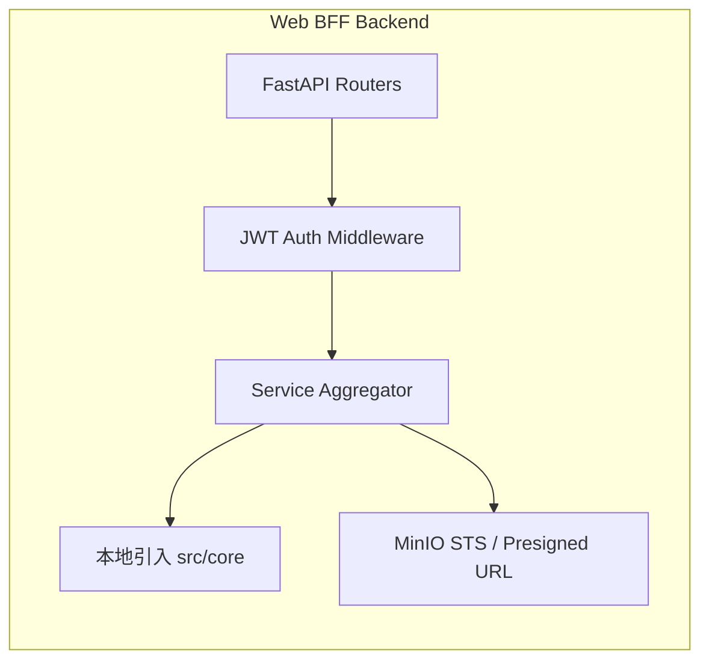
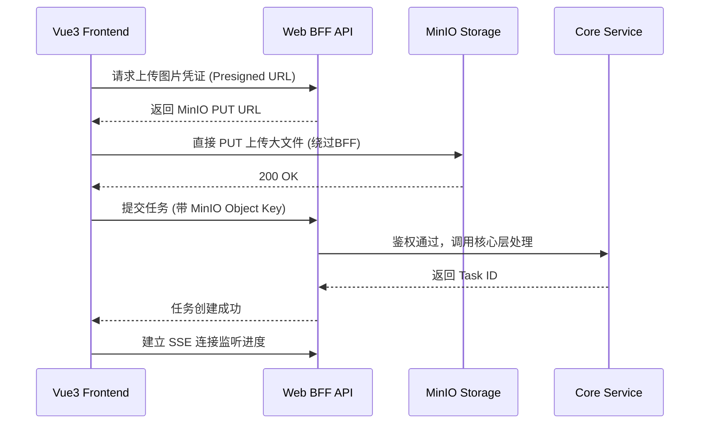

# Web端入口迁移与系统重构开发计划书

## 📖 文档概述
本文档旨在为本项目从单一的 Telegram Bot 入口向“多平台 Web + Bot 共存”架构演进提供全面、专业的开发指南与项目管理规划。计划涵盖底层重构、BFF后端开发及 Vue3 前端开发三大核心模块。

---

## 📅 项目管理规划 (Project Management)

### 1. 里程碑设置与时间估算 (Milestones & Time Estimation)
整个项目预计耗时 **4-5 周**，分为四个关键里程碑：
*   **Milestone 1 (Week 1): 核心解耦与数据迁移**
    *   完成数据库 `users` 表的多平台 ID 改造。
    *   完成 Bot 业务逻辑抽离至 `src/core/` 目录。
    *   验收：现有 Bot 在新架构下稳定运行，无性能退化。
*   **Milestone 2 (Week 2): Web BFF 后端基建**
    *   完成 FastAPI BFF 框架搭建。
    *   完成 JWT 鉴权体系与第三方 OAuth（Google/TG）接入。
    *   封装核心生图/视频接口。
    *   验收：Postman/Swagger 跑通所有 Web API。
*   **Milestone 3 (Week 3-4): Vue3 前端开发与对接**
    *   完成基础框架、Ant Design Vue 引入。
    *   实现登录、主控制台、任务流交互界面。
    *   实现基于 SSE/WebSocket 的任务状态实时推送。
    *   验收：前端核心主流程闭环测试通过。
*   **Milestone 4 (Week 5): 联调、压测与上线部署**
    *   全链路压测，CDN/Nginx 配置，发布上线。

### 2. 关键路径分析 (Critical Path)
**数据库迁移 -> 核心逻辑抽离 -> BFF 接口暴露 -> 前端任务流对接**。
*注意：前端的基础 UI 组件可以与 BFF 开发并行，但涉及核心状态流转（如生图排队）的页面必须在 BFF 接口稳定后进行联调。*

---

## 🛠️ 阶段一：重构现有 Bot 系统

### 1.1 子步骤清单 (优先级排序)
1.  **[P0] 数据库表结构迁移 (Alembic)**：将 `users.id` 解耦，新增多平台登录字段。
2.  **[P0] 核心业务层 (Core Layer) 抽象**：在 `src/core/` 下新建服务类，剥离扣费、锁检测、任务分发逻辑，移除 Telegram `Update` 依赖。
3.  **[P1] Bot Handler 适配**：将原有的 `task_service.py` 和 `permission_service.py` 改造为调用 `src/core/` 中的纯函数。
4.  **[P2] 全局回归测试**：确保原有 Bot 流程（尤其是支付回调、发货）完全正常。

### 1.2 系统架构图


### 1.3 数据流图 (请求生命周期)


### 1.4 核心数据结构设计 (Alembic 迁移)
```sql
-- 目标 users 表核心结构
CREATE TABLE users (
    internal_id BIGSERIAL PRIMARY KEY, -- 纯内部系统ID，解耦TG
    telegram_id BIGINT UNIQUE,         -- 原有的 TG ID
    google_id VARCHAR(255) UNIQUE,     -- Google OAuth ID
    email VARCHAR(255) UNIQUE,         -- 邮箱注册
    hashed_password VARCHAR(255),      -- 密码哈希
    credits INTEGER DEFAULT 6,
    -- ... 其他原有业务字段保留
);
-- 索引
CREATE INDEX idx_users_telegram_id ON users(telegram_id);
```

### 1.5 风险与应对、验收标准
*   **风险**：外键关联（如 `orders`, `history`）在迁移主键时断裂。
*   **应对**：采用两步迁移法。先加 `telegram_id` 列并复制数据，然后修改外键引用，最后更换主键类型。
*   **验收**：旧用户的积分和历史记录无缝保留，Bot 响应延迟无增加。

---

## 🌐 阶段二：开发 Web BFF 后端

### 2.1 子步骤清单
1.  **[P0] BFF 框架初始化**：基于 FastAPI，在项目根目录新建 `web_api/`。
2.  **[P0] JWT 认证体系**：实现 `/api/auth/login`, `/api/auth/google` 等接口。
3.  **[P0] API 路由与网关**：实现 `/api/tasks/`，内部调用 `src/core/` 逻辑。
4.  **[P1] MinIO 直传策略**：实现 `/api/storage/presigned-url` 接口，减轻 BFF 流量压力。
5.  **[P1] SSE 状态推送**：实现 `/api/tasks/stream` 供前端实时监听进度。

### 2.2 BFF 架构设计图


### 2.3 数据流图 (Web 端生成任务)


### 2.4 接口定义示例
*   `POST /api/auth/login`: 账号密码/OAuth 登录，返回 `{ "access_token": "jwt..." }`
*   `GET /api/storage/upload-url`: 返回 MinIO 直传 URL。
*   `POST /api/tasks/generate`: 提交生图任务，参数 `{"task_type": "face_swap", "inputs": {"face": "key1", "target": "key2"}}`。

### 2.5 风险与应对、验收标准
*   **风险**：SSE 占用大量后端连接导致 FastAPI Worker 耗尽。
*   **应对**：使用异步 ASGI (Uvicorn) 运行 BFF，并配置合理的 Timeout 机制，前端加入断线重连逻辑。
*   **验收**：前端能稳定获取 JWT，且所有受保护的路由正确拦截未授权请求。

---

## 🖥️ 阶段三：开发 Vue3 前端

### 3.1 子步骤清单
1.  **[P0] 项目初始化**：`npm create vite@latest web_frontend -- --template vue-ts`。
2.  **[P0] 引入组件与路由**：配置 Ant Design Vue (UI) + Vue Router + Pinia。
3.  **[P1] Auth 模块开发**：登录、注册、Google/TG 一键登录组件。
4.  **[P1] 核心工作台页面**：包含不同模式（换脸、动图等）的表单提交与大文件分片上传组件。
5.  **[P2] 响应式与状态优化**：处理移动端适配，接入 SSE 实现进度条动画。

### 3.2 前端架构设计图
```mermaid
graph TD
    subgraph "Vue 3 Frontend Architecture"
        UI[Ant Design Vue Components]
        Views[Pages / Views]
        Store[Pinia State Management]
        Router[Vue Router & Navigation Guards]
        API[Axios / VueUse (SSE)]
        
        UI --> Views
        Views --> Store
        Views --> Router
        Views --> API
        Store --> API
    end
```

### 3.3 数据流与状态管理方案
*   **Store 设计 (Pinia)**：
    *   `useAuthStore`: 管理 `token`, `user_info` (包含灵石余额、境界)，处理登出逻辑。
    *   `useTaskStore`: 管理当前活动的 `task_id` 列表、进度百分比、历史记录缓存。
*   **路由守卫 (Navigation Guard)**：全局拦截，未登录重定向至 `/login`，已登录拦截重复访问登录页。

### 3.4 性能优化与懒加载策略
1.  **路由懒加载**：使用 `const Console = () => import('./views/Console.vue')` 分割代码块。
2.  **大文件上传优化**：针对大于 50MB 的视频，前端直传 MinIO，避免通过 Base64 或表单编码占用浏览器内存。
3.  **按需引入组件**：Ant Design Vue 配合 `unplugin-vue-components` 实现组件按需加载，减小首屏打包体积。

### 3.5 风险与应对、验收标准
*   **风险**：移动端 (H5) 下复杂表单（如换脸+参数调节）布局错乱。
*   **应对**：严格遵循 Ant Design Vue 的 Grid 栅格系统，所有核心操作面板采用响应式抽屉 (Drawer) 或堆叠布局。
*   **验收**：Lighthouse 性能评分 > 85，首屏加载时间 < 1.5s，PC 与手机端均能顺畅完成一套完整的换脸任务闭环。
