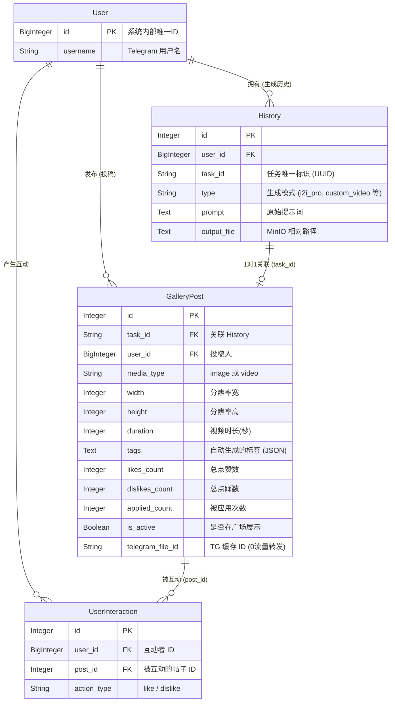
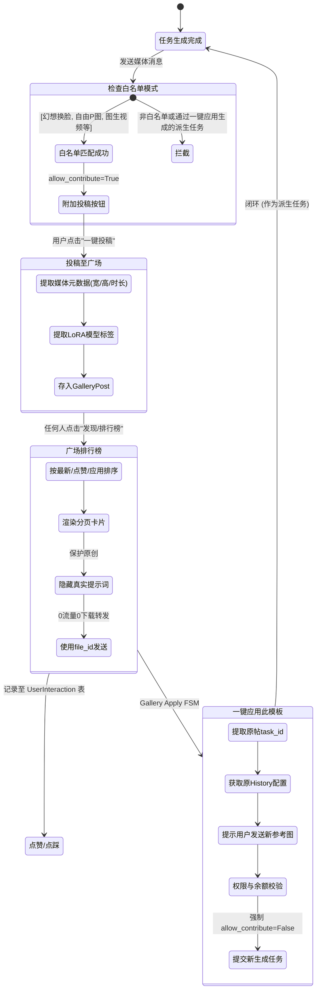
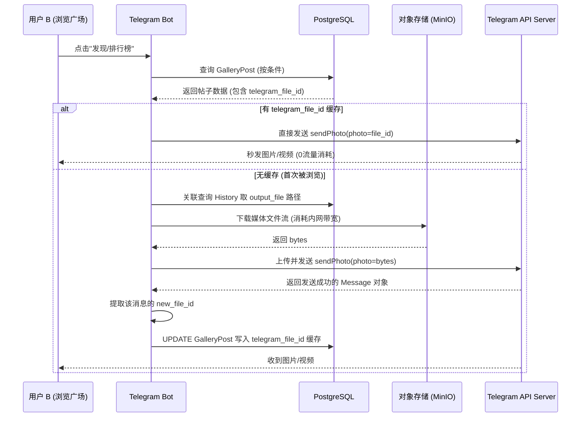

# 修仙主题 Telegram 图像与视频机器人 - 社区广场与一键应用功能架构梳理

本文档详细梳理了最近新增的**社区广场（Gallery）**、**排行榜**、**点赞/点踩**以及**一键应用模版**等核心功能的架构、数据流和业务逻辑。同时总结了当前代码中已解决的问题、潜在的 Bug 以及未来的优化方向。

---

## 1. 核心架构与业务流图

### 1.1 实体关系图 (ER Diagram)
社区功能建立在现有的用户和任务历史体系之上，新增了 `GalleryPost` 和 `UserInteraction` 两个核心表，通过 `task_id` 和内部 `user_id` 进行关联。



### 1.2 核心业务状态机流转图 (State Machine Flow)
展示了从用户完成生成、点击投稿，到其他用户在广场浏览并一键应用的完整生命周期。



### 1.3 0流量转发与媒体缓存架构图
为了优化服务器带宽，排行榜采用了基于 `telegram_file_id` 的缓存转发机制。



---

## 2. 关键代码链路与设计亮点

### 2.1 原创保护与“禁止套娃”机制
**设计难点**：如果用户一键应用别人的模板生成了作品，这个作品默认也会带有“一键投稿”按钮。如果用户再次投稿，会导致排行榜充斥大量同质化甚至完全一样的“套娃”内容。
**解决链路**：
- 在 `src/services/task_service.py` 的生成接口（如 `process_generation_task` 和 `process_i2i_pro_task`）中引入了 `allow_contribute` 布尔开关。
- 在 `gallery_apply_fsm.py` (一键应用状态机) 中，向底层发起生成请求时，**强制传入 `allow_contribute=False`**。
- 底层在拼装键盘时：`show_gallery_btn = task_type in allowed_gallery_types and allow_contribute`，从而彻底切断了复制者的二次投稿链路。

### 2.2 时长计费容错与动态降级
**设计难点**：视频生成帧率可能存在微小误差（例如 5 秒的视频可能实际生成了 5.78 秒）。原代码严格按 `> 5秒` 划入下一计费档位（如 8秒档），导致原作者花 6 灵石，应用者却被扣 12 灵石。
**解决链路**：
- 在 `gallery_apply_fsm.py` 中引入了阈值容错（Threshold Tolerance）：
  ```python
  if post.duration > 9: dur_str = "10s"
  elif post.duration > 6: dur_str = "8s"
  else: dur_str = "5s" # ≤6秒均视为5秒基础档
  ```
- 配合 `permission_service`，当低等级用户尝试一键应用 10s/1024p 的高规格模板时，系统会自动将其降级为 5s/512p 并重新计算低档位费用，既防止了越权白嫖，又避免了阻断交易。

### 2.3 动态标签与本地化映射
**设计难点**：存入数据库的 LoRA 标签通常是英文名（如 `#BreastGrow`），在排行榜展示给中文用户时体验不佳。
**解决链路**：
- 在 `callback_handler.py` 渲染排行榜卡片时，动态引入 `video_lora_fsm.py` 中的 `LORA_MODELS` 字典字典。
- 遍历 `GalleryPost.tags`，进行实时映射替换（如 `#BreastGrow` -> `#巨乳膨胀`），确保前端展示与后台存储解耦。

---

## 3. 当前可能存在的 Bug 与优化点 (TODO & Refactor)

虽然核心功能已闭环跑通，但从高并发和严谨的工程架构角度来看，系统仍有以下几个隐患和可优化的点：

### 🚨 潜在 Bug
1. **点赞/点踩逻辑的并发覆盖冲突 (Lost Update)**
   - **位置**: `callback_handler.py` (大约 550 行)
   - **问题**: 目前代码使用 `post.likes_count += 1` 并在内存中累加后 `session.commit()`。在极高并发下（多人同时点赞同一帖子），后提交的事务会覆盖前者的值，导致点赞数丢失。
   - **修复建议**: 改用数据库层面的原子更新，即 SQL 的 `UPDATE table SET likes_count = likes_count + 1 WHERE id = X`。在 SQLAlchemy 中可以使用：
     `session.execute(update(GalleryPost).where(GalleryPost.id == post.id).values(likes_count=GalleryPost.likes_count + 1))`
2. **重复点赞/点踩校验不严谨**
   - **位置**: `callback_handler.py` (大约 539 行)
   - **问题**: 查询历史互动时，加上了 `.where(UserInteraction.action_type == action)` 条件。这意味着如果我点过赞（action='like'），我依然可以去点踩（action='dislike'），这会导致同一用户对同一帖子产生了两条互斥的计数。
   - **修复建议**: 检查时去掉 `action_type` 的过滤，只要用户对该 `post_id` 有过任何互动记录，就拒绝再次操作；或者实现更复杂的“切换赞踩”逻辑（原赞-1，新踩+1）。
3. **连点翻页导致的 `Message to delete not found` 错误**
   - **问题**: 排行榜翻页采用的是“发送新消息 + 异步删除旧消息 (`robust_delete_message`)” 的逻辑。如果用户手速极快连点“下一页”，可能导致系统尝试删除一条已经被 Telegram 吞掉或删掉的消息，抛出 API 异常。
   - **修复建议**: 捕获 `telegram.error.BadRequest` 异常并忽略 `Message to delete not found` 错误，防止日志刷屏。

### 💡 架构优化点
1. **一键应用的参数穿透不彻底**
   - **现状**: 目前的一键应用主要穿透了 `prompt`、`lora_name`、分辨率和时长。
   - **优化**: 如果原作者使用了特殊的高级参数（如 `History.params` 中的控制网权重、采样步数、降噪强度等），目前这些参数在“一键应用”创建新任务时丢失了。未来应深度解析 `History.params` 并透传给底层生成接口，实现 100% 完美的“克隆”。
2. **Dashboard 与 Web 端的深度融合**
   - 刚刚在 Dashboard 后台增加了广场内容的审核与增删改查界面。未来 Vue3 的 Web 前端（面向普通用户的页面）也可以接入 `/api/gallery/all` 接口，将“修仙界广场”从纯 Telegram 内端延伸到 Web 网页端，打造全平台的社区生态。
3. **增加“取消投稿”与“作者本人删除”功能**
   - 目前只有管理员能在 Dashboard 删帖。应在机器人的“个人中心”或“我的历史记录”中，允许原作者下架自己的投稿内容。