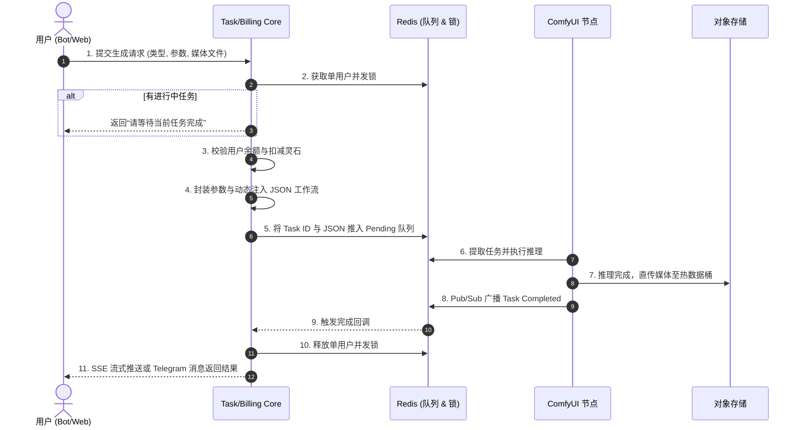

# 01_BIZ_AI创作与生成板块

## 1. 业务需求说明书 (BRD)
**目标定位**：提供多模态（文生图、图生视频、面部替换等）的一键式 AI 创作工具。旨在降低非技术用户使用高端 ComfyUI 模型的门槛，将复杂的节点连线转化为所见即所得的参数调节（时长、分辨率等）。
**商业价值**：作为系统的“现金牛”业务，通过每次生成扣减“灵石”直接变现；并通过高质量的生成结果吸引用户将其发布至“社区广场”，形成内容生态的飞轮效应。

## 2. 功能规格说明书 (FSD)
本板块包含以下核心能力：
*   **图像创作 (Image Generation)**：
    *   `i2i_pro`: 高级文生图/图生图（支持 Lora 注入与提示词优化）。
    *   `face_swap`: 图像面部替换。
*   **视频创作 (Video Generation)**：
    *   `custom_video` / `ltx_video`: 高级图生视频（支持动态计费：512p/720p/1024p 与 5s/10s 时长调节）。
    *   `video_lora`: 带特效标签（如 `#BreastGrow`）的视频生成。
*   **AI 提示词助理 (Prompt Optimizer)**：
    *   提供基于上传参考图和简短中文，通过本地 LLM 扩写为丰富英文结构化 Prompt 的能力。

**前置依赖**：用户必须具有足够的灵石，且单人同一时刻只能有 1 个任务排队或运行中（并发锁防刷）。

## 3. 业务流程图 (Flow)



## 4. 关键接口与数据契约 (API/Data)
### Web BFF 接口：`POST /api/tasks/generation`
*   **请求体 (Request Body)**：
    ```json
    {
      "task_type": "custom_video",
      "params": {
        "prompt": "A beautiful fairy flying in the sky",
        "resolution": "1280x704",
        "duration_multiplier": 2.0, // 对应 10s
        "image_url": "bot-data/user_uploads/123/img.jpg"
      }
    }
    ```
*   **计费契约**：视频生成的成本为 `基础分辨率价格 * 时长倍数`。例如 720p 基础为 18 灵石，时长 10s (2.0x)，则总扣减 36 灵石。

## 5. ComfyUI 工作流参数注入原则 (Workflow Patcher Redlines)
本板块中所有底层推理均依赖 ComfyUI 的 JSON 工作流，其参数动态注入必须严格遵守以下红线：
*   **禁止启发式匹配 (No Heuristic Matching)**：在处理带有多个图像输入的工作流（如 `face_swap`）时，绝对禁止使用启发式遍历来盲目覆盖图片节点，这会导致参数错乱并触发 ComfyUI HTTP 400 错误。
*   **必须使用 `mappings.json` 精确绑定**：所有需要动态修改的节点参数，必须在 Worker 节点的 `mappings.json` 中明确声明映射关系。例如：视频工作流中的尺寸调整必须映射给 `FindPerfectResolution` 节点，时长控制映射给 `PainterI2V` 节点。
*   **类型安全转换**：在 Python 字典与 JSON 转换时，需特别注意 `None` 与 JSON `null` 的转换，尤其是在处理 `seed` 等整数型参数时，防止类型错误导致节点执行失败。

## 6. 用户操作手册 (Manual)
### 5.1 Telegram 端操作
1.  在 Bot 主菜单点击 `🎬 懒人动图`。
2.  选择 `高级图生视频 (LTX)`。
3.  按提示发送一张作为起点的照片。
4.  在底部内联键盘选择视频分辨率与生成时长。
5.  输入您想要的画面描述（或点击“智能优化”交由 AI 扩写）。
6.  确认消耗灵石，等待 Bot 下发生成的 MP4 文件（约需 2-5 分钟）。

### 5.2 Web 端操作
1.  进入工作台主页，点击左侧导航栏的 `动态视频`。
2.  在右侧参数面板上传您的参考图（大于 100MB 视频将自动启用 MinIO 直传提速）。
3.  通过滑块和下拉框调节分辨率、时长和 Lora 权重。
4.  点击底部的 `立即生成`。
5.  页面将切换至任务详情弹窗，通过 SSE 实时展示“排队中 -> 生成中 -> 完成”的进度。

---
*版本历史：*
* *v1.1.0 - 加入了 LTX 高级图生视频支持，新增了分辨率与时长的动态计费逻辑。*
* *v1.0.0 - 初版上线，支持基础文生图与一键换脸。*
