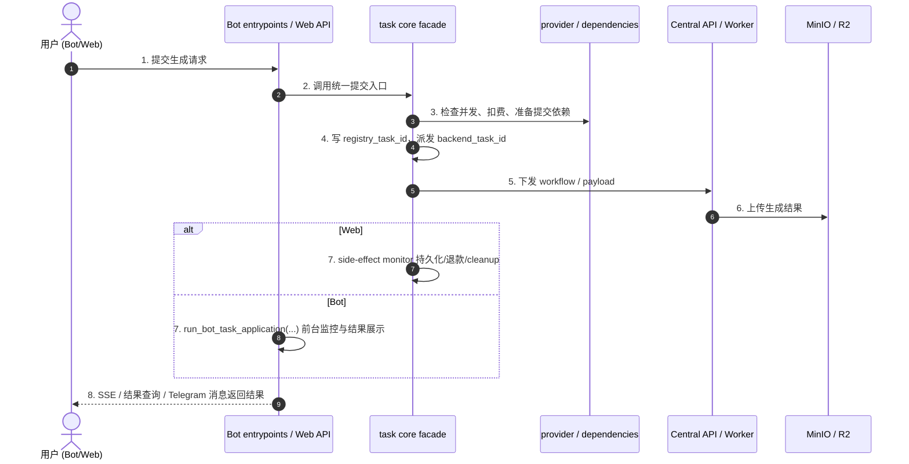

# 01_BIZ_AI创作与生成板块

## 1. 业务需求说明书 (BRD)

**目标定位**：提供多模态（文生图、图生视频、换脸等）的一站式 AI 创作能力，把复杂的 ComfyUI 工作流转化为用户可理解的参数与模板操作。

**商业价值**：作为系统的核心变现板块，通过任务生成消耗灵石，并把高质量结果沉淀到社区广场与模板应用链路，形成内容与消费飞轮。

## 2. 功能规格说明书 (FSD)

本板块包含以下核心能力：

- **图像创作**：`i2i_pro`、`edit_image`、`face_swap`、`quick_image`
- **视频创作**：`custom_video`、`ltx_video`、`face_video`、`quick_video`
- **AI 提示词助理**：基于参考图和简短描述扩写 Prompt

**前置依赖**：用户必须具备足够灵石，且同一时刻受并发锁约束。

**当前视频口径**：旧 `custom_video` / `video_lora` 与 `wan22_video_v2` 共用 Wan22 AIO 底层内核和 worker workflow，但仍是两个用户功能入口。旧入口支持 `5s/8s/10s`，分辨率与计费对齐 v2 四档，`video_lora` 额外保留旧 LoRA 选择。历史与投稿类型仍保留旧值，执行面才使用 `image_to_video`。`video_insert` / `video_edit` 只保留为 legacy Central/Worker alias；懒人动图的差异在 FSM/entrypoint 内置 prompt，不再表示独立 workflow 或模型。

## 3. 当前业务主链



## 4. 当前接口与数据契约

### 4.1 Web 任务入口

当前 Web 主入口统一为：

- `POST /api/tasks/generate`

请求体以 `inputs` 为主，例如：

```json
{
  "task_type": "custom_video",
  "inputs": {
    "prompt": "A beautiful fairy flying in the sky",
    "resolution_preset": "standard",
    "duration": 5,
    "image_url": "bot-data/user_uploads/123/img.jpg"
  },
  "source_post_id": 123
}
```

### 4.2 计费契约

- 视频成本通常由分辨率与时长组合计算。
- Wan22 AIO 视频配置事实源是 `src.domain_config.wan22_aio_video`；`wan22_video_v2` 的分辨率档位为 `preview`（展示为“极速”，约 512p，默认且最低价）6 灵石、`small`（展示为“清晰”，约 600p）12 灵石、`standard`（约 720p）20 灵石、`hd`（约 810p）30 灵石；旧 `fast` 仅作为兼容别名归一到 `preview`。时长支持 `5s/8s/10s`，对应 `81/129/161` 帧，计费倍率为 `1x/2x/3x`。
- 旧 `custom_video` / `video_lora` 当前同样支持 `5s/8s/10s` 并对齐上述 v2 档位计费；旧投稿中的 `512p/720p/1024p` 会映射为 `preview/standard/hd`，`0.36 MP - Small` 会映射为 `small`。
- 具体倍率与 guardrail 以当前服务实现为准，不在业务文档中固化旧常量值。

### 4.3 双 ID 语义

- `registry_task_id`：本地任务注册与历史/清理语义
- `backend_task_id`：后端执行面运行态语义

## 5. 当前实现红线

- 任务主链不再按“单体 Task/Billing Core + finally 写历史释放锁”的旧口径理解。
- `task_core.py` 当前是 facade；真实默认装配在 provider/dependencies、submission、web-monitor、runtime 子模块。
- Bot 主链当前以分域 entrypoints 和 `run_bot_task_application(...)` 为真实入口，不再依赖历史兼容层作为业务主入口。
- Web 结果除了 stream 外，还存在 history fallback 与结果查询链路。

## 6. 用户操作手册

### 6.1 Telegram 端

1. 选择对应创作入口。
2. 通过 FSM 收集图片、视频设置、提示词等参数。
3. 按入口流程确认或直接提交任务；`图生视频 v2` 在前置设置面板直接发送起始帧即确认设置，填写或跳过负面提示词后直接进入生成。
4. 等待 Bot 前台进度通知与结果回传。

### 6.2 Web 端

1. 进入统一练功房工作台，默认落在高频图像模式。
2. 通过顶部横向模式栏切换 `自由P图`、`文生图`、`幻想换脸`、`局部重绘`、`图生视频`、`图生视频 v2` 等模式。
3. 在主输入面板中填写提示词，并按需上传参考素材；低频参数通过“三点”展开。
4. 点击立即生成。
5. 通过任务详情、stream 与历史记录查看运行态和结果。

> `图生视频 v2` 已并入统一练功房；旧图生视频与 v2 的历史详情和结果区都会回到练功房完成扩展生成、重新生成与多段拼接。独立 `Wan22VideoV2` 页面仅作为兼容入口保留。

## 7. 维护原则

- 若修改 Bot entrypoints、`run_bot_task_application(...)`、`task_core facade`、`task_stream/history fallback`，需同步更新本业务文档。
- 若新增模板应用、视频成本模型或结果回传语义，应同步补 focused tests 与黄金路径回归清单。
