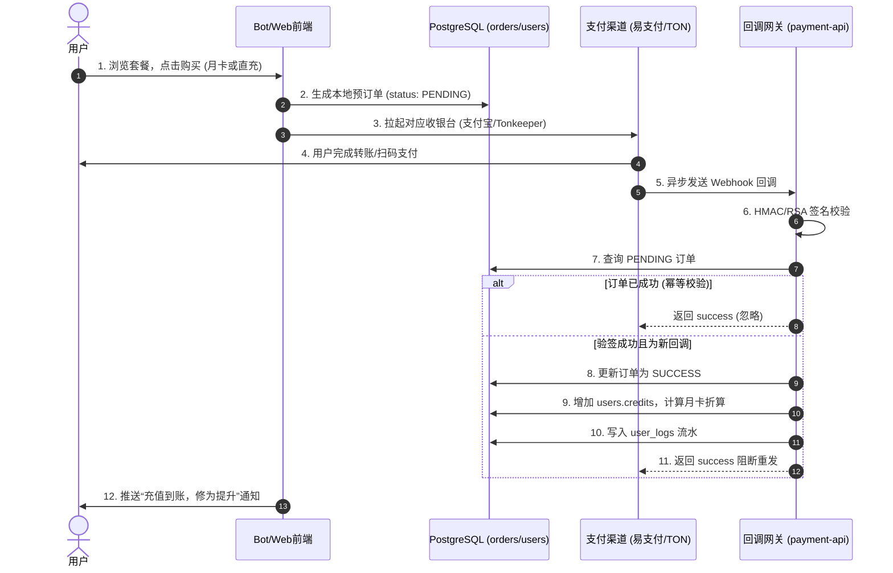

# 02_BIZ_商业化与会员资产板块

## 1. 业务需求说明书 (BRD)
**目标定位**：构建系统的闭环盈利模式。通过单一虚拟货币（灵石）消除复杂的支付计算，为全球用户提供灵活的充值通道（加密货币、Telegram 内购、人民币网关）。并设计阶梯式的修仙等级与会员体系（内门、核心、真传）来拉升用户留存率（ARPU）。
**商业价值**：通过月卡跨级折算逻辑，消除用户升级的心理阻力；通过邀请返利机制实现低成本的裂变获客。

## 2. 功能规格说明书 (FSD)
本板块包含以下核心能力：
*   **多渠道支付网关接入**：
    *   `RMB`：易支付/支付宝/微信，异步回调验签。
    *   `TON`：基于区块链钱包直连的加密货币支付。
    *   `Stars`：Telegram 官方原生数字商品代币支付。
*   **单轨制资产账本**：
    *   充值灵石、消耗灵石、僵尸任务退款均被强制记录在 `user_logs`。
*   **阶梯会员特权 (Identity System)**：
    *   `内门弟子`、`核心弟子`、`真传弟子`，分别对应不同的排队权重、月度免费灵石额度与隐藏视频节点的解锁权限。
    *   月卡跨级折算（如同级或低级卡将天数折算为高级卡的延长，高级卡购买低级卡则按比例折现天数，拒绝降级）。

**前置依赖**：用户必须通过 Telegram 首次登录完成隐式注册，获得 `internal_user_id`。

## 3. 业务流程图 (Flow)

## 4. 关键接口与数据契约 (API/Data)
### 第三方回调网关：`POST /api/payment/notify` (暴露于 8021 端口)
*   **核心逻辑契约**：该接口负责所有“真实资金到账”的凭证校验。无论 `out_trade_no` 对应的支付渠道是什么，该接口的职责是将系统 `orders.status` 由 `PENDING` 置为 `SUCCESS`，并发放商品。
*   **会员升级折算公式**（权数）：
    *   真传弟子 = 10，核心弟子 = 5，内门弟子 = 2，外门 = 1。
    *   新购套餐折算天数 = `(旧套餐剩余价值 + 新套餐价值) / 目标套餐权数`。

## 5. 用户操作手册 (Manual)
### 5.1 如何充值灵石与会员
1.  在 Telegram 机器人输入 `/recharge` 或点击菜单栏 `💎 充值`。
2.  查看商品橱窗：
    *   **散修盘缠 (直充)**：仅获得灵石，不改变身份。
    *   **内门/核心/真传月卡**：获得当月大额灵石、专属身份头衔、免排队特权、解锁高级长视频。
3.  点击对应套餐的按钮，系统将下发 3 个支付选项：
    *   `使用 TON 支付`：拉起 WebApp，连接您的 Tonkeeper 或 TG 钱包进行链上签名。
    *   `使用 RMB 支付`：拉起网页版支付宝/微信收银台。
    *   `使用 TG Stars 支付`：拉起 Telegram 官方应用内购买。
4.  支付完成后，无需保留页面，10 秒内 Bot 将向您推送“交易成功”的回执与新修为明细。

### 5.2 如何查看我的资产流水
1.  在 Bot 菜单栏点击 `👤 个人中心`。
2.  面板将展示您当前的“修仙境界”、“剩余灵石”及“到期时间”。
3.  如对扣费有疑问，可随时联系 `@大师姐`，后台将通过 `user_logs` 溯源您的每一笔灵石变动。

---
*版本历史：*
* *v1.2.0 - 将原先的 RMB 预建单模式统一推广至 Telegram Stars 支付，修复了星星支付偶尔未发货的竞态漏洞。*
* *v1.0.0 - 建立核心账本与月卡折算机制。*
