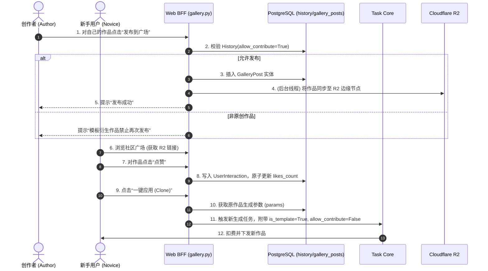

# 03_BIZ_社区广场与社交互动板块

## 1. 业务需求说明书 (BRD)
**目标定位**：构建系统的 UGC (用户生成内容) 社区。通过“画廊 (Gallery)”展示高质量的作品，为新手提供可直接“一键应用 (Clone)”的灵感库。
**商业价值**：通过点赞、排行榜等社交互动机制，增加核心用户的成就感与粘性；通过“一键应用”降低小白用户的创作门槛，从而提升全站整体的任务提交量（即消耗灵石变现）；同时，通过 R2 边缘加速机制实现社区作品的极速分发。

## 2. 功能规格说明书 (FSD)
本板块包含以下核心能力：
*   **作品发布 (Submit to Gallery)**：
    *   用户可将个人 `History` 中满意的生成结果推送到公共广场。
    *   **原创保护**：若原作品是基于他人模板克隆（`allow_contribute=False`）生成，则系统强行拦截其发布请求，防止套娃式盗图。
*   **社区展示与过滤 (Gallery Feed)**：
    *   展示作者名称、生成时间、使用的模型标签（如 Lora 节点对应的 `#BreastGrow`）。
    *   支持按任务类型（如文生图、高级视频）、时间范围（今日、本周、历史）及热度（点赞数）筛选排序。
*   **社交互动 (Interactions)**：
    *   点赞 (`like`) 与点踩 (`dislike`)，防连点与并发覆盖。
    *   一键应用模板 (`apply`)，提取原图参数作为默认值（如高阶玩家的高级分辨率，可能被降级为低阶玩家的默认值），直接发起新任务。

**前置依赖**：用户已完成作品的生成，且文件处于 MinIO 热桶或 R2 桶中。

## 3. 业务流程图 (Flow)

## 4. 关键接口与数据契约 (API/Data)
### 发布与防套娃保护：`POST /api/gallery/posts/submit/{task_id}`
*   **业务规则**：该接口通过查询任务的 `history` 表来判断当前用户是否有权发布。
*   **数据流向**：前端调用后，后端会在 `gallery_posts` 表插入新记录，并关联原 `task_id`。
### 互动与防并发：`POST /api/gallery/posts/{post_id}/interact`
*   **业务规则**：使用数据库 `UserInteraction` 的联合唯一约束拦截重复操作；更新点赞数时使用 `likes_count = likes_count + 1` 的原生 SQL 语句，避免高并发下内存数据覆盖。

## 5. 用户操作手册 (Manual)
### 5.1 浏览与一键同款 (Web / Bot)
1.  **在 Bot 内**：发送 `/gallery` 即可打开随机推送的高赞作品流，您可以直接在下方按钮点击 👍、👎 或 🚀（一键同款）。
2.  **在 Web 端**：点击左侧导航 `社区广场`，瀑布流中展示所有优质内容。点击卡片可查看使用的 Lora 模型或具体的时长参数。
3.  点击“一键同款”后，系统会自动提取大神设置的隐藏参数，您只需上传自己的参考图（如换脸视频），即可获得一模一样运镜风格的个人作品。

### 5.2 如何将得意之作挂上广场？
1.  在 Web 端的 `闪回瓶 (历史记录)` 或 Bot 的生成结果消息中，找到您刚刚创作的（非克隆）作品。
2.  点击底部的 `分享至广场` 按钮。
3.  系统即刻将您的作品推向全球首页，收获点赞。若您的作品被多次应用，您还将获得特殊的“布道者”隐藏成就。

---
*版本历史：*
* *v1.3.0 - Web 广场大改版，增加了 Lora 标签的动态翻译，并将热数据同步至 Cloudflare R2 以抵抗高并发加载。*
* *v1.1.0 - 引入了一键应用的 `allow_contribute` 原创保护机制，杜绝广场充斥无脑套娃的垃圾内容。*
