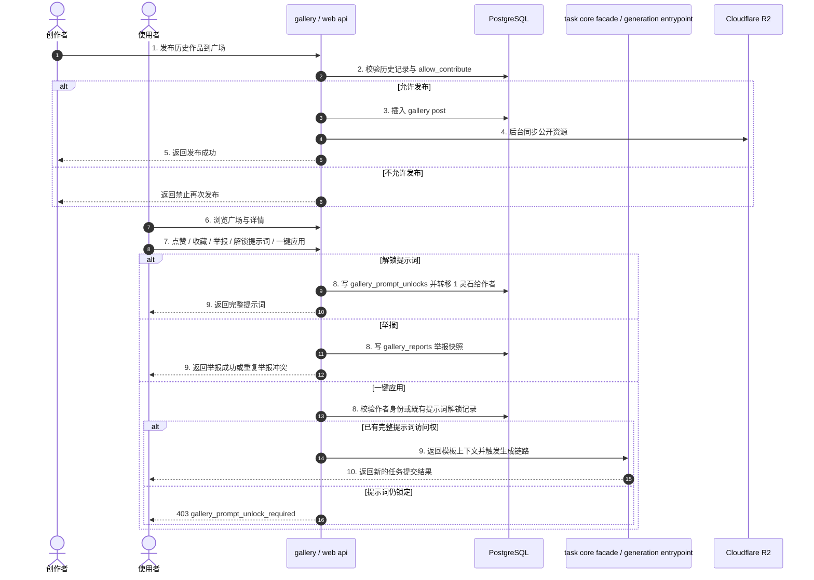

# 03_BIZ_社区广场与社交互动板块

## 1. 业务需求说明书 (BRD)

**目标定位**：构建系统的 UGC 社区。通过 Gallery 展示高质量作品，为新手提供可直接一键应用的灵感库。

**商业价值**：通过点赞、收藏、排行榜、提示词解锁与模板应用，提升用户粘性与任务提交量；提示词解锁可把 1 灵石收益直接分配给作者，同时借助 R2 边缘分发优化公开内容加载体验。

## 2. 功能规格说明书 (FSD)

本板块包含以下核心能力：

- **作品发布**：用户可将个人历史中的作品推送到公共广场。
- **原创保护**：若作品是基于他人模板衍生且 `allow_contribute=False`，系统强制拦截再次发布。
- **投稿封禁**：管理员可对用户开启 `is_submission_banned`，统一禁止 Bot/Web 端投稿、公开分享与重新上架。
- **后台治理**：Dashboard 广场管理展示投稿用户，支持按用户名、提示词片段、提示词字数筛选，并支持一键封禁该用户投稿能力、下架其全部广场投稿。
- **社区展示与过滤**：支持按类型、时间范围、热度等维度筛选。
- **原始输入预览**：市集、修仙笔记、我的投稿和用户主页作品卡片会展示输入素材缩略图，详情中可查看完整输入素材列表。
- **社交互动**：点赞、点踩、收藏与一键应用模板；完整提示词未解锁时不能打开
  Web 模板工作台。
- **举报治理**：用户可在作品详情举报儿童、血腥、恶心或其他违规内容；
  Dashboard 可查看举报、标记处理并联动软下架作品；作者主动删除被举报投稿
  时，待处理举报自动进入“已处理”，举报快照继续保留。
- **关注与粉丝**：用户可关注创作者，在个人中心查看“我的关注”和“我的粉丝”；粉丝列表支持进入对方主页与回关/取消关注。
- **用户公开主页**：公开主页展示创作者资料和公开投稿分页，投稿详情与广场详情共享提示词解锁能力。
- **提示词解锁**：未解锁提示词在市集详情中只展示半公开遮罩内容；用户可支付 1 灵石解锁完整提示词，消耗转给作者，并在修仙笔记的“提示词模版”中长期查看；命中 `low_trust_free_tier` 的用户不能新增解锁转账，但作者自看和已解锁记录再次查看不受影响。

## 3. 当前业务流程

## 4. 当前接口与数据契约

- 发布入口基于历史记录与 gallery post 关联，不再把社区流程叙述成直接耦合旧单体 core。
- 一键应用当前主路径是 Web apply-context / workbench；Web 获取完整模板上下文前
  必须是作者或已解锁该投稿提示词，未解锁统一返回
  `403 gallery_prompt_unlock_required`。不应再把 Telegram compat 流程写成唯一主入口。
- 市集筛选中自由P图 v2 是独立分组，不与旧自由P图共用 tab；旧自由P图分组保留 `edit` / `quick_image` / `img2img_lora`，v2 分组只收 `pornmaster_flux2_single_edit` / `pornmaster_flux2_multi_edit`。
- 自由P图 v2 支持投稿与 Web 一键应用；应用时复用并锁定原提示词，用户重新上传 1/2 张参考图，不展示 LoRA，提交按图片数量落到 single/multi v2 任务，并通过 `source_post_id` 记应用计数。
- Wan22 一键应用只开放单段记录：旧 `custom_video` / `video_lora` 与 `wan22_video_v2` 单段可进入模板应用，所有 stitched 拼接结果必须禁用按钮并由 apply-context 返回 400；v2 单段需回填负面提示词与分辨率档位。
- Gallery/修仙笔记展示用响应会从 `History.input_file` 暴露 `input_file/input_file_url/input_files/input_file_urls`，仅用于原始输入缩略图和详情预览；`txt2img` 不展示输入，单输入任务展示一张，多输入任务按顺序展示并在卡片角标显示叠层/`+N`。
- Wan22 首尾帧投稿展示为“起始帧 / 终止帧”。SCAIL-2 `scail2_action_transfer` / `scail2_video_replacement` / `scail2_face_swap_v2` 投稿展示为“参考图 / 驱动视频”。
- SCAIL-2 支持 Web/Bot 投稿；Web 一键应用时模板只复用投稿的 motion/driving video，复用者必须上传自己的 reference image。展示两份原始输入不代表 apply-context 复用两份输入。模板衍生结果保持 `allow_contribute=false`，不能再次投稿。
- 高级图生视频pro 接收 Web/主 Bot 新生成的 I2V、FLF2V 与 REF2V 投稿，统一在
  一个 Gallery 页签展示并复用全部通用互动。应用模板时锁定原提示词、时长、画质
  档位、比例及有序效果增强参数：I2V/FLF2V 要求使用者重新上传 1 张首帧或 2 张
  首尾帧，不复用原图；REF2V 要求使用者自行选择新的第 1 张主图，投稿者第 2 张起的
  参考图作为模板素材默认带入、可预览并可逐张替换。缺少完整 Pro 上下文的旧投稿仍
  可点赞、收藏、评论和举报，但不能一键应用；模板衍生结果不能再次投稿。
- reaction 以 `(user_id, post_id)` advisory transaction lock 串行切换，
  reaction/apply partial unique index 防重；投稿以 `(task_id, user_id)` unique
  和显式 conflict target 保证只有一个事实结果。
- 举报入口为 `POST /api/gallery/posts/{post_id}/reports`，请求体只包含 `reason=children|gore|gross|other`；同一用户对同一作品重复举报返回 `409`，不覆盖旧原因，作品已下架或不存在时不可举报。
- 作者调用投稿删除入口时，系统在删除 `GalleryPost` 前把同作品 pending 举报
  统一写为 `status=resolved`、`resolution_action=user_deleted` 并保留举报行；
  Dashboard“已处理”筛选继续可见，处理动作展示为“用户已删除”。
- 提示词解锁入口为 `POST /api/gallery/posts/{post_id}/prompt-unlock`，依赖 `gallery_prompt_unlocks.user_id + post_id` 唯一约束防重复扣费；解锁不再按低信任免费层拦截，首次解锁只受余额、帖子有效性和转账事务约束；修仙笔记“提示词模版”入口读取 `GET /api/gallery/my-prompt-unlocks`。
- 用户公开主页入口为 `GET /api/users/{user_id}/public-profile?page=&size=`，返回用户摘要和公开投稿分页 `posts`；兼容字段 `recent_posts` 只等于当前页 items。公开主页投稿详情也必须显示可解锁提示词入口。
- 用户中心关注入口为 `GET /api/users/me/follows`，粉丝入口为 `GET /api/users/me/followers`；粉丝列表中的 `is_following` 表示当前用户是否已回关该粉丝。
- Dashboard 广场列表入口为 `GET /api/gallery/all`，后台治理筛选可使用 `username`、`prompt_contains`、`prompt_max_length`，其中提示词条件基于 `History.prompt`。
- Dashboard 批量治理入口为 `POST /api/gallery/users/{user_id}/ban-submissions-and-takedown`，会设置用户投稿封禁、下架其所有 `GalleryPost`、同步取消相关历史记录公开状态，并处理该作者全部 pending 举报；响应包含 `affected_posts`、`affected_histories` 与 `resolved_reports`。
- Dashboard 举报管理入口为 `GET /api/gallery/reports?page=&page_size=&status=&reason=&post_id=`；图片和视频缩略图可打开弹窗预览，可用 `POST /api/gallery/reports/{report_id}/resolve` 标记处理，治理按钮统一复用用户级“封禁并下架”。兼容接口 `POST /api/gallery/reports/{report_id}/takedown` 仍保留单作品软下架和同作品 pending 举报处理语义。

## 5. 用户操作手册

### 5.1 浏览与一键同款

1. 在 Web 端进入社区广场查看作品。
2. 卡片左上角可查看原始输入缩略图；多输入任务会显示叠层和剩余数量。
3. 点击卡片查看详情、原始输入列表、模型标签与生成参数。
4. 若发现违规内容，可在详情中点击“举报”，选择儿童、血腥、恶心或其他原因提交。
5. 若想查看完整提示词，可点击“解锁提示词（1灵石）”；解锁后可复制提示词，并可在修仙笔记的“提示词模版”中再次查看。
6. 作者或已解锁该提示词的用户可点击一键同款进入模板应用链路；提示词仍锁定时，
   一键应用保持禁用并提示先解锁。

### 5.2 发布作品

1. 在历史记录或结果详情中选择满意作品。
2. 点击发布到广场。
3. 若作品满足原创保护条件且账号未被投稿封禁，系统将完成投稿并同步公开资源。

## 6. 维护原则

- 若修改 gallery submit、apply-context、详情弹层、举报治理或模板应用工作台，需要同步更新本业务文档。
- 若涉及任务触发链路，优先使用 `task core facade / generation entrypoint` 口径，而不是旧的泛化“Task Core 单体”。
