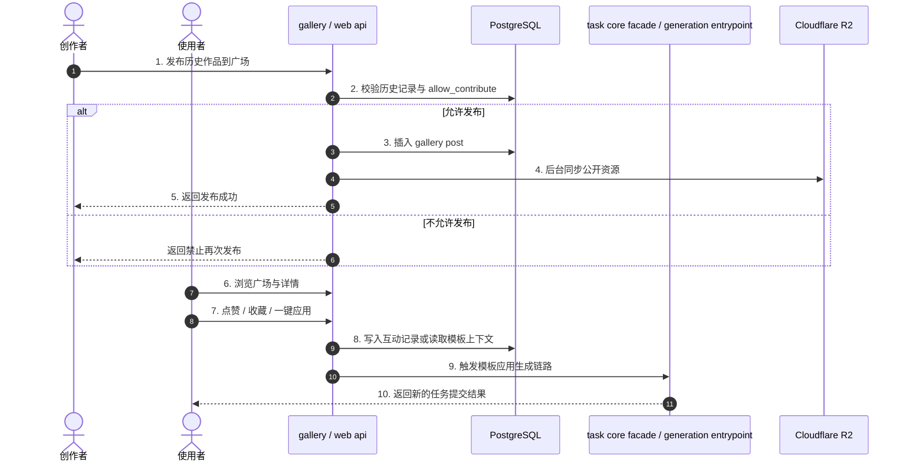

# 03_BIZ_社区广场与社交互动板块

## 1. 业务需求说明书 (BRD)
**目标定位**：构建系统的 UGC 社区。通过 Gallery 展示高质量作品，为新手提供可直接一键应用的灵感库。

**商业价值**：通过点赞、收藏、排行榜与模板应用，提升用户粘性与任务提交量；同时借助 R2 边缘分发优化公开内容加载体验。

## 2. 功能规格说明书 (FSD)
本板块包含以下核心能力：
- **作品发布**：用户可将个人历史中的作品推送到公共广场。
- **原创保护**：若作品是基于他人模板衍生且 `allow_contribute=False`，系统强制拦截再次发布。
- **投稿封禁**：管理员可对用户开启 `is_submission_banned`，统一禁止 Bot/Web 端投稿、公开分享与重新上架。
- **社区展示与过滤**：支持按类型、时间范围、热度等维度筛选。
- **社交互动**：点赞、点踩、收藏与一键应用模板。

## 3. 当前业务流程

## 4. 当前接口与数据契约
- 发布入口基于历史记录与 gallery post 关联，不再把社区流程叙述成直接耦合旧单体 core。
- 一键应用当前主路径是 Web apply-context / workbench，不应再把 Telegram compat 流程写成唯一主入口。
- 互动防并发与去重依赖数据库约束与服务层收口，避免高并发下覆盖更新。

## 5. 用户操作手册
### 5.1 浏览与一键同款
1. 在 Web 端进入社区广场查看作品。
2. 点击卡片查看详情、模型标签与生成参数。
3. 点击一键同款后进入模板应用链路。

### 5.2 发布作品
1. 在历史记录或结果详情中选择满意作品。
2. 点击发布到广场。
3. 若作品满足原创保护条件且账号未被投稿封禁，系统将完成投稿并同步公开资源。

## 6. 维护原则
- 若修改 gallery submit、apply-context、详情弹层或模板应用工作台，需要同步更新本业务文档。
- 若涉及任务触发链路，优先使用 `task core facade / generation entrypoint` 口径，而不是旧的泛化“Task Core 单体”。
