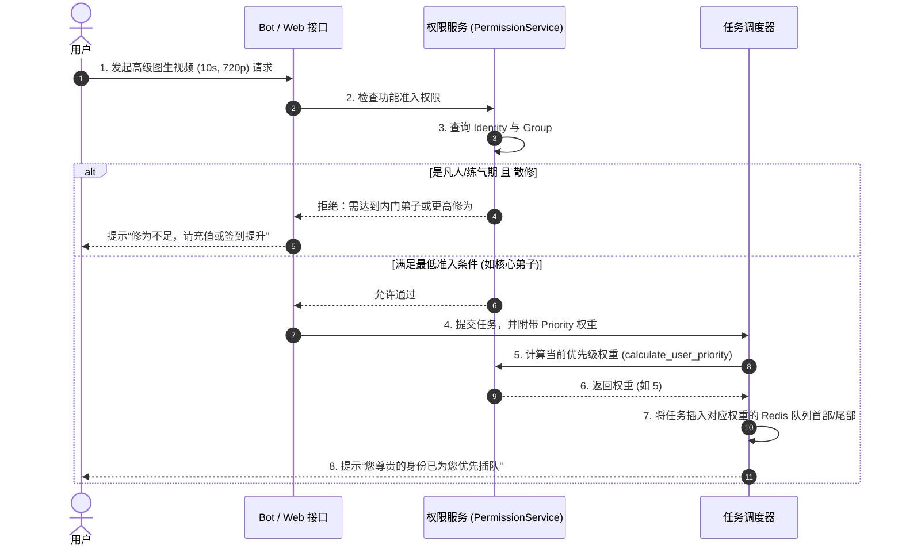

# 04_BIZ_用户修为与身份权限体系

## 1. 业务需求说明书 (BRD)
**目标定位**：构建符合“修仙”世界观的用户成长与权限管控体系。系统将用户的等级划分为两条平行的线：基于签到与活跃度提升的**“修为境界”**（如凡人、练气、筑基），以及基于氪金订阅获取的**“身份头衔”**（如内门、核心、真传弟子）。
**商业价值**：
1. **促活与留存**：利用“修为境界”和签到系统，培养零氪或微氪用户的日活习惯。
2. **变现与尊享感**：利用“身份头衔”建立阶梯式的权限壁垒，为充值用户提供免排队特权、高级长视频生成权限及额外的每月灵石配额，从而驱动会员卡的销售转化。

## 2. 功能规格说明书 (FSD)
本体系通过底层的 `PermissionService` 拦截全局功能，核心规格如下：

### 2.1 活跃度等级（修为境界 - User Group）
用户通过每日签到 (`/checkin`) 或完成特定任务积累经验值（贡献点），从而突破境界。
*   **凡人 / 练气期**：默认基础等级。系统负载高时将遭遇“排队限流”拦截。
*   **筑基期 / 金丹期 / 元婴期**：进阶活跃等级。享有基础的**免排队特权**（队列优先级提升）。金丹期及以上用户在 Bot 内会展示专属 Web 端的入口按钮。

### 2.2 会员身份特权（身份头衔 - User Identity）
通过付费订阅（充值）获取，具有严格的有效期（`identity_expire_at`）和跨级折算逻辑。
*   **无身份 (散修)**：基础权限，只能生成短视频（如 5s）和标准分辨率图像。
*   **内门弟子**：
    *   **权限解锁**：解锁 Web 工作台登录权限、高级分辨率生成。
    *   **优先级权重**：`2`（高于所有白嫖的活跃用户）。
*   **核心弟子**：
    *   **权限解锁**：解锁更长时长的视频（如 10s）。
    *   **优先级权重**：`5`。
*   **真传弟子**：
    *   **权限解锁**：解锁 1024p 顶级画质、超长视频（如 20s）及隐藏的高消耗 AI 节点。
    *   **优先级权重**：`10`（最高级，绝对优先调度）。

**前置依赖**：用户数据的创建与 `internal_user_id` 的绑定。

## 3. 业务流程图 (Flow)

### 3.1 权限拦截与调度优先级判定流转



## 4. 关键接口与数据契约 (API/Data)

### 核心权限判定函数映射
在业务层，所有的权限判断被抽象在 `PermissionService` 服务中，核心映射关系如下：
```python
# src/services/permission_service.py 中计算优先级的伪代码逻辑
if identity == '真传弟子': return 10
if identity == '核心弟子': return 5
if identity == '内门弟子': return 2
if group in ['元婴期', '金丹期', '筑基期']: return 1
return 0 # 凡人 / 练气期
```

### 数据库实体关联 (Users 表)
业务层强依赖 `Users` 表的以下字段以支撑双轨等级：
*   `current_identity`: 字符串，如 `'内门弟子'`。
*   `identity_expire_at`: 时间戳，记录会员特权的失效时间。一旦超期，系统将自动降级为无身份。
*   `group` / `experience` (可选拓展): 记录通过签到获得的修为阶段与经验值。

## 5. 用户操作手册 (Manual)

### 5.1 如何提升修为境界？
1.  在 Telegram 机器人内，每日发送 `/checkin`（或点击 `📅 每日签到`）。
2.  系统会随机派发灵石奖励，并累加您的隐藏修仙经验。
3.  当经验达到阈值时，Bot 会自动推送境界突破通知（如“恭喜您突破至筑基期！”），此时您将自动获得基础的免排队特权。

### 5.2 如何获取专属会员身份？
1.  发送 `/recharge` 打开充值面板。
2.  不要选择“散修盘缠”（仅加灵石不加身份）。请选择“内门弟子月卡”、“核心弟子月卡”或“真传弟子月卡”。
3.  支付完成后，您的菜单和个人中心头衔将立刻更新。
4.  **跨级折算提示**：如果您已经是“内门弟子”，再次购买“核心弟子”，系统**不会**让您吃亏。剩余的内门天数将自动按价值比例折算成额外的核心弟子天数！

---
*版本历史：*
* *v1.1.0 - 明确分离了 `Identity`（付费特权）和 `Group`（活跃等级），并修复了凡人队列爆满时无法提交任务的限制。*
* *v1.0.0 - 建立修仙世界观，设计出基础的排队优先级权重算法。*
