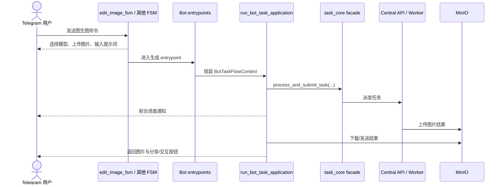

# 图生图 (Image-to-Image) 业务流与架构分析

本文档描述当前系统中的图生图链路，包括自由 P 图、I2I Pro、换脸与相关 Telegram 交互流。

## 一、 当前业务主链

## 二、 当前分层说明

### 2.1 交互层

- 图生图入口由 `edit_image_fsm.py` 等 FSM 控制。
- 当前 FSM 采用统一菜单打断与超时清理，不再依赖仅中文正则的旧模式。

### 2.2 Bot 任务流层

- FSM 完成参数收集后，通常调用 `process_generation_task(...)`、`process_i2i_pro_task(...)` 等模块级入口。
- 真实处理链路下沉到 `run_bot_task_application(...)` 与 `task core facade` 分层链路。

### 2.3 Core 提交层

- `task_core.py` 当前是 facade，不再承担全部底层逻辑。
- 真实默认装配通过 provider/dependencies、submission 与 runtime 模块完成。
- 测试优先显式注入 `dependencies`，避免继续 patch 旧模块级 seam。

## 三、 LoRA / 工作流注入

- LoRA 与工作流注入仍由工作流 patcher / mapping 驱动。
- Bot 侧只负责收集用户参数与选择，不应在 FSM 内直接耦合底层节点结构。
- 若新增 LoRA 或工作流参数透传，应同步 `allbot-comfy-models` 相关知识。

## 四、 结果回传与清理

- 成功链路需负责结果下载、发送、分享按钮与可选 gallery 交互。
- 失败/取消链路需负责状态消息收口、临时文件清理与 runtime cleanup。
- 当前取消态应通过专用异常/终态语义处理，不回退到字符串 sentinel。

## 五、 测试要求

- 覆盖图生图入口正常提交、菜单打断、超时退出。
- 覆盖 entrypoint 到 `run_bot_task_application(...)` 的上下文装配。
- 覆盖结果发送与失败清理逻辑。
