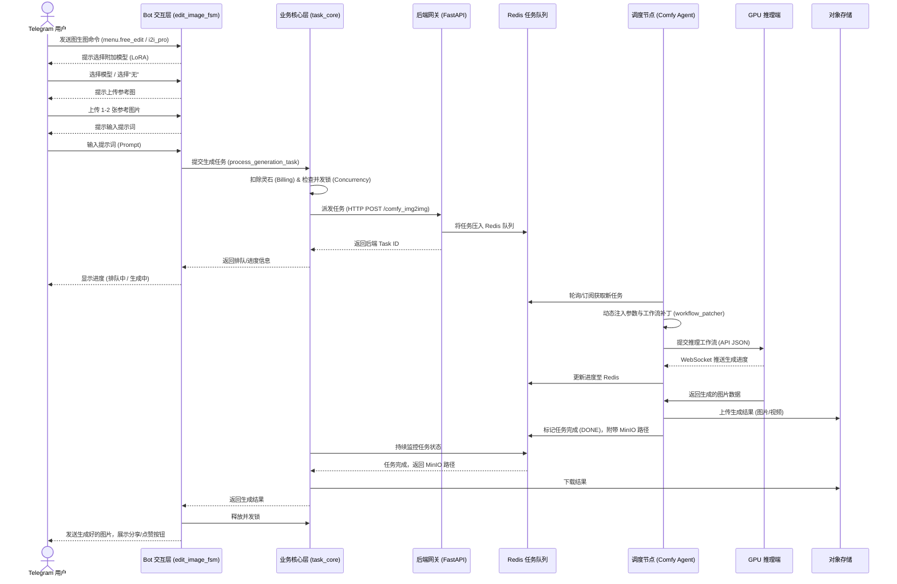
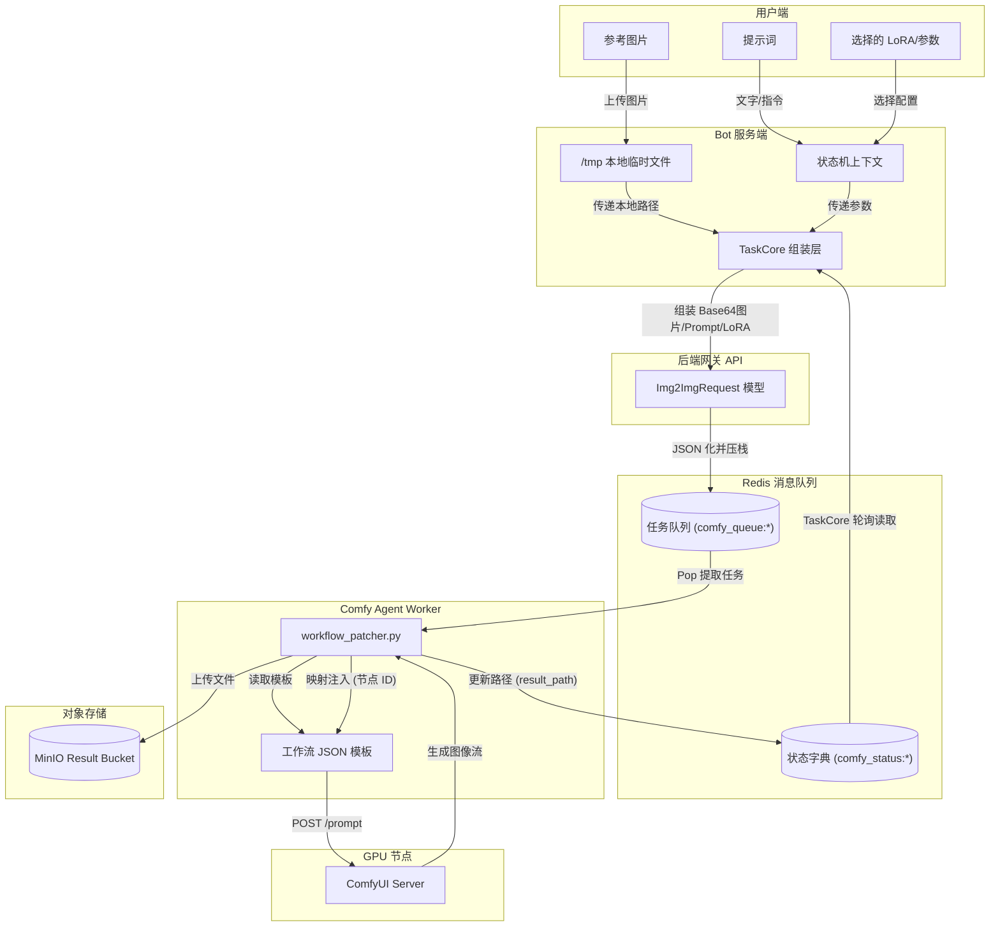
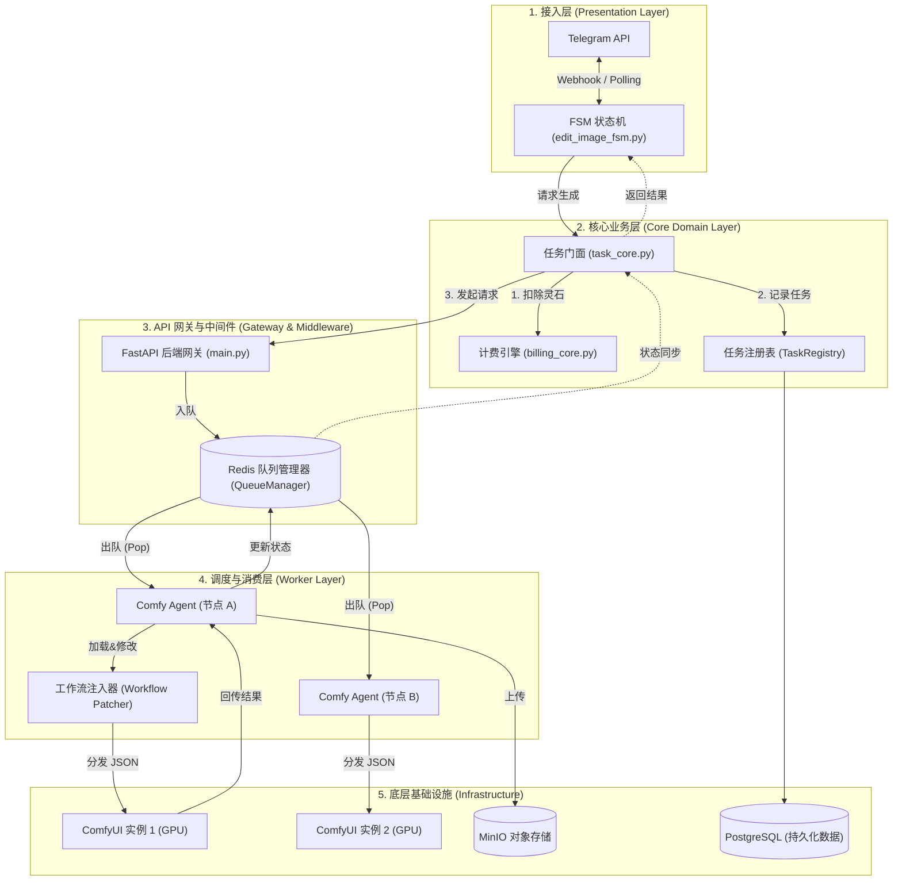

# 图生图 (Image-to-Image) 业务流与架构分析

本文档详细分析了现有系统中的图生图（自由P图 / 幻想换脸 / 附加模型）的业务流程、数据流向以及底层的调度架构。

## 一、 业务流程图 (Business Flow)

## 二、 数据流向图 (Data Flow)

描述在图生图任务执行期间，图片、提示词和模型参数等数据是如何在各个微服务间流转的。

## 三、 系统架构图 (Architecture Diagram)

图生图模块在系统中的层级架构，展示了从接入层到底层基础设施的分层解耦设计。

## 四、 架构分析说明

目前的图生图 (Image-to-Image) 模块采用了**高度解耦的三层架构**，以保障系统在高并发情况下的稳定性和容灾能力：

### 1. 交互与核心层 (Telegram Bot + Task Core)
- **状态机流转 (FSM)**: 图生图的业务入口由 `edit_image_fsm.py` 控制。使用 `ConversationHandler` 严格规范了“选模型 -> 传图 -> 传词”的收集顺序。
- **资源隔离**: 图片首先被下载到 Bot 的本地 `/tmp/bot_fsm_tmp` 目录中。收集完毕后，FSM 调用 `bot_task_service.py` 将控制权移交给系统核心层。
- **计费与并发锁**: 在 `task_core.py` 中，执行 `check_concurrency_lock` 和 `check_and_deduct_credits`，利用 Redis 的原子性保证灵石不被超扣，同时限制用户最大并发数（目前 MAX_CONCURRENT_TASKS = 3）。

### 2. 网关与调度层 (FastAPI + Redis Queue)
- **解耦中转**: Bot 并不直接与 ComfyUI 通信，而是通过 HTTP 调用 `backend/app/main.py` 中的网关接口（如 `/comfy_img2img_lora`）。
- **队列管理**: FastAPI 接收到请求后，将其转化为 `TaskType` 对应的 Pydantic 模型，推入 Redis 的等待队列（由 `QueueManager` 统一管理），随后立刻向 Bot 返回一个 `task_id`。
- **状态监控**: Bot 使用该 `task_id` 轮询后端（或使用 pub/sub），向用户实时反馈“排队中 (第 X 位)”或“生成中 (X%)”的进度。

### 3. 消费与推理层 (Worker + ComfyUI)
- **Worker 轮询**: `workers/comfy_agent/` 独立运行在各个计算节点上。它们不断从 Redis 取出对应任务类型的 Payload。
- **动态补丁 (Workflow Patcher)**: 这是架构中最灵活的部分。
  - Worker 首先读取 `mappings.json`，获知业务参数（如 `prompt`, `image`, `lora_name`）对应在 ComfyUI 工作流中的节点 ID。
  - 读取基础工作流模板（例如 `Qwen-Rapid-AIO.json`）。
  - **防爆重连**: 如果用户没有选择 LoRA（或者某些可选图没有传），Patcher 会执行动态剪枝操作（如绕过 LoRA 节点，直接将 KSampler 连向 Checkpoint），防止 ComfyUI 因为节点参数缺失而崩溃。
- **结果回传**: ComfyUI 推理完毕后，Worker 将图片上传到 MinIO 的 `result_bucket`，并将路径写回 Redis `status` 中，从而闭环整个数据流。

### 4. 附加模型(LoRA)的配置特性
得益于 `allbot-comfy-models` 的技能设计，增加新的图生图 LoRA 模型**无需修改底层代码**。只需：
1. 将 `.safetensors` 文件放至指定目录。
2. 在 `edit_image_fsm.py` 的 `LORA_MODELS` 字典中增加对应的路径和中文名。
3. 系统会自动将其展示给用户，并通过网关将其作为 `lora_name` 参数一路透传到 `workflow_patcher.py` 中进行节点注入。
