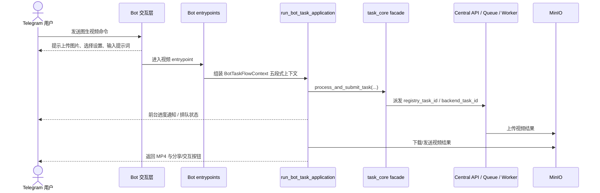
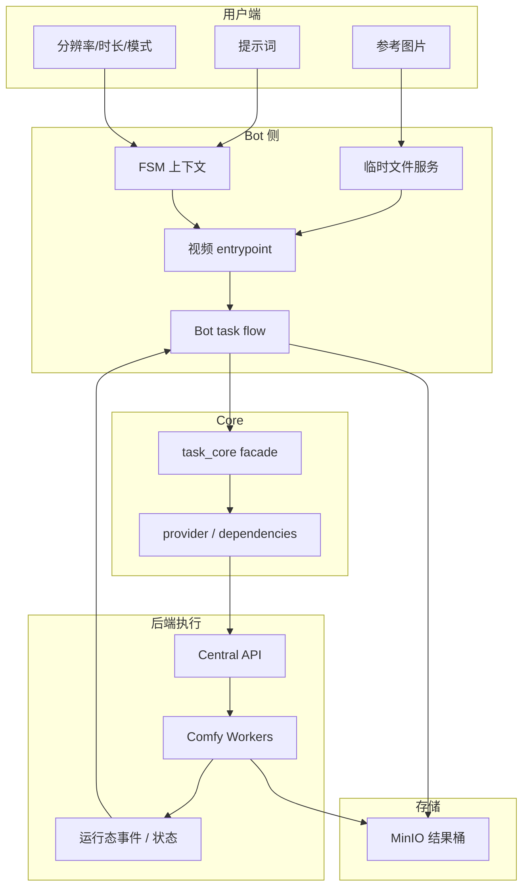

# 图生视频 (Image-to-Video) 业务流与架构分析

本文档描述当前系统中的图生视频链路，包括 `ltx_video`、`wan22_video_v2`、自定义视频、快捷视频与相关 Telegram / Web 任务流。

## 一、 当前业务主链

### 当前关键事实
- FSM 不再直接长轮询 `task_core`；真实主链是 `entrypoint -> run_bot_task_application(...) -> task_core facade`。
- Bot 视频主链的取消态当前通过 `BotTaskCancelled` 收口，而不是字符串 sentinel。
- `quick_video_fsm.py` 已不再通过构造假的 `Update/Message` 适配旧接口。
- `ltx_video` 当前主协议是 `lora_items` 多选链路，最多 3 个 LoRA，旧 `lora_name / lora_strength` 只保留兼容。
- `wan22_video_v2` 已进入统一视频主链；除主视频外，还可能通过 `extra_outputs.last_frame` 回传尾帧图片。
- Web `wan22_video_v2` 已支持与 Bot 对齐的多段链：历史与 `/api/tasks/{task_id}/result` 会返回 `last_frame` 与 `result_meta`，并新增 `/api/users/history/{task_id}/wan22-chain`、`/api/users/history/{task_id}/wan22-chain/stitch` 供工作台继续扩展、中段重生成和整链拼接；其中整链拼接现在会把拼接后 MP4 上传存储，并新增一条 `History` 记录返回给前端，而不是只回下载流。

## 二、 数据流向

## 三、 分层说明
### 3.1 交互层
- `ltx_video_fsm.py`、`wan22_video_v2_fsm.py`、`image_to_video_fsm.py`、`quick_video_fsm.py` 等负责分步收集参数。
- 全局菜单打断通过 `is_global_menu_command(...)` 统一识别。
- 当前主 FSM 普遍使用 `conversation_timeout=300`。
- `wan22_video_v2_fsm.py` 现已收口为“起始帧 + 可选终止帧 + prompt/negative prompt”输入；是否启用首尾帧由是否上传第二张图自动判断，尾帧提取固定开启且仅作存储，不再开放 `color_match`、`perfect_loop`、`upscale`、`extract_last_frame` 给用户。

### 3.2 Bot 任务流层
- 视频任务入口主要位于：
  - `task_service_entrypoints_video.py`
  - `task_service_entrypoints_specialized.py`
  - `task_service_entrypoints_generation.py`
- 这些入口负责构造 `BotTaskFlowContext`，再进入 `run_bot_task_application(...)`。
- 其中 generation 侧已继续按任务族拆分到：
  - `task_service_generation_image.py`
  - `task_service_generation_video.py`
  - `task_service_generation_wan22.py`
- 内部调用当前应优先直接进入分域 entrypoints；历史 `bot_task_service.py` compat 壳已删除，不再作为调用入口。
- `process_wan22_video_v2_task(...)` 位于 generation entrypoints，`process_ltx_video_task(...)` 位于 specialized entrypoints；两者都已走统一提交与前台监控主链。

### 3.3 Core 提交与监控层
- `task_core.py` 负责统一提交语义。
- `task_dispatcher.py` 基于 strategy 生成 workflow / payload。
- Web 任务完成后由 `src/services/task_web_side_effects.py`、`task_web_lifecycle_monitor.py`、`task_web_terminal_finalization.py` 协同承接 side effect 与终态收口；Bot 则由 `run_bot_task_application(...)` 负责前台监控与展示。
- `wan22_video_v2` 的链式上下文（`wan22_prev_task_id`、`wan22_chain_task_ids`、分辨率、负面提示词、是否使用终止帧）现由 dispatcher metadata 写入提交，再由 Web terminal finalization 合并进历史 `extra_outputs._wan22_context`，供 Bot/Web 共用历史链恢复。

### 3.4 Web 工作台与历史链
- 工作台页面 `frontend/src/views/Wan22VideoV2.vue` 现在区分“展示中的整条链”和“当前提交的编辑上下文链”，避免中间段重生成时误把后续旧分支一起带入。
- 桌面端默认使用横向链路条查看各段并切换编辑；手机端改为纵向链路与全宽按钮，降低连续扩展/重生成时的误触成本。
- 历史详情 `TaskDetailModal.vue` 已为 `wan22_video_v2` 提供“扩展下一段 / 重新生成本段 / 完成整链拼接”入口；其中扩展要求当前记录存在可用 `last_frame`。点击“完成整链拼接”后，前端会直接打开新生成的拼接历史记录，提示词按“第 N 段”分段汇总各子片段 prompt。

## 四、 计费与资源约束
- 视频任务计费是动态的，通常由分辨率与时长组合决定。
- 过高画质与过长时长组合仍可能触发 guardrail，避免显存溢出或节点拥塞。
- 任何取消/失败路径都必须与并发锁释放和必要退款一并考虑。

## 五、 结果发送与清理
- Bot 完成后会发送 MP4、caption、reply markup 与后续交互入口。
- `wan22_video_v2` 在开启 `extract_last_frame` 时，还会额外发送 `extra_outputs.last_frame` 对应的尾帧图片。
- 运行结束后需清理：
  - status message
  - 本地临时文件
  - runtime state / registry
  - 必要的锁与终态消息

## 六、 测试要求
- 覆盖参数收集、菜单打断、超时退出。
- 覆盖视频 entrypoint 到 `run_bot_task_application(...)` 的上下文装配。
- 覆盖取消、失败、成功三条主分支。
- 若修改 `wan22_video_v2`，需覆盖“单起始帧 / 双帧模式 / 尾帧开关”三类布尔门控与结果发送语义。
- 若修改 `wan22_video_v2` Web 链式编辑，需额外覆盖 `result_meta`、历史链查询、整链拼接、以及“中间段重生成只继承前序链路”的提交上下文截断语义。
- 若修改 `ltx_video`，需覆盖 `lora_items` 多选、单项兼容字段与无 LoRA 回退三类协议。
- 若修改视频成本计算、requested_duration 或结果发送语义，需同步回归 focused tests 与黄金路径集。
