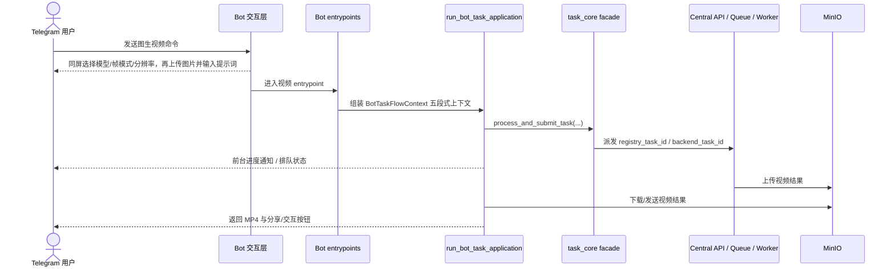
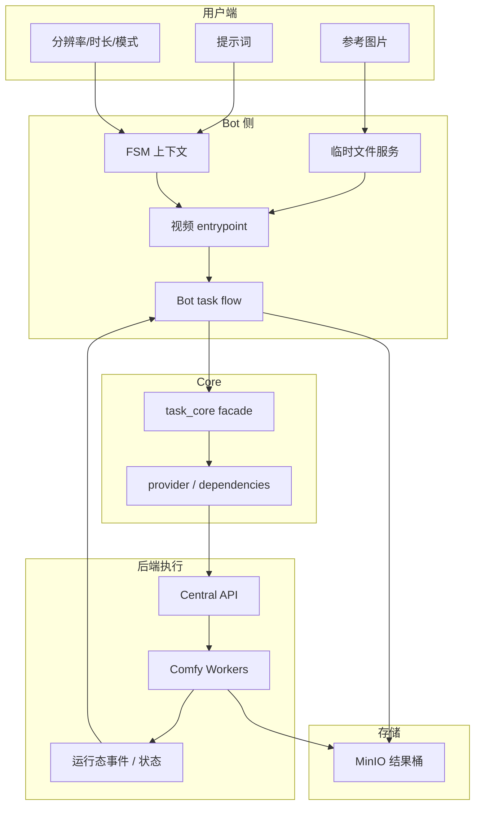

# 图生视频 (Image-to-Video) 业务流与架构分析

本文档描述当前系统中的图生视频链路，包括 `ltx_video`、`wan22_video_v2`、自定义视频、快捷视频与相关 Telegram / Web 任务流。

## 一、 当前业务主链

### 当前关键事实
- FSM 不再直接长轮询 `task_core`；真实主链是 `entrypoint -> run_bot_task_application(...) -> task_core facade`。
- Bot 视频主链的取消态当前通过 `BotTaskCancelled` 收口，而不是字符串 sentinel。
- `quick_video_fsm.py` 已不再通过构造假的 `Update/Message` 适配旧接口。
- `ltx_video` 当前主协议是 `lora_items` 多选链路，最多 3 个 LoRA，旧 `lora_name / lora_strength` 只保留兼容。
- `ltx_video` 用户侧历史/Gallery 类型不拆分；执行面按 `ltx_mode` 分流到 `ltx_video`（单首帧 I2V）、`ltx_video_flf2v`（首尾帧）或 `ltx_video_v2v_audio`（输入视频 + 文本生成带音频视频）。三者共用现有 LTX 主模型、LoRA 选项和计费倍率。
- LTX 首尾帧和视频配音路径都会保存 `extra_outputs.last_frame`；普通 LTX I2V 若请求带 `extract_last_frame=true` 也会保存尾帧，用于扩展生成。
- `wan22_video_v2` 已进入统一视频主链；除主视频外，还可能通过 `extra_outputs.last_frame` 回传尾帧图片。
- 旧图生视频 `custom_video` / `video_lora` 与 Telegram 懒人动图在执行面统一为 `image_to_video`，与 `wan22_video_v2` 共用 `Wan22AioV82.json`；历史、投稿和展示类型仍保留 `custom_video` / `video_lora` 或具体懒人动图 mode，不改写成 v2。
- `Wan22AioV82.json` 在 `2603` 最终帧序列后接入 `265` (`FL_RIFE`, `multiplier=4`) 插帧；worker patcher 会把主视频输出、帧数统计和尾帧提取都切到 `["265", 0]`，避免插帧后视频时长变慢。
- Wan22 AIO 视频配置事实源是 `src.domain_config.wan22_aio_video`：旧图生视频 `custom_video` / `video_lora` / 懒人动图 mode / legacy `video_insert`、`video_edit` -> execution `image_to_video` -> `legacy_image_to_video` profile；图生视频 v2 `wan22_video_v2` -> execution `wan22_video_v2` -> `wan22_video_v2` profile。两者共享 worker workflow，但不是同一个用户功能。
- 旧图生视频支持 `5s/8s/10s`，对应 `81/129/161` 帧；分辨率与计费基数对齐 v2 四档：`preview` / `small` / `standard` / `hd`。历史投稿中的 `512p` / `720p` / `1024p` 会分别映射到 `preview/standard/hd`，`0.36 MP - Small` 会映射到 `small`，canonical duration 会恢复为 `5s/8s/10s`，缺失或非 canonical 时回退 5 秒。
- Telegram `image_to_video_fsm.py` 的旧图生视频主入口会先展示同屏设置面板：附加模型、单图/首尾帧、`preview/small/standard/hd` 分辨率与确认按钮。确认后单图模式收 1 张起始图，首尾帧模式依次收起始图与终止图，然后要求发送提示词提交。
- Telegram `ltx_video_fsm.py` 的高级图生视频入口会先选择最多 3 个 LTX LoRA，再选择“单首帧 / 首尾帧 / 视频配音”。首尾帧模式依次收起始图和终止帧；视频配音模式收输入视频，再把文本作为音频/口型同步方向提交。
- `image_to_video` 和 `wan22_video_v2` 通过 `wan22_model_profile` 区分主模型：旧入口使用 legacy high/low 主模型，v2 使用 snatchkiss high/low 主模型。`video_lora` 仍保留旧 LoRA 前缀选择，`custom_video` 兼容入口保持无 LoRA，v2 会清空额外 LoRA 槽。
- Web `wan22_video_v2`、`custom_video`、`video_lora` 已支持与 Bot 对齐的多段链：历史与 `/api/tasks/{task_id}/result` 会返回 `last_frame` 与 `result_meta`，并新增 `/api/users/history/{task_id}/wan22-chain`、`/api/users/history/{task_id}/wan22-chain/stitch` 供练功房继续扩展、分段重生成和整链拼接；其中整链拼接现在会把拼接后 MP4 上传存储，并新增一条 `History` 记录返回给前端，而不是只回下载流。

### Legacy 视频任务类型收口表

| 类型 / mode | 当前定位 | 执行面 task type | Worker / workflow 口径 |
| :--- | :--- | :--- | :--- |
| `image_to_video` | 旧图生视频的新中性执行名；Web 可直接提交该字面量 | `image_to_video` | `Wan22AioV82.json` + `legacy_image_to_video` profile |
| `custom_video` / `video_lora` | 用户功能与历史/Gallery 类型；`video_lora` 额外允许旧 LoRA | `image_to_video` | 同上；历史类型不改名 |
| `perfect_video_insert`、`doggy_style`、`blowjob`、`undress_tongue`、`closeup_blowjob`、`perfect_video_edit`、`txt2video` | Telegram 懒人动图 / 旧快捷入口 mode；差异只在 FSM/entrypoint 注入内置 prompt | `image_to_video` | 不代表独立 worker workflow |
| `video_insert` / `video_edit` | legacy Central/Worker alias，用于旧队列残留、旧 endpoint 或旧容器兼容 | `image_to_video` | 必须复用 `patch_image_to_video_workflow`，不得再绑定独立 JSON 或模型 |
| `wan22_video_v2` | 图生视频 v2 用户功能与历史类型 | `wan22_video_v2` | `Wan22AioV82.json` + `wan22_video_v2` profile |

新增入口、测试、RunPod profile 和生产 worker 能力配置时，优先使用 canonical `image_to_video` / `wan22_video_v2`。只有为了兼容存量队列或旧部署，才继续让 worker 声明 `video_insert` / `video_edit` alias。

## 二、 数据流向

## 三、 分层说明
### 3.1 交互层
- `ltx_video_fsm.py`、`wan22_video_v2_fsm.py`、`image_to_video_fsm.py`、`quick_video_fsm.py` 等负责收集图片、提示词与参数；其中旧图生视频会在上传图片前用同屏设置面板收集附加模型、帧模式、分辨率和时长，`wan22_video_v2` 主入口会先同屏选择单图/首尾帧、分辨率和时长，再按所选模式收 1 张或 2 张图片。
- 全局菜单打断通过 `is_global_menu_command(...)` 统一识别。
- 当前主 FSM 普遍使用 `conversation_timeout=300`。
- `wan22_video_v2_fsm.py` 现已收口为“启动设置面板 + 起始帧 + 可选终止帧 + prompt/negative prompt”输入；主入口先选择单图或首尾帧、分辨率档位和时长，确认后再根据帧模式决定收 1 张或 2 张图片。填写或跳过负面提示词后直接提交任务，不再展示后置设置确认页；`WAIT_SETTINGS` 仅保留用于兼容已发出的旧确认消息。续写入口仍会预载上一段尾帧，再沿用兼容的单图/首尾帧选择。尾帧提取固定开启且仅作存储，不再开放 `color_match`、`perfect_loop`、`upscale`、`extract_last_frame` 给用户。

### 3.2 Bot 任务流层
- 视频任务入口主要位于：
  - `task_service_entrypoints_video.py`
  - `task_service_entrypoints_specialized.py`
  - `task_service_entrypoints_generation.py`
- 这些入口负责构造 `BotTaskFlowContext`，再进入 `run_bot_task_application(...)`。
- 其中 generation 侧已继续按任务族拆分到：
  - `task_service_generation_image.py`
  - `task_service_generation_video.py`
  - `task_service_generation_wan22.py`
- Wan22 AIO 图生视频 Bot 生成服务已收口到 `src/services/wan22_aio_video_generation.py`；`task_service_generation_video.py` 与 `task_service_generation_wan22.py` 保留薄 wrapper，前端/Bot 交互语义不随底层合并而改名。
- 内部调用当前应优先直接进入分域 entrypoints；历史 `bot_task_service.py` compat 壳已删除，不再作为调用入口。
- `process_wan22_video_v2_task(...)` 位于 generation entrypoints，`process_ltx_video_task(...)` 位于 specialized entrypoints；两者都已走统一提交与前台监控主链。

### 3.3 Core 提交与监控层
- `task_core.py` 负责统一提交语义。
- `task_dispatcher.py` 基于 strategy 生成 workflow / payload。
- Web 任务完成后由 `src/services/task_web_side_effects.py`、`task_web_lifecycle_monitor.py`、`task_web_terminal_finalization.py` 协同承接 side effect 与终态收口；Bot 则由 `run_bot_task_application(...)` 负责前台监控与展示。
- Wan22 图生视频链式上下文（`wan22_prev_task_id`、`wan22_chain_task_ids`、分辨率、负面提示词、是否使用终止帧、主模型 profile、旧 LoRA 信息）现由 dispatcher metadata 写入提交，再由 Web terminal finalization 合并进历史 `extra_outputs._wan22_context`，供 Bot/Web 共用历史链恢复。适用类型包括 `wan22_video_v2`、`custom_video`、`video_lora` 与懒人动图 mode。

### 3.4 Web 练功房与历史链
- `wan22_video_v2` 主入口已并入练功房 `frontend/src/views/CustomFeatures.vue`；独立 `frontend/src/views/Wan22VideoV2.vue` 仅作为兼容入口保留。旧 `custom_video` / `video_lora` 也复用同一套 Wan22 多段编辑能力。
- 练功房结果区不再提供语义含混的“继续生成”，而是为 Wan22 图生视频显示“扩展生成 / 重新生成”；第二段及以后基于 `wan22_prev_task_id` 额外显示“拼接”。
- 扩展生成会把当前段 `extra_outputs.last_frame` 作为锁定起始帧，清空本段正向 prompt，并提交 `wan22_prev_task_id = 当前段` 与包含当前段在内的 `wan22_chain_task_ids`。
- 重新生成第一段只清空表单并保持 `wan22_video_v2` 模式，不自动复用原始素材或参数；第二段及以后会复用上一段尾帧、当前段 prompt/负面 prompt/分辨率和可选终止帧，且只继承当前段之前的链路上下文。
- 历史详情 `TaskDetailModal.vue` 已为 `wan22_video_v2`、`custom_video`、`video_lora` 提供“扩展下一段 / 重新生成本段 / 完成整链拼接”入口；编辑入口会携带 `type=<来源类型>&wan22_mode=extend|regenerate&wan22_task_id=...` 回到练功房。点击“完成整链拼接”后，前端会直接打开新生成的拼接历史记录，提示词按“第 N 段”分段汇总各子片段 prompt，拼接历史类型保持来源链路类型。
- Gallery 一键应用只支持 Wan22 单段记录：旧 `custom_video` / `video_lora` 继续恢复 prompt、旧 LoRA、分辨率档位和 canonical 时长，`wan22_video_v2` 单段恢复 prompt、negative prompt、分辨率档位和 canonical 时长；所有 stitched 拼接记录都禁用一键应用，apply-context 服务端返回 400。
- Telegram Bot 第二段及以后点击“重新生成”会进入可编辑 FSM：锁定上一段尾帧，继承当前段终止帧、负面提示词、分辨率和旧 LoRA 上下文，并展示原 prompt；用户可以发送新 prompt，或点击“使用原提示词”继续。
- Telegram Bot 结果按钮不能只依赖 `context.bot_data["msg_meta_<message_id>"]` 里的内存元数据；`扩展生成 / 重新生成 / 完成拼接` callback 需携带当前 `task_id`，旧消息则允许从同条消息的 `submit_gallery_<task_id>` 按钮兜底恢复，再从历史 `extra_outputs._wan22_context` 补齐分辨率、上一段、负面提示词、LoRA 和拼接链路上下文。若仍无法恢复，必须回一条明确失效提示，避免只显示“任务初始化中”。
- Telegram Bot 点击“完成拼接”后也会把拼接 MP4 上传存储并新增一条 `source=bot` 的历史记录；结果消息使用新 `task_id` 注入“投稿至广场”按钮，继续复用 `submit_gallery_<task_id>` 投稿链路。

## 四、 计费与资源约束
- 视频任务计费是动态的，通常由分辨率与时长组合决定。
- Wan22 AIO 视频的分辨率档位统一维护在 `src.domain_config.wan22_aio_video`，Bot / Web / dispatcher / worker patcher 共享同一语义；分辨率基数为 `preview` = 极速 / 约 512p / `0.26 MP - Preview` / 6 灵石（默认且最低价），`small` = 清晰 / 约 600p / `0.36 MP - Small` / 12 灵石，`standard` = 标准 / 约 720p / `0.52 MP - SD` / 20 灵石，`hd` = 高清 / 约 810p / `0.65 MP - Balanced` / 30 灵石。旧 `fast` 仅作为兼容别名归一到 `preview`。Worker 会把档位同时写入 `Wan22AioV82.json` 的 `DaSiWa_ResolutionScaleCalculator` 节点 `2612.inputs.precision_presets` 与 `2612.inputs.resolution_preset`，并补齐该节点当前版本要求的非图片宽高兜底输入。
- Wan22 AIO 视频的时长统一为 `5s/8s/10s`，对应 `81/129/161` 帧，计费倍率为 `1x/2x/3x`；worker patcher 会把秒数写入 `Wan22AioV82.json` 的 `2578.inputs.value`。`custom_video` / `video_lora` 现在完全对齐上述 v2 计费口径；投稿一键应用恢复旧 `1024p` 时应自动选择 `hd`，并按历史 canonical duration 计算灵石。
- 过高画质与过长时长组合仍可能触发 guardrail，避免显存溢出或节点拥塞。
- 任何取消/失败路径都必须与并发锁释放和必要退款一并考虑。

## 五、 结果发送与清理
- Bot 完成后会发送 MP4、caption、reply markup 与后续交互入口。
- `wan22_video_v2` 与执行面 `image_to_video` 都会额外保存 `extra_outputs.last_frame` 对应的尾帧图片，用于扩展生成、分段重生成和整链拼接。V82 下 `2607` 会从 RIFE 后的 `265` 帧序列抽取尾帧，`ImageFromBatch.batch_index` 需保持 `4095` 以满足当前节点上限；Worker 优先读取 Comfy `2503` 尾帧输出。如果某个 Comfy 实例只返回主 MP4，`agent_result_materialization.py` 会用 `ffmpeg/ffprobe` 从主视频补抽最后一帧，因此 worker 镜像必须保留 ffmpeg 依赖。
- `ltx_video` / `ltx_video_flf2v` / `ltx_video_v2v_audio` 也属于尾帧扩展任务。FLF2V 与 V2V Audio workflow 的 `SaveImage 902` 保存尾帧；若只返回主 MP4，同一套 ffmpeg 兜底会补抽 `last_frame`。Bot/Web 的“扩展生成”会把该尾帧作为下一段 LTX 起始帧，不拼接整链。
- 运行结束后需清理：
  - status message
  - 本地临时文件
  - runtime state / registry
  - 必要的锁与终态消息

## 六、 测试要求
- 覆盖参数收集、菜单打断、超时退出。
- 覆盖视频 entrypoint 到 `run_bot_task_application(...)` 的上下文装配。
- 覆盖取消、失败、成功三条主分支。
- 若修改 `wan22_video_v2`，需覆盖“单起始帧 / 双帧模式 / 尾帧开关”三类布尔门控与结果发送语义。
- 若修改 Wan22 Web 链式编辑，需额外覆盖 `wan22_video_v2`、`custom_video`、`video_lora` 与懒人动图 mode 历史的 `result_meta`、历史链查询、结果区按钮、练功房路由恢复、整链拼接、首段重生成清空、以及“后续段重生成只继承前序链路”的提交上下文截断语义。
- 若修改 Wan22 尾帧物化逻辑，需覆盖 Comfy 返回 `2503` 和只返回主 MP4 的兜底抽帧两类路径，确保旧图生视频生成后仍可扩展和拼接。
- 若修改旧图生视频投稿一键应用，需覆盖 prompt、`[模型: xxx]` LoRA 解析、旧分辨率到 `preview/small/standard/hd` 映射、`5s/8s/10s` 恢复和 v2 灵石消耗。
- 若修改 Wan22 Gallery 一键应用，需覆盖 v2 单段 `negative_prompt` / `wan22_resolution_preset` 回填，以及旧/v2 stitched 拼接记录列表禁用与 apply-context 400 拒绝。
- 若修改 `ltx_video`，需覆盖 `lora_items` 多选、单项兼容字段、无 LoRA 回退、单首帧/首尾帧/视频配音三条模式分发，以及 `extra_outputs.last_frame` 扩展生成。
- 若修改视频成本计算、requested_duration 或结果发送语义，需同步回归 focused tests 与黄金路径集。
