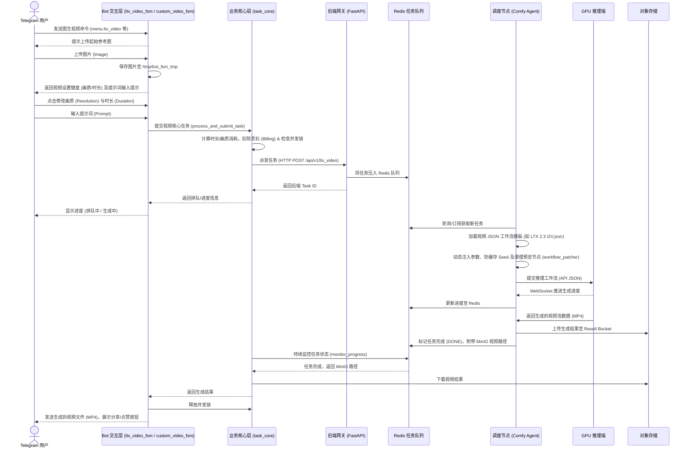
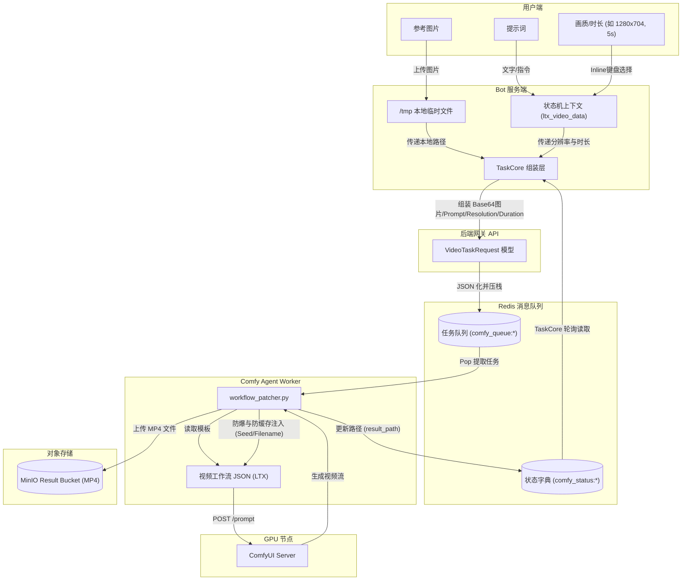
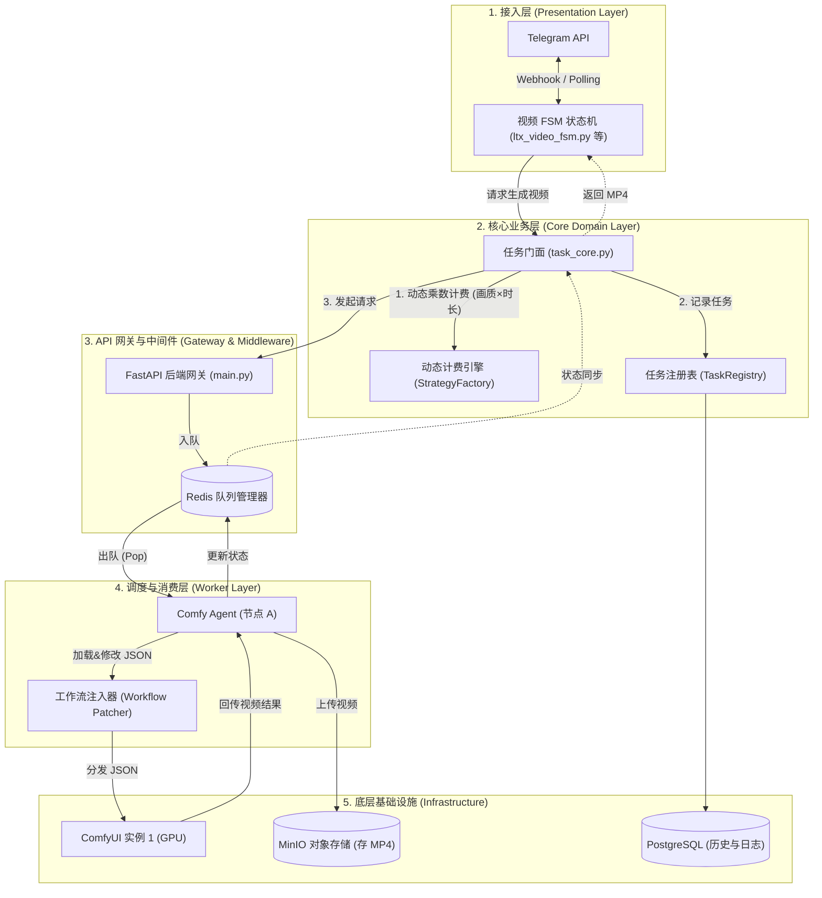

# 图生视频 (Image-to-Video) 业务流与架构分析

本文档详细分析了现有系统中的图生视频（如高级图生视频 LTX-Video、幻想视频、自定义视频等）的业务流程、数据流向以及底层的调度架构。

## 一、 业务流程图 (Business Flow)

## 二、 数据流向图 (Data Flow)

描述在图生视频任务执行期间，图片、视频生成参数（画质/时长）和提示词等数据是如何流转的。

## 三、 系统架构图 (Architecture Diagram)

图生视频模块的层级架构，展示了其在计费、调度和视频结果回传上的设计。

## 四、 架构分析说明

图生视频模块在基础三层架构之上，针对视频生成的特殊性（高资源消耗、长耗时、节点缓存问题）进行了多项针对性设计：

### 1. 交互与动态计费层 (FSM + Task Core)
- **状态机流转 (FSM)**: 视频生成（如 `ltx_video_fsm.py`）比生图多了一个“参数选择”环节。在用户上传图片后，系统会弹出 Inline 键盘供用户实时选择**画质 (Resolution)**与**时长 (Duration)**。
- **动态乘数计费**: 视频任务由于算力消耗巨大，灵石扣除不再是固定值，而是通过 `StrategyFactory` 和常量配置（如 `LTX_RESOLUTION_COST` 和 `LTX_DURATION_MULTIPLIER`）计算：`Base Cost * Duration Multiplier`，并在点击确认前预检余额。
- **互斥锁限制**: 对于极高画质（如 >= 1024p）和超长时长（如 >= 10s）的组合，在非特定模式下会触发 `CoreDomainError` 进行拦截，防止显存溢出 (OOM)。

### 2. 网关与调度监控 (Gateway & Monitor)
- **队列管理**: FastAPI 接收到 `ltx_video` 等视频任务请求后压入 Redis 队列。
- **长轮询与锁释放**: 考虑到视频生成时间远长于图片（通常需要数分钟），系统根据请求来源采用双轨制策略：对于 Web UI 请求，挂载 `monitor_task_and_release_lock` 作为独立后台异步任务来监控进度和释放锁；对于 Telegram Bot 流，由 `TaskService` 维持前台长轮询 (`async for`) 实时给用户推送进度，并在 `finally` 块中统一调用 `release_concurrency_lock` 稳妥释放并发锁。两者最终都会调用 `image_service.download_video_result` 下载 `.mp4` 文件。

### 3. 消费推理与防缓存机制 (Worker Patcher)
在视频生成链路中，`workflow_patcher.py` 扮演了关键的“动态补丁”角色，针对视频工作流（如 LTX 2.3）做了大量定制优化：
- **防爆重连与剪枝**: 去除无用的预览节点（如 `Preview Override` 等 UI 调试节点），防止在 API 模式下触发 `AttributeError` 导致任务崩溃。
- **防缓存 (Seed Injection)**: 强制注入随机 Seed 作为 `filename_prefix`（如 `ltx_video_{unique_id}_{node_id}`）。由于 ComfyUI 对视频生成节点 `VHS_VideoCombine` 有缓存机制，若不每次更新输出前缀，会导致生成直接被跳过，无法触发历史记录回传。
- **直连路由**: 对于不需要经过特定复杂处理的连线（例如 LTX 工作流中的 Node 7 直接路由到 Node 8），进行代码层面的强绑定以保证生成的稳定性。

### 4. 视频存储与分发 (Storage & Response)
- **MinIO 存储**: Worker 端获取到 ComfyUI 输出的视频后，将其上传至 MinIO 的 `result_bucket`。
- **Telegram 分发**: Bot 通过 `robust_send_video` 工具函数将 `.mp4` 格式的数据发送给用户，并附带生成参数、画廊分享和点赞功能，完成闭环。
