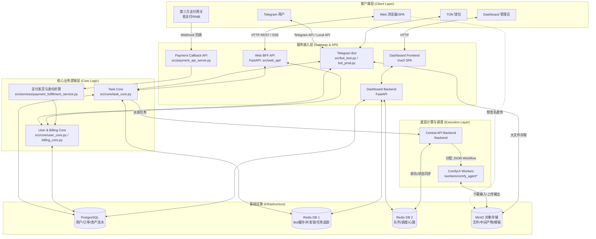
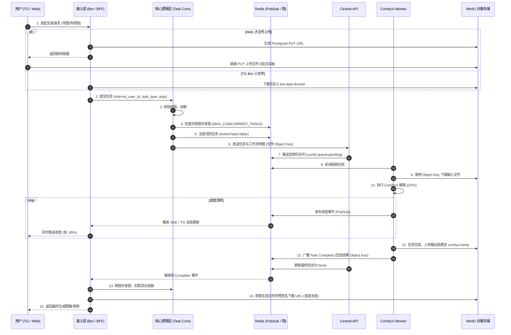
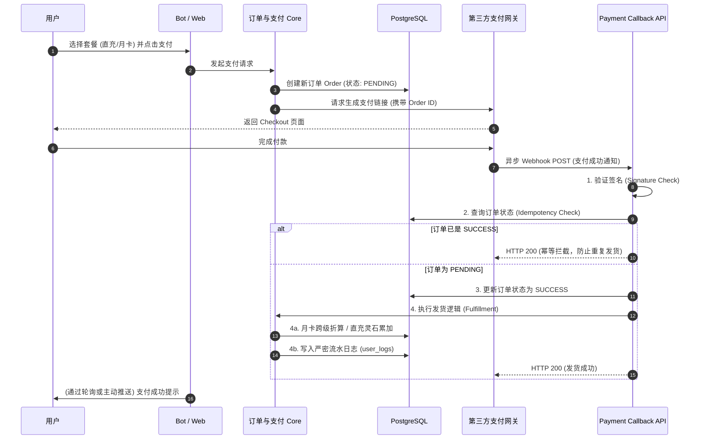
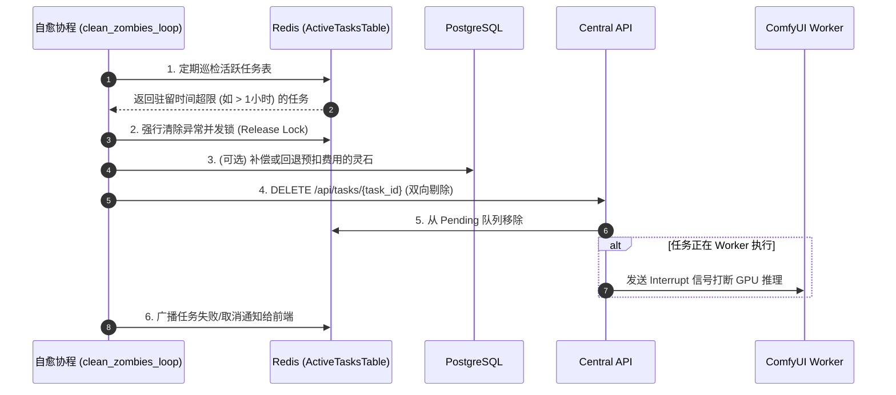

# 修仙主题 AI 创作工作台 - 系统架构与数据流说明书

本文档基于项目的最新重构与功能迭代（涵盖多模块分布式架构、三大支付体系并入等），通过 Graph 架构图和数据流图，全面梳理系统的核心组成部分及其流转机制。

---

## 1. 核心系统架构图 (System Architecture Graph)

系统采用分布式多节点架构，从前端入口、统一业务逻辑、到底层基础设施与计算节点实现了职责分离。

### 架构模块说明
1. **客户端层**：包含传统的 Telegram Bot 交互端、现代化的 Web SPA（Vue3）前端、管理后台 Dashboard，以及负责接收异步回调的第三方支付网关。
2. **服务接入层**：针对不同客户端提供独立接入点。Bot 端负责 TG 交互状态机，BFF 负责处理 Web 端的 JWT 鉴权与 SSE 状态推送，Payment API 独立负责监听外网 HTTP 支付回调。
3. **核心业务逻辑层**：整个系统的底座，平台无关 (Platform-Agnostic)。统一处理权限鉴定、并发锁机制 (`ActiveTasksTable`)、扣费逻辑与任务封装。
4. **基础设施层**：PostgreSQL 负责资产与订单的绝对持久化；Redis 按库分离（DB1 处理高速缓存与并发控制，DB2 处理底层队列与心跳）；MinIO 负责所有流媒体与图像对象存储，实现文件引用传递（Object Key）。
5. **底层计算层**：Central API 解析工作流，动态注入参数并向后端的 ComfyUI Agents (Workers) 派发计算任务。

---

## 2. 核心业务数据流图 (Data Flow Diagrams)

### 2.1 任务生成流 (Task Generation Flow)

涵盖从用户上传素材、系统鉴权与并发锁判定、直到异步节点完成任务并通过 Pub/Sub 推送状态回前端的全过程。

### 2.2 支付与充值数据流 (Payment & Top-up Flow)

系统采用“先预建单，后异步验签发货”的高幂等性安全设计。

### 2.3 异常拦截与僵尸任务自愈机制 (Zombie Task Recovery)

为防止因网络中断、Worker 崩溃等导致用户并发锁被永久锁死（Ghost Locks），系统配备了自愈闭环。

---

## 3. 核心机制设计红线备忘

根据开发指南 (AGENTS.md)，系统维护和后续迭代中需严格遵守以下架构级红线：

1. **统一用户标识**：不同终端（Telegram / Web）进来的请求，进入 `src/core` 前必须被解析为底层的 `internal_user_id`（对应 DB 的 `users.id`）。绝不允许在 Core 层混用 Telegram ID 或其他平台凭证。
2. **大文件传输绕流**：对于 100MB+ 的视频，坚决贯彻通过 MinIO **预签名直传 (Presigned PUT)** 的模式。Web 流量直接走 MinIO，禁止 BFF 或 Bot 服务器进行文件流的中转，以防耗尽服务器内存与带宽。
3. **并发锁最终一致性**：无论前端用户是否断开 SSE 连接或异常中断，后台的 Background Tasks 或自愈协程都必须确保在任务终态（成功/失败/被取消）时，释放该用户的并发锁。
4. **数据库流水对账**：任何触发资产变更（增减灵石）的操作，必须通过上下文追踪同步写入 `user_logs` 表，杜绝“隐式加钱”。
5. **月卡跨级保护**：高等级身份（如真传弟子）覆盖购买低等级套餐时，不可发生身份降级，系统应将低等级天数按既定比例折算为高等级天数。

> 文档由 AI 助手自动提取汇总，最后更新日期：2026-04-15
