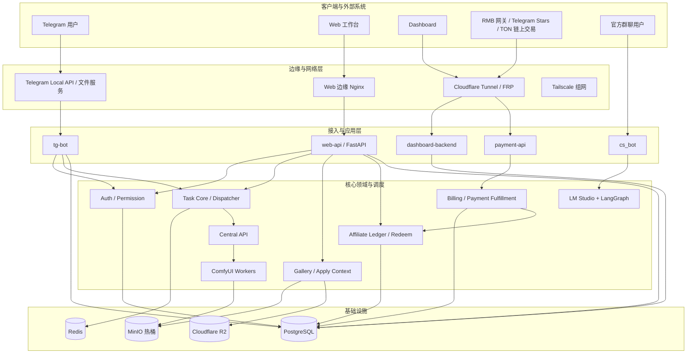
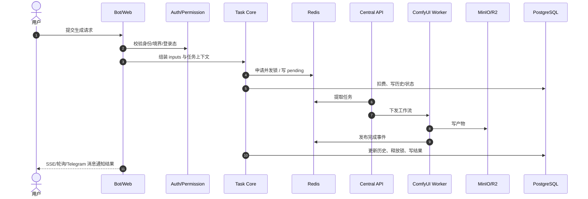
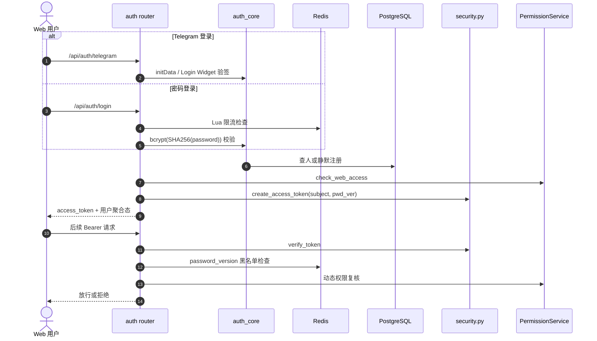
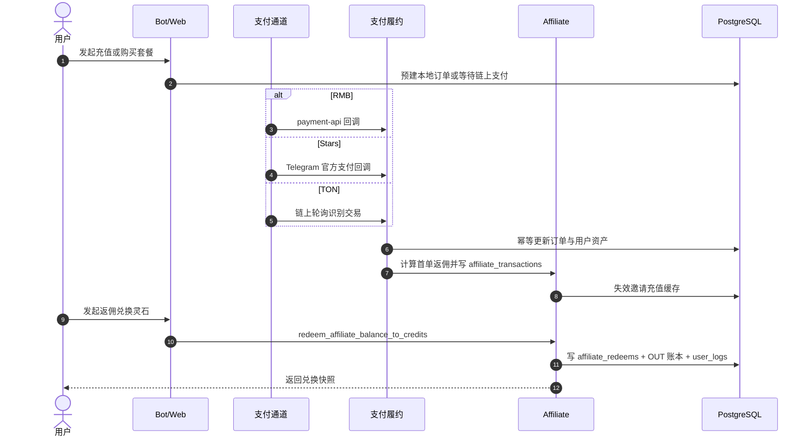

# 修仙主题 AI 创作工作台 - 系统架构与业务分析报告

## 目录
1. [系统架构总览](#1-系统架构总览)
2. [关键数据流与核心闭环](#2-关键数据流与核心闭环)
3. [业务板块划分](#3-业务板块划分)
4. [关键设计决策](#4-关键设计决策)
5. [当前架构口径与维护约束](#5-当前架构口径与维护约束)

---

## 1. 系统架构总览

AllBot 当前采用“多入口接入 + 核心领域下沉 + 异步任务调度 + 分级存储 + 独立运维/客服侧车”的整体架构。相较早期版本，当前系统已经明显从“Telegram Bot 驱动的单体生成工具”演进为一个覆盖 Telegram、Web、Dashboard、支付网关与社群客服的复合平台。

### 1.1 当前架构图

### 1.2 当前分层说明
- **客户端与外部系统**
  - Telegram 仍是核心用户入口。
  - Web 工作台已成为生成、历史管理、广场浏览与模板应用的主入口之一。
  - Dashboard 已是独立的后台系统，不再只是简单的管理面板。
  - 支付侧不是单一渠道，当前实际并存 RMB、Telegram Stars、TON 三条履约路径。
  - `cs_bot` 面向官方群聊，是独立客服服务，不与主 Bot 共用同一条请求链路。
- **边缘与网络层**
  - Web 前端通过海外边缘 Nginx 承接静态资源与反向代理。
  - Telegram 大文件通过 Local API / 文件服务补齐官方体积限制。
  - Cloudflare Tunnel / FRP / Tailscale 仍承担公网暴露与内网互通职责。
- **接入与应用层**
  - `tg-bot` 负责 Telegram 交互、FSM 与支付回执通知。
  - `web-api` 同时承载认证、任务提交、历史、广场、用户中心、返佣兑换等主 Web 能力。
  - `payment-api` 主要负责 RMB 回调入口；Stars 与 TON 各有自己的履约入口，不应再笼统视作统一 Webhook。
  - `dashboard-backend` 有自己的后台接口与能力边界。
  - `cs_bot` 是独立 LangGraph 客服应用。
- **核心领域与调度**
  - 认证权限、任务调度、计费支付、返佣、社区广场都已形成相对清晰的领域边界。
  - 任务执行继续由 `Central API + ComfyUI Workers` 负责。
  - 文本客服推理不走 ComfyUI，而是直接走 `LM Studio + LangGraph`。
- **基础设施层**
  - PostgreSQL 承载订单、用户、历史、广场、返佣等业务主数据。
  - Redis 同时服务于队列、并发锁、登录限流、评论限频、旧 token 黑名单等场景。
  - MinIO 是主存储；R2 面向社区公开资源的高频分发。

---

## 2. 关键数据流与核心闭环

### 2.1 生成任务主链路

当前关键事实：
- Web 生成接口主路径已是 `/api/tasks/generate`，请求体以 `inputs` 为主，而不是旧文档里的 `params`。
- 广场模板应用会把 `source_post_id`、`requested_duration`、`billing_resolution` 等语义字段带入任务链路。
- 任务结果除运行态 SSE 外，还存在历史结果查询与老任务恢复兜底逻辑。

### 2.2 认证与会话闭环

当前关键事实：
- Web 认证已经是双入口模型：Telegram 验签登录 + 用户名密码登录。
- JWT 使用 `SECRET_KEY` 签发，`BOT_TOKEN` 仅用于 Telegram 验签。
- 改密会导致旧会话失效，权限变更也会影响既有 Web 会话可用性。

### 2.3 支付、返佣与资产闭环

当前关键事实：
- 支付域已从“单一充值发货”升级为“支付履约 + 返佣入账 + 返佣兑换灵石”的复合域。
- `affiliate_transactions` 是返佣主账本，`affiliate_redeems` 是返佣兑换记录，二者都已上线。
- 返佣兑换灵石当前已落地；返佣兑换会员身份和提现仍未上线。

### 2.4 社区广场闭环

当前关键事实：
- 广场不再只是投稿与点赞，还包含评论、我的收藏、我的投稿、Web apply-context。
- `apply-context` 已经是 Web workbench 模板应用主入口。
- R2 公开 URL 与缩略图优先策略已成为广场读路径的一部分。
- Telegram 端 `gallery_apply_fsm` 仅应视为兼容链路，不再是主产品路径。

### 2.5 CS Bot 闭环

当前关键事实：
- `cs_bot` 通过 `LangGraph + SkillManager + ChatOpenAI(LM Studio兼容接口)` 运行。
- 当前记忆机制是进程内 `MemorySaver()`，不是 Redis 持久化记忆树。
- 图片消息与文本消息使用不同 `thread_id` 做上下文隔离。

---

## 3. 业务板块划分

### 3.1 主营板块
- **01 AI 创作与生成**
  - 负责多模态生成、任务提交、排队、结果回传与模板应用。
- **02 商业化与会员资产**
  - 负责充值、身份月卡、订单履约、返佣账本与返佣兑换灵石。
- **03 社区广场与社交互动**
  - 负责投稿、互动、评论、收藏、apply-context 与公开资源分发。
- **04 用户修为与身份权限**
  - 负责境界、身份、Web 准入、动态权限复核与任务优先级。

### 3.2 支撑板块
- **任务调度与节点通信**
  - Redis 队列、Central API、ComfyUI Worker 集群。
- **对象存储与边缘媒体分发**
  - MinIO 热桶、R2 分发、历史回溯 URL 组装。
- **后台运营与观测**
  - Dashboard、Worker Logs、返佣榜、评论管理、日志与运维排障。
- **社群客服与本地大模型**
  - `cs_bot`、LM Studio、LangGraph、技能工具绑定。

---

## 4. 关键设计决策

1. **核心层隔离平台对象**
   - `src/core/` 维持对 Telegram `Update` 与 Web `Request` 的隔离，统一围绕内部用户标识与领域对象编排。
2. **支付与返佣使用显式幂等锚点**
   - 订单号、`tx_hash`、`idempotency_key` 共同构成资产链路的防重复基线。
3. **认证从一次性授权升级为持久权限检查**
   - 通过 `password_version` 黑名单与动态权限复核，避免“旧 token 长期有效”的安全问题。
4. **社区广场主路径前移到 Web**
   - `apply-context`、收藏、评论等能力都围绕 Web workbench 收敛，Telegram 侧只保留兼容入口。
5. **客服能力独立于生成算力栈**
   - ComfyUI 负责图像/视频，LM Studio 负责客服文本推理，避免资源争抢与架构混杂。
6. **部署以 `safe_deploy.sh` 为基线**
   - 当前标准部署流程已把维护模式、僵尸清理、Alembic 多 head 检查、宿主机迁移与分阶段重建串联起来。

---

## 5. 当前架构口径与维护约束

- 不要再把系统描述成“Telegram Bot + Web 辅助页”的结构，当前已经是多入口平台。
- 不要再把支付描述成单一 `/api/payment/notify` 回调模型；那只覆盖 RMB 子链路。
- 不要再把认证描述成“仅 Telegram WebApp 登录”；密码登录、改密失效旧会话已是现行能力。
- 不要再把广场描述成“投稿 + 点赞”；评论、收藏、apply-context、R2 URL 优先都已进入主流程。
- 不要再把 `cs_bot` 写成 Redis 持久化记忆型智能体；当前是 `MemorySaver()` 进程内记忆。
- 不要再把数据库迁移写成“容器启动自动执行”；当前标准流程是 `safe_deploy.sh` 在宿主机先检查多 head，再执行 `alembic upgrade head`。
