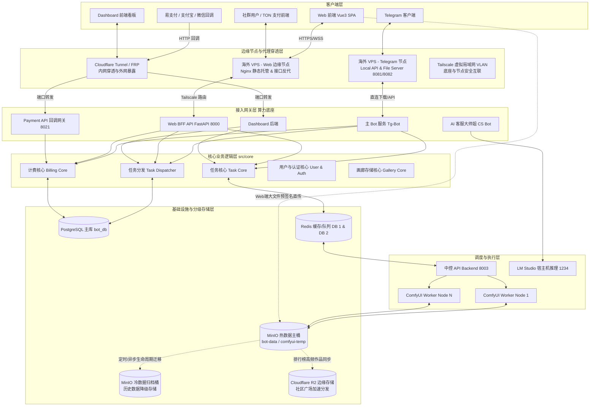
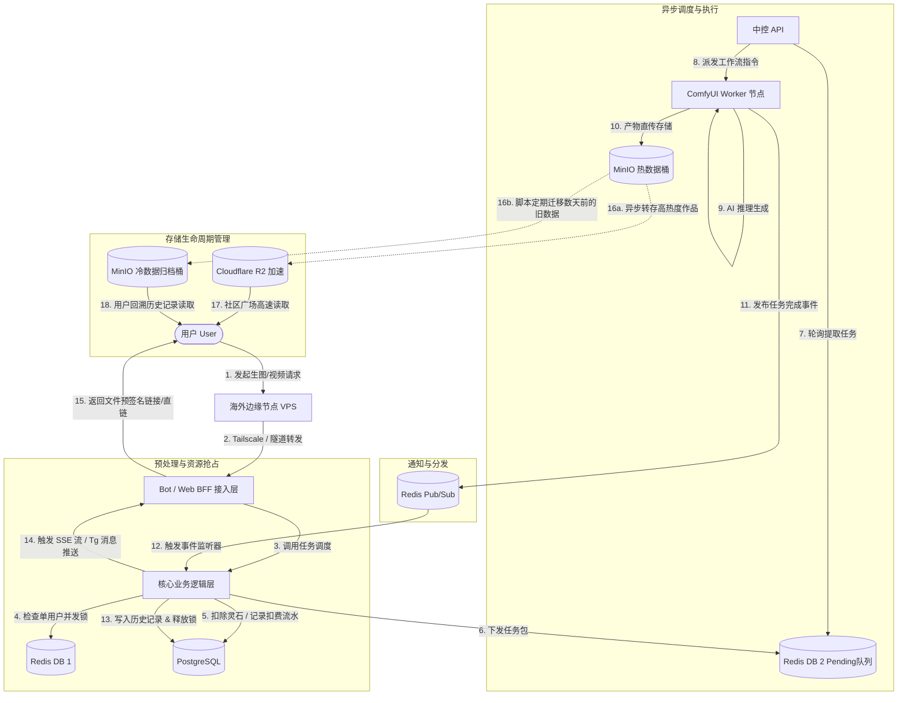
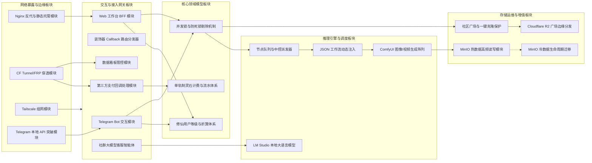

# 修仙主题 AI 创作工作台 - 系统架构与业务分析报告

## 目录
1. [系统架构梳理](#1-系统架构梳理)
2. [数据流图分析](#2-数据流图分析)
3. [业务板块划分](#3-业务板块划分)
4. [关键设计决策与技术选型](#4-关键设计决策与技术选型)
5. [架构合理性分析与优化建议](#5-架构合理性分析与优化建议)

---

## 1. 系统架构梳理

系统采用现代化的**多模块、多节点分布式架构**。在物理部署上，系统划分为“海外边缘节点层”与“国内（武汉）算力与数据底座”，通过内网穿透（FRP / Cloudflare Tunnel / Tailscale 等）组建虚拟局域网（VLAN），既突破了网络访问限制，又保障了底层数据和高算力设备的安全。

### 系统架构图

### 架构物理与逻辑层级说明
1. **客户端层**：多端覆盖。包括传统的 Telegram 交互、内嵌的 TON Web App、独立的 Vue3 创作工作台，以及三方支付网关的异步回调发起方。支持多语言 (i18n)，Web 端基于 `vue-i18n`，Telegram 端基于 `I18nFilter` 和 Redis 语言偏好缓存。
2. **边缘节点与代理穿透层 (Edge & Network Layer)**：
   * **Web VPS**：部署 Nginx，负责 Web 前端（Vue3 打包的 `/dist`）的静态文件托管，并将 `/api/` 的动态请求通过内网反向代理（Proxy Pass）给国内底座。
   * **Telegram VPS**：运行官方 Local API 和文件服务器，专门用于突破 Telegram 官方 50MB 视频上传和 20MB 下载限制，将文件通过 HTTP 直链暴露给 Bot 底座提取。
   * **隧道穿透与组网**：使用 Tailscale 组建虚拟局域网打通海内外节点通信；使用 Cloudflare Tunnel 和 FRP 将本地的 Payment API（端口 8021）和 Dashboard 暴露到公网，既能接收外网支付回调，又能隐藏国内真实服务器 IP。
3. **接入网关层**：接收处理解析后的请求。各微服务（主 Bot、Web BFF、支付 API、客服大师姐）互不干扰，独立运作。
4. **核心领域逻辑层 (Core-Driven Architecture)**：业务“中枢”。剥离特定平台依赖，废弃传统的 Service/Repository 三层架构思路，全面拥抱核心领域层架构 (`src/core/`)。使用内部统一的 `internal_user_id` 处理鉴权、通过 Saga 模式进行单轨制计费与分布式退款、并发锁检查及任务派发，完全不知道 HTTP 或 Telegram Bot 的存在。
5. **调度与执行层**：中控 API 作为任务调度器（基于 Redis Pub/Sub 实现无阻塞分发）；ComfyUI 节点执行生图/视频计算；同时宿主机部署 **LM Studio**（监听本地 1234 端口），为 CS Bot（大师姐）提供低成本的本地大模型（如 Qwen）推理能力。
6. **基础设施与分级存储层**：
   * **PostgreSQL / Redis**：提供财务强一致性账本与高速队列锁机制。
   * **冷热分离的 MinIO 存储**：包含一个**热数据主桶**（近期生成作品、ComfyUI 中间件传输）与一个**冷数据归档桶**（定时迁移若干天以上的旧历史文件），有效降低主库 IO 压力。
   * **Cloudflare R2**：专门用于高并发的“社区广场 (Gallery)”模块流媒体加速。

---

## 2. 数据流图分析

以下梳理了系统中完整的“图像/视频生成”及“数据冷热生命周期”的数据流转路径。

### 任务执行与存储降级数据流图

### 数据流转核心设计
* **穿透转发**：所有来自公网的用户流量首先打到海外 VPS 或 CF 边缘节点，通过安全的隧道清洗和反向代理进入国内的计算底座。
* **存储降级与冷热隔离**：产出结果默认写入 MinIO 热桶。随着时间推移，后台任务自动将数天前的用户私人历史数据迁移至**冷数据归档桶**；而推送到广场的热门作品会被主动同步到 **Cloudflare R2** 进行 CDN 加速分发。
* **本地模型数据流**：客服大师姐（CS Bot）捕获群聊文本后，不走 ComfyUI 调度，而是直接请求宿主机的 LM Studio（`127.0.0.1:1234`）进行意图嗅探，并在判断为求助时做出响应。
* **全链路追踪 (End-to-End Tracing)**：为解决分布式异步环境下的日志串包问题，系统实现了跨进程的 TraceID 透传。入口网关（Bot/BFF）生成 TraceID 并通过 `ContextVar` 在当前进程的协程中流转；在跨节点调度时，通过 HTTP Headers (`X-Trace-ID`) 与 Redis 任务 Payload 携带 TraceID，最终在 ComfyUI Worker 节点日志中还原，实现单次请求的全生命周期可观测性。

---

## 3. 业务板块划分

项目在功能模块上通过高内聚原则划分，不仅涵盖了业务核心，还包含了复杂的网络组网与存储运维板块。

### 业务模块与部署拓扑关系图

### 核心板块职责边界
* **网络暴露与边缘板块**：解决“国内高算力底座无法直接对外提供服务”的痛点。由 VPS、Tunnel、FRP 共同承担抗 DDoD、反代、以及突破 Telegram 官方大文件限制的网络中转重任。
* **推理引擎与调度板块**：包含了执行具体任务的算力集群。不仅有 ComfyUI 生成图片视频，还新增了本地部署的 LM Studio，专为社群客服机器人提供文本推理算力。
* **存储运维板块**：基于 MinIO 构建的冷热分级存储架构。通过脚本自动将早期个人数据移至冷数据桶释放主盘 IO，同时利用 R2 加速公开广场。

---

## 4. 关键设计决策与技术选型

1. **海外双 VPS 与内网穿透架构**：
   * **决策**：为了利用国内便宜的高端显卡算力，同时满足海外用户的 Web 极速访问和 Telegram 服务器的直连，系统设计了物理分离的架构。
   * **技术选型**：使用 Tailscale 组建底层 VLAN 保证内网接口不暴露；使用 Cloudflare Tunnel 和 FRP 将支付回调、Dashboard 面板等特定服务安全映射到公网；使用独立的 Telegram VPS 运行 Local API 规避 50MB 官方限制。
2. **三级存储与数据生命周期 (Storage Tiering)**：
   * **决策**：多媒体 AI 生成极为消耗磁盘空间和 IO。若全放一处会导致主库在重度并发下“假死”（引发 Web 503 宕机）。
   * **技术选型**：热数据桶（MinIO 主桶）负责当前创作；冷数据归档桶（额外 MinIO）负责存放过期历史；Cloudflare R2 负责广场公开资源分发。配合离线 `_region_map` 机制，彻底避免了 MinIO 阻塞引发的 FastAPI 事件循环崩溃。
3. **去中心化推理引擎**：
   * **决策**：不仅图像/视频生成由 ComfyUI 阵列承接，文字推理也下沉到本地。
   * **技术选型**：采用 LM Studio（暴露兼容 OpenAI 的 API）在本地运行大模型（如 Qwen），结合 LangGraph 的长效记忆机制，打造极低成本、可控意图嗅探的“合欢宗大师姐”社群客服。

---

## 5. 架构合理性分析与优化建议

### 架构合理性 (Strengths)
* **网络穿透与安全性极高**：通过边缘节点、VLAN 和 FRP 的组合，将高价值的算力服务器和数据库完全隐藏在 NAT 之后。即使海外节点遭到攻击，核心数据和业务中枢依然安全。
* **存储成本与性能的完美平衡**：冷热数据分离的引入是一个极其出彩的设计。它让热盘始终保持高 IOPS，而把海量历史包袱转移到廉价大容量的冷存储中，辅以 R2 边缘加速，用户体验几乎不受影响。
* **高度模块化的业务底座**：不论是新增 Web 界面、TON 支付、还是基于大模型的 CS Bot，底层的 `src/core` 计费和鉴权系统都无需大改，展现了优秀的领域驱动设计（DDD）能力。

### 持续优化建议 (Recommendations)
1. **穿透服务的单点故障防范**：
    * 目前国内底座与外界通信高度依赖单条 FRP 隧道或 Tailscale 节点。建议配置多条隧道或使用 BGP 协议进行多线负载均衡与容灾，防止单点断网导致系统彻底失联。
2. **冷数据检索与缓存预热优化**：
    * 当用户翻阅非常久远的历史记录时，从“冷数据桶”提取大文件可能会存在延迟。建议在 Web BFF 层针对历史数据读取加入轻量级缓存预热机制（如请求时提前触发异步拉取到内存或热盘）。
3. **算力节点的动态弹性伸缩 (Auto-Scaling)**：
    * ComfyUI Worker 目前为静态多开隔离部署。未来如果接入更多的闲置显卡服务器，可以考虑引入 Kubernetes 或 Nomad，结合 Redis 队列深度，实现算力节点的动态伸缩与休眠。
