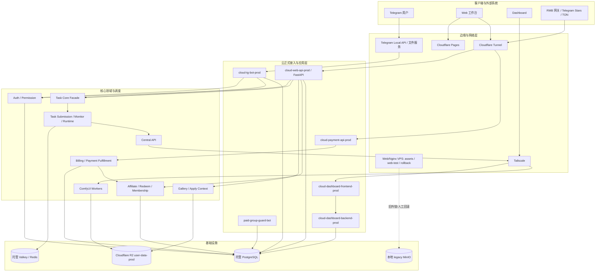
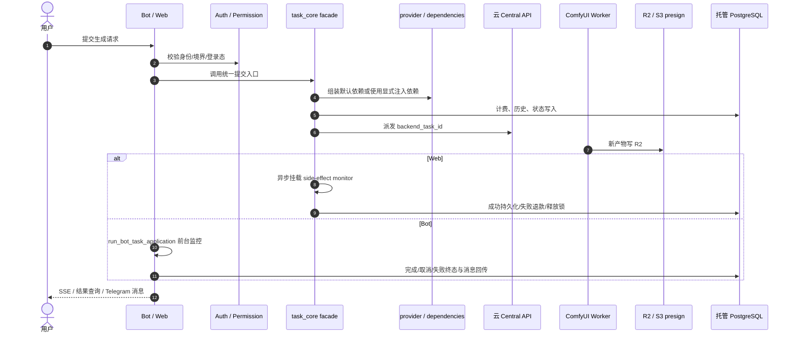

# 修仙主题 AI 创作工作台 - 系统架构与业务分析报告

## 目录
1. [系统架构总览](#1-系统架构总览)
2. [关键数据流与核心闭环](#2-关键数据流与核心闭环)
3. [业务板块划分](#3-业务板块划分)
4. [关键设计决策](#4-关键设计决策)
5. [当前架构口径与维护约束](#5-当前架构口径与维护约束)

---

## 1. 系统架构总览

AllBot 当前采用“多入口接入 + 核心领域下沉 + 异步任务调度 + 分级存储 + 独立运维边界”的整体架构。系统已经从早期的 Telegram Bot 驱动单体，演进为覆盖 Telegram、Web、Dashboard 与支付的复合平台。

### 1.1 当前架构图

### 1.2 当前分层说明
- **客户端与外部系统**
  - Telegram 仍是核心入口之一。
  - Web 工作台已成为生成、历史管理、广场浏览与模板应用的主路径。
  - Dashboard 与支付 API 都是独立边界，不再是 Bot 的附属模块。
- **接入与应用层**
  - `tg-bot` 负责 Telegram 交互、FSM、结果消息与支付通知。
  - `paid_group_guard_bot` 是独立 Telegram 审核 Bot，只订阅付费群 `chat_join_request`，按成功订单、后台赠送订单或筑基期及以上修为只读判断入群资格，不承载主业务 Bot 的菜单、生成、支付回调或文件处理。
  - `web-api` 承担认证、任务提交、任务运行态、历史、广场、用户中心、返佣兑换与站点通知读取等主能力。
  - `payment-api` 负责 RMB 回调；Stars 与 TON 各有对应履约入口。
  - `dashboard-frontend` 是管理后台云端 Nginx 网关，默认只通过 Tailscale/受控入口访问；`dashboard-backend` 除系统视图外，当前还承接站点通知的创建、编辑、置顶与删除管理入口。
- **核心领域与调度**
  - `task_core.py` 当前是稳定 facade，不再承担所有细节逻辑。
  - 真实默认装配已下沉到 provider/dependencies、submission、web-monitor、runtime 等子模块。
  - 任务执行仍由 `Central API + ComfyUI Workers` 完成；正式 Central 已运行在云控制面，生产算力由本地 worker compose、LAN AIO agent、`remote_workers` 与手动 RunPod 备用池按当次运维目标共同接入。判断当前容量必须以 Central `/system/workers` 的实时快照为准，不再写死为“本地 7 个 worker”。
- **基础设施层**
  - 正式 PostgreSQL 与 Valkey/Redis 已迁到云侧托管/外部服务，保存主数据、业务账本、队列、并发锁、登录限流、任务运行态与 worker heartbeat。
  - 新生成对象写入 R2 `user-data-prod`；本地 MinIO 保留为 legacy 迁移补齐、人工回滚、旧外链排障与本地热数据备份，不再是正式 Web/Dashboard 运行时 fallback。
  - Web/Nginx VPS 不再承接正式 `web.aivison.it.com` 主流量；它保留 `assets.aivison.it.com` legacy 人工回滚/旧外链入口、`web-test.aivison.it.com` 测试静态站和正式 Web 回滚副本。

### 1.3 云正式生产口径
2026-06-07 晚间正式生产已经切到“云控制面 + 托管 PostgreSQL/Valkey + R2 + 本地 GPU worker / LAN AIO / remote_workers / 手动 RunPod 备用池”：
- 云端 Droplet `allbot-do-sgp1-control` 承载 `cloud-central-api-prod`、`cloud-web-api-prod`、`cloud-payment-api-prod`、`cloud-dashboard-backend-prod`、`cloud-dashboard-frontend-prod`、`cloud-imgproxy-prod` 与 `cloud-tg-bot-prod`。
- `workers/docker-compose-cloud-prod-worker.yml` 仍声明本地 `cloud-prod-comfy-agent-1..7` 与 `cloud-prod-worker-relay`；线上实际可用 worker 还可能包含 LAN AIO、`remote_workers` 与手动 RunPod。2026-06-18 03:06 快照为 13 个 healthy active workers，属于运行态快照，不作为固定容量承诺。
- `web.aivison.it.com` 已由 Cloudflare Pages 承接静态前端；正式 Web API 独立走 `api.aivison.it.com` Cloudflare Tunnel 回源云 Web API；`rmb.aivison.it.com` 回源云 Payment API；`assets.aivison.it.com` 保留本地 legacy MinIO 只读代理，但正式应用不再生成该域名 URL。
- 长期运维细节见 `docs/子模块_云正式控制面部署_cloud_prod_control_plane.md`。

### 1.4 云测试与本地灾备口径
- 云测试控制面运行在独立 DigitalOcean Droplet `allbot-do-sgp1-test-control`，Tailscale IP `100.82.124.91`。同机容器承载测试 PostgreSQL、Redis、Central API、Web API、Dashboard Backend、Dashboard Frontend、imgproxy 与测试 Bot；本地主服务器运行 8 个 cloud-worker 测试容器并连接云测试 Central，其中 `cloud_worker_test_08` 指向 gpu-002 SCAIL-2 LAN AIO runtime。
- 云测试 Web 公网入口是 `web-test.aivison.it.com`，由 Web/Nginx VPS 提供 `/root/dist-test` 静态站，`/api/` 回源云测试 Web API `100.82.124.91:8001`。云测试端口绑定 Tailscale IP，公网 eth0 端口由测试机防火墙 drop。
- 本地主服务器不再保留一套日常正式入口；只保留云正式整体故障时的临时本地正式灾备方案。操作手册见 `docs/子模块_本地正式灾备切换_local_prod_fallback.md`。

---

## 2. 关键数据流与核心闭环

### 2.1 生成任务主链路

当前关键事实：
- Web 主入口是 `/api/tasks/generate`，请求体以 `inputs` 为主。
- 任务链路显式区分 `registry_task_id` 与 `backend_task_id`。
- Web 运行态依赖 `src/services/task_web_side_effects.py`、`task_web_lifecycle_monitor.py` 与 `task_web_terminal_finalization.py`；Bot 则由 `run_bot_task_application(...)` 前台监控。
- 任务结果除了运行态 stream 外，还有 history fallback 与结果查询兜底。

延伸阅读：
- 生成任务全链路专题文档：`/docs/子模块_生成任务全链路_task_full_chain.md`
- 任务调度专题文档：`/docs/子模块_任务调度_task_scheduler.md`
- 执行面与节点通信专题文档：`/docs/子模块_中控API与节点通信_central_api.md`

### 2.2 认证与会话闭环
- Web 认证当前是双入口：Telegram 验签登录 + 用户名密码登录。
- JWT 以 `SECRET_KEY` 签发，并携带 `pwd_ver` / `channel` 等语义 claim。
- 改密会导致旧 token 失效；权限变化会触发动态复核。
- Telegram Bot 个人中心打开 Web/Mini App 时，当前通过 `build_versioned_mini_app_url()` 在 `MINI_APP_URL` 上追加 `v` 参数，借此主动击穿 Telegram 旧 WebView 快照。

### 2.3 支付、返佣与资产闭环
- 支付域已经从单一充值升级为“支付履约 + 返佣入账 + affiliate 兑换灵石/会员”的复合域。
- RMB 履约当前走 membership settlement 主路径，并保留 legacy fallback。
- affiliate 已不仅是返佣台账，还承担兑换与审计语义。

### 2.4 社区广场闭环
- 广场当前包含投稿、点赞、评论、收藏、我的投稿、我的收藏与 Web apply-context。
- `apply-context` 已成为 Web workbench 主路径。
- Telegram 端 `gallery_apply_fsm` 仅应视作兼容链路，不再是主产品路径。

### 2.5 站点通知闭环
- Dashboard 当前可维护全站站点通知，支持标题、正文、启用状态、置顶、目标修为与目标身份。
- Web 侧通过 `/api/app/site-notice` 与 `/api/app/site-notices` 读取通知。
- 通知可见性按用户当前 `group` / `identity` 做“任一命中即显示”过滤；两项都为空表示所有 Web 用户可见。

---

## 3. 业务板块划分

### 3.1 主营板块
- **01 AI 创作与生成**
  - 负责多模态生成、任务提交、排队、结果回传与模板应用。
- **02 商业化与会员资产**
  - 负责充值、身份月卡、订单履约、返佣账本与 affiliate 兑换。
- **03 社区广场与社交互动**
  - 负责投稿、互动、评论、收藏、apply-context 与公开资源分发。
- **04 用户修为与身份权限**
  - 负责境界、身份、Web 准入、动态权限复核与任务优先级。

### 3.2 支撑板块
- **任务调度与节点通信**
  - task core facade、provider/capability、Web monitor、runtime cleanup、QueueManager、Central API、Workers。
- **对象存储与媒体交付**
  - R2 正式写入、legacy MinIO 迁移补齐/人工回滚、结果 URL 生命周期。
- **交互状态机与回调路由**
  - Telegram FSM、全局菜单黑盒退出、callback prefix 路由、临时文件服务。

---

## 4. 关键设计决策

### 4.1 Core 只消费 capability/provider
- `core` 目录禁止直接 import 基础设施实现。
- facade 层只暴露稳定语义，真实逻辑优先下沉到 provider/dependencies、submission、monitor、runtime 子模块。

### 4.2 双 ID 运行态模型
- 本地注册与历史链路使用 `registry_task_id`。
- 后端执行与 best-effort cancel 使用 `backend_task_id`。
- 取消、恢复、僵尸清理、强制终止都必须显式区分两者。

### 4.3 Web 与 Bot 监控分流
- Web 提交成功后异步挂载 side-effect monitor。
- Bot 进入 `run_bot_task_application(...)` 前台监控与展示链路。
- 两条路径共享 task core，但不共享同一表示层职责。

### 4.4 测试 seam 前移
- 新测试优先通过 `dependencies` / `*_func` seam 注入能力。
- 不再鼓励依赖旧的模块级 patch 点。

---

## 5. 当前架构口径与维护约束
- 文档中的入口函数、异常类型、超时值、双 ID 语义必须与代码保持一致。
- `src/bot_main.py` 是 Telegram Bot shared entrypoint；`src/bot_test.py` 仅保留历史兼容 shim。
- `paid_group_guard_bot/main.py` 是付费群审核 Bot 独立入口，必须使用独立 `PAID_GROUP_BOT_TOKEN`，不能复用主业务 `BOT_TOKEN` 或接入主 Bot FSM。
- 若修改 task core facade、provider/dependencies、submission、web-monitor、runtime、Bot 五段式上下文或 stream fallback，必须同步更新知识库。
- 若修改云正式 compose、worker compose、边缘 upstream、R2/legacy 媒体策略、Central 状态观测缓存或 Dashboard 高频监控策略，必须同步更新云正式部署文档与相关 skills。
- 若技能文档与代码入口冲突，应先更新 skill / docs，再继续开发。

### 5.1 维护基线与知识库口径
- 2026-06-18 知识库维护口径：`AGENTS.md` 只保留全局路由，细节以 `.codex/skills/*/SKILL.md` 和 `/docs` 为准；技能正文应记录稳定边界和入口，不沉淀一次性 Pod ID、任务 ID、失败尝试流水账或真实密钥值。一次性 canary、迁移证据和模型上传流水应进入 `docs/archive/` 或 `logs/`。
- `src/task_core_process_defaults.py` 是 task core process 默认装配的真实入口。
- RunPod Provider v0 的稳定边界是云测试 `img2img/img2img_lora` canary、云测试 split video profile (`image_to_video` / `wan22_video_v2`) canary、云测试 `i2i_pro` 三任务 canary、云测试 `scail2` 两任务 canary，以及手动云正式备用 worker；生产自动按队列扩容仍未开启。`prod-worker --profile i2i_pro` 支持 `i2i_pro`、Web 文生图执行类型 `t2i-pornmaster-turbo` 与 `face_swap`；`prod-worker --profile scail2` 支持 `scail2_action_transfer` 与 `scail2_video_replacement`。Dashboard 已提供正式手动 RunPod 新增/暂停/删除入口并支持 `scail2 / 视频生视频`，但 `scail2` RunPod 是手动备用/临时扩容能力，不代表线上固定常驻容量。
- `wan22_aio_video` 只保留为兼容/回滚 profile；新视频测试、扩容和正式备用 worker 都应使用 split profile。
- 2026-06-18 全局质量评估未发现 Critical/High 级架构阻断，`src/core` 未发现直接依赖 Telegram `Update` 或 FastAPI `Request/APIRouter` 等平台对象；Alembic 为单 head `7f3a9c1d2e4b`；`pytest --collect-only` 可收集 1362 个测试。
- 当前主要风险集中在长期维护成本：Worker `agent_main.py::process_task`、Dashboard RunPod 管理服务、任务提交 provider/dependencies 装配、Bot 进度监控、练功房主 composable 与前端生成页重复逻辑。`ruff check` 仍有 11 个低风险 lint 项，主要是未使用 import 与脚本级 `E402`。
- workflow 资产已收口到 `workers/comfy_agent/workflows`；Central API 不再维护 backend 副本，也不再执行 workflow 启动校验。
- `TaskCoreServiceProviders` 与主要 capability 已补强 `Protocol` / 精确 `Callable` 契约；新增 provider/capability 时继续沿用显式类型与 dependencies seam。
- 详细质量基线见 `docs/子模块_代码静态分析与质量评估规范_code_quality.md` 与 `logs/code_analysis_report_20260618_0306.md`。
