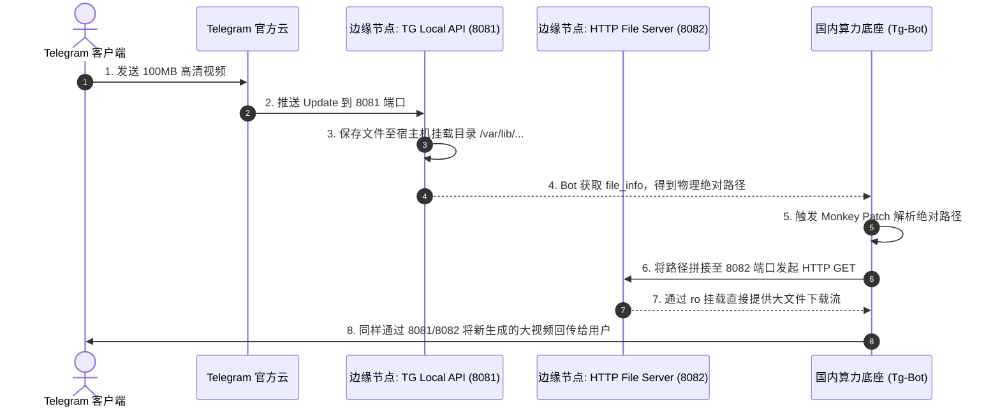

# 子模块: Telegram 本地 API 与文件代理 (TG Local API)

## 1. 目标与范围

本模块致力于突破 Telegram 官方 Bot API 在云端下载 20MB、上传 50MB 的多媒体文件体积限制。通过在海外独立 VPS 部署官方提供的 `telegram-bot-api` 容器并开启 `TELEGRAM_LOCAL=1`，配合 Python HTTP 文件服务器和统一 Telegram runtime bootstrap，实现了针对高分辨率 AI 生成长视频的极速直传与下载能力。

仓库中的 prod Compose/env example 当前把下列地址作为 Local API 默认值：

- API base：`http://69.63.220.115:8081`
- File base：`http://69.63.220.115:8082`

这是仓库配置默认值，不是本轮 live 验证。目标环境仍以受控
`TELEGRAM_API_BASE_URL` / `TELEGRAM_FILE_BASE_URL` 为准；节点、端口、容器、
磁盘和 SSH 状态必须当次只读探测，所以本资料在审计矩阵中标记为
`runtime-verification-required`。

## 2. 架构图与调用链



## 3. 核心代码片段

### 共享 Telegram runtime bootstrap

[`src/services/telegram_runtime_bootstrap.py`](../src/services/telegram_runtime_bootstrap.py)

```python
install_telegram_runtime_patches(logger=logger)
request = build_telegram_httpx_request()

application = (
    ApplicationBuilder()
    .token(BOT_TOKEN)
    .base_url(build_telegram_bot_base_url())
    .base_file_url(resolve_telegram_file_base_url())
    .request(request)
    .get_updates_request(request)
    .build()
)
```

主 Bot `src/bot_main.py` 与 QQCC Bot `qqcc_bot/main.py` 都调用该 helper。它统一负责：

- `TELEGRAM_API_BASE_URL` / `TELEGRAM_FILE_BASE_URL` 默认值与环境覆盖；
- `HTTPXRequest(proxy=None, connect_timeout=60, read_timeout=120, write_timeout=120, connection_pool_size=500)`；
- `File.download_to_drive` 本地文件代理 patch；
- `Poll.de_json` 对旧 update 缺失 `members_only` 的兼容；
- `ChatMemberRestricted.de_json` 对旧 Local Bot API payload 缺失可选 `can_react_to_messages` 的兼容；缺失时按 Bot API 语义继承 `can_send_messages`，避免 PTB 解析失败后 polling offset 被同一条 update 永久阻塞；
- Bot middleware 中 correlation id、语言缓存与 `context.t` 注入。

## 4. 接口定义 (网络契约)

本模块对外表现为 PTB 框架内的 `ApplicationBuilder` 参数配置：

```python
# 必须显式将请求路由指向 VPS
application = (
    ApplicationBuilder()
    .token(BOT_TOKEN)
    .base_url(build_telegram_bot_base_url())
    .base_file_url(resolve_telegram_file_base_url())
    .build()
)
```

`TELEGRAM_API_BASE_URL` 默认 `http://69.63.220.115:8081`，`TELEGRAM_FILE_BASE_URL` 默认 `http://69.63.220.115:8082`。主 Bot 和 QQCC Bot 必须共用这组 helper，避免不同 polling 服务出现下载、Poll 兼容或语言注入行为漂移。

## 5. 单元与集成测试要求

- **覆盖率基准**：不涉及业务，但 runtime bootstrap 与 Monkey Patch 代码要求 focused tests 覆盖默认/覆盖 URL、patch 幂等和旧 Poll update 兼容。
- **核心用例**：
  1. `test_local_api_connection`：在 Bot 启动前，测试 `http://<VPS_IP>:8081/bot<TOKEN>/getMe` 是否返回正常的 Bot 信息，而非 502。
  2. `test_large_file_download`：用户上传一个 45MB 的视频文件，断言共享 `download_to_drive` patch 能在 `read_timeout` 内无阻碍地落盘，且 HTTP 状态码为 200。
  3. `test_directory_permissions`：验证 `telegram-bot-api` 写入宿主机的文件能被 8082 端口读取，不报 403 Forbidden 错误。

## 6. 运维与恢复边界

- 读取仓库默认地址不授权修改节点、DNS、防火墙、容器或 Bot 环境。
- mutation 前先加载 `allbot-cloud-ssh`，从 SSH host config、目标服务状态和
  挂载权限建立当次事实；不得按本文猜测用户名、镜像、目录或 token 来源。
- Local API 和只读文件服务必须共享受控媒体目录，但写权限只授予实际容器
  UID/GID，禁止用全目录 `0777` 作为恢复手段。
- token 会出现在 Bot API URL path。探测只能在受控终端执行，不把完整命令、
  URL、日志或 shell history 写入文档和聊天。
- 切回 Telegram 官方 API 会恢复官方文件大小限制，且属于目标 Bot 配置与
  重部署；必须按明确模块、环境和 exact digest 执行，不能在容器内临时改 env。

## 7. 观测与故障定位

- 端口可达只证明 TCP listener，不证明指定 token 的 `getMe`、polling、共享
  文件目录或大文件下载正常。
- 404 先区分探测了 API 根路径、token path 错误、file path 拼接、文件已清理
  或只读服务挂载不一致，不能直接归因于权限。
- 依次核对 Bot 解析后的 base URL、Local API 日志、文件真实路径、只读服务
  mount、HTTP status 与下载超时；输出必须脱敏。
- 修改 runtime bootstrap 时至少运行
  `tests/services/test_telegram_runtime_bootstrap.py` 和相关 Bot entrypoint
  隔离测试。
