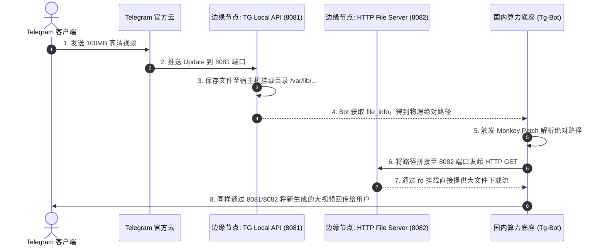

# 子模块: Telegram 本地 API 与文件代理 (TG Local API)

## 1. 目标与范围
本模块致力于突破 Telegram 官方 Bot API 在云端下载 20MB、上传 50MB 的多媒体文件体积限制。通过在海外独立 VPS 部署官方提供的 `telegram-bot-api` 容器并开启 `TELEGRAM_LOCAL=1`，配合 Python HTTP 文件服务器和底层的 Monkey Patch，实现了针对高分辨率 AI 生成长视频的极速直传与下载能力。

## 2. 架构图与调用链



## 3. 核心代码片段

### Monkey Patch 文件下载逻辑 (src/bot_prod.py)
[`bot_prod.py:L15-L42`](file:///home/hfy/APP/All_bot/src/bot_prod.py#L15)
```python
import telegram
from telegram.ext import ApplicationBuilder
import httpx

# 保存原始方法
_original_download_to_drive = telegram.File.download_to_drive

async def custom_download_as_bytearray(self, out=None, custom_path=None, read_timeout=120.0, *args, **kwargs):
    """
    拦截 python-telegram-bot 的下载行为，
    防止其将 base_file_url 强制拼接 'bot<token>' 导致 404。
    提取 file_path，强制指向 8082 HTTP 文件服务器。
    """
    raw_path = self.file_path
    # 核心修复：直接通过直连下载，跳过代理和错误的 token 拼接
    target_url = f"http://<VPS_IP>:8082{raw_path}"
    
    async with httpx.AsyncClient(proxy=None) as client:
        response = await client.get(target_url, timeout=read_timeout)
        response.raise_for_status()
        return bytearray(response.content)

# 动态替换类方法
telegram.File.download_as_bytearray = custom_download_as_bytearray
```

## 4. 接口定义 (网络契约)
本模块对外表现为 PTB 框架内的 `ApplicationBuilder` 参数配置：
```python
# 必须显式将请求路由指向 VPS
application = (
    ApplicationBuilder()
    .token(BOT_TOKEN)
    .base_url("http://<VPS_IP>:8081/bot")
    .base_file_url("http://<VPS_IP>:8082") # 仅提供前缀，通过 Patch 截断
    .build()
)
```

## 5. 单元与集成测试要求
- **覆盖率基准**：不涉及业务，但 Monkey Patch 代码要求 **100%** 的集成测试通过率。
- **核心用例**：
  1. `test_local_api_connection`：在 Bot 启动前，测试 `http://<VPS_IP>:8081/bot<TOKEN>/getMe` 是否返回正常的 Bot 信息，而非 502。
  2. `test_large_file_download`：用户上传一个 45MB 的视频文件，断言 `custom_download_as_bytearray` 能在 `read_timeout` 内无阻碍地返回完整的 `bytearray`，且 HTTP 状态码为 200。
  3. `test_directory_permissions`：验证 `telegram-bot-api` 写入宿主机的文件能被 8082 端口读取，不报 403 Forbidden 错误。

## 6. 部署与回滚步骤
- **VPS 端部署**：
  必须确保宿主机目录权限开放 (`chmod -R 777`) 给容器内的 UID 101。
  ```bash
  docker run -d -p 8081:8081 --name tg-local-api -e TELEGRAM_LOCAL=1 -v /var/lib/telegram-bot-api:/var/lib/telegram-bot-api aiogram/telegram-bot-api
  docker run -d -p 8082:8000 -v /var/lib/telegram-bot-api:/var/lib/telegram-bot-api:ro python:3.9 python -m http.server 8000 --directory /
  ```
- **故障回滚**：
  如果 VPS 宕机，临时注释掉 `base_url` 与 `base_file_url`，并重启 Bot。这会使 Bot 回退到官方服务器限制，大于 20MB 的视频暂时报错，但其他业务恢复可用。

## 7. 监控告警规则 (SLI/SLO)
- **SLI**：8081 和 8082 端口的网络可用性及 404 错误率。
- **SLO**：文件下载请求的成功率 > 99%，大文件（100MB）下载速度 > 5MB/s。
- **告警策略**：
  - **Critical**：如果 Monkey Patch 中持续抛出 `httpx.HTTPStatusError: 404 Not Found`，意味着路径拼接逻辑失效或目录权限错误，需立刻通知运维人工核对 VPS 目录挂载。
