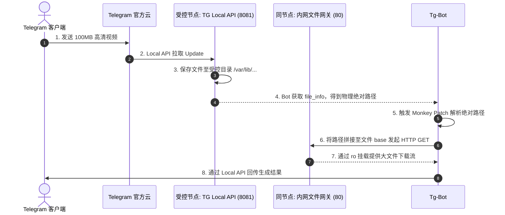

# 子模块: Telegram 本地 API 与文件代理 (TG Local API)

## 1. 目标与范围

本模块通过 `telegram-bot-api --local`、只读文件网关和统一 Telegram runtime
bootstrap 支持大媒体收发。Local API 可以部署在独立 VPS，也可以作为云控制面的
内部模块运行；Bot 只依赖 `TELEGRAM_API_BASE_URL` 与
`TELEGRAM_FILE_BASE_URL`，不依赖固定主机。

仓库中的 prod Compose/env example 当前把下列地址作为 Local API 默认值：

- API base：`http://69.63.220.115:8081`
- File base：`http://69.63.220.115:8082`

这些地址只保留为 legacy fallback，不代表推荐拓扑或 live 状态。目标环境仍以受控
`TELEGRAM_API_BASE_URL` / `TELEGRAM_FILE_BASE_URL` 为准；节点、端口、容器、
磁盘和 SSH 状态必须当次只读探测，所以本资料在审计矩阵中标记为
`runtime-verification-required`。

## 2. 架构图与调用链



## 3. 核心代码片段

### 共享 Telegram runtime bootstrap

[`src/services/telegram_runtime_bootstrap.py`](../src/services/telegram_runtime_bootstrap.py)

```python
install_telegram_runtime_patches(logger=logger)
request = build_telegram_httpx_request()

application = (
    ApplicationBuilder()
    .token(BOT_TOKEN)
    .base_url(build_telegram_bot_base_url())
    .base_file_url(resolve_telegram_file_base_url())
    .request(request)
    .get_updates_request(request)
    .build()
)
```

主 Bot `src/bot_main.py` 与 QQCC Bot `qqcc_bot/main.py` 都调用该 helper。它统一负责：

- `TELEGRAM_API_BASE_URL` / `TELEGRAM_FILE_BASE_URL` 默认值与环境覆盖；
- `HTTPXRequest(proxy=None, connect_timeout=60, read_timeout=120, write_timeout=120, connection_pool_size=500)`；
- `File.download_to_drive` 本地文件代理 patch；
- `Poll.de_json` 对旧 update 缺失 `members_only` 的兼容；
- `ChatMemberRestricted.de_json` 对旧 Local Bot API payload 缺失可选 `can_react_to_messages` 的兼容；缺失时按 Bot API 语义继承 `can_send_messages`，避免 PTB 解析失败后 polling offset 被同一条 update 永久阻塞；
- Bot middleware 中 correlation id、语言缓存与 `context.t` 注入。

## 4. 接口定义 (网络契约)

本模块对外表现为 PTB 框架内的 `ApplicationBuilder` 参数配置：

```python
# 必须显式将请求路由指向当前受控 Local API
application = (
    ApplicationBuilder()
    .token(BOT_TOKEN)
    .base_url(build_telegram_bot_base_url())
    .base_file_url(resolve_telegram_file_base_url())
    .build()
)
```

云内模块的 Compose 网络地址固定为：

- `TELEGRAM_API_BASE_URL=http://telegram-local-api:8081`
- `TELEGRAM_FILE_BASE_URL=http://telegram-local-files`

两个服务都不发布宿主机端口。Local API 可写
`${ALLBOT_STATE_ROOT}/telegram-local-api`；文件网关把同一目录只读挂到与绝对
`file_path` 一致的 URL 层级。主 Bot 和 QQCC Bot 必须共用 runtime helper，避免
不同 polling 服务出现下载、Poll 兼容或语言注入行为漂移。

模块由 `telegram-local-api` profile 控制，默认
`TELEGRAM_LOCAL_API_ENABLED=false`。只有启用时，配置契约才要求并仅投影
`TELEGRAM_API_ID`、`TELEGRAM_API_HASH`。二者必须由操作者从 Telegram 获取，
不得使用 Bot token 替代、提交 Git 或写入 artifact。Local API 当前消费精确 digest
固定的第三方 `aiogram/telegram-bot-api` 容器；二进制语义仍以 Telegram 官方
`tdlib/telegram-bot-api` 为准，升级前必须重新做兼容与大文件 canary。

## 5. 单元与集成测试要求

- **覆盖率基准**：不涉及业务，但 runtime bootstrap 与 Monkey Patch 代码要求 focused tests 覆盖默认/覆盖 URL、patch 幂等和旧 Poll update 兼容。
- **核心用例**：
  1. `test_local_api_connection`：在 Bot 启动前，测试 `http://<VPS_IP>:8081/bot<TOKEN>/getMe` 是否返回正常的 Bot 信息，而非 502。
  2. `test_large_file_download`：用户上传一个 45MB 的视频文件，断言共享 `download_to_drive` patch 能在 `read_timeout` 内无阻碍地落盘，且 HTTP 状态码为 200。
  3. `test_directory_permissions`：验证 `telegram-bot-api` 写入宿主机的文件能被 8082 端口读取，不报 403 Forbidden 错误。

## 6. 运维与恢复边界

- 读取仓库默认地址不授权修改节点、DNS、防火墙、容器或 Bot 环境。
- mutation 前先加载 `allbot-cloud-ssh`，从 SSH host config、目标服务状态和
  挂载权限建立当次事实；不得按本文猜测用户名、镜像、目录或 token 来源。
- Local API 和只读文件服务必须共享受控媒体目录，但写权限只授予实际容器
  UID/GID，禁止用全目录 `0777` 作为恢复手段。
- token 会出现在 Bot API URL path。探测只能在受控终端执行，不把完整命令、
  URL、日志或 shell history 写入文档和聊天。
- 切回 Telegram 官方 API 会恢复官方文件大小限制，且属于目标 Bot 配置与
  重部署；必须按明确模块、环境和 exact digest 执行，不能在容器内临时改 env。

### 6.1 云测试迁移顺序

Telegram 官方明确说明：同一 Bot 同时登录多个 Local API 时不能保证收到全部
updates；从旧 Local API 移动到新实例前，应在旧实例调用 `logOut`。因此测试迁移
必须按 token 逐一执行，不能直接双开抢占：

1. 记录旧 API/file URL、当前 module identity 和 config revision；确认
   `TELEGRAM_API_ID/HASH` 已进入受控 test env。
2. 部署并激活 `compose-contract`、`config-contract`，但先不切换 polling Bot。
3. 部署 `telegram-local-api` 与 `telegram-local-files`，核对 health、无宿主机
   端口、资源上限和共享目录权限。
4. 停止目标测试 Bot 的 polling；在旧 Local API 对该 token 调用 `logOut`，响应
   和命令都必须脱敏。没有旧节点文件级访问时，接受这一小段切换窗口，不声称
   update 零丢失。
5. 在 test env 把 API/file URL 改为上述 Docker 内网地址，重新激活
   `config-contract`，再部署目标 Bot exact digest。
6. 验证新 Local API `getMe`、单一 polling、一个无副作用 update，以及真实大文件
   `getFile` 返回的绝对路径能经文件网关下载。

需要零丢失迁移时，按 Telegram 官方流程先删除 webhook、调用 `close`，再把旧
实例中该 Bot 的工作子目录搬到新实例。没有旧节点 SSH 和文件级事实时不得臆测或
执行这条路径。

回滚按相反方向执行：先停止测试 Bot，在新 Local API `logOut`，恢复旧 URL 与
config revision，再启动 Bot 并确认单一 polling。仅停止新 Local API 而不恢复
文件 base 会使绝对路径下载失败。

## 7. 观测与故障定位

- 端口可达只证明 TCP listener，不证明指定 token 的 `getMe`、polling、共享
  文件目录或大文件下载正常。
- 404 先区分探测了 API 根路径、token path 错误、file path 拼接、文件已清理
  或只读服务挂载不一致，不能直接归因于权限。
- 依次核对 Bot 解析后的 base URL、Local API 日志、文件真实路径、只读服务
  mount、HTTP status 与下载超时；输出必须脱敏。
- 修改 runtime bootstrap 时至少运行
  `tests/services/test_telegram_runtime_bootstrap.py` 和相关 Bot entrypoint
  隔离测试。

参考：Telegram 官方
[`tdlib/telegram-bot-api` 迁移说明](https://github.com/tdlib/telegram-bot-api#moving-a-bot-from-one-local-server-to-another)。
