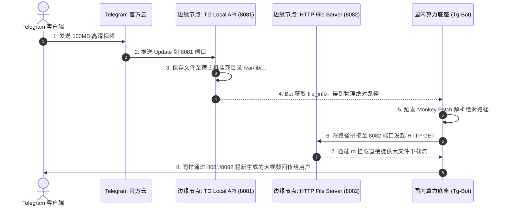

# 子模块: Telegram 本地 API 与文件代理 (TG Local API)

## 1. 目标与范围

本模块致力于突破 Telegram 官方 Bot API 在云端下载 20MB、上传 50MB 的多媒体文件体积限制。通过在海外独立 VPS 部署官方提供的 `telegram-bot-api` 容器并开启 `TELEGRAM_LOCAL=1`，配合 Python HTTP 文件服务器和统一 Telegram runtime bootstrap，实现了针对高分辨率 AI 生成长视频的极速直传与下载能力。

当前 Telegram Local API VPS 公网 IP 为 `69.63.220.115`：

- API base：`http://69.63.220.115:8081`
- File base：`http://69.63.220.115:8082`
- 2026-06-08 公网探测：22/8081/8082 端口可达；8081 根路径返回 404 属正常现象，真实健康需用 `/bot<TOKEN>/getMe`；8082 根路径返回 200。
- 当前主服务器尚未配置该 VPS 的可用 SSH key，`root@69.63.220.115` publickey 登录失败；资源、Docker 容器、挂载目录需补齐 SSH 后再采集。

## 2. 架构图与调用链



## 3. 核心代码片段

### 共享 Telegram runtime bootstrap

[`src/services/telegram_runtime_bootstrap.py`](../src/services/telegram_runtime_bootstrap.py)

```python
install_telegram_runtime_patches(logger=logger)
request = build_telegram_httpx_request()

application = (
    ApplicationBuilder()
    .token(BOT_TOKEN)
    .base_url(build_telegram_bot_base_url())
    .base_file_url(resolve_telegram_file_base_url())
    .request(request)
    .get_updates_request(request)
    .build()
)
```

主 Bot `src/bot_main.py` 与 QQCC Bot `qqcc_bot/main.py` 都调用该 helper。它统一负责：

- `TELEGRAM_API_BASE_URL` / `TELEGRAM_FILE_BASE_URL` 默认值与环境覆盖；
- `HTTPXRequest(proxy=None, connect_timeout=60, read_timeout=120, write_timeout=120, connection_pool_size=500)`；
- `File.download_to_drive` 本地文件代理 patch；
- `Poll.de_json` 对旧 update 缺失 `members_only` 的兼容；
- Bot middleware 中 correlation id、语言缓存与 `context.t` 注入。

## 4. 接口定义 (网络契约)

本模块对外表现为 PTB 框架内的 `ApplicationBuilder` 参数配置：

```python
# 必须显式将请求路由指向 VPS
application = (
    ApplicationBuilder()
    .token(BOT_TOKEN)
    .base_url(build_telegram_bot_base_url())
    .base_file_url(resolve_telegram_file_base_url())
    .build()
)
```

`TELEGRAM_API_BASE_URL` 默认 `http://69.63.220.115:8081`，`TELEGRAM_FILE_BASE_URL` 默认 `http://69.63.220.115:8082`。主 Bot 和 QQCC Bot 必须共用这组 helper，避免不同 polling 服务出现下载、Poll 兼容或语言注入行为漂移。

## 5. 单元与集成测试要求

- **覆盖率基准**：不涉及业务，但 runtime bootstrap 与 Monkey Patch 代码要求 focused tests 覆盖默认/覆盖 URL、patch 幂等和旧 Poll update 兼容。
- **核心用例**：
  1. `test_local_api_connection`：在 Bot 启动前，测试 `http://<VPS_IP>:8081/bot<TOKEN>/getMe` 是否返回正常的 Bot 信息，而非 502。
  2. `test_large_file_download`：用户上传一个 45MB 的视频文件，断言共享 `download_to_drive` patch 能在 `read_timeout` 内无阻碍地落盘，且 HTTP 状态码为 200。
  3. `test_directory_permissions`：验证 `telegram-bot-api` 写入宿主机的文件能被 8082 端口读取，不报 403 Forbidden 错误。

## 6. 部署与回滚步骤

- **VPS 端部署**：
  必须确保宿主机目录权限开放 (`chmod -R 777`) 给容器内的 UID 101。

  ```bash
  docker run -d -p 8081:8081 --name tg-local-api -e TELEGRAM_LOCAL=1 -v /var/lib/telegram-bot-api:/var/lib/telegram-bot-api aiogram/telegram-bot-api
  docker run -d -p 8082:8000 -v /var/lib/telegram-bot-api:/var/lib/telegram-bot-api:ro python:3.9 python -m http.server 8000 --directory /
  ```

  上述命令只作为形态参考；生产恢复前必须先 SSH 到 `69.63.220.115` 核对现有容器、镜像、挂载与 token 来源，不要盲目覆盖运行中的容器。
- **故障回滚**：
  如果 VPS 宕机，临时注释掉 `base_url` 与 `base_file_url`，并重启 Bot。这会使 Bot 回退到官方服务器限制，大于 20MB 的视频暂时报错，但其他业务恢复可用。

## 7. 监控告警规则 (SLI/SLO)

- **SLI**：8081 和 8082 端口的网络可用性及 404 错误率。
- **SLO**：文件下载请求的成功率 > 99%，大文件（100MB）下载速度 > 5MB/s。
- **告警策略**：
  - **Critical**：如果 Monkey Patch 中持续抛出 `httpx.HTTPStatusError: 404 Not Found`，意味着路径拼接逻辑失效或目录权限错误，需立刻通知运维人工核对 VPS 目录挂载。
  - **SSH 管理缺口**：当前主服务器没有该 VPS 的可用免密 SSH；若 8081/8082 故障，只能先做公网端口判断。需要把运维公钥加入该节点 root 或专用 deploy 用户后，才能按完整 SOP 查看 `docker logs`、挂载目录和磁盘空间。
