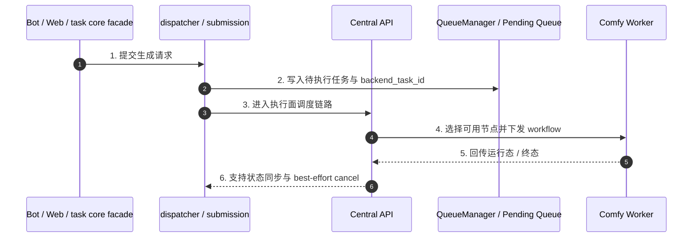

# 子模块: 中控 API 与节点通信 (Central API & Worker Communication)

## 1. 目标与范围

本模块是系统底层执行面的一部分，负责承接已经由上游 `task core facade` 派发完成的 backend 任务，把 workflow/payload 分发给可用 Worker，并支持运行态取消与节点视图维护。

当前知识口径下，Central API 不是“客户端直接主入口”；主业务流入口在：

- Telegram Bot / FSM / Bot entrypoints
- Web API / tasks generate
- `task_core.py` facade
- `task_dispatcher.py` / submission 链

Central API 负责的是执行面，不是上游业务编排面。

## 2. 当前架构图

## 3. 当前职责边界

### 3.1 Central API 负责什么

- 接收待执行任务并选择合适 Worker
- 承接运行态下发与取消语义
- 维护节点心跳、基础 worker 视图与执行面状态同步
- 在终止场景下执行 backend 侧 best-effort cancel

### 3.2 Central API 不负责什么

- 不作为 Web/Bot 的主业务入口文档口径
- 不承担上游计费、并发锁、历史持久化或 Bot 展示语义
- 不把“Redis DB2 + Pub/Sub 等待结果”描述成全站唯一主链

## 4. 与 task core 的关系

当前更准确的任务主链应表述为：

- `Entry(Bot/Web) -> task core facade -> provider/dependencies -> submission/dispatcher -> Central API -> Worker`

这意味着：

- 上游生成 `registry_task_id`
- 提交阶段派发 `backend_task_id`
- Central API 主要围绕 backend 执行态工作
- 取消、恢复与清理时需显式区分 `registry_task_id` 与 `backend_task_id`

## 5. 接口语义

### 5.1 任务取消

- `DELETE /api/tasks/{task_id}` 仍可视为 backend 执行面的终止入口。
- pending 任务可直接从队列移除并进入取消退款链路。
- Worker 可在真实 `/api/agent/task/pop?cancel_lock=true` 时把任务标记为 `cancel_locked=1`、`execution_phase=preparing`；这表示任务已进入输入准备或执行流水线，用户取消接口应返回 `not_cancellable` / `reason=cancel_locked`，不再写 `cancel_requested`。
- legacy 未锁定 running 任务仍保留 `cancel_requested` 兼容语义，等待执行端确认。
- 上游仍需自行完成 registry cleanup、锁释放、退款与终态收口。

### 5.2 节点通信

- Worker 心跳、可用性与执行中状态是 Central API / Queue 视图的一部分
- Worker heartbeat 状态约定为 `idle`、`running`、`error`、`quarantined`；其中 `error` 表示 ComfyUI 探活持续失败，`quarantined` 表示连续基础设施类任务失败后的冷却隔离。Agent 到 relay/Central 的控制面请求连续失败默认达到 12 次且持续 300 秒时会以退出码 75 退出，让 Docker `restart: always` 接管；这只处理控制面半断，不替代 Central task heartbeat 的 zombie 清理。
- heartbeat 可携带 `health_reason`、`last_error`、`last_error_at`、`consecutive_failures`、`quarantined_until`，用于 Dashboard 节点卡片展示和排障
- `/system/status` 中 `active_workers` 只表示有 heartbeat 的节点数；`healthy_workers` 表示 heartbeat 健康态为 `idle/running` 的节点数；`accepting_workers` 才表示同时处于健康态且 agent control 为 `enabled` 的可接新单节点数。`comfy_online` 仍按 `healthy_workers > 0` 计算，用于区分 runtime 健康与接单开关。
- `/system/status.queue_by_type` 仍表示 Central pending 队列按执行类型的计数；`queue_by_type_details` 是同一 Central 视图的轻量补充，只读扫描 `comfy:queue:pending` 与 `comfy:task:{backend_task_id}` 中的 `type` / `created_at`，按任务类型返回 `pending_count` 与 `max_pending_wait_seconds`。这里的最长等待严格按 pending 任务的 `created_at` 计算，不查询用户订单、低信任免费层或 active registry，也不改变调度顺序。Dashboard `/api/system/status.queue_by_type_details` 仍是更高层聚合口径，包含 active count、低信任免费层与非低信任最长等待等字段。
- `/system/status.queue_pressure_by_worker_profile` 按共享 Worker 执行池聚合 `supported_task_types`、`pending_count`、`accepting_worker_count` 及 RunPod/本地可接单数量。分母只统计 heartbeat 快照中 `status=idle|running` 且 `control_state=enabled` 的 Worker；同池多个执行类型的 pending 求和，公开和 legacy alias 先归一。该字段供低阶外门用户扣费前准入与 Dashboard “可接单服务器”展示复用。
- `/system/workers` 会展示每个 worker 的 `control_state`、`control_reason`、`control_updated_at`；`/system/status` 会聚合 `workers_by_control_state`，用于排查“worker 健康但 pending 不被 pop”的场景。
- `/system/status` 与 `/system/workers` 是短缓存快照，不是强一致调度入口。Central API 会对同一 Redis 连接参数与队列 key 组合的队列/worker 快照做约 10 秒短 TTL 缓存，并在刷新中返回短时 stale 快照，避免 Bot、Web 与 Dashboard 并发轮询时重复扫描 Redis 导致状态接口超时或触发 Bot 熔断。低阶外门用户的容量准入明确接受这一快照语义，不新增 Redis 原子预约，极端并发下可短暂越过理论阈值；实际任务分发、Worker `pop`、状态上报与完成回流仍走实时 Redis/HTTP 路径。
- `/status/{backend_task_id}` 是单任务观测接口，也会对同一 Redis/队列 key 与 task id 做短 TTL 缓存、最大条目数限制和单飞刷新，默认约 2 秒 TTL、4 秒 stale 窗口，用于吸收 Web API 粗状态、Web SSE 兼容路径、Dashboard active task 与 Bot polling 的重复轮询。Redis Pub/Sub 只作为进度快路径；Web SSE 订阅或读取 Pub/Sub 失败时，同一连接会继续用 `/status` 补偿轮询到终态。Central 默认 pending 响应里的 `queue_pos` 仍是全局 0-based 队列位置；调用方显式传 `include_type_position=true` 时，pending 响应会额外返回同任务类型内的 0-based `queue_type_pos`。用户侧展示已降级为低频粗状态：Web 通过 `/api/tasks/{registry_task_id}/status` 每约 15 秒查询并优先展示同任务类型位置，Bot 也默认每约 15 秒 HTTP polling 并优先展示同任务类型位置；二者都在缺少 `queue_type_pos` 时回退全局 `queue_pos`，running 不展示 progress 百分比、不按 progress 反复编辑。它不改变 pending/running/done 的事实源，终态收口仍以 Worker `/complete`、Redis 事件和上游 monitor/history 为准。
- Central FastAPI 生命周期内复用共享 Redis 客户端；依赖注入优先使用 `request.app.state.redis`，只有离线/测试场景缺失 app state 时才回退到临时 Redis 连接。Redis client 必须通过 `src.services.redis_connection.build_redis_client(...)` 创建，默认带 `socket_connect_timeout=5`、`socket_timeout=5`、`health_check_interval=15`、`socket_keepalive=true` 与 `retry_on_timeout=true`，不要把 `get_redis()` 再改回每请求新建连接或裸 `Redis.from_url(...)` 模式。
- Central Redis 连接瞬断重试耗尽时，执行面 API 统一返回 `503 Service Unavailable` 与 `Retry-After: 2`，语义是控制面 Redis 暂时不可用、上游可按忙碌/补偿路径处理；排障时应区别于业务参数错误和 Worker 执行失败。
- `/api/agent/task/complete` 是结果成功回流的唯一确认点。媒体 Worker 先写
  `staging/worker-results/{backend_task_id}/...`，并上报 `staging_key`、
  `sha256`、`byte_size` 和 `content_type`。Central 在任何 done 终态写入前将
  staging 对象服务端复制到 `task-results/{backend_task_id}/...`，复验大小、
  SHA-256 和元数据后才确认完成。复制与重复 `/complete` 必须幂等；
  不完整、跨任务或校验不符的 staging 报文直接拒绝，不得先写 done。
  旧 Worker 不携资产元数据时仅在一个兼容发布周期内沿用原
  `result_path`；全部媒体 Worker 切换后将
  `LEGACY_RESULT_COMPLETION_ENABLED=false`，缺少资产契约的媒体完成请求直接拒绝。
  拒绝响应使用稳定 `detail.code`（例如
  `legacy_media_completion_rejected`、`staging_integrity_failed`、
  `durable_copy_failed`），并携带 `retryable`。Central 以
  `result_promotion_rejected` 结构化日志记录 code/task/agent；受 agent token
  保护的 `GET /api/agent/task/result-storage-metrics` 返回当前进程按 code 聚合的
 失败计数，供运行态采集，进程重启后不作为持久账本。
  文本结果不依赖媒体资产契约。Worker 端必须对完成回报进行有限重试，全部失败后
  显式失败。
- `/api/agent/task/text-delta` 是 `prompt_optimize` 的可选增量协议，只写运行态快照，
  不构成成功。Central 以 task owner、attempt、连续 sequence、服务端字段契约和长度
  做原子校验；重复 sequence 幂等确认，跳号拒绝并返回期望值。终态写入采用 CAS，
  late fail 不得覆盖 done。旧 Worker 不调用此接口时继续只用 `/complete`。
- `/api/agent/task/status` 是运行态观测回报，Worker 端对瞬时断连或 5xx 做轻量重试；重试耗尽只记录错误，不应直接让正在生成的任务失败。status 可携带 `execution_phase`、`cancel_locked` 与 `set_current=false`，用于双槽流水线下更新阶段而不覆盖 agent 当前任务指针。
- `/api/agent/task/pop?cancel_lock=true` 是 V2 worker 流水线的真实接单入口；它仍会从 pending 转 running 并写 task heartbeat，同时写取消锁字段。Central 仍是唯一队列事实源，worker 不得绕过 pop 直接执行 peek 结果。
- Central 会把缺失 task heartbeat 的 zombie 终态归因到任务已绑定的 `worker_id`。同一 Worker 在一小时失联窗口内累计 6 个此类任务时，自动写入 30 分钟 `disabled` control；现有 `pop(agent_id=...)` 门禁随即停止该实例继续领取，但不覆盖人工 `draining/disabled`。该临时隔离只阻止坏实例反复伤害新任务，不替代 provider/LAN 对 Pod、容器、GPU 或 ComfyUI 的根因恢复。
- `/api/agent/task/pop` 与 `/peek` 可选携带 `preferred_types`，但必须同时携带 `types` 且前者是后者的子集，否则返回 422。参数缺失或清洗后为空时完全沿用旧 score 顺序。参数有效时，Central 在单次 Redis Lua 中按 score 扫描候选：记录最早 fallback，但只要领取瞬间存在 preferred 就优先原子 `ZREM` 最早 preferred；没有 preferred 才领取最早 fallback。已经 running 的 fallback 不抢占，下一次领取重新判断。真实原子出队失败不盲 retry；`peek` 使用相同分组顺序但不修改队列。
- 新版 worker 会在 `/api/agent/task/pop` query 中携带 `agent_id`。Central 会读取 `comfy:agent:control:{agent_id}` 控制键；若 worker 处于 `draining` 或 `disabled`，则返回空任务并保留 pending 队列不变。旧 worker 不传 `agent_id` 时保持兼容旧行为。
- `/api/agent/task/peek?types=...&limit=1` 是只读预取 hint，只扫描 pending 队列中最早匹配的任务并返回 `{ "task": task_details | null }`。它不得 `zrem` pending、不得写 running set、不得标记 `running`、不得写 task heartbeat；真实接单和取消语义仍必须以后续 `/api/agent/task/pop` 为准。
- 任务类型事实表位于 `src/domain_config/task_type_registry.py`，当前提供查询 helper 并驱动 Gallery/apply、Central simple task 映射与 workflow filename facts，同时作为一致性门禁；Central simple route 的 task key -> `TaskType` 值由 registry 的 `central_type` 派生，队列 task type 与 worker `SUPPORTED_TASK_TYPES` 分发语义保持不变。新增 Central simple route 或 workflow 映射时，必须同步 registry 并跑 `tests/config/test_task_type_registry.py`。
- `pornmaster_flux2_edit_bf16` 使用独立 simple route `/api/v1/pornmaster_flux2_edit_bf16` 和同名队列类型，只接受单图输入。2026-07-12 已通过单服务 force-recreate `central-api-prod` 重新注册挂载代码，正式 OpenAPI 已包含该 POST；未重建镜像、未进入维护、未重启其它服务。
- GPU pool 控制器使用 `POST /api/agent/task/control/{agent_id}` 与 `GET /api/agent/task/control/{agent_id}` 管理 worker `enabled/draining/disabled` 状态；接口沿用 `AGENT_SECRET_TOKEN`，用于模型同步、任务类型切换和单 worker canary 前的安全 drain。
- Dashboard 的 RunPod / LAN AIO worker `重启` 按钮也复用该 control 协议：重启前先把目标 agent 置为 `disabled`，底层运维脚本原地重启对应 Pod/容器并等待新 heartbeat 后再置为 `enabled`；Central 不负责直接重启 Pod、Docker 或 GPU 节点。
- worker heartbeat 可选携带 `node_id`、`provider`、`gpu_index`、`runtime_profile`、`image_ref`、`model_bundle_versions`、`pool_managed`、`worker_agent_managed`、`comfy_runtime_kind`、`comfy_runtime_managed`。这些字段只增强观测和资源池管理，不改变 Central 按 `SUPPORTED_TASK_TYPES` 分发任务的基本语义；其中 `image_ref` 不等于底层 ComfyUI 一定由该镜像运行，`gpu-226:8188` 当前就是 `host_service`。
- `complete/failed/cancelled` 终态回报只记录 task 的 `worker_id`，并用 compare-and-clear 清理 agent `current_task_id`：只有当前指针仍等于该 task 时才清除，避免旧任务后台 complete 抹掉新任务展示。
- Worker 等待 ComfyUI 结果时，WebSocket 终态不是唯一信号；当 WS 未及时设置结果时，worker 会按策略探测 `/history/{prompt_id}` 收口。日志里的 `Task result not set via WS, checking history` 通常解释为 ComfyUI/worker 本地执行链路的短暂停顿，不等同于 Central 状态接口慢。
- 云正式 worker 可在本地主机通过 `workers/local_relay/relay_main.py` 访问 Central。该 relay 透明代理 `pop/check/peek/complete/heartbeat/task_heartbeat`，保留 query/body 新字段；对非终态 `running` status 做本地快速 ACK 和最新值合并转发；`complete`、`failed`、`cancelled`、`pop`、`check` 必须同步转发成功后才返回。relay 同时提供本地上传 sidecar，worker 只有在 R2/S3 put 成功后才调用 `/complete`，因此 Central 仍是唯一队列事实源。relay `/health` 只表示进程存活，`/ready` 会短超时检查 Central `/health`、HTTP client、上传 client 与 pending status 数量，watchdog 应以 `/ready` 判定 relay 是否需要精确恢复；若 `/ready` 返回 404，表示当前运行 relay 尚未升级到新版，只记录 `relay_ready_endpoint_missing`，不触发重启循环。
- RunPod 镜像内的 `runpod_relay` 遵守同一同步转发与 sidecar 上传确认语义，上游 Central 使用 RunPod 专用 Cloudflare Tunnel 域名。
- 文档不再固化 Redis DB 编号与具体低层队列命名为稳定架构事实

## 6. 测试要求

- 覆盖任务成功下发到可用 Worker
- 覆盖无可用 Worker 时的重试或回退语义
- 覆盖 `DELETE /api/tasks/{task_id}` 的 best-effort cancel
- 覆盖 worker 心跳、健康字段、`error/quarantined` 节点视图与 `healthy_workers` 聚合统计
- 覆盖 agent control 字段透出、`workers_by_control_state` 聚合与 `accepting_workers` 排除 `disabled/draining` worker
- 覆盖 `peek` 只读语义：不修改 pending/running/status/task heartbeat，且不返回已取消任务
- 覆盖 `pop(cancel_lock=true)` 写入取消锁，locked running cancel 返回不可取消且不写 `cancel_requested`
- 覆盖 `pop(agent_id=...)` 在 worker `draining/disabled` 时不出队、不写 running
- 覆盖同一 Worker 第 6 个 task heartbeat-lost 会进入临时 `disabled`，前 5 个和无 `worker_id` 的 legacy zombie 不误隔离其它实例
- 覆盖未传 `preferred_types` 时旧顺序不变、preferred 优先于更早 fallback、无 preferred 时回退、非子集 422、并发领取不重复，以及 preferred `peek` 不修改队列
- 覆盖 worker heartbeat GPU pool 元数据能在 `/system/workers` 解析展示
- 覆盖双槽 worker 下旧任务终态 compare-clear 不会清掉新任务 `current_task_id`
- 覆盖本地 relay 对终态同步转发、非终态 status 合并转发、sidecar 上传成功后才允许 worker complete

## 7. 部署与回滚

- Central API 是独立部署的 backend 执行面服务。
- 若分发逻辑异常导致任务堆积，应先检查：
  - worker 是否仍有 heartbeat，`healthy_workers` 是否大于 0，以及 `accepting_workers` 是否大于 0
  - worker 是否处于 `error` 或 `quarantined`，并查看 `last_error` / `health_reason`
  - worker `SUPPORTED_TASK_TYPES` 是否覆盖任务的执行面类型，例如旧图生视频与 Telegram 懒人动图新提交最终会排队为 `image_to_video`；LTX 高级图生视频当前用户入口会排队为 `ltx_video` 或 `ltx_video_flf2v`，`ltx_video_v2v_audio` 仅作为历史/队列兼容执行面保留；legacy `video_insert` / `video_edit` 只应作为旧队列兼容 alias，必须和 `image_to_video` 使用同一 workflow/mapping/patcher；RunPod `i2i_pro` profile 必须声明 `SUPPORTED_TASK_TYPES=i2i_pro,t2i-pornmaster-turbo,face_swap_v2,face_swap`，并将两个 face swap 类型都 override 到 `face_swap_v2.json`
  - SCAIL-2 测试环境可以由 `cloud_worker_test_08` 声明 `SUPPORTED_TASK_TYPES=scail2_action_transfer,scail2_action_transfer_long,scail2_video_replacement,scail2_face_swap_v2` 并指向 gpu-002 LAN AIO runtime `http://192.168.1.2:8190`，也可以由 RunPod `scail2` profile 的 `runpod_test_scail2_*` worker 接单；RunPod canary 会临时 disable 同环境支持 SCAIL-2 的非 RunPod worker，结束后必须恢复。云正式 LAN slot0 agent `lan_aio_prod_gpu002_gpu0_scail2_01` 声明 `scail2_action_transfer,scail2_action_transfer_long,scail2_video_replacement,scail2_face_swap_v2` 并写正式桶 `user-data-prod`；手动正式 RunPod `runpod_prod_scail2_manual_NN` 仍只声明 `scail2_action_transfer,scail2_video_replacement`，不得重建无关 `cloud-prod-comfy-agent-1..7`
  - LTX 高级图生视频正式可由 LAN AIO `lan_aio_prod_gpu177_gpu1_ltx_video_01` 或手动正式 RunPod `runpod_prod_ltx_video_manual_NN` 接单；两者都必须声明 `ltx_video,ltx_video_flf2v,ltx_video_v2v_audio`，写 `user-data-prod`，并通过 `TASK_TYPE_WORKFLOW_OVERRIDES` 使用 10Eros v1.2 workflow。canary 结束后 RunPod worker 保持 disabled，手动 enable 后才参与调度；LAN AIO 只消费镜像内烘焙的同一份 v1.2 runtime。
  - 目标 worker 是否设置了 `TASK_TYPE_WORKFLOW_OVERRIDES`，导致同一 task type 在测试/canary worker 上读取不同 workflow JSON
  - queue 是否持续堆积
  - 上游 task core submission 是否仍在正常写入任务
- 队列中的待执行任务通常具有可恢复性，重启执行面服务不应被表述为必然丢任务。
- 云正式 Central 单服务热修可只重建 `central-api-prod`；短时间内 worker heartbeat/status 上报可能抖动，但 pending 队列与 worker 内正在执行的 ComfyUI 任务不因 Central 容器重建本身立即丢失。
- Central Redis 连接偶发 reset 时，QueueManager 对安全读写和幂等更新已做有限 transient retry，覆盖入队事务、`/status/{task_id}`、agent `/task/check`、`task_heartbeat`、运行态 `status`、worker heartbeat 和 agent control 等路径；真实出队 `zpopmin` 与会改变候选任务的队列移除不做盲 retry，避免重复弹单。排障时不要把一次连接重置直接解读成队列丢失，应结合 worker 重试、task heartbeat 和队列事实判断。

## 8. 维护原则

- 中控文档要以“执行面”而不是“业务主入口”来描述 Central API。
- 不再把客户端直连中控、Redis DB2、固定 Pub/Sub 同步等待写成全局主叙事。
- 不要把 Dashboard/状态观测缓存误认为调度缓存；修改调度、取消、完成回流时仍需按实时 Redis/HTTP 主链测试。
