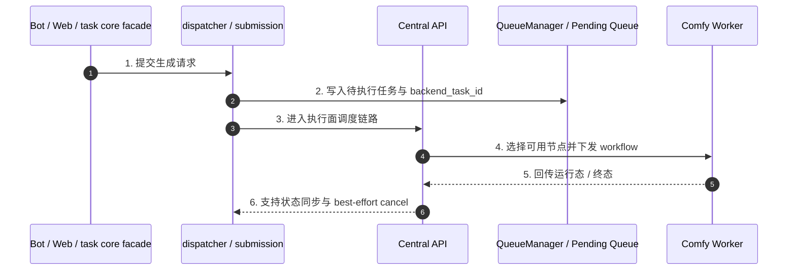

# 子模块: 中控 API 与节点通信 (Central API & Worker Communication)

## 1. 目标与范围
本模块是系统底层执行面的一部分，负责承接已经由上游 `task core facade` 派发完成的 backend 任务，把 workflow/payload 分发给可用 Worker，并支持运行态取消与节点视图维护。

当前知识口径下，Central API 不是“客户端直接主入口”；主业务流入口在：
- Telegram Bot / FSM / Bot entrypoints
- Web API / tasks generate
- `task_core.py` facade
- `task_dispatcher.py` / submission 链

Central API 负责的是执行面，不是上游业务编排面。

## 2. 当前架构图

## 3. 当前职责边界
### 3.1 Central API 负责什么
- 接收待执行任务并选择合适 Worker
- 承接运行态下发与取消语义
- 维护节点心跳、基础 worker 视图与执行面状态同步
- 在终止场景下执行 backend 侧 best-effort cancel

### 3.2 Central API 不负责什么
- 不作为 Web/Bot 的主业务入口文档口径
- 不承担上游计费、并发锁、历史持久化或 Bot 展示语义
- 不把“Redis DB2 + Pub/Sub 等待结果”描述成全站唯一主链

## 4. 与 task core 的关系
当前更准确的任务主链应表述为：
- `Entry(Bot/Web) -> task core facade -> provider/dependencies -> submission/dispatcher -> Central API -> Worker`

这意味着：
- 上游生成 `registry_task_id`
- 提交阶段派发 `backend_task_id`
- Central API 主要围绕 backend 执行态工作
- 取消、恢复与清理时需显式区分 `registry_task_id` 与 `backend_task_id`

## 5. 接口语义
### 5.1 任务取消
- `DELETE /api/tasks/{task_id}` 仍可视为 backend 执行面的终止入口。
- pending 任务可直接从队列移除并进入取消退款链路。
- Worker 可在真实 `/api/agent/task/pop?cancel_lock=true` 时把任务标记为 `cancel_locked=1`、`execution_phase=preparing`；这表示任务已进入输入准备或执行流水线，用户取消接口应返回 `not_cancellable` / `reason=cancel_locked`，不再写 `cancel_requested`。
- legacy 未锁定 running 任务仍保留 `cancel_requested` 兼容语义，等待执行端确认。
- 上游仍需自行完成 registry cleanup、锁释放、退款与终态收口。

### 5.2 节点通信
- Worker 心跳、可用性与执行中状态是 Central API / Queue 视图的一部分
- Worker heartbeat 状态约定为 `idle`、`running`、`error`、`quarantined`；其中 `error` 表示 ComfyUI 探活持续失败，`quarantined` 表示连续基础设施类任务失败后的冷却隔离。Agent 到 relay/Central 的控制面请求连续失败默认达到 12 次且持续 300 秒时会以退出码 75 退出，让 Docker `restart: always` 接管；这只处理控制面半断，不替代 Central task heartbeat 的 zombie 清理。
- heartbeat 可携带 `health_reason`、`last_error`、`last_error_at`、`consecutive_failures`、`quarantined_until`，用于 Dashboard 节点卡片展示和排障
- `/system/status` 中 `active_workers` 只表示有 heartbeat 的节点数；`healthy_workers` 才表示当前可接单节点数，`comfy_online` 按 `healthy_workers > 0` 计算
- `/system/status` 与 `/system/workers` 是高频观测接口，不是强一致调度入口。Central API 会对同一 Redis 连接参数与队列 key 组合的队列/worker 快照做约 10 秒短 TTL 缓存，并在刷新中返回短时 stale 快照，避免 Bot、Web 与 Dashboard 并发轮询时重复扫描 Redis 导致状态接口超时或触发 Bot 熔断。实际任务分发、Worker `pop`、状态上报与完成回流仍走实时 Redis/HTTP 路径，不依赖该观测缓存。
- `/status/{backend_task_id}` 是单任务观测接口，也会对同一 Redis/队列 key 与 task id 做短 TTL 缓存、最大条目数限制和单飞刷新，默认约 2 秒 TTL、4 秒 stale 窗口，用于吸收 Web SSE、Dashboard active task 与 Bot fallback 的重复轮询。Web SSE 侧还有补偿轮询退避：同一任务状态/队列位置/进度连续不变时，从 pending 约 5 秒、running 约 10 秒逐步退到默认最多约 20 秒，状态变化后恢复初始间隔。它不改变 pending/running/done 的事实源，终态收口仍以 Worker `/complete`、Redis 事件和上游 monitor/history 为准。
- Central FastAPI 生命周期内复用共享 Redis 客户端；依赖注入优先使用 `request.app.state.redis`，只有离线/测试场景缺失 app state 时才回退到临时 Redis 连接。不要把 `get_redis()` 再改回每请求新建连接的模式。
- `/api/agent/task/complete` 是结果成功回流的唯一确认点。Worker 端必须对完成回报进行有限重试，并在全部失败后显式失败，避免 Central 因未收到 `complete` 而把已生成任务误判为 heartbeat lost。
- `/api/agent/task/status` 是运行态观测回报，Worker 端对瞬时断连或 5xx 做轻量重试；重试耗尽只记录错误，不应直接让正在生成的任务失败。status 可携带 `execution_phase`、`cancel_locked` 与 `set_current=false`，用于双槽流水线下更新阶段而不覆盖 agent 当前任务指针。
- `/api/agent/task/pop?cancel_lock=true` 是 V2 worker 流水线的真实接单入口；它仍会从 pending 转 running 并写 task heartbeat，同时写取消锁字段。Central 仍是唯一队列事实源，worker 不得绕过 pop 直接执行 peek 结果。
- 新版 worker 会在 `/api/agent/task/pop` query 中携带 `agent_id`。Central 会读取 `comfy:agent:control:{agent_id}` 控制键；若 worker 处于 `draining` 或 `disabled`，则返回空任务并保留 pending 队列不变。旧 worker 不传 `agent_id` 时保持兼容旧行为。
- `/api/agent/task/peek?types=...&limit=1` 是只读预取 hint，只扫描 pending 队列中最早匹配的任务并返回 `{ "task": task_details | null }`。它不得 `zrem` pending、不得写 running set、不得标记 `running`、不得写 task heartbeat；真实接单和取消语义仍必须以后续 `/api/agent/task/pop` 为准。
- GPU pool 控制器使用 `POST /api/agent/task/control/{agent_id}` 与 `GET /api/agent/task/control/{agent_id}` 管理 worker `enabled/draining/disabled` 状态；接口沿用 `AGENT_SECRET_TOKEN`，用于模型同步、任务类型切换和单 worker canary 前的安全 drain。
- worker heartbeat 可选携带 `node_id`、`provider`、`gpu_index`、`runtime_profile`、`image_ref`、`model_bundle_versions`、`pool_managed`、`worker_agent_managed`、`comfy_runtime_kind`、`comfy_runtime_managed`。这些字段只增强观测和资源池管理，不改变 Central 按 `SUPPORTED_TASK_TYPES` 分发任务的基本语义；其中 `image_ref` 不等于底层 ComfyUI 一定由该镜像运行，`gpu-226:8188` 当前就是 `host_service`。
- `complete/failed/cancelled` 终态回报只记录 task 的 `worker_id`，并用 compare-and-clear 清理 agent `current_task_id`：只有当前指针仍等于该 task 时才清除，避免旧任务后台 complete 抹掉新任务展示。
- Worker 等待 ComfyUI 结果时，WebSocket 终态不是唯一信号；当 WS 未及时设置结果时，worker 会按策略探测 `/history/{prompt_id}` 收口。日志里的 `Task result not set via WS, checking history` 通常解释为 ComfyUI/worker 本地执行链路的短暂停顿，不等同于 Central 状态接口慢。
- 云正式 worker 可在本地主机通过 `workers/local_relay/relay_main.py` 访问 Central。该 relay 透明代理 `pop/check/peek/complete/heartbeat/task_heartbeat`，保留 query/body 新字段；对非终态 `running` status 做本地快速 ACK 和最新值合并转发；`complete`、`failed`、`cancelled`、`pop`、`check` 必须同步转发成功后才返回。relay 同时提供本地上传 sidecar，worker 只有在 R2/S3 put 成功后才调用 `/complete`，因此 Central 仍是唯一队列事实源。relay `/health` 只表示进程存活，`/ready` 会短超时检查 Central `/health`、HTTP client、上传 client 与 pending status 数量，watchdog 应以 `/ready` 判定 relay 是否需要精确恢复；若 `/ready` 返回 404，表示当前运行 relay 尚未升级到新版，只记录 `relay_ready_endpoint_missing`，不触发重启循环。
- 非 Tailscale 远程 Windows GPU 节点使用 `remote_workers/` 独立 venv 包时，bundled `remote_relay` 也必须遵守同样的同步转发与 sidecar 上传确认语义；差异仅在于 relay 的上游 Central 地址是 worker 专用 Cloudflare Tunnel 域名。
- 文档不再固化 Redis DB 编号与具体低层队列命名为稳定架构事实

## 6. 测试要求
- 覆盖任务成功下发到可用 Worker
- 覆盖无可用 Worker 时的重试或回退语义
- 覆盖 `DELETE /api/tasks/{task_id}` 的 best-effort cancel
- 覆盖 worker 心跳、健康字段、`error/quarantined` 节点视图与 `healthy_workers` 聚合统计
- 覆盖 `peek` 只读语义：不修改 pending/running/status/task heartbeat，且不返回已取消任务
- 覆盖 `pop(cancel_lock=true)` 写入取消锁，locked running cancel 返回不可取消且不写 `cancel_requested`
- 覆盖 `pop(agent_id=...)` 在 worker `draining/disabled` 时不出队、不写 running
- 覆盖 worker heartbeat GPU pool 元数据能在 `/system/workers` 解析展示
- 覆盖双槽 worker 下旧任务终态 compare-clear 不会清掉新任务 `current_task_id`
- 覆盖本地 relay 对终态同步转发、非终态 status 合并转发、sidecar 上传成功后才允许 worker complete

## 7. 部署与回滚
- Central API 是独立部署的 backend 执行面服务。
- 若分发逻辑异常导致任务堆积，应先检查：
  - worker 是否仍有 heartbeat，以及 `healthy_workers` 是否大于 0
  - worker 是否处于 `error` 或 `quarantined`，并查看 `last_error` / `health_reason`
  - worker `SUPPORTED_TASK_TYPES` 是否覆盖任务的执行面类型，例如旧图生视频与 Telegram 懒人动图新提交最终会排队为 `image_to_video`；legacy `video_insert` / `video_edit` 只应作为旧队列兼容 alias，必须和 `image_to_video` 使用同一 workflow/mapping/patcher；RunPod `i2i_pro` profile 必须声明 `SUPPORTED_TASK_TYPES=i2i_pro,t2i-pornmaster-turbo,face_swap`
  - SCAIL-2 测试环境可以由 `cloud_worker_test_08` 声明 `SUPPORTED_TASK_TYPES=scail2_action_transfer,scail2_video_replacement` 并指向 gpu-002 LAN AIO runtime `http://192.168.1.2:8190`，也可以由 RunPod `scail2` profile 的 `runpod_test_scail2_*` worker 接单；RunPod canary 会临时 disable 同环境支持 SCAIL-2 的非 RunPod worker，结束后必须恢复。云正式可以由 gpu-002 slot0 agent `lan_aio_prod_gpu002_gpu0_scail2_01` 接单，也可以由手动正式 RunPod `runpod_prod_scail2_manual_NN` 接单；两者都必须声明 `scail2_action_transfer,scail2_video_replacement` 并写正式桶 `user-data-prod`，不得重建无关 `cloud-prod-comfy-agent-1..7`
  - 目标 worker 是否设置了 `TASK_TYPE_WORKFLOW_OVERRIDES`，导致同一 task type 在测试/canary worker 上读取不同 workflow JSON
  - queue 是否持续堆积
  - 上游 task core submission 是否仍在正常写入任务
- 队列中的待执行任务通常具有可恢复性，重启执行面服务不应被表述为必然丢任务。
- 云正式 Central 单服务热修可只重建 `central-api-prod`；短时间内 worker heartbeat/status 上报可能抖动，但 pending 队列与 worker 内正在执行的 ComfyUI 任务不因 Central 容器重建本身立即丢失。
- 2026-06-10 巡检发现 Redis 写连接偶发 reset 会让 `/status/{task_id}` 或 worker heartbeat/status 短暂 500。修复方向是在 Central Redis 关键读写路径增加有限 retry/reconnect，并补 `/status/{task_id}`、`task_heartbeat`、`status` focused tests；排障时不要把一次连接重置直接解读成队列丢失。

## 8. 维护原则
- 中控文档要以“执行面”而不是“业务主入口”来描述 Central API。
- 不再把客户端直连中控、Redis DB2、固定 Pub/Sub 同步等待写成全局主叙事。
- 不要把 Dashboard/状态观测缓存误认为调度缓存；修改调度、取消、完成回流时仍需按实时 Redis/HTTP 主链测试。
