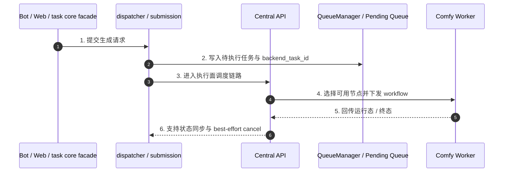

# 子模块: 中控 API 与节点通信 (Central API & Worker Communication)

## 1. 目标与范围
本模块是系统底层执行面的一部分，负责承接已经由上游 `task core facade` 派发完成的 backend 任务，把 workflow/payload 分发给可用 Worker，并支持运行态取消与节点视图维护。

当前知识口径下，Central API 不是“客户端直接主入口”；主业务流入口在：
- Telegram Bot / FSM / Bot entrypoints
- Web API / tasks generate
- `task_core.py` facade
- `task_dispatcher.py` / submission 链

Central API 负责的是执行面，不是上游业务编排面。

## 2. 当前架构图

## 3. 当前职责边界
### 3.1 Central API 负责什么
- 接收待执行任务并选择合适 Worker
- 承接运行态下发与取消语义
- 维护节点心跳、基础 worker 视图与执行面状态同步
- 在终止场景下执行 backend 侧 best-effort cancel

### 3.2 Central API 不负责什么
- 不作为 Web/Bot 的主业务入口文档口径
- 不承担上游计费、并发锁、历史持久化或 Bot 展示语义
- 不把“Redis DB2 + Pub/Sub 等待结果”描述成全站唯一主链

## 4. 与 task core 的关系
当前更准确的任务主链应表述为：
- `Entry(Bot/Web) -> task core facade -> provider/dependencies -> submission/dispatcher -> Central API -> Worker`

这意味着：
- 上游生成 `registry_task_id`
- 提交阶段派发 `backend_task_id`
- Central API 主要围绕 backend 执行态工作
- 取消、恢复与清理时需显式区分 `registry_task_id` 与 `backend_task_id`

## 5. 接口语义
### 5.1 任务取消
- `DELETE /api/tasks/{task_id}` 仍可视为 backend 执行面的终止入口
- 它的职责是：
  - 根据 backend 运行态定位任务
  - 向关联 Worker 发起 best-effort cancel
  - 返回成功、未找到或失败结果
- 上游仍需自行完成 registry cleanup、锁释放、退款与终态收口

### 5.2 节点通信
- Worker 心跳、可用性与执行中状态是 Central API / Queue 视图的一部分
- Worker heartbeat 状态约定为 `idle`、`running`、`error`、`quarantined`；其中 `error` 表示 ComfyUI 探活持续失败，`quarantined` 表示连续基础设施类任务失败后的冷却隔离
- heartbeat 可携带 `health_reason`、`last_error`、`last_error_at`、`consecutive_failures`、`quarantined_until`，用于 Dashboard 节点卡片展示和排障
- `/system/status` 中 `active_workers` 只表示有 heartbeat 的节点数；`healthy_workers` 才表示当前可接单节点数，`comfy_online` 按 `healthy_workers > 0` 计算
- `/system/status` 与 `/system/workers` 是高频观测接口，不是强一致调度入口。Central API 会对同一 Redis 连接参数与队列 key 组合的队列/worker 快照做约 10 秒短 TTL 缓存，并在刷新中返回短时 stale 快照，避免 Bot、Web 与 Dashboard 并发轮询时重复扫描 Redis 导致状态接口超时或触发 Bot 熔断。实际任务分发、Worker `pop`、状态上报与完成回流仍走实时 Redis/HTTP 路径，不依赖该观测缓存。
- `/status/{backend_task_id}` 是单任务观测接口，也会对同一 Redis/队列 key 与 task id 做短 TTL 缓存、最大条目数限制和单飞刷新，默认约 2 秒 TTL、4 秒 stale 窗口，用于吸收 Web SSE、Dashboard active task 与 Bot fallback 的重复轮询。Web SSE 侧还有补偿轮询退避：同一任务状态/队列位置/进度连续不变时，从 pending 约 5 秒、running 约 10 秒逐步退到默认最多约 20 秒，状态变化后恢复初始间隔。它不改变 pending/running/done 的事实源，终态收口仍以 Worker `/complete`、Redis 事件和上游 monitor/history 为准。
- Central FastAPI 生命周期内复用共享 Redis 客户端；依赖注入优先使用 `request.app.state.redis`，只有离线/测试场景缺失 app state 时才回退到临时 Redis 连接。不要把 `get_redis()` 再改回每请求新建连接的模式。
- `/api/agent/task/complete` 是结果成功回流的唯一确认点。Worker 端必须对完成回报进行有限重试，并在全部失败后显式失败，避免 Central 因未收到 `complete` 而把已生成任务误判为 heartbeat lost。
- `/api/agent/task/status` 是运行态观测回报，Worker 端对瞬时断连或 5xx 做轻量重试；重试耗尽只记录错误，不应直接让正在生成的任务失败。
- Worker 等待 ComfyUI 结果时，WebSocket 终态不是唯一信号；当 WS 未及时设置结果时，worker 会按策略探测 `/history/{prompt_id}` 收口。日志里的 `Task result not set via WS, checking history` 通常解释为 ComfyUI/worker 本地执行链路的短暂停顿，不等同于 Central 状态接口慢。
- 文档不再固化 Redis DB 编号与具体低层队列命名为稳定架构事实

## 6. 测试要求
- 覆盖任务成功下发到可用 Worker
- 覆盖无可用 Worker 时的重试或回退语义
- 覆盖 `DELETE /api/tasks/{task_id}` 的 best-effort cancel
- 覆盖 worker 心跳、健康字段、`error/quarantined` 节点视图与 `healthy_workers` 聚合统计

## 7. 部署与回滚
- Central API 是独立部署的 backend 执行面服务。
- 若分发逻辑异常导致任务堆积，应先检查：
  - worker 是否仍有 heartbeat，以及 `healthy_workers` 是否大于 0
  - worker 是否处于 `error` 或 `quarantined`，并查看 `last_error` / `health_reason`
  - worker `SUPPORTED_TASK_TYPES` 是否覆盖任务的执行面类型，例如旧图生视频入口最终会排队为 `image_to_video`
  - queue 是否持续堆积
  - 上游 task core submission 是否仍在正常写入任务
- 队列中的待执行任务通常具有可恢复性，重启执行面服务不应被表述为必然丢任务。
- 云正式 Central 单服务热修可只重建 `central-api-prod`；短时间内 worker heartbeat/status 上报可能抖动，但 pending 队列与 worker 内正在执行的 ComfyUI 任务不因 Central 容器重建本身立即丢失。

## 8. 维护原则
- 中控文档要以“执行面”而不是“业务主入口”来描述 Central API。
- 不再把客户端直连中控、Redis DB2、固定 Pub/Sub 同步等待写成全局主叙事。
- 不要把 Dashboard/状态观测缓存误认为调度缓存；修改调度、取消、完成回流时仍需按实时 Redis/HTTP 主链测试。
