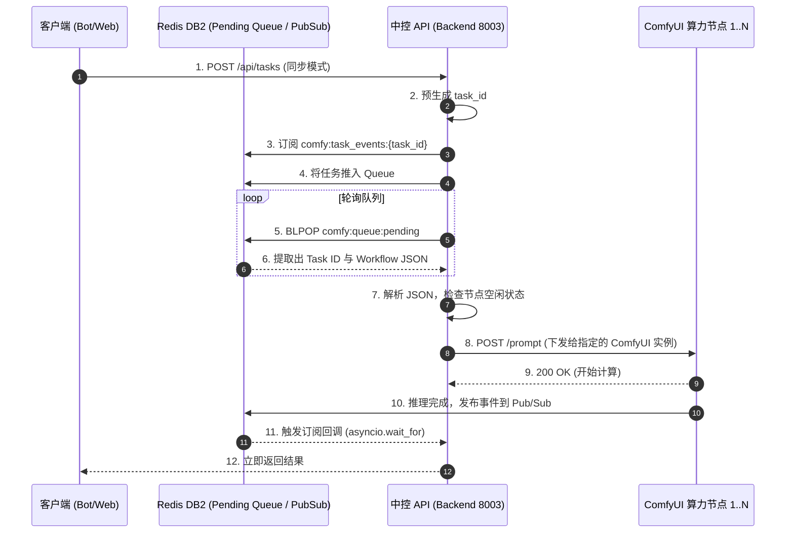

# 子模块: 中控 API 与节点通信 (Central API & Worker Communication)

## 1. 目标与范围
本模块是系统底层的“任务分发器 (Dispatcher)”。作为独立部署在 `/backend` 目录下的微服务（8003端口），它在前端（Tg Bot / Web API）与后端（多开隔离的 ComfyUI Workers）之间建立起解耦的缓冲层。
中控 API 负责轮询 Redis `DB 2` 中的排队任务，解析并验证 JSON 工作流，随后将具体的计算指令派发给空闲的 Worker 节点；同时，它也监听 Worker 的心跳以维持系统的算力大盘监控，并支持在前端放弃任务时执行双向剔除（Delete Task）。对于同步等待任务，中控 API 全面采用 **Redis Pub/Sub** 机制替代传统的 while 轮询，实现零延迟的任务状态通知。

## 2. 架构图与流向



## 3. 核心代码片段

### 任务派发与动态路由 (backend/app/main.py)
*（模拟中控调度核心逻辑）*
[`main.py:L100-L130`](file:///home/hfy/APP/All_bot/backend/app/main.py#L100)
```python
async def poll_and_dispatch():
    """
    中控调度器后台任务：
    从 Redis 的 DB2 (comfy:queue:pending) 阻塞提取任务，
    通过轮询可用 Worker 的心跳池，将任务下发到最空闲的 ComfyUI 端口。
    """
    import json
    
    while True:
        # 1. 阻塞获取队列
        result = await redis_client.db2.blpop("comfy:queue:pending", timeout=5)
        if not result:
            continue
            
        task_data = json.loads(result[1])
        task_id = task_data['task_id']
        workflow = task_data['workflow']
        
        # 2. 选取空闲节点 (通过检查 comfy:agent:heartbeat)
        worker_url = await get_idle_worker()
        if not worker_url:
            # 无空闲节点，将任务推回队列首部
            await redis_client.db2.lpush("comfy:queue:pending", result[1])
            await asyncio.sleep(2)
            continue
            
        # 3. 派发给 ComfyUI
        # 注意：需将 task_data 中的 trace_id 提取出并注入 HTTP Headers 中 (X-Trace-ID)
        headers = {"X-Trace-ID": task_data.get("trace_id", "")}
        async with httpx.AsyncClient() as client:
            resp = await client.post(f"{worker_url}/prompt", json={"prompt": workflow}, headers=headers)
            if resp.status_code == 200:
                await redis_client.db2.set(f"comfy:task_node:{task_id}", worker_url)
```

## 4. 接口定义 (OpenAPI 3.0)

```yaml
openapi: 3.0.3
info:
  title: Central API
  version: 1.0.0
paths:
  /api/tasks/{task_id}:
    delete:
      summary: 双向剔除取消任务
      description: 当 Bot 侧触发僵尸任务清理时调用。不仅从 Redis 清理，还向关联的 Worker 发起中断指令。
      parameters:
        - in: path
          name: task_id
          required: true
          schema:
            type: string
      responses:
        '200':
          description: 任务已从底层节点成功终止
        '404':
          description: 未找到对应的运行节点
```

## 5. 单元与集成测试要求
- **核心用例**：
  1. `test_dispatch_to_idle_worker`：模拟一个空闲节点的心跳，向 DB2 推入一个测试任务，断言中控 API 在 5 秒内提取任务并正确通过 `POST /prompt` 下发给该节点。
  2. `test_requeue_on_busy`：模拟所有节点均离线或繁忙，断言中控 API 在尝试下发失败后，将任务以 `LPUSH` 的方式退回队列，且不丢失数据。
  3. `test_interrupt_zombie_task`：向中控 API 发送 `DELETE /api/tasks/{task_id}`，断言中控 API 能从 Redis 取出对应节点的 URL，并向其发出终止信号（中断生成，防止幽灵显存占用）。

## 6. 部署与回滚步骤
- **部署服务**：
  在项目根目录下的 `/backend` 文件夹中执行独立构建，该容器默认监听 8003 端口。
  `cd backend && docker-compose up -d --build api`
- **故障回滚**：
  如果中控分发逻辑存在 Bug 导致任务堆积：
  1. 重启 `api` 容器：`docker restart backend_api_1`。
  2. 队列任务存储在持久化的 Redis 中，因此中控 API 的重启或短暂离线**绝对不会**导致任务丢失，重启后将自动继续处理 `pending` 队列。

## 7. 监控告警规则 (SLI/SLO)
- **SLI**：Worker 节点的心跳存活率；队列任务的 Dispatch (下发) 延迟。
- **SLO**：任务下发延迟（非队列满时）< 2秒；至少保留 1 个存活 Worker 节点。
- **告警策略**：
  - **Warning**：如果 DB2 中的 `comfy:agent:heartbeat` 键全部过期消失，意味着底层算力阵列全军覆没（如断电或 ComfyUI 崩溃），中控将立刻向研发发出“算力池归零”的最高级告警，避免前端持续接单导致严重客诉。
