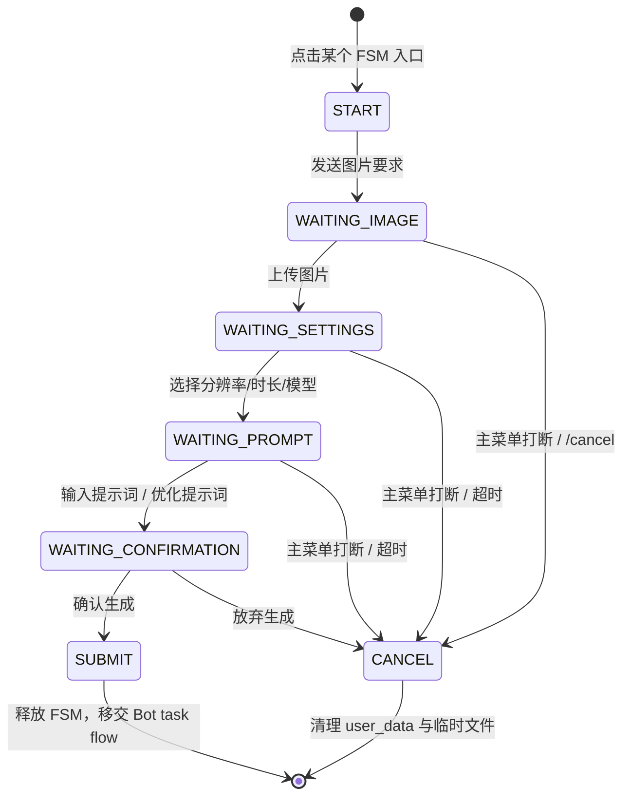

# 子模块: 交互状态机与回调路由 (FSM & Callback Handlers)

## 1. 目标与范围
本模块包含所有通过 Python-Telegram-Bot (PTB) 实现的有限状态机逻辑，以及基于装饰器注册的 callback 路由体系。

当前职责边界：
- FSM 负责分步收集图片、视频设置、提示词与确认信息。
- 全局菜单打断依赖统一黑盒路由，而不是散落的硬编码菜单判断。
- callback 路由负责把充值、广场、杂项等回调拆分到独立模块。
- 文件下载、临时目录创建与清理由服务层承接，不应在各 FSM 内重复实现。

## 2. 当前架构图

## 3. 当前主链路
### 3.1 FSM 到 Bot 任务流
当前主链为：
- FSM / message handler
- 分域 entrypoints
- `task_service_entrypoints_generation.py`
- `task_service_entrypoints_specialized.py`
- `task_service_entrypoints_video.py`
- `run_bot_task_application(...)`

Bot flow 当前采用五段式上下文：
- `request`
- `presentation`
- `billing`
- `failure`
- `cleanup`

取消态使用 `BotTaskCancelled`，不再使用字符串 sentinel。

### 3.2 全局菜单黑盒退出
FSM 入口与过程中，当前推荐组合为：
- `I18nFilter(...)`
- `menu_route_registry.py`
- `GLOBAL_REVERSE_MAP`
- `is_global_menu_command(...)`

在任意文字输入 handler 内，应优先判断 `is_global_menu_command(...)`，决定是否强制退出当前 FSM。
- 若多个 FSM 共享同一类取消/超时/意外输入退出逻辑，优先复用 `fsm_shared.py`，不要在各文件继续复制 `_t/cancel/timeout/unexpected_input` 样板。
- `menu_route_registry.py` 是反向菜单路由事实源：FSM-only menu keys、QQCC 特殊翻译覆盖、`menu.video_lora` 优先级和旧键盘文案 alias 都在这里分区维护；`prompt_router.build_global_menu_filter()` 只负责把这些 key 翻译成 `GLOBAL_REVERSE_MAP`。

### 3.3 主 Bot 与 QQCC 重复入口收口
主业务 Bot 底部菜单不再展示旧 `修仙市集` 和 `视频创作` 入口；旧 `修仙市集` 文案与新 `懒人bot` 菜单都只回复前往 QQCC 懒人 Bot 的 inline URL 按钮，跳转目标由 `QQCC_LAZY_BOT_URL` 或 `QQCC_LAZY_BOT_USERNAME` 提供。`图片换脸` 二级菜单只保留双图 `快速换脸` 与单图 `随机换脸`。

旧 `快速脱衣`、`快速自慰`、`menu.video_edit_*`、旧 `AI绘图` / `AI动图` / `快速换脸` 文本入口和主 Bot 上的 `qvid_*` callback 必须回复前往 QQCC 懒人 Bot 的 inline URL 按钮或入口未配置提示，不得进入任务提交。QQCC Bot 仍保留 `AI绘图` / `AI动图` 动态场景入口、`qdraw_scene:*`、`qvid_scene:*` 与旧 `qvid_mode:*` 已发按钮兼容。

主 Bot `src/bot_main.py` 与 QQCC Bot `qqcc_bot/main.py` 共享 `src/services/telegram_runtime_bootstrap.py`，统一 Local Bot API URL、HTTPXRequest、Telegram File/Poll patch 和语言/i18n middleware。共享 bootstrap 不改变注册边界：主 Bot 仍注册完整 FSM/支付/恢复，QQCC 仍只注册 quick image/video、QQCC market 和最小 callback，并继续用 `bot:qqcc` 过滤恢复任务。

Quick Video 的提交阶段已收口到 `src/services/quick_video_submission_service.py`：`quick_video_fsm.py` 只负责 Telegram 状态、设置面板、额度检查、用户回复和上下文清理；service 负责构造提交计划、QQCC 场景 engine 分支、尾帧绘图链成本与执行 payload。后续改 `AI动图` 提交语义时优先覆盖 service focused tests，再保留 FSM 黑盒回归。

Quick Image 的提交阶段已收口到 `src/services/quick_image_submission_service.py`：`quick_image_fsm.py` 只负责 Telegram 状态、图片接收、额度检查、用户回复和上下文清理；service 负责构造提交计划、随机换脸模板过滤、QQCC AI绘图场景/后处理链成本与执行 payload。旧 `WAIT_UNDRESS_METHOD` 选择态和旧脱衣方式 callback 已移除，`i2i_draw` 提交 payload 仅保留 service 兼容。

主 Bot 高级视频提交阶段已收口到 `src/services/advanced_video_submission_service.py`：`image_to_video_fsm.py`、`wan22_video_v2_fsm.py`、`ltx_video_fsm.py` 仍负责 Telegram 状态、素材接收、额度检查、用户回复和清理；service 负责旧图生视频/Wan22 v2/LTX 的提交计划、分辨率与时长归一、首尾帧 payload、LTX LoRA 多选与扩展链上下文。该 service 不新增 task type、workflow、RunPod profile 或 QQCC 能力；旧 setup confirm callback 仍只作为已发消息兼容。

主 Bot 高级视频设置面板已收口到 `src/services/advanced_video_settings_view_service.py`：旧图生视频、Wan22 v2 与 LTX 的同屏设置 view-model/keyboards、费用展示、LTX 扩展直接续写/添加终止帧提示都由 service 构造；FSM wrapper 只回写归一后的分辨率/时长、处理 callback 状态并发送或编辑 Telegram 消息。后续修改高级视频按钮布局或设置文案时，应优先覆盖 service focused tests，再保留 handler 黑盒回归。

LTX 扩展/拼接回调准备阶段已收口到 `src/services/ltx_video_extension_service.py`：`ltx_video_fsm.py` 的扩展入口只负责解析 callback task id、会话冲突、写入 seed 后展示设置面板；`ltx_video_callbacks.py` 的完成拼接 callback 只负责 Telegram 进度提示、调用 stitch、发送结果、记录 message meta 和置灰原按钮。历史归属校验、`_ltx_context` 合并、尾帧下载、扩展 FSM 初始数据和完整链路 histories 加载都由该 service 负责。

### 3.4 Callback 路由
当前 callback 体系依赖：
- `@register_callback("prefix")` 前缀注册
- 按前缀长度降序匹配
- 主入口导入子模块以触发注册
- 未命中时统一 `safe_answer_query(...)` 兜底

### 3.5 SCAIL-2 视频生视频 FSM
正式 Bot 与测试 Bot 的主菜单中，原“视频换脸”位置已进入“视频生视频”二级菜单。二级菜单顺序固定为：
- 视频换人
- 动作迁移
- 视频换脸
- 返回主菜单

`视频换人`、`动作迁移` 和 SCAIL-2 `视频换脸` 由
`src/handlers/fsm/scail2_video_fsm.py` 处理，状态流为：
- `WAIT_REFERENCE_IMAGE`：只接收参考图片
- `WAIT_MOTION_VIDEO`：接收 Telegram video 或 video document，驱动视频上限 40MB
- `WAIT_PROMPT`：接收正向提示词，或通过 inline button 跳过并使用 task type 默认提示词；空文本会提示用户点击跳过
- `WAIT_DURATION`：inline keyboard 只允许 `5秒 · 40灵石` 或 `8秒 · 80灵石`

该 FSM 不询问负面提示词，统一使用 `SCAIL2_DEFAULT_NEGATIVE_PROMPT`。提交时通过
`process_scail2_video_task(...)` 进入 Bot task flow，inputs 与 Web 保持一致：
`images=[reference_image_local_path, motion_video_local_path]`、`prompt`（可为空，服务层会补默认值）、`negative_prompt`、
`duration`、`resolution=512x896`。正常结束、取消、超时、非法文件、全局菜单打断或下载后发现超限时，
都必须清理临时文件和 `user_data["scail2_video_data"]`。旧 `face_video` FSM
业务逻辑暂不删除，但“视频换脸”菜单与 `/video_swap` 不再默认进入旧 720p/1024p 流程。

## 4. 关键实现约束
### 4.1 FSM 超时
当前主 FSM 普遍采用：
- `conversation_timeout=300`

若后续调整超时值，必须同步更新：
- FSM 文档
- 相关 focused tests
- 若有对应 skill 文档，也需同步更新

### 4.2 临时文件服务
常规 FSM 文件下载与清理应优先复用 `fsm_temp_file_service.py`，避免各 FSM 自己拼装。

### 4.3 语言切换
语言切换当前不只是菜单文案变更，还涉及：
- 数据库语言字段更新
- Redis 缓存同步
- translator 运行时状态刷新

## 5. 测试要求
- 覆盖 FSM 超时与主菜单打断
- 覆盖完整参数收集后进入对应 Bot entrypoint 或 `run_bot_task_application(...)`
- 覆盖 callback prefix 路由与统一兜底
- 覆盖 SCAIL-2 入口 task type 映射、40MB 视频拦截、5s/8s 时长按钮、默认负面词和临时文件清理；测试环境还需覆盖 `scail2_face_swap_v2`。
- 若 PTB 某些配置会触发已知 warning，测试需显式说明它是“预期行为”还是“应修复行为”
