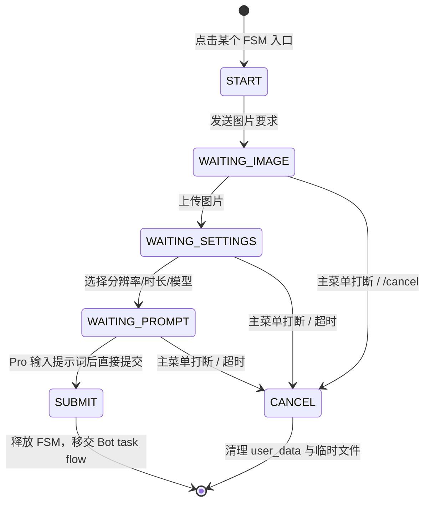

# 子模块: 交互状态机与回调路由 (FSM & Callback Handlers)

主菜单把原高级图生视频与 Pro 分成稳定配置键 `menu.ltx_video` 和
`menu.advanced_video_pro`。Dashboard 可分别排序和显隐两个按钮；Bot 每次发送新键盘时
从数据库加载最新配置，不依赖代码发布或环境变量切换展示。LTX handler 始终注册；H3
后端能力开启时另行注册只声明 `/advanced_video_pro` 和 Pro 文案的
`advanced_video_pro_fsm.py`，不抢占 `/ltx_video`、`fsm_start_ltx_video` 与旧 LTX
callback。隐藏入口不会改变 Web/API、任务执行面或 `/advanced_video_pro` 兼容命令。
H3 入口选择四个公开模式、时长、画质档位与比例；主模型和附加模型从 Dashboard
运行时配置按模式载入，不进入终端设置面板。图生视频模式选择后保持在设置态接收媒体，
用户无需点击“确认设置”；T2V 同态直接接收提示词。I2V/FLF2V 分别收集 1/2 张图片；
REF2V 进入统一参考模式，在同一 `WAIT_MEDIA` 状态自动识别 Telegram 图片、voice/audio/
音频 document、video/视频 document，可组合收集 1–4 张图片、一个音频和一个视频，
但音频不能作为唯一生成参考。收到每个媒体后都显示当前有效价格、各类型剩余名额和精简
提示词写法：图片使用 `<Picture N>`、视频使用 `<Video 1>`、音频使用 `<Audio 1>`。
参考视频最长 40 秒、最大 40 MB，上传后可在不超过原片长度的 3/5/10/15 秒开头片段中
选择；切换片段必须立即刷新价格。参考收集阶段只保留“完成参考内容，填写提示词”，不得
再发送“添加语音”“跳过语音”等分阶段按钮。提交计划由
`advanced_video_pro_submission_service.py` 校验并通过公共 Bot task facade 入队。
用户输入原始提示词后立即提交生成；新会话不再进入 `WAIT_CONFIRMATION`，不创建
Prompt Optimizer draft，也不发送“直接生成/优化后再生成”按钮。已提交的历史 H3
优化 draft 和已发出的 `avpopt_*` callback 仍按 owner fence、幂等扣费与 24 小时
续接契约完成，只作存量兼容；旧 `avp_prompt_*` 按钮进入失效提示，不得在缺少
会话上下文时重复扣费或静默改投其它任务类型。
I2V、FLF2V 与 REF2V 原生生成记录都设置 `allow_contribute=true`，可进入 Gallery
投稿；T2V 保持不可投稿。任何从 Gallery 模板生成的派生任务仍必须
`allow_contribute=false`，不能因为原模式可投稿而递归投稿。
该入口画质统一为极速/清晰/标准/高清四档。首帧与首尾帧模式隐藏固定比例按钮并
展示“跟随首帧”；第二张图片与首帧比例差异超过 1% 时保留首帧和会话状态、删除
无效尾帧并要求重传。文生视频仍展示固定画面比例。
高级图生视频pro 的设置摘要不得显示基础链、checkpoint、LoRA、作者模型名或附加模型
数量；只显示用户可选的时长、画质、比例和当前预计灵石消耗。时长与画质按钮也按
当前其它维度展示完整价格矩阵，默认费用必须来自 `get_minimax_h3_cost`，不得在 FSM
重复编码；REF2V 收到参考媒体后通过统一任务定价 matcher 读取后台覆盖价，并将已展示
价格作为该次提交的可信快照。面板明确提示直接发送图片、音频、视频或提示词。服务端把
Dashboard 独立“Pro 模型预设”子页已校验的主模型与附加模型精确强度交给
`advanced_video_pro_submission_service.py`。历史 `avp_settings_done` callback 只作已发消息
兼容，新键盘不得再次发送该按钮或 `avp_addon_*` 按钮。
Pro 会话中凡是继续等待用户选择模式、上传图片或输入提示词的提示，都同时说明可发送
`/cancel` 取消当前流程并切换功能；终态成功、余额不足和配置不可用提示不重复追加。

H3 I2V/FLF2V/REF2V 成功结果通过稳定 `h3_extend:<task_id>` 进入扩展态。FSM 先校验
History 归属和 v1/v2 上下文，再下载上一段末尾视频和尾帧到统一临时目录。新扩展
固定进入视频参考续写，不再展示或提交首尾帧续写；历史消息中的首尾帧 callback 会
明确提示能力已取消并切回视频参考续写。视频参考续写设置面板显式提供
`avp_settings_done` “发送提示词”按钮，进入提示词态后用户发送文本即提交生成。直接扩展
不允许追加图片、音频或视频；扩展态不携带 REF2V 原参考图，继承投稿权限，时长和画质
可调，模型预设在进入时重新读取 Dashboard 当前配置。取消、
超时、比例校验失败和提交异常都沿用统一临时文件清理。第二段起结果键盘展示
`h3_stitch:<task_id>`，拼接 callback 必须应答并将幂等闪回瓶结果发回用户。

## 1. 目标与范围

本模块包含所有通过 Python-Telegram-Bot (PTB) 实现的有限状态机逻辑，以及基于装饰器注册的 callback 路由体系。

当前职责边界：

- FSM 负责分步收集图片、视频设置与提示词；Pro 链路在提示词到达后直接提交。
- 全局菜单打断依赖统一黑盒路由，而不是散落的硬编码菜单判断。
- callback 路由负责把充值、广场、杂项等回调拆分到独立模块。
- 充值菜单同时提供 USDT-TON 身份套餐、USDT-TON 灵石直充、原生 TON、
  Telegram Stars 与人民币入口。USDT 两个按钮都进入主 Vue `/billing`，
  分别携带 `method=usdt-ton&kind=membership|credits`；旧原生 TON 深链保持
  `method=ton&kind=membership`，不得把两种链上资产混成同一按钮。
- Telegram 人民币充值命中支付宝直连白名单时，Bot 只发送 AllBot 公开结算
  短链接；手机和电脑在同一 Vue 路由内响应式展示，二维码与手机支付按钮复用
  同一笔 WAP 交易。callback 不直接向用户暴露支付宝签名 URL，也不按客户端
  类型创建两笔交易。
- 文件下载、临时目录创建与清理由服务层承接，不应在各 FSM 内重复实现。
- 主 Bot 返佣面板提供 USDT-TON 人工兑换申请：金额、主网钱包地址、确认三步，
  最低 5 USDT，300 秒超时并支持全局菜单打断；冻结统一进入
  `affiliate_usdt_redeem_service`，FSM 不直接写账本。

## 2. 当前架构

### 2.1 主 Bot 模块边界

| Module | Interface / 职责 | 稳定事实源 |
| --- | --- | --- |
| composition root | 环境、ApplicationBuilder、provider 初始化、polling | `src/bot_main.py` |
| handler registry | middleware → FSM → command/callback/payment/media fallback → error 的唯一注册顺序 | `src/handlers/main_bot_handler_registry.py` |
| Telegram bootstrap | Local API URL、HTTP request、payload patch、语言上下文 | `src/services/telegram_runtime_bootstrap.py` |
| update processor | 同 user 串行、跨 user 有界并发与 timing log | `src/services/telegram_update_processor.py` |
| lifecycle supervisor | 主 Bot 后台 task 的命名、强引用、完成移除及 shutdown cancel/await | `src/services/main_bot_task_supervisor.py` |
| message/callback adapter | 文本/媒体分发、前缀 callback registry、统一应答 | `src/handlers/message_handler*.py`、`callback_handler.py`、`callback_router.py` |
| FSM adapter | Telegram 状态、素材接收、回复和清理 | `src/handlers/fsm/` |
| application services | 设置/提交计划、扩展历史、权限快照、临时文件 | `src/services/*_submission_service.py`、`telegram_video_permission_service.py`、`fsm_temp_file_service.py` |

`src/bot_main.py` 不再维护长 handler 清单。新增或移动 FSM 时只修改 registry，并确保
所有 `ConversationHandler` 仍位于全局 `CallbackQueryHandler` 之前。主 Bot 自建的支付
poller、恢复、zombie sweep 与历史 prompt delivery 都必须交给 lifecycle supervisor；
shutdown 先 cancel/await 这些 task，再记录恢复策略并关闭 Redis。

### 2.2 通用会话状态图

## 3. 当前主链路

### 3.1 FSM 到 Bot 任务流

当前主链为：

- FSM / message handler
- 分域 entrypoints
- `task_service_entrypoints_generation.py`
- `task_service_entrypoints_specialized.py`
- `task_service_entrypoints_video.py`
- `run_bot_task_application(...)`

Bot flow 当前采用五段式上下文：

- `request`
- `presentation`
- `billing`
- `failure`
- `cleanup`

取消态使用 `BotTaskCancelled`，不再使用字符串 sentinel。

### 3.2 全局菜单黑盒退出

FSM 入口与过程中，当前推荐组合为：

- `I18nFilter(...)`
- `menu_route_registry.py`
- `GLOBAL_REVERSE_MAP`
- `is_global_menu_command(...)`

在任意文字输入 handler 内，应优先判断 `is_global_menu_command(...)`，决定是否强制退出当前 FSM。

- 若多个 FSM 共享同一类取消/超时/意外输入退出逻辑，优先复用 `fsm_shared.py`，不要在各文件继续复制 `_t/cancel/timeout/unexpected_input` 样板。
- `menu_route_registry.py` 是反向菜单路由事实源：FSM-only menu keys、QQCC 特殊翻译覆盖、`menu.video_lora` 优先级和旧键盘文案 alias 都在这里分区维护；`prompt_router.build_global_menu_filter()` 只负责把这些 key 翻译成 `GLOBAL_REVERSE_MAP`。

### 3.3 主 Bot 与 QQCC 重复入口收口

主 Bot 的 Reply Keyboard 支持运行时展示配置。事实源为 `src/services/main_bot_menu_config_service.py` 与 `runtime_checkpoints` 中的 `main_bot_menu_config:v1`；Dashboard 通过认证接口 `/api/main-bot/menu-config` 管理主菜单排序、每行 1–4 个按钮，以及主菜单和“图片换脸”“视频生视频”二级菜单的显隐。原高级图生视频与 Pro 是两个独立项目；新增 Pro 项对旧 checkpoint 采用默认隐藏，避免升级后自行开放。配置不引入数据库迁移；读取失败时必须回退完整默认菜单，避免故障期间误隐藏入口。

`/start`、`/cancel`、返回主菜单、语言切换、未知输入兜底、空闲图片提示和两个二级菜单入口都在发送新键盘前加载最新配置。Telegram 已经发出的旧键盘不会主动撤回；隐藏只影响后续 Reply Keyboard 展示，不停用 route、FSM、旧按钮或手工文本入口。二级菜单的“返回主菜单”固定可见，`QQCC_LAZY_BOT_ENABLED` 等既有安全/能力闸门仍优先，展示配置只能进一步隐藏。

主业务 Bot 底部菜单不再展示旧 `修仙市集` 和 `视频创作` 入口；旧 `修仙市集` 文案与新 `懒人bot` 菜单都只回复前往 QQCC 懒人 Bot 的 inline URL 按钮，跳转目标由 `QQCC_LAZY_BOT_URL` 或 `QQCC_LAZY_BOT_USERNAME` 提供。`图片换脸` 二级菜单只保留双图 `快速换脸` 与单图 `随机换脸`。

旧 `快速脱衣`、`快速自慰`、`menu.video_edit_*`、旧 `AI绘图` / `AI滤镜` / `AI动图` / `快速换脸` 文本入口和主 Bot 上的 `qvid_*` callback 必须回复前往 QQCC 懒人 Bot 的 inline URL 按钮或入口未配置提示，不得进入任务提交。QQCC Bot 仍保留 `AI绘图` / `AI滤镜` / `AI动图` 动态场景入口、`qdraw_scene:*`、`qfilter_scene:*`、`qvid_scene:*` 与旧 `qvid_mode:*` 已发按钮兼容。

主 Bot `src/bot_main.py` 与 QQCC Bot `qqcc_bot/main.py` 共享 `src/services/telegram_runtime_bootstrap.py`，统一 Local Bot API URL、HTTPXRequest、Telegram File/Poll patch 和语言/i18n middleware。共享 bootstrap 不改变注册边界：主 Bot仍注册完整 FSM/支付/恢复；QQCC 注册 quick image/video、QQCC market、最小 callback，以及结果消息已经公开的 Wan22 扩展/重生成 ConversationHandler 入口，并继续用 `bot:qqcc` 过滤恢复任务。`wan22v2_extend:*` 不能只出现在结果键盘中，官方/私有 QQCC Application 都必须在全局 callback fallback 之前注册该 FSM，否则按钮会被记为 unmatched callback。

主 Bot 的注册事实源是 `src/handlers/main_bot_handler_registry.py`，而不是
`bot_main.py` 内的 import/add_handler 副作用。高级视频 primary/compatibility handler
由 composition root 根据运行策略构造后显式传入 registry，既不扩大 QQCC handler 集，
也不改变既有优先级。

QQCC 不注册主 Bot H3 高级 FSM，但共享 quick video handler 接管 `h3_extend:<task_id>`：
只列出当前配置中有效的 H3 `mode=i2v` AI 视频场景，选择 callback 使用有长度门禁的
`h3xs:<index>`，选择时再次读取配置，场景被删除/停用则 fail closed。官方与私有
Application factory 共用该注册，提交仍分别写精确 client type。

主 Bot 和 QQCC Bot 都注册 PTB `ConversationHandler`，入口构建不得开启无键全局并发 `concurrent_updates(True)`。主 Bot 使用 `src/services/telegram_update_processor.py` 的 `PerUserUpdateProcessor`：以 `effective_user.id` 为串行键，同一用户的 Update 严格按顺序执行，不同用户最多并发处理 `MAIN_BOT_MAX_CONCURRENT_UPDATES` 个（默认 32，上限 256）；无用户 Update 回退到 chat 键，无 user/chat 的系统 Update 共用保守串行键。处理器为每个 Update 记录 `telegram_update_timing`，包含 `queue_wait_ms` 与 `handler_duration_ms`，用于日志侧计算排队和执行耗时分位数。主 Bot long polling 的 `poll_interval` 为 0，避免原先额外 0～2 秒轮询抖动。QQCC 官方 Bot 当前仍保持单通道；`paid_group_guard_bot` 不注册生成 FSM，仍允许保持全局并发处理群审核与消息删除。

主 Bot 全局 callback router 在用户数据库/缓存同步前先调用 `safe_answer_query(...)`，避免同步和路由 I/O 延长客户端转圈；路由模块和高频 FSM callback 的应答也必须使用该 helper，使过期 callback 只记录告警而不终止业务动作。

#### QQCC 私有 Bot 申请 FSM

`qqcc_bot/private_bot_fsm.py` 的 `私有bot` 入口只注册在官方 QQCC。首次点击说明 `@BotFather` + `/newbot` 申请步骤；文本状态收到 token 后必须先尽力删除原 Telegram 消息，禁止在回复、日志、异常或审计 metadata 中回显。验证有效后无需审核直接注册 webhook；同一 owner 已有绑定时只返回管理入口。全局菜单打断、`/cancel` 和 300 秒超时都结束 token 接收状态。

私有 QQCC Application 由 webhook worker 装配，不注册申请入口、不启动 polling，并继续复用 quick image/video 与 Wan22 结果续段 FSM。worker 为每个 private Bot 使用独立顺序队列，防止同一 Bot 的 ConversationHandler update 交错；不同 Bot 才通过全局并发门限并行。详细凭据/worker/Host 契约见 `docs/子模块_QQCC用户私有Bot平台_qqcc_private_bot_platform.md`。

Quick Video 入口的场景版本投影、旧 route 到场景映射、能力拒绝和 FSM seed 已收口到 `src/services/quick_video_entry_service.py`；`src/handlers/fsm/quick_video_entry_view.py` 负责示范媒体、REF2V 模板、费用/文案和跳转绘图按钮的 Telegram 展示，I/O 依赖由 `quick_video_fsm.py` 显式传入。提交与设置归一仍以 `src/services/quick_video_submission_service.py` 为事实源：FSM 负责状态、素材、额度检查和上下文清理，submission service 负责 QQCC scene engine、尾帧绘图链成本、执行 payload，以及 `set_res_*` / `set_dur_*` callback 的分辨率/时长归一。主 Bot 档位校验通过 `src/services/telegram_video_permission_service.py` 将 Telegram 用户映射为不可变的内部权限快照；设置 callback 与提交重新读取当前策略，开始提交时只查询一次。提交旧图生视频时，plan 会把 `resolution` / `duration` 显式传给 `process_video_task_template(...)`，不再通过 `context.user_data["custom_video_resolution"]` / `custom_video_duration` / `mode` 作为桥接状态。后续改入口规则先覆盖 entry service，改展示先覆盖 entry view/FSM 黑盒，改提交或设置语义先覆盖 submission service。

Quick Image 的提交阶段已收口到 `src/services/quick_image_submission_service.py`：`quick_image_fsm.py` 和 `random_faceswap_again` callback 只负责 Telegram 状态/按钮、图片路径读取、额度检查、用户回复和上下文清理；service 负责构造提交计划、随机换脸模板过滤、QQCC AI绘图/AI滤镜场景、`draw -> draw...` / `draw -> filter` / 单步 `filter` 链成本与执行 payload，并在重生成 metadata 中写入 `scene_kind=draw|filter`。旧 `WAIT_UNDRESS_METHOD` 选择态和旧脱衣方式 callback 已移除，`i2i_draw` 提交 payload 仅保留 service 兼容。

主 Bot 高级视频提交阶段已收口到 `src/services/advanced_video_submission_service.py`：`image_to_video_fsm.py`、`wan22_video_v2_fsm.py`、`ltx_video_fsm.py` 仍负责 Telegram 状态、素材接收、额度检查、用户回复和清理；service 负责旧图生视频/Wan22 v2/LTX 的提交计划、分辨率与时长归一、首尾帧 payload、LTX LoRA 多选与扩展链上下文。LTX 提交时，`resolution`、`duration` 和 `ltx_mode` 由 plan 显式传给 `process_ltx_video_task(...)`；主 Bot 与 QQCC 市集 apply 都不得再通过 `context.user_data` 顶层 `ltx_video_*` 键桥接后台任务参数。该 service 不新增 task type、workflow、RunPod profile 或 QQCC 能力；旧 setup confirm callback 仍只作为已发消息兼容。

主 Bot 高级视频设置面板已收口到 `src/services/advanced_video_settings_view_service.py`：旧图生视频、Wan22 v2 与 LTX 的同屏设置 view-model/keyboards、费用展示、LTX 扩展直接续写/添加终止帧提示，以及对应 settings callback data 到 `fsm_data` 的解析回写都由 service 承接；FSM wrapper 只处理 callback 状态并发送或编辑 Telegram 消息。后续修改高级视频按钮布局、设置文案或设置 callback 语义时，应优先覆盖 service focused tests，再保留 handler 黑盒回归。

LTX Bot 侧当前只保留单首帧与首尾帧：`ltx_video_fsm.py` 不再注册 `ltx_mode_v2v_audio` callback、`WAIT_VIDEO` 状态或视频上传 handler。底层 `ltx_video_v2v_audio` 仍作为历史/队列兼容执行面由 service/core/worker 负责 reject 或执行兼容，不能从 Bot FSM 重新暴露。

LTX 扩展/拼接回调准备阶段已收口到 `src/services/ltx_video_extension_service.py`：`ltx_video_fsm.py` 的扩展入口只负责解析 callback task id、会话冲突、写入 seed 后展示设置面板；`ltx_video_callbacks.py` 的完成拼接 callback 只负责 Telegram 进度提示、调用 stitch、发送结果、记录 message meta 和置灰原按钮。历史归属校验、`_ltx_context` 合并、尾帧下载、扩展 FSM 初始数据和完整链路 histories 加载都由该 service 负责。

Wan22 AIO 链路扩展/重生成/拼接回调准备阶段已收口到 `src/services/wan22_video_v2_extension_service.py`，覆盖旧图生视频 `custom_video` / `video_lora` 与图生视频 v2：`wan22_video_v2_fsm.py` 的扩展/重生成入口只负责解析 callback task id、会话冲突、写入 seed 后继续 FSM；`wan22_video_v2_callbacks.py` 的重生成 callback 只负责发送提交中提示并调用提交 service，完成拼接 callback 只负责进度提示、调用 stitch、发送结果、记录 message meta 和置灰原按钮。历史归属校验、`_wan22_context` 合并、上一段尾帧下载、当前段输入图复用、FSM seed 和完整链路 histories 加载都由该 service 负责。

### 3.4 Callback 路由

当前 callback 体系依赖：

- `@register_callback("prefix")` 前缀注册
- 按前缀长度降序匹配
- 主入口导入子模块以触发注册
- 主 Bot / QQCC Bot 在 callback handler import 阶段调用 `validate_callback_routes(...)` 校验关键 prefix manifest，防止拆模块后漏导入
- 未命中时统一 `safe_answer_query(...)` 兜底

### 3.5 SCAIL-2 视频生视频 FSM

正式 Bot 与测试 Bot 的主菜单中，原“视频换脸”位置已进入“视频生视频”二级菜单。二级菜单顺序固定为：

- 视频换人
- 动作迁移
- 视频换脸
- 返回主菜单

`视频换人`、`动作迁移` 和 SCAIL-2 `视频换脸` 由
`src/handlers/fsm/scail2_video_fsm.py` 处理，状态流为：

- `WAIT_REFERENCE_IMAGE`：只接收参考图片
- `WAIT_MOTION_VIDEO`：接收 Telegram video 或 video document，驱动视频上限 40MB
- `WAIT_PROMPT`：接收正向提示词，或通过 inline button 跳过并使用 task type 默认提示词；空文本会提示用户点击跳过
- `WAIT_DURATION`：inline keyboard 只允许 `5秒 · 40灵石` 或 `8秒 · 80灵石`

该 FSM 不询问负面提示词，统一使用 `SCAIL2_DEFAULT_NEGATIVE_PROMPT`。提交时通过
`process_scail2_video_task(...)` 进入 Bot task flow，inputs 与 Web 保持一致：
`images=[reference_image_local_path, motion_video_local_path]`、`prompt`（可为空，服务层会补默认值）、`negative_prompt`、
`duration`、`resolution=512x896`。正常结束、取消、超时、非法文件、全局菜单打断或下载后发现超限时，
都必须清理临时文件和 `user_data["scail2_video_data"]`。旧 `src/handlers/fsm/face_video_fsm.py` 已从 Bot 层删除，`FaceVideoState` 也不再保留；“视频换脸”菜单与 `/video_swap` 现在都由 SCAIL-2 视频生视频 FSM 接管。非 Bot 层的 `face_video` 历史任务类型、Gallery 历史展示与 worker/workflow 兼容仍按历史数据保留。

## 4. 关键实现约束

### 4.1 FSM 超时

当前主 FSM 普遍采用：

- `conversation_timeout=300`

高级视频这类以 inline callback 为最后操作的 FSM，其 `TIMEOUT` handler 必须匹配
完整 `Update`，确保超时发生在 callback 后也会清理 `in_conversation` 和临时状态；
不能只注册 `MessageHandler(filters.ALL, ...)`。

若后续调整超时值，必须同步更新：

- FSM 文档
- 相关 focused tests
- 若有对应 skill 文档，也需同步更新

### 4.2 临时文件服务

常规 FSM 文件下载与清理应优先复用 `fsm_temp_file_service.py`，避免各 FSM 自己拼装。
`cleanup_fsm_user_data(user_data)` 是全局兜底清理入口：它会收集所有 `*_data` 中的 `image_path`、`end_image_path`、`video_path`、`images` 等临时路径，也会收集随机换脸“再来一张”使用的顶层 `last_face_image` 临时缓存；只删除 `TMP_DIR` 下文件，并清理 `in_conversation`、`*_data` 与这些顶层临时缓存，保留 `language_code` 等偏好。主 Bot `/cancel`、QQCC `/cancel` 与 `global_error_handler` 都应走该 helper；单个 FSM 的正常提交/超时仍可保留自己的局部 cleanup，但路径规则需与该 helper 一致。

### 4.3 语言切换

语言切换当前不只是菜单文案变更，还涉及：

- 数据库语言字段更新
- Redis 缓存同步
- translator 运行时状态刷新

### 4.4 当前边界债务

- Quick Video 的入口规划和展示已纵切；`quick_video_fsm.py` 剩余热点是生成启动、
  REF2V 替换和素材接收。`advanced_video_pro_fsm.py`、`wan22_video_v2_fsm.py`、
  `ltx_video_fsm.py` 仍需按 media acquisition、设置 view、submission ownership
  逐个纵切，禁止一次性改写全部 FSM。
- H3 与 LTX25 的 `ffprobe` 已通过 `asyncio.to_thread` 避免阻塞 update loop，但命令和
  JSON 解析仍在 FSM 内重复；后续可迁入共享 media probe service。
- Gallery browse callback 仍直接打开数据库 session。该债务属于 Gallery application
  service/repository seam，修改时叠加 `allbot-gallery-storage`，不要在 Telegram 重构中
  顺手跨域移动事务。

## 5. 测试要求

- 覆盖 FSM 超时与主菜单打断
- 覆盖完整参数收集后进入对应 Bot entrypoint 或 `run_bot_task_application(...)`
- 覆盖 callback prefix 路由与统一兜底
- 覆盖主 Bot registry 中 middleware/FSM/fallback 顺序，以及后台 task 正常完成移除和
  shutdown cancel/await
- 覆盖主 Bot 同用户 Update 不重叠、不同用户可并发、全局并发上限、等待任务取消释放，以及 callback 在用户同步前安全应答
- 覆盖 Telegram user id 到视频权限快照的显式 dependencies seam；handler 测试不得
  隐式连接真实 PostgreSQL
- 覆盖 SCAIL-2 入口 task type 映射、40MB 视频拦截、5s/8s 时长按钮、默认负面词和临时文件清理；测试环境还需覆盖 `scail2_face_swap_v2`。
- 若 PTB 某些配置会触发已知 warning，测试需显式说明它是“预期行为”还是“应修复行为”
