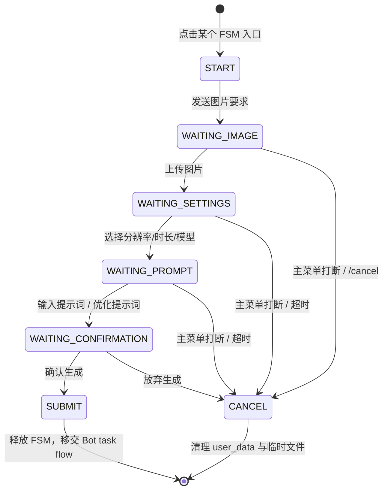

# 子模块: 交互状态机与回调路由 (FSM & Callback Handlers)

## 1. 目标与范围
本模块包含所有通过 Python-Telegram-Bot (PTB) 实现的有限状态机逻辑，以及基于装饰器注册的 callback 路由体系。

当前职责边界：
- FSM 负责分步收集图片、视频设置、提示词与确认信息。
- 全局菜单打断依赖统一黑盒路由，而不是散落的硬编码菜单判断。
- callback 路由负责把充值、广场、杂项等回调拆分到独立模块。
- 文件下载、临时目录创建与清理由服务层承接，不应在各 FSM 内重复实现。

## 2. 当前架构图

## 3. 当前主链路
### 3.1 FSM 到 Bot 任务流
当前主链为：
- FSM / message handler
- 分域 entrypoints
- `task_service_entrypoints_generation.py`
- `task_service_entrypoints_specialized.py`
- `task_service_entrypoints_video.py`
- `run_bot_task_application(...)`

Bot flow 当前采用五段式上下文：
- `request`
- `presentation`
- `billing`
- `failure`
- `cleanup`

取消态使用 `BotTaskCancelled`，不再使用字符串 sentinel。

### 3.2 全局菜单黑盒退出
FSM 入口与过程中，当前推荐组合为：
- `I18nFilter(...)`
- `GLOBAL_REVERSE_MAP`
- `is_global_menu_command(...)`

在任意文字输入 handler 内，应优先判断 `is_global_menu_command(...)`，决定是否强制退出当前 FSM。
- 若多个 FSM 共享同一类取消/超时/意外输入退出逻辑，优先复用 `fsm_shared.py`，不要在各文件继续复制 `_t/cancel/timeout/unexpected_input` 样板。

### 3.3 Callback 路由
当前 callback 体系依赖：
- `@register_callback("prefix")` 前缀注册
- 按前缀长度降序匹配
- 主入口导入子模块以触发注册
- 未命中时统一 `safe_answer_query(...)` 兜底

## 4. 关键实现约束
### 4.1 FSM 超时
当前主 FSM 普遍采用：
- `conversation_timeout=300`

若后续调整超时值，必须同步更新：
- FSM 文档
- 相关 focused tests
- 若有对应 skill 文档，也需同步更新

### 4.2 临时文件服务
常规 FSM 文件下载与清理应优先复用 `fsm_temp_file_service.py`，避免各 FSM 自己拼装。

### 4.3 语言切换
语言切换当前不只是菜单文案变更，还涉及：
- 数据库语言字段更新
- Redis 缓存同步
- translator 运行时状态刷新

## 5. 测试要求
- 覆盖 FSM 超时与主菜单打断
- 覆盖完整参数收集后进入对应 Bot entrypoint 或 `run_bot_task_application(...)`
- 覆盖 callback prefix 路由与统一兜底
- 若 PTB 某些配置会触发已知 warning，测试需显式说明它是“预期行为”还是“应修复行为”
