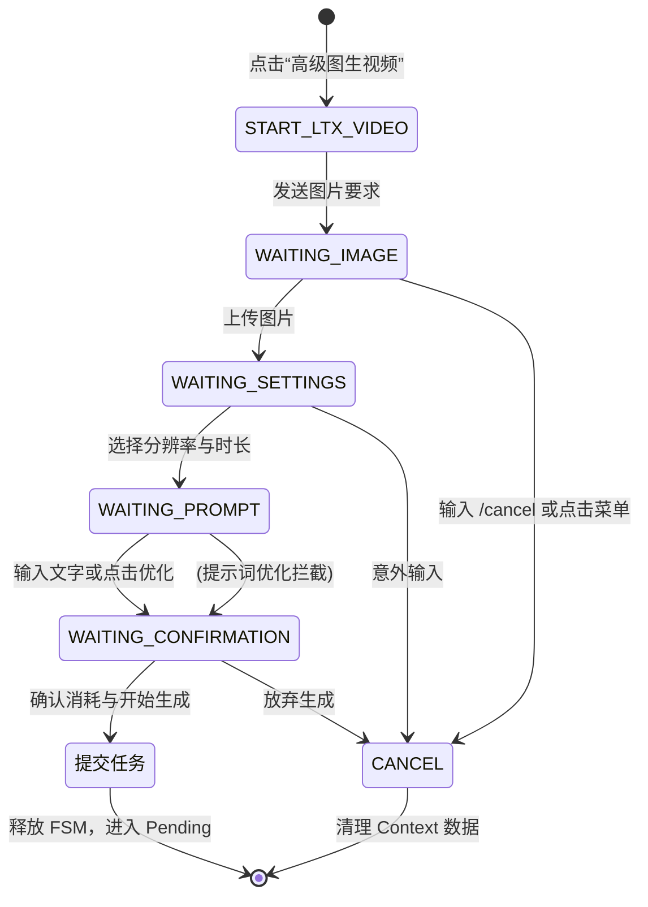

# 子模块: 交互状态机与回调路由 (FSM & Callback Handlers)

## 1. 目标与范围
本模块包含所有通过 Python-Telegram-Bot (PTB) 实现的有限状态机逻辑（如高级图生视频、自由P图、视频换脸、各类一键懒人动图/P图等）以及**基于装饰器的回调路由体系 (`callback_router.py`)**。
FSM 负责在 Telegram 客户端收集用户的图像、分辨率、时长等分步参数，期间处理菜单按钮的意外中断拦截（防死锁）；回调路由负责拆分庞大的 Callback 处理逻辑（拆分为 `billing`, `gallery`, `misc` 等子模块），实现单一职责原则（SRP）。

## 2. 架构图与调用链



## 3. 核心代码片段

### 菜单拦截与上下文清理 (src/handlers/fsm/ltx_video_fsm.py)
[`ltx_video_fsm.py:L292-L315`](file:///home/hfy/APP/All_bot/src/handlers/fsm/ltx_video_fsm.py#L292)
```python
async def unexpected_input(update: Update, context: ContextTypes.DEFAULT_TYPE) -> int:
    """
    当处于等待输入状态时，如果用户点击了主菜单或其他无关按钮，
    必须通过正则捕获并自动退出当前 FSM，释放用户操作锁。
    """
    _cleanup_context(context, update.effective_user.id)
    await update.message.reply_text("已取消当前操作。请继续使用菜单。")
    return ConversationHandler.END

def get_ltx_video_fsm_handler() -> ConversationHandler:
    return ConversationHandler(
        entry_points=[CallbackQueryHandler(start_ltx_video, pattern='^ltx_video$')],
        states={
            # ... 其它状态
            WAITING_PROMPT: [
                MessageHandler(filters.Regex('^(取消|退出)$'), cancel_conversation),
                MessageHandler(filters.TEXT & ~filters.COMMAND, receive_prompt),
                CallbackQueryHandler(optimize_prompt_handler, pattern='^optimize_prompt$')
            ],
        },
        fallbacks=[
            CommandHandler('cancel', cancel_conversation),
            MessageHandler(filters.Regex('^(🏠 主菜单|💎 充值|...)$'), unexpected_input)
        ],
        conversation_timeout=600 # 10分钟超时
    )
```

## 4. 接口定义与回调路由机制 (Routing & OpenAPI)

*注：本模块完全基于 Telegram 长连接，属于内部的异步回调路由体系，不暴露 HTTP API。其触发条件如下：*

### 4.1 装饰器回调路由 (`src/handlers/callback_router.py`)
采用 `@register_callback("prefix")` 动态注册各个业务线的回调逻辑，核心模块被划分为：
- `billing_callbacks.py`: 充值与签到相关回调。
- `gallery_callbacks.py`: 广场作品的点赞、应用与公开分享。
- `misc_callbacks.py`: 通用帮助与菜单回调。

### 4.2 状态机触发条件 (FSM)
```yaml
telegram_webhook:
  - Event: CallbackQuery
    Pattern: "^ltx_video$"
    Action: 触发 START_LTX_VIDEO 状态，提示用户上传基础图像
  - Event: Message (Photo)
    State: WAITING_IMAGE
    Action: 验证分辨率，存入 context.user_data['ltx_image_path']，进入 WAITING_SETTINGS
```

## 5. 单元与集成测试要求
- **覆盖率基准**：交互状态机的各分支与容错覆盖率要求 **≥80%**。
- **核心用例**：
  1. `test_fsm_timeout_cleanup`：启动 FSM 后等待超过 `conversation_timeout`，断言 `timeout_conversation` 触发且清理掉 `user_data` 中的临时文件与状态。
  2. `test_fsm_unexpected_menu_click`：在 `WAITING_PROMPT` 状态下模拟收到包含主菜单表情符号的文本消息，断言 `unexpected_input` 触发，返回 `ConversationHandler.END` 并终止。
  3. `test_fsm_normal_flow_submission`：模拟用户连贯完成图片、设置、提示词和确认四个步骤，断言最终调用了 `TaskService.process_ltx_video_task()` 且参数齐全。

## 6. 部署与回滚步骤
- **部署**：
  该模块随着主 Bot 容器一并启动（`tg-bot`）。重启容器即可使新的 FSM 状态机逻辑生效。
- **回滚**：
  如果有死循环或捕获异常，回退代码。由于 `user_data` 通常在内存中（若未配置持久化），重启 Bot 容器将强行重置所有用户正在进行的 FSM 对话状态。

## 7. 监控告警规则 (SLI/SLO)
- **SLI**：FSM 异常抛出率与用户未完成率（Dropout Rate）。
- **SLO**：每 100 次 FSM 发起中，未完成率应控制在 30% 以下，避免过多的 600s 超时堆积内存。
- **告警策略**：
  - **Warning**：如果在某个状态节点捕获到大量 `KeyError` 或 `TypeError`，意味着上下文 `user_data` 的键值校验存在缺陷，需记录 Log 并输出到 Sentry/ELK。
