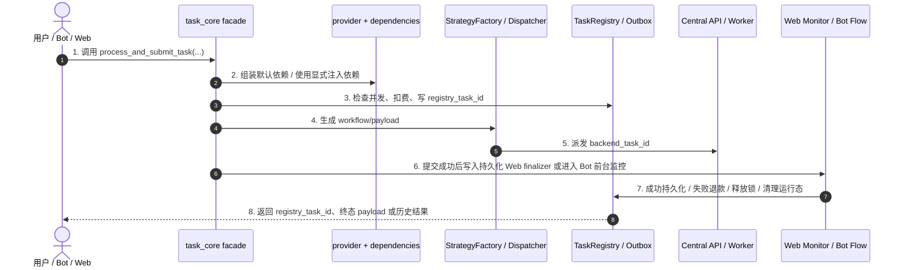

# 子模块: 任务调度 (Task Scheduler)

## 1. 目标与范围
本模块负责统一提交、排队、监控、取消与清理图片/视频生成任务。当前架构下，任务调度不是单一 `task_core.py` 单体，而是由以下几层组成：

- `src/core/task_core.py`：公开 facade，暴露稳定入口，如 `process_and_submit_task(...)`、`persist_successful_task_result(...)`
- `src/core/task_lifecycle_contract.py`：共享任务生命周期 contract，统一 side-effect plan 归一化与 backend 终态判断
- `src/core/task_core_service_providers.py`：provider/capability 边界，屏蔽 `image_service`、`TaskRegistry`、submission outbox 等基础设施实现
- `src/core/task_core_default_dependencies.py`：默认依赖装配层，把 facade 所需运行时能力拼装为 `TaskCore*Dependencies`
- `src/core/task_core_submission.py`：提交 Saga、注册表写入、派发与补偿
- `src/services/task_lifecycle_runner.py`：共享 lifecycle runner / terminal router，负责 monitor->route 骨架与 success/cancelled/failure 分流
- `src/services/task_web_monitor.py`：Web 端 side-effect finalizer 的 application/service 实现，负责成功持久化、取消/失败终态、运行态清理
- `src/services/task_web_finalizer.py`：持久化 Web finalizer 队列与恢复循环，负责在进程重启后继续收口未完成的 Web 终态
- `src/core/task_core_runtime.py`：双 ID 终止、best-effort cancel、并发锁与 registry 清理
- `src/core/task_dispatcher.py`：StrategyFactory + payload/workflow 注入

所有 Bot / Web 任务都应通过 facade + provider/dependencies 边界进入调度链，不应在上层直接 import 基础设施实现。

## 2. 启动与装配
### 2.1 Provider 注册
`task_core` 相关 provider 必须在应用入口注册，而不是在 core 模块导入时自动完成。当前注册路径为：

- `src/task_core_provider_setup.py`
- `src/web_api/main.py`
- `src/bot_test.py`

这意味着：

- 生产运行时应先完成 `configure_task_core_service_providers(...)`
- 单元测试优先显式传 `dependencies` 或 `*_func` seam，不依赖全局 provider 自动可用

### 2.2 双 ID 语义
任务链路中同时存在两个 ID：

- `registry_task_id`：本地任务注册表 ID，贯穿 Web/Bot、历史、清理、恢复、SSE 与前台展示
- `backend_task_id`：真正派发到后端执行器/中控的运行态 ID

取消、恢复、僵尸清理和 side-effect monitor 都必须显式区分这两个 ID，不能混用。

## 3. 架构图与调用链

## 4. 公开入口与职责
### 4.1 任务提交门面
当前统一提交入口：

- `src/core/task_core.py::process_and_submit_task(...)`

职责：

- 基于 `TaskCoreProcessDependencies` 获取策略、输入准备与计费能力
- 进行并发锁检查与扣费
- 执行提交 Saga，写入 `registry_task_id` 并派发 `backend_task_id`
- 提交成功后根据 `TaskSubmissionSideEffectPlan` 写入持久化 Web finalizer 或其他 side effect；默认 Web side effect 装配由 dependency 层负责，facade 不直接 import `task_web_monitor`
- 提交失败时执行补偿，并在未成功提交时释放并发锁

### 4.2 Web 监控门面
当前 Web 异步收尾入口：

- `src/services/task_web_monitor.py::monitor_task_and_release_lock_default(...)`
- `src/services/task_web_finalizer.py::run_pending_web_finalizer_loop(...)`

职责：

- 轮询 backend 终态并恢复上次进程未完成的 finalizer
- 成功时持久化历史、可选 R2 warmup、清理 registry/锁
- 取消时退款并终态清理
- 失败时退款并终态清理

补充约束：
- backend 执行面在发布 `done/error` 的 `comfy:task_events:{backend_task_id}` 终态事件时，应随事件携带 `task_type`，并尽量附带 `worker_id`、`created_at` 等最小详情，避免 Dashboard/stream 消费端与 Web monitor runtime cleanup 争抢 Redis 临时详情键而产生观测竞态。
- Bot 轮询展示、Web monitor 和 stream/result fallback 对 backend `done/error/cancelled` 的判定，应共享 `task_lifecycle_contract.py`，避免多处写死终态名单。

### 4.3 Bot 主链路
Bot 不再走字符串取消协议，也不再依赖厚重 compat wrapper。当前主链为：

- FSM / handler
- `src/services/task_service_entrypoints_generation.py`（当前仅保留 `i2i_pro` 这类仍有独立业务语义的入口）
- `src/services/task_service_entrypoints_specialized.py`
- `src/services/task_service_entrypoints_video.py`
- `src/services/task_service_flow.py::run_bot_task_application(...)`

其中 generation 入口已继续按任务族下沉：

- `src/services/task_service_generation_image.py`
- `src/services/task_service_generation_video.py`
- `src/services/task_service_generation_wan22.py`

Bot flow 已拆成五段式上下文：

- `request`
- `presentation`
- `billing`
- `failure`
- `cleanup`

取消态改为专用异常 `BotTaskCancelled`，不再依赖字符串 sentinel `"cancelled"`。
当前 Bot `task_service_flow.py` 与 Web `task_web_monitor.py` 已共享 `task_lifecycle_runner.py` 的 monitor->route 骨架；Web monitor 与 `task_web_finalizer.py` 进一步共享 backend terminal router，避免多处重复写 success/cancelled/failure 分流。

## 5. API 口径
当前 Web 任务入口以 `/api/tasks/generate` 为主，body 口径为：

- `task_type`
- `inputs`
- `prompt`
- `negative_prompt`
- `priority`
- `is_template`
- `source_post_id`

不应再使用旧文档中的 `/api/tasks/generation + params` 表述。

## 6. 运行态与恢复策略
### 6.1 Web
Web 端已形成两条路径：

- 运行态：`/api/tasks/{task_id}/stream`
- 历史兜底 / 结果恢复：`/api/tasks/{task_id}/result` 及 history fallback

SSE 侧当前已把运行态 not-found 收口为明确终止 / fallback 语义，不再稳定制造无效轮询。

### 6.2 僵尸任务与强制终止
当前僵尸任务清理与强制终止会联合处理：

- backend cancel best-effort
- registry 清理
- 并发锁释放
- 必要时退款 / pending refund 处理

当前清理阈值以服务实现为准，文档不再固化旧的“10 分钟”口径。

## 7. 测试要求
### 7.1 最小必测面
至少覆盖：

- facade 提交成功 / 失败 / 补偿
- provider/dependencies 显式注入契约
- Web monitor 成功 / 取消 / 失败
- 双 ID 清理
- Bot `run_bot_task_application(...)` 五段式上下文装配
- history / stream 的 not-found fallback

### 7.2 推荐测试文件
- `tests/core/test_task_core_dependencies.py`
- `tests/core/test_task_core_persistence.py`
- `tests/core/test_task_core_r2_warmup.py`
- `tests/core/test_task_runtime_cleanup.py`
- `tests/services/test_task_service_flow.py`
- `tests/services/test_task_service_completion.py`
- `tests/web_api/test_tasks_stream.py`
- `tests/web_api/test_task_runtime_api_service.py`
- `tests/backend/test_main_helpers.py`

## 8. 部署与回滚
### 8.1 部署
默认遵循“测试优先部署”：

- 测试环境：`safe_deploy_test.sh`
- 正式环境：仅在明确确认后执行 `safe_deploy.sh`

### 8.2 回滚
若本轮改动涉及 provider/dependencies 边界，回滚时除了代码版本，还应确认：

- 应用入口的 provider 注册逻辑是否与目标版本一致
- 相关 focused tests / 主干回归是否重新通过

## 9. 收口原则
- core 只消费 capability/provider，不直接 import 基础设施实现
- facade 保留稳定符号；真实逻辑优先下沉到 dependency builder / flow / runtime / monitor 模块
- 测试优先走显式依赖注入，不依赖旧的模块级 patch seam
- 文档中的入口函数、异常类型、超时值、双 ID 语义必须与代码一致
