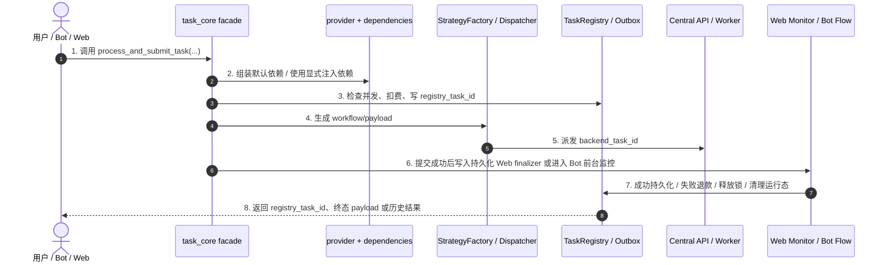

# 子模块: 任务调度 (Task Scheduler)

## 1. 目标与范围
本模块负责统一提交、排队、监控、取消与清理图片/视频生成任务。当前架构下，任务调度不是单一 `task_core.py` 单体，而是由以下几层组成：

- `src/core/task_core.py`：公开 facade，暴露稳定入口，如 `process_and_submit_task(...)`、`persist_successful_task_result(...)`
- `src/core/task_core_types.py`：任务 core 数据契约，包含 `TaskSuccessPersistenceCommand` 等成功持久化命令对象
- `src/core/task_lifecycle_contract.py`：共享任务生命周期 contract，统一 side-effect plan 归一化与 backend 终态判断
- `src/core/task_core_service_providers.py`：provider/capability 边界，屏蔽 `image_service`、`TaskRegistry`、submission outbox 等基础设施实现
- `src/core/task_core_default_dependencies.py`：纯 builder 层，负责把 capability/provider 组合成 `TaskCore*Dependencies`
- `src/task_core_process_defaults.py`：runtime-specific process 默认装配，负责把 billing / strategy / Web side effects 接到 process dependencies
- `src/task_core_persistence_defaults.py`：runtime-specific persistence 默认装配，负责把 `src.logger.UserLogger` 等基础设施注入到 core persistence dependencies
- `src/core/user_logger_protocol.py`：core 侧只依赖 UserLogger protocol，不直接 import `src.logger`
- `src/core/task_core_submission.py`：提交 Saga、注册表写入、派发与补偿
- `src/services/task_lifecycle_runner.py`：共享 lifecycle runner / terminal router，负责 monitor->route 骨架与 success/cancelled/failure 分流
- `src/services/task_web_side_effects.py`：Web 提交后的 side effect plan 归一化、pending finalizer 入队与 apply 互动记录
- `src/services/task_web_lifecycle_monitor.py`：Web runtime monitor stage，负责 backend 轮询、终态 snapshot 构造与 terminal router 对接
- `src/services/task_web_terminal_finalization.py`：Web terminal finalization，负责成功持久化、取消/失败收尾与 runtime cleanup
- `src/services/task_web_finalizer.py`：持久化 Web finalizer 队列与恢复循环，负责在进程重启后继续收口未完成的 Web 终态
- `src/core/task_core_runtime.py`：双 ID 终止、best-effort cancel、并发锁与 registry 清理
- `src/core/task_dispatcher.py`：StrategyFactory + payload/workflow 注入

所有 Bot / Web 任务都应通过 facade + provider/dependencies 边界进入调度链，不应在上层直接 import 基础设施实现。

## 2. 启动与装配
### 2.1 Provider 注册
`task_core` 相关 provider 必须在应用入口注册，而不是在 core 模块导入时自动完成。当前注册路径为：

- `src/task_core_provider_setup.py`
- `src/web_api/main.py`
- `src/bot_main.py`
- `src/bot_test.py` 兼容 shim

这意味着：

- 生产运行时应先完成 `configure_task_core_service_providers(...)`
- 单元测试优先显式传 `dependencies` 或 `*_func` seam，不依赖全局 provider 自动可用
- `src/core` 不能直接 import Web/Bot 请求对象或 `src.logger.UserLogger` 等基础设施实现；需要日志或持久化能力时，通过 protocol/dependency 从 runtime 默认装配注入。

### 2.2 双 ID 语义
任务链路中同时存在两个 ID：

- `registry_task_id`：本地任务注册表 ID，贯穿 Web/Bot、历史、清理、恢复、SSE 与前台展示
- `backend_task_id`：真正派发到后端执行器/中控的运行态 ID

取消、恢复、僵尸清理和 side-effect monitor 都必须显式区分这两个 ID，不能混用。

## 3. 架构图与调用链

执行面补充口径：
- Central API / QueueManager 仍是唯一队列事实源。worker 真实接单只能通过 `/api/agent/task/pop`，该接口会把任务从 pending 转 running 并写 task heartbeat。
- V2 worker 可用 `/api/agent/task/pop?cancel_lock=true` 真实接单并立即写 `cancel_locked=1`、`execution_phase=preparing`；pending 仍可取消，locked running 任务应返回不可取消，不再写 `cancel_requested`。legacy 未锁 running 任务保留旧 request-cancel 兼容语义。
- `/api/agent/task/peek?types=...&limit=1` 只用于 worker 输入预取，只读扫描 pending 候选任务；不得移除 pending、不得写 running、不得更新任务状态或 heartbeat。取消、僵尸检测和终态收口不能依赖 peek。
- 新版 worker 在真实 `/api/agent/task/pop` 时会携带 `agent_id`，Central 可通过 agent control 键将单个 worker 标记为 `draining/disabled`，让它不再接新单但不影响其它 worker。该能力用于 GPU Pool Controller 切换任务类型、同步模型或单点 canary 前的安全 drain。
- 云正式本地 worker 可通过 `workers/local_relay` 访问云 Central，并用 relay 内的上传 sidecar 把本地 spool 结果上传 R2；但任务成功语义不变，必须 R2/S3 put 成功后才 `/complete`。
- 开启 `PIPELINE_ENABLED` 时，每个 worker 默认最多持有 2 个 Central running 任务：一个 ComfyUI active/queued，一个 finalizing。上一单 GPU 完成后进入后台 finalizer 上传并 complete，下一单可提前完成输入准备和 `queue_prompt`。Worker 必须按 `prompt_id` 路由 WS 事件，并对所有本地 running/finalizing task 发送 task heartbeat，防止 zombie 误杀。

## 4. 公开入口与职责
### 4.1 任务提交门面
当前统一提交入口：

- `src/core/task_core.py::process_and_submit_task(...)`

职责：

- 基于 `TaskCoreProcessDependencies` 获取策略、输入准备与计费能力
- `task_core.py` 仅保留 facade；具体步骤继续拆到 `task_core_process_flow.py` 的 `build_prepared_task_submission_request(...)`、`prepare_task_submission_context(...)`、`execute_task_submission_attempt(...)`、`release_submission_lock_if_needed(...)`
- 进行并发锁检查与扣费
- 执行提交 Saga，写入 `registry_task_id` 并派发 `backend_task_id`
- 提交成功后根据 `TaskSubmissionSideEffectPlan` 写入持久化 Web finalizer 或其他 side effect；默认 Web side effect 装配由 dependency 层负责，facade 不直接 import Web application 层实现
- 提交失败时执行补偿，并在未成功提交时释放并发锁

默认 process dependencies 已按 input、billing、submission、side-effect 四组 builder 拆分。新增装配能力时应优先落在对应 builder，保持 `build_default_task_core_process_dependencies(...)` 作为聚合入口，而不是重新把基础设施解析堆回 facade。

### 4.2 Web 监控门面
当前 Web 异步收尾入口：

- `src/services/task_web_lifecycle_monitor.py::monitor_task_and_release_lock_default(...)`
- `src/services/task_web_finalizer.py::run_pending_web_finalizer_loop(...)`

职责：

- `task_web_side_effects.py` 负责 side effect plan -> pending finalizer / apply interaction
- `task_web_lifecycle_monitor.py` 负责轮询 backend 终态并构造 terminal snapshot
- `task_web_terminal_finalization.py` 负责成功持久化、取消/失败退款与 runtime cleanup
- `task_web_finalizer.py` 负责恢复上次进程未完成的 pending finalizer

补充约束：
- Web API 可多 worker 运行，每个 worker 都可能启动 finalizer loop；`task_web_finalizer.py` 在获取 Redis lock 后必须重新读取单条 pending record，不能继续使用 `hgetall` 快照里的旧 record，避免 stale snapshot 重复收口。
- 成功历史落库必须对 `user_id + task_id + source` 做幂等保护；重复收口时只能更新/跳过已有 `History`，不能再次插入，也不能重复触发 Web history R2 warmup。
- backend 执行面在发布 `done/error` 的 `comfy:task_events:{backend_task_id}` 终态事件时，应随事件携带 `task_type`，并尽量附带 `worker_id`、`created_at` 等最小详情，避免 Dashboard/stream 消费端与 Web monitor runtime cleanup 争抢 Redis 临时详情键而产生观测竞态。
- Bot 轮询展示、Web monitor 和 stream/result fallback 对 backend `done/error/cancelled` 的判定，应共享 `task_lifecycle_contract.py`，避免多处写死终态名单。

成功历史持久化的对象入口为 `persist_successful_task_result_command(TaskSuccessPersistenceCommand(...))`；旧 `persist_successful_task_result(...)` 签名保留为兼容层。新增代码和测试优先构造 command 与 `TaskCorePersistenceDependencies`，不要扩大模块级 monkeypatch。

### 4.3 Bot 主链路
Bot 不再走字符串取消协议，也不再依赖厚重 compat wrapper。当前主链为：

- FSM / handler
- `src/services/task_service_entrypoints_generation.py`（当前仅保留 `i2i_pro` 这类仍有独立业务语义的入口）
- `src/services/task_service_entrypoints_specialized.py`
- `src/services/task_service_entrypoints_video.py`
- `src/services/task_service_flow.py::run_bot_task_application(...)`

其中 generation 入口已继续按任务族下沉：

- `src/services/task_service_generation_image.py`
- `src/services/task_service_generation_video.py`
- `src/services/task_service_generation_wan22.py`

Bot flow 已拆成五段式上下文：

- `request`
- `presentation`
- `billing`
- `failure`
- `cleanup`

当前 `task_service_flow.py` 已直接内聚提交、monitor、terminal 与 cleanup 四段 helper，不再额外拆出仅单文件消费的 stage 壳。

取消态改为专用异常 `BotTaskCancelled`，不再依赖字符串 sentinel `"cancelled"`。
当前 Bot `task_service_flow.py` 与 Web `task_web_lifecycle_monitor.py` 已共享 `task_lifecycle_runner.py` 的 monitor->route 骨架；Web monitor 与 `task_web_finalizer.py` 进一步共享 backend terminal router，避免多处重复写 success/cancelled/failure 分流。
Bot 前台 `monitor_task_progress(...)` 已进一步拆出纯状态渲染 `render_progress_transition(...)`；Telegram I/O、取消/失败处理仍留在 runtime 层，双 ID 与 FSM 全局菜单退出语义不变。

## 5. API 口径
当前 Web 任务入口以 `/api/tasks/generate` 为主，body 口径为：

- `task_type`
- `inputs`
- `prompt`
- `negative_prompt`
- `priority`
- `is_template`
- `source_post_id`

不应再使用旧文档中的 `/api/tasks/generation + params` 表述。

## 6. 运行态与恢复策略
### 6.1 Web
Web 端已形成两条路径：

- 运行态：`/api/tasks/{task_id}/stream`
- 历史兜底 / 结果恢复：`/api/tasks/{task_id}/result` 及 history fallback

SSE 侧当前已把运行态 not-found 收口为明确终止 / fallback 语义，不再稳定制造无效轮询。

### 6.2 僵尸任务与强制终止
当前僵尸任务清理与强制终止会联合处理：

- backend cancel best-effort
- registry 清理
- 并发锁释放
- 必要时退款 / pending refund 处理

当前清理阈值以服务实现为准，文档不再固化旧的“10 分钟”口径。

## 7. 测试要求
### 7.1 最小必测面
至少覆盖：

- facade 提交成功 / 失败 / 补偿
- provider/dependencies 显式注入契约
- Web monitor 成功 / 取消 / 失败
- 双 ID 清理
- Central `cancel_lock`：pending cancel、locked running 不可取消、legacy running request-cancel
- Worker 双槽 pipeline：最多 2 个 running、后台 finalizer 不提前 complete、旧任务终态不清新任务 current pointer
- Bot `run_bot_task_application(...)` 五段式上下文装配
- history / stream 的 not-found fallback

### 7.2 推荐测试文件
- `tests/core/test_task_core_dependencies.py`
- `tests/core/test_task_core_persistence.py`
- `tests/core/test_task_core_r2_warmup.py`
- `tests/core/test_task_runtime_cleanup.py`
- `tests/services/test_task_service_flow.py`
- `tests/services/test_task_service_completion.py`
- `tests/web_api/test_tasks_stream.py`
- `tests/web_api/test_task_runtime_api_service.py`
- `tests/backend/test_main_helpers.py`

## 8. 部署与回滚
### 8.1 部署
默认遵循“测试优先部署”：

- 测试环境：默认云测试控制面 `scripts/safe_deploy_cloud_test.sh`；旧本地测试栈不再作为受支持测试或回滚路径，仅作为历史取证材料保留。
- 正式环境：仅在明确确认后执行云正式 `scripts/safe_deploy_cloud_prod.sh` 或 cloud-prod compose 单服务重建；`safe_deploy.sh` 只用于云正式整体故障时的本地正式灾备。
- 正式部署前应确认生产 worker 的 `SUPPORTED_TASK_TYPES` 覆盖本次上线的执行面类型；旧图生视频与 Telegram 懒人动图新提交实际依赖 `image_to_video`。worker 继续声明 `video_insert` / `video_edit` 只用于兼容旧队列残留，不应再作为新增 workflow 能力方向。
- `video_insert` / `video_edit` 不再承担独立调度语义；排障时看到这两个类型，应先按 legacy alias 归入 `image_to_video` 链路检查 dispatcher、Central queue、worker patcher 与 `Wan22AioV82.json`，不要按新任务类型补一套 strategy/workflow。
- workflow canary 优先只在目标云测试 worker 设置 `TASK_TYPE_WORKFLOW_OVERRIDES`，确认无误后再考虑调整默认 `TASK_TYPE_WORKFLOW_FILENAMES` 或正式 compose。
- SCAIL-2 云测试 task type 为 `scail2_action_transfer` 与 `scail2_video_replacement`，当前接 Web 测试站与测试 Bot，只允许云测试 worker `cloud_worker_test_08` 接单；该 worker 指向 gpu-002 LAN AIO SCAIL-2 runtime `http://192.168.1.2:8190`。runtime 容器本身不设置 `AGENT_ID` / `CENTRAL_API_URL` / `SUPPORTED_TASK_TYPES`，Central 接单边界仍在 worker agent。第一版只开放 5s/8s，成本 40/80 灵石，不承诺长视频；非法时长应在 Web task core strategy 阶段以 400 拒绝，或在 Bot FSM 内拒绝。测试 Bot 只收参考图、驱动视频和正向提示词，负面词使用默认值，驱动视频上限 40MB。
- 云正式 worker compose 现在包含本地 relay/sidecar 服务；更新 worker 主链或 `workers/local_relay` 时，应把 relay 与目标 worker 一起纳入测试 canary，先确认 relay `/health`、`/ready`、Central `/system/workers`、R2 上传和 `/complete` 成功链路。
- GPU worker 自动恢复使用 `scripts/watch_cloud_worker_recovery.sh`。云测试可用 `--env cloud-test --mode execute` 做故障注入；云正式默认只运行 `--env cloud-prod --mode dry-run`。该脚本只精确恢复本地主服务器上的 relay 或单个 worker 容器，不操作 GPU 节点或 ComfyUI 容器。relay `/ready` 返回 404 表示运行版本尚未包含深度健康接口，watchdog 只记录 `relay_ready_endpoint_missing`，不通过重启来替代版本部署。
- V2 pipeline 可用 `PIPELINE_ENABLED=false` 按 worker 回退到旧串行路径；生产灰度优先替换单个图生图 worker，观察 GPU 空档、`relay_forward_failed`、`sidecar_upload_failed`、`complete` 失败和 Central zombie 增长。

### 8.2 回滚
若本轮改动涉及 provider/dependencies 边界，回滚时除了代码版本，还应确认：

- 应用入口的 provider 注册逻辑是否与目标版本一致
- 相关 focused tests / 主干回归是否重新通过

## 9. 收口原则
- core 只消费 capability/provider，不直接 import 基础设施实现
- facade 保留稳定符号；真实逻辑优先下沉到 dependency builder / flow / runtime / monitor 模块
- 测试优先走显式依赖注入，不依赖旧的模块级 patch seam
- 文档中的入口函数、异常类型、超时值、双 ID 语义必须与代码一致
