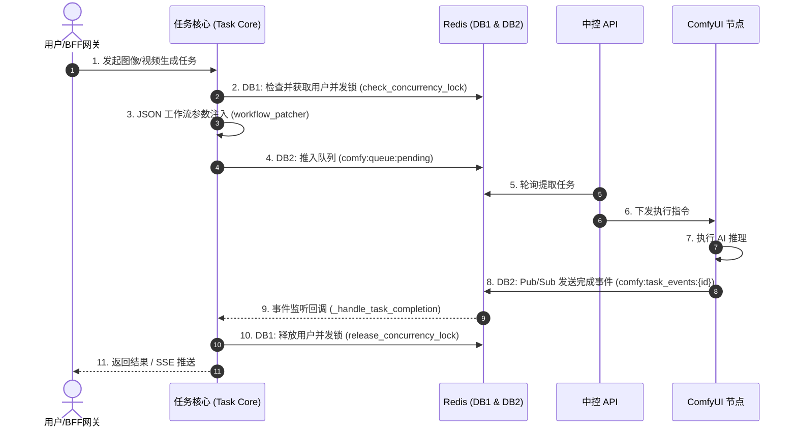

# 子模块: 任务调度 (Task Scheduler)

## 1. 目标与范围
本模块负责统一调度和下发底层 AI 生成任务（包括图片、视频等生成）。它是整个系统的“发动机调度器”，具备跨平台的并发锁防刷、排队限流、死锁自愈（僵尸任务剔除）以及高频实时状态同步（Pub/Sub）。所有的 Bot、Web 请求均经过本核心的统一路由分发给 ComfyUI 阵列。

## 2. 架构图与调用链



## 3. 核心代码片段

### 任务派发与参数注入 (src/core/task_core.py)
[`task_core.py:L95-L121`](file:///home/hfy/APP/All_bot/src/core/task_core.py#L95-L121)
```python
async def core_submit_generation_task(
    internal_user_id: int, 
    task_type: str, 
    params: dict
) -> str:
    """平台无关的核心派发逻辑，负责锁定、生成 UUID 并推入队列"""
    # 获取单用户锁
    lock_ok, msg = await check_concurrency_lock(internal_user_id)
    if not lock_ok:
        raise ValueError(msg)
        
    task_id = str(uuid.uuid4())
    # 动态注入参数到 JSON
    workflow = await patch_workflow(task_type, params)
    
    # 压入 Redis
    await redis_client.db2.rpush("comfy:queue:pending", json.dumps({
        "task_id": task_id,
        "workflow": workflow,
        "user_id": internal_user_id
    }))
    
    return task_id
```

### 并发锁释放与事件回调 (src/core/billing_core.py)
[`billing_core.py:L13-L41`](file:///home/hfy/APP/All_bot/src/core/billing_core.py#L13-L41)
```python
async def check_concurrency_lock(internal_user_id: int) -> Tuple[bool, str]:
    """通过 Redis SETNX 控制单用户最大并发任务，默认值为 1"""
    lock_key = f"user_lock:{internal_user_id}"
    if await redis_client.db1.set(lock_key, "1", nx=True, ex=3600):
        return True, "Lock acquired"
    return False, "您有正在进行中的任务，请稍后再试"

async def release_concurrency_lock(internal_user_id: int):
    """任务完成或异常时，必须确保并发锁释放"""
    lock_key = f"user_lock:{internal_user_id}"
    await redis_client.db1.delete(lock_key)
```

## 4. 接口定义 (OpenAPI 3.0)

```yaml
openapi: 3.0.3
info:
  title: Task Scheduler API
  version: 1.0.0
paths:
  /api/tasks/generation:
    post:
      summary: 创建底层生成任务
      requestBody:
        required: true
        content:
          application/json:
            schema:
              type: object
              properties:
                task_type:
                  type: string
                  example: face_video
                params:
                  type: object
      responses:
        '200':
          description: 返回排队的 task_id，后续用于 SSE 监听
          content:
            application/json:
              schema:
                type: object
                properties:
                  task_id:
                    type: string
        '429':
          description: 并发锁冲突或排队限流（凡人、练气期队列爆满）
```

## 5. 单元与集成测试要求
- **覆盖率基准**：调度层核心测试覆盖率要求 **≥90%**。
- **核心用例**：
  1. `test_concurrency_limit`：同一用户瞬间发起 2 次请求，断言第二次必定返回 `429` 且报错 `有正在进行中的任务`。
  2. `test_zombie_task_cleanup`：制造一个没有回调的“幽灵任务”，断言定时协程能在 1 小时超时后自动踢除并在 `db1` 中释放锁。
  3. `test_workflow_parameter_injection`：传入 `duration=10` 的参数，断言最终压入队列的 JSON 中，指定的节点映射被正确修改，无类型错误。

## 6. 部署与回滚步骤
- **部署**：
  调度层代码与主 Bot 或 Web API 共享。执行：
  `docker-compose -f deploy/docker-compose.yml up -d --build tg-bot web-api`
- **回滚**：
  `git revert HEAD`，随后重新拉起容器。如果锁死发生，可以运行 `/home/hfy/APP/All_bot/clean_zombies.py` 强制释放 Redis 锁。

## 7. 监控告警规则 (SLI/SLO)
- **SLI**：Redis 队列深度 `comfy:queue:pending` 与死锁比例（任务超过 10 分钟未结束）。
- **SLO**：队列任务平均响应时间 < 30 秒（非爆满期），死锁率 < 0.1%。
- **告警策略**：
  - **Critical**：如果 pending 队列深度连续 15 分钟 > 100，或 Worker 节点全线掉线（DB2 心跳丢失），触发 P0 级钉钉群告警。
