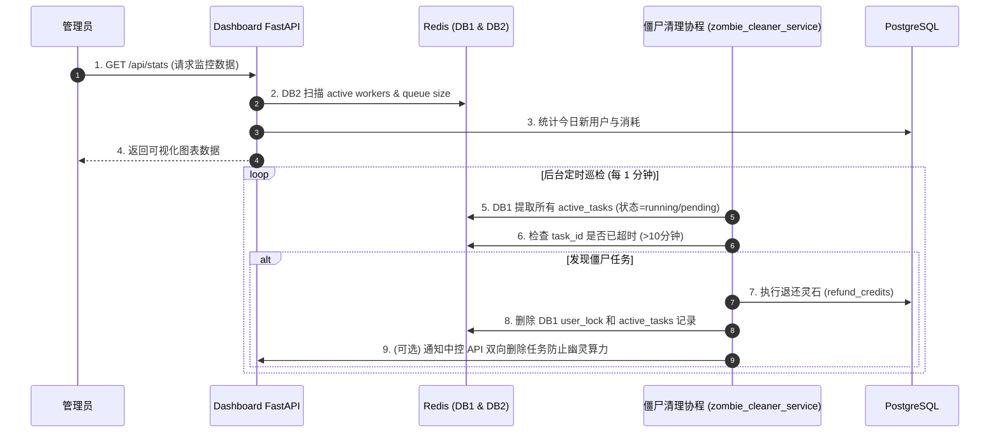

# 子模块: 后台监控与清理 (Dashboard & Monitoring)

## 1. 目标与范围
本模块包含面向管理员的 Vue3/FastAPI 数据看板（Dashboard）和自动化运行的幽灵任务自愈协程（Zombie Cleaner）。其目标是提供全系统数据可视化（包含用户统计、服务器节点存活状态、Gallery 广场管理、历史任务回溯），并在出现 Worker 节点宕机或并发锁死锁时，主动释放用户锁定资源并退还灵石，保障整个生成集群的高可用性。

## 2. 架构图与调用链



## 3. 核心代码片段

### 僵尸任务自愈协程 (src/services/zombie_cleaner_service.py)
[`zombie_cleaner_service.py:L11-L40`](file:///home/hfy/APP/All_bot/src/services/zombie_cleaner_service.py#L11)
```python
async def clean_zombies():
    """
    自动巡检 Redis 中的 ActiveTasksTable。
    如果任务超过设定阈值（例如 10 分钟）仍未结束，则判定为僵尸任务，自动退还灵石并释放用户并发锁。
    """
    from src.core.billing_core import refund_credits, release_concurrency_lock
    import time
    import json
    
    tasks = await redis_client.db1.hgetall("ActiveTasksTable")
    current_time = time.time()
    
    for task_id, task_data_json in tasks.items():
        task_data = json.loads(task_data_json)
        start_time = task_data.get('start_time', current_time)
        
        # 超过 600 秒 (10分钟) 强制清理
        if current_time - start_time > 600:
            user_id = task_data.get('user_id')
            cost = task_data.get('cost', 0)
            
            # 核心容灾逻辑
            if cost > 0:
                await refund_credits(user_id, cost, task_type="refund_zombie")
            await release_concurrency_lock(user_id)
            await redis_client.db1.hdel("ActiveTasksTable", task_id)
            # 发送双向踢除 API 避免 Worker 算力浪费
            ...
```

### Dashboard 接口鉴权 (dashboard/backend/main.py)
[`main.py:L62-L80`](file:///home/hfy/APP/All_bot/dashboard/backend/main.py#L62)
```python
@app.middleware("http")
async def check_auth_header(request: Request, call_next):
    """
    后台 Dashboard 的基础认证中间件。
    检查 HTTP 请求头中的 ADMIN_SECRET 是否与环境变量匹配。
    """
    # 排除不需要鉴权的路由
    if request.url.path in ["/api/health", "/docs", "/openapi.json"]:
        return await call_next(request)
        
    admin_secret = request.headers.get("Authorization")
    if not admin_secret or admin_secret.replace("Bearer ", "") != os.getenv("ADMIN_SECRET"):
        return JSONResponse(status_code=401, content={"detail": "Unauthorized"})
        
    return await call_next(request)
```

## 4. 接口定义 (OpenAPI 3.0)

```yaml
openapi: 3.0.3
info:
  title: Dashboard API
  version: 1.0.0
paths:
  /api/stats:
    get:
      summary: 获取系统大盘监控数据
      security:
        - bearerAuth: []
      responses:
        '200':
          description: 返回在线节点数、排队长度和用户统计
          content:
            application/json:
              schema:
                type: object
                properties:
                  active_workers:
                    type: integer
                  queue_size:
                    type: integer
                  today_new_users:
                    type: integer
```

## 5. 单元与集成测试要求
- **覆盖率基准**：自愈与清退逻辑要求 **≥90%** 覆盖率。
- **核心用例**：
  1. `test_zombie_cleaner_refunds_correctly`：在 Redis 中伪造一个耗时 601 秒且带有 cost=10 的任务，运行 `clean_zombies`，断言用户的灵石增加了 10，且 Redis 锁被删除。
  2. `test_zombie_cleaner_ignores_fresh_tasks`：伪造一个耗时 30 秒的任务，运行巡检，断言没有任何清理操作发生。
  3. `test_dashboard_auth_middleware`：发送未携带 `ADMIN_SECRET` 的请求到 `/api/stats`，断言被中间件 401 拦截。

## 6. 部署与回滚步骤
- **部署**：
  在主项目目录和 dashboard 目录下均可运行：
  ```bash
  cd dashboard
  docker-compose up -d --build
  ```
  *注意*：后台依赖宿主机网络，通常配置为 `network_mode: "host"`，通过 FRP 将 8001 端口穿透至公网供管理员访问。
- **环境要求**：必须在 `.env` 中正确配置复杂的 `ADMIN_SECRET`，并确保前后端保持一致。
- **回滚**：
  无数据库结构变更，拉取上一版本直接重启容器。

## 7. 监控告警规则 (SLI/SLO)
- **SLI**：僵尸任务清理的触发频率与成功率，Dashboard 接口平均响应时间。
- **SLO**：每分钟不超过 5 个僵尸任务。
- **告警策略**：
  - **Critical**：当 1 小时内触发的 `clean_zombies` 次数超过总排队任务数的 5%，意味着底层的 ComfyUI Worker 出现系统性瘫痪（可能因 OOM 宕机），系统必须立刻发送最高级别 P0 告警给研发团队。
