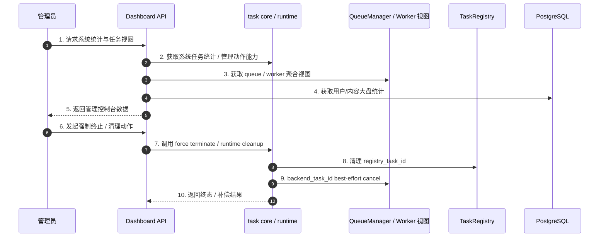

# 子模块: 后台监控与清理 (Dashboard & Monitoring)

## 1. 目标与范围
本模块包含面向管理员的 Dashboard 视图与显式管理动作，用于查看系统任务统计、Worker/Queue 运行态、用户与内容大盘，并在异常情况下通过统一 core/runtime 入口执行任务终止与清理。

当前知识口径下，Dashboard 不是“僵尸任务主处理器”；真正的任务运行态治理已收口到：
- `task_core` facade
- `task_core_runtime.py`
- `QueueManager`
- `TaskRegistry`
- `force_terminate_task(...)` / runtime cleanup

## 2. 当前架构图

## 3. 当前职责边界
### 3.1 Dashboard 负责什么
- 系统大盘与管理视图
- task stats、worker/queue 状态聚合
- 管理员显式触发的终止、清理与只读查询
- 管理接口鉴权与审计

### 3.2 Dashboard 不负责什么
- 不定义任务补偿主链
- 不直接把 Redis 手工删键当作标准治理方式
- 不以 `zombie_cleaner_service`、`active_tasks` 哈希、固定 10 分钟阈值作为主文档口径

## 4. 推荐接口语义
### 4.1 系统统计
- 读取聚合后的系统任务统计
- 补充 worker / queue 视图
- 不把旧字段名固定成唯一契约
- Worker 视图区分 `active_workers` 与 `healthy_workers`：前者表示有 heartbeat，后者表示 `idle/running` 且可接单
- `comfy_online` 按 `healthy_workers > 0` 判定；全部节点 `error/quarantined` 时必须显示不可用
- Worker 卡片应展示 `error` / `quarantined`、最近错误、失败次数、心跳时间与预计恢复时间，不能把故障节点渲染为空闲

### 4.2 强制终止
- Dashboard 应优先调用 core 暴露的系统任务管理入口，如 `force_terminate_task(...)`
- 退款、锁释放、runtime cleanup 与双 ID 清理由 core/runtime 统一完成

## 5. 测试要求
- 覆盖 Dashboard 鉴权中间件
- 覆盖系统统计接口的基础返回
- 覆盖 `healthy_workers`、`error_workers`、`quarantined_workers` 与 `workers_by_status` 聚合
- 覆盖 Dashboard 对 `error/quarantined` Worker 的红色/隔离态展示
- 覆盖管理员强制终止时的：
  - `registry_task_id` 清理
  - `backend_task_id` best-effort cancel
  - runtime cleanup / 锁释放
- 覆盖 worker / queue 视图补齐与异常场景

## 6. 部署与运维
- Dashboard 随部署脚本更新，但不应被文档描述为“僵尸任务自动自愈中心”。
- 若出现 stuck task，应优先通过 Dashboard 管理动作或 core 暴露的终止入口处理。
- Redis 手工删键只作为极端故障兜底，不作为标准 SOP。

## 7. 告警建议
- 任务终态异常率
- runtime cleanup 失败率
- worker 存活率与 queue 堆积
- 恢复失败率与 force terminate 失败率
