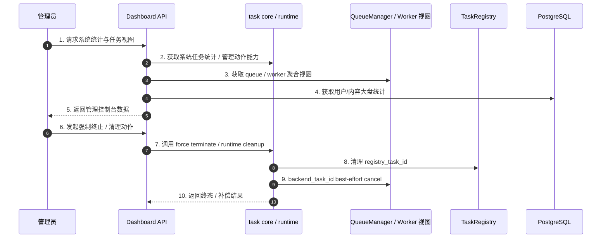

# 子模块: 后台监控与清理 (Dashboard & Monitoring)

## 1. 目标与范围
本模块包含面向管理员的 Dashboard 视图与显式管理动作，用于查看系统任务统计、Worker/Queue 运行态、用户与内容大盘，并在异常情况下通过统一 core/runtime 入口执行任务终止与清理。

当前知识口径下，Dashboard 不是“僵尸任务主处理器”；真正的任务运行态治理已收口到：
- `task_core` facade
- `task_core_runtime.py`
- `QueueManager`
- `TaskRegistry`
- `force_terminate_task(...)` / runtime cleanup

## 2. 当前架构图

## 3. 当前职责边界
### 3.1 Dashboard 负责什么
- 系统大盘与管理视图
- task stats、worker/queue 状态聚合
- 管理员显式触发的终止、清理与只读查询
- 用户列表过滤/排序与用户资产迁移预览；用户转移接口支持 `dry_run=true` 先返回迁移计划且不修改数据库
- 管理接口鉴权与审计

### 3.2 Dashboard 不负责什么
- 不定义任务补偿主链
- 不直接把 Redis 手工删键当作标准治理方式
- 不以 `zombie_cleaner_service`、`active_tasks` 哈希、固定 10 分钟阈值作为主文档口径

## 4. 推荐接口语义
### 4.1 系统统计
- 读取聚合后的系统任务统计
- 补充 worker / queue 视图
- 不把旧字段名固定成唯一契约
- Dashboard 大盘 stats 属于高成本查询，后端使用短 TTL 进程内缓存与 single-flight 合并并发请求；前端 stats 请求不得强制附加 `_t` 缓存击穿参数。
- Dashboard 的灵石消耗统计以 `user_logs` 账本为准：生成任务负向流水计入消耗，`refund%` 退款流水抵扣消耗；`history` 仅用于成功生成量、类型分布与小时分布，不再用“视频 6 / 图片 2”硬编码反推灵石。
- Worker 视图区分 `active_workers` 与 `healthy_workers`：前者表示有 heartbeat，后者表示 `idle/running` 且可接单
- `comfy_online` 按 `healthy_workers > 0` 判定；全部节点 `error/quarantined` 时必须显示不可用
- Worker 卡片应展示 `error` / `quarantined`、最近错误、失败次数、心跳时间与预计恢复时间，不能把故障节点渲染为空闲
- Worker/queue 监控通过云 Central `/system/status` 与 `/system/workers` 获取短缓存观测快照；这两个接口不是强一致调度入口，管理后台不要用高频轮询压垮 Central/Valkey。
- Dashboard 生产前端已具备云端 Nginx 网关配置：`cloud-dashboard-frontend-prod` 默认绑定云正式 Tailscale IP 的 `8086`，静态资源由云控制面提供，`/api/` 在 Docker 内网直连 `dashboard-backend-prod:8043`。本地局域网 `http://192.168.1.115:8086/` 仍可作为局域网/回退入口，但不再是唯一前端承载方式。
- 前端队列监控默认约 10 秒轮询一次；并发统计约 60 秒刷新一次；活动任务表约 15 秒刷新一次。除非有明确压测证据，不要降到 2 秒或更高频。
- Dashboard Nginx 网关会对 `/api/stats*` 做约 15 秒短缓存，对 `/api/system/status`、`/api/system/workers`、`/api/system/concurrency_stats` 做约 5 秒短缓存；登录、退款、封禁、删除、清理僵尸任务等写操作不得缓存。
- Worker listener 应作为受监督后台循环运行；异常后由外层循环重试，不递归 `create_task`，并且每轮退出都显式关闭 pubsub / Redis client。

### 4.2 强制终止
- Dashboard 应优先调用 core 暴露的系统任务管理入口，如 `force_terminate_task(...)`
- 退款、锁释放、runtime cleanup 与双 ID 清理由 core/runtime 统一完成

### 4.3 用户转移
- 用户列表入口的查询条件应先归一化为 `UserListQuery`，再进入查询与 presenter，保持路由参数和响应字段兼容。
- 用户转移先计算 `UserTransferPlan`，再执行真实迁移；`dry_run=true` 时只返回 before/after、预计 moved_counts 与合并决策，不写库、不写审计日志。
- 真实转移会把历史、模板共建、签到、账本日志、订单、affiliate 流水、广场投稿/评论/互动、提示词解锁、关注关系与邀请关系并入目标用户；`gallery_prompt_unlocks.user_id + post_id`、`user_follows.follower_id + followee_id` 等唯一锚点在迁移前必须先去重，避免删除源用户时触发非空外键或唯一约束错误。
- 真实转移的 `extra_info` 必须包含 before/after 快照、moved_counts，以及 membership / ban / stats 的合并决策，便于后续追溯。

## 5. 测试要求
- 覆盖 Dashboard 鉴权中间件
- 覆盖系统统计接口的基础返回
- 覆盖 `healthy_workers`、`error_workers`、`quarantined_workers` 与 `workers_by_status` 聚合
- 覆盖 Dashboard 对 `error/quarantined` Worker 的红色/隔离态展示
- 覆盖管理员强制终止时的：
  - `registry_task_id` 清理
  - `backend_task_id` best-effort cancel
  - runtime cleanup / 锁释放
- 覆盖 worker / queue 视图补齐与异常场景
- 覆盖 stats 缓存命中、single-flight 并发合并、Central proxy 超时兜底与前端不击穿 stats 缓存
- 覆盖用户列表筛选/排序、用户转移 dry-run 无副作用、真实转移审计快照，以及提示词解锁/关注关系迁移去重

## 6. 部署与运维
- Dashboard 随部署脚本更新，但不应被文档描述为“僵尸任务自动自愈中心”。
- 若出现 stuck task，应优先通过 Dashboard 管理动作或 core 暴露的终止入口处理。
- Redis 手工删键只作为极端故障兜底，不作为标准 SOP。
- 管理后台卡顿时先区分三类问题：Dashboard stats 重查询、Central 观测接口慢、GPU/ComfyUI 执行停顿。GPU 生成短暂停顿不等同于 Dashboard worker 监控慢。
- 云测试 Dashboard 前端由 `deploy/docker-compose-cloud-test.yml` 的 `cloud-dashboard-frontend-test` 提供，默认 `http://100.82.124.91:8087/`，用于先验证云端前端体验。
- 云正式 Dashboard 前端由 `deploy/docker-compose-cloud-prod.yml` 的 `cloud-dashboard-frontend-prod` 提供，默认 `http://100.107.220.127:8086/`。生产发布前必须先经云测试验证并由用户确认，且 `CLOUD_PROD_BIND_IP` 不得为 `0.0.0.0`。
- 面向公网访问管理后台时，必须使用 Cloudflare Tunnel + Cloudflare Access 或等价身份层保护，回源到 `100.107.220.127:8086`；不要把 `8086` 或 `8043` 裸露到公网。
- 本地管理后台入口由 `dashboard/docker-compose-local-gateway.yml` 管理，可作为局域网/回退入口。原本地上线流程是先启动 `dashboard-local-gateway-8085` canary，验证后停止旧 `8086` Vite dev 进程，再启动 `dashboard-local-gateway-8086`；该流程不需要重建云端正式 Dashboard Backend。
- 旧的 `0.0.0.0:8043` SSH 转发只作为临时兼容入口；长期应移除或收紧到 `127.0.0.1`，避免绕过受控网关直连云后端。

## 7. 告警建议
- 任务终态异常率
- runtime cleanup 失败率
- worker 存活率与 queue 堆积
- 恢复失败率与 force terminate 失败率
