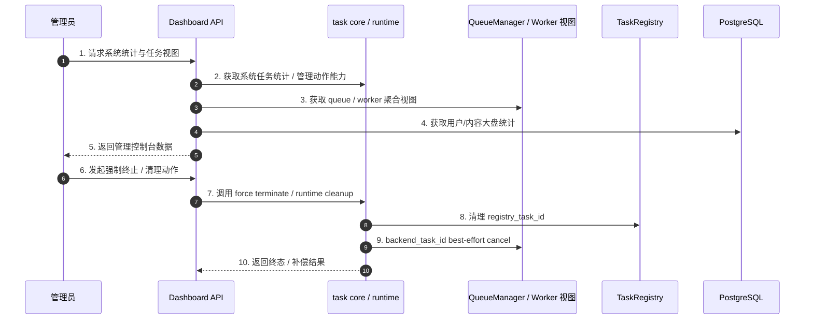

# 子模块: 后台监控与清理 (Dashboard & Monitoring)

## 1. 目标与范围

本模块包含面向管理员的 Dashboard 视图与显式管理动作，用于查看系统任务统计、Worker/Queue 运行态、用户与内容大盘，并在异常情况下通过统一 core/runtime 入口执行任务终止与清理。

当前知识口径下，Dashboard 不是“僵尸任务主处理器”；真正的任务运行态治理已收口到：

- `task_core` facade
- `task_core_runtime.py`
- `QueueManager`
- `TaskRegistry`
- `force_terminate_task(...)` / runtime cleanup

## 2. 当前架构图

## 3. 当前职责边界

### 3.1 Dashboard 负责什么

- 系统大盘与管理视图
- task stats、worker/queue 状态聚合
- 管理员显式触发的终止、清理与只读查询
- 用户列表过滤/排序与用户资产迁移预览；用户转移接口支持 `dry_run=true` 先返回迁移计划且不修改数据库
- 管理接口鉴权与审计
- Dashboard router 只负责鉴权、schema 和 HTTP 错误映射；客服工单的
  查询、状态转换、Telegram 投递与事务提交已收口到
  `support_ticket_admin_service.py`。`private_bots.py` 与
  `reference_assets.py` 是剩余的事务型 router 迁移清单；AST 门禁只允许
  该清单缩小，禁止新 router 重新直接调用 session 事务方法。

### 3.2 Dashboard 不负责什么

- 不定义任务补偿主链
- 不直接把 Redis 手工删键当作标准治理方式
- 不以 `zombie_cleaner_service`、`active_tasks` 哈希、固定 10 分钟阈值作为主文档口径

## 4. 推荐接口语义

### 4.1 系统统计

- 读取聚合后的系统任务统计
- 补充 worker / queue 视图
- 不把旧字段名固定成唯一契约
- Dashboard 大盘 stats 属于高成本查询，后端使用短 TTL 进程内缓存与 single-flight 合并并发请求；前端 stats 请求不得强制附加 `_t` 缓存击穿参数。
- Dashboard 的灵石消耗统计以 `user_logs` 账本为准：生成任务负向流水计入消耗，`refund%` 退款流水抵扣消耗；`history` 仅用于成功生成量、类型分布与小时分布，不再用“视频 6 / 图片 2”硬编码反推灵石。
- Dashboard 历史生成页通过既有数据推导展示来源，不给 `history` 新增列：`web` / `bot` 直接来自 `History.source`，官方懒人 Bot 由 `History.extra_outputs._qqcc_regenerate` 识别，用户私有懒人 Bot 再通过 `PrivateBotTaskSubmission.registry_task_id` 关联并显示精确 `bot:qqcc-private:<id>`。`GET /api/history/all` 的 `source` 支持 `web`、`bot`、`bot:qqcc`、`bot:qqcc-private` 和精确私有 Bot client type；私有账本已按保留策略清理的陈旧记录不能反推出租户 ID，应按剩余历史标记降级展示。
- Dashboard 历史集合在完成 SQL 查询后先结束只读事务，再通过 R2 S3 existence cache/singleflight 并发解析输出原件与缩略图；响应使用 `output_file_url` / `output_file_preview_url`，输入同时返回原件 `input_file_url` 与不做公网 HEAD 的文件级缩略图候选 `input_file_preview_url`。列表图片优先加载缩略图，点击后才显示原图；列表不得挂载原视频 `<video>`，无视频缩略图时显示占位符，管理员点击后才在当前页面弹窗加载带 controls 的原视频。缩略图缺失或对象存储异常只降级到原图/占位符，不能阻断历史接口。
- 用户列表的“历史记录”弹窗使用 `GET /api/history/{user_id}` 的真实总数分页，
  不得用固定条数截断高频用户；Worker/私有 Bot 诊断字段通过每个任务的单值子查询
  补充，不能让一对多日志行重复挤占用户历史分页。
- Worker 视图区分 `active_workers`、`healthy_workers` 与 `accepting_workers`：前者表示有 heartbeat，`healthy_workers` 表示 heartbeat 状态为 `idle/running`，`accepting_workers` 表示同时健康且 agent control 为 `enabled`、可接新单。
- `comfy_online` 按 `healthy_workers > 0` 判定；全部节点 `error/quarantined` 时必须显示不可用；若 `healthy_workers > 0` 但 `accepting_workers=0`，应展示为“节点健康但接单关闭/维护中”。
- Worker 卡片应展示 `error` / `quarantined`、`control_state`、`control_reason`、最近错误、失败次数、心跳时间与预计恢复时间，不能把故障节点或 `disabled/draining` 节点渲染为空闲可接单
- 系统监控页的 Worker 卡片可打开单节点历史生成记录弹窗；该弹窗只在管理员点击具体卡片后调用既有 `/api/workers/history?worker_id=...` 分页接口，默认每页 10 条。Worker 历史记录不得加入 `/api/system/status` / `/api/system/workers` 的高频轮询，也不得随 Worker 卡片批量预取。
- Worker/queue 监控通过云 Central `/system/status` 与 `/system/workers` 获取短缓存观测快照；这两个接口不是强一致调度入口，管理后台不要用高频轮询压垮 Central/Valkey。
- Dashboard `/api/system/status` 会保留 `queue_by_type` 作为 active registry 口径的活跃任务数，并补充 `queue_by_type_details`：`active_count` 同 active registry，`pending_count` / `max_pending_wait_seconds` / `oldest_pending_task_id` / `oldest_pending_created_at` 只读采样 Central `comfy:queue:pending` 与 `comfy:task:{task_id}`。pending 采样默认优先读 `WORKER_REDIS_URL`，若该分库没有 pending 快照，再按 `DASHBOARD_PENDING_QUEUE_FALLBACK_REDIS_URL`、`REDIS_URL` 兜底读取；这是 Dashboard 展示层兼容，不能替代修正 Central 入队分库。`max_pending_wait_seconds` 严格按 pending 任务的 `created_at` 计算，不使用带优先级偏移的 zset score；执行中任务只计入活跃数，不计入最长排队等待。Dashboard 还会通过 active registry 的 `backend_task_id -> user_id` 映射批量判定 pending 队列中的 `low_trust_free_tier`，响应顶层返回 `low_trust_free_tier_pending_user_count` / `low_trust_free_tier_pending_task_count`，各类型详情返回 `low_trust_free_tier_user_count` / `low_trust_free_tier_task_count`，并返回 `max_non_low_trust_pending_wait_seconds` 表示“已知用户且确认不是低信任免费层”的最长等待；未知用户不计入该字段，低信任查询失败时该字段降级为空，不能把用户默认当作非低信任。内部 pending 记录会保留不含用户 ID 的全局队列序号和非低信任标记，供 RunPod profile 聚合计算“清到最后一个非低信任 pending 任务”的前缀任务数；该私有队列记录不返回给前端。该统计只读复用线上业务口径：`checkin_count > 7`、自身无 `SUCCESS` 订单，且不满足 `referrals` 真实邀请数 `>100` 与受邀成功订单用户去重率 `>3%` 的高质量邀请者豁免；受邀成功订单只要求 `orders.status='SUCCESS'`。该统计不改变优先级、扣费或调度。Redis pending 采样或低信任批量查询失败时详情列降级为空或 `0`，不能影响系统监控主响应。
- Dashboard `/api/system/status` 同时返回 `runpod_profile_queue_details` 兼容字段：后端字段按正式 RunPod profile 事实源聚合；前端隐藏旧 `pornmaster_flux2_edit` 监控行，保留 `pornmaster_flux2_edit_bf16 / 自由P图 v2.5 + v3 共用执行池`。BF16 同时聚合 `pornmaster_flux2_edit_bf16` 与 `pornmaster_flux2_multi_edit_bf16` 队列，返回 `autoscaler_enabled=true`，与其它正式 profile 一样自动 add/down/restart/enable；两类默认均按单任务 30 秒、清空阈值 30 分钟，并保留暂停、锁定、重启和删除人工兜底。前端仍用 `queue_by_type_details` 重新计算展示用活跃数和排队数；`scail2` 展示额外折入 LAN 任务，但 RunPod autoscaler 只统计 RunPod 可承接类型。该字段的 `active_count` 是未终态任务数而非 worker 数；“可接单服务器”优先读取 Central `queue_pressure_by_worker_profile` 中与低阶用户准入完全一致的健康 enabled RunPod/本地数量，旧 Central 缺字段时才从 `/api/system/workers` 按 `idle|running + enabled` 同口径回退。
- Dashboard 生产前端已具备云端 Nginx 网关配置：`cloud-dashboard-frontend-prod` 默认绑定云正式 Tailscale IP 的 `8086`，静态资源由云控制面提供，`/api/` 在 Docker 内网直连 `dashboard-backend-prod:8043`。本地局域网 `http://192.168.1.115:8086/` 仍可作为局域网/回退入口，但不再是唯一前端承载方式。
- 邀请返佣页支持人工 USDT-TON 兑换处理：待处理记录可确认打款或拒绝解冻，
  成功必须填写唯一交易哈希，拒绝必须填写原因。云测试运行独立 Dashboard
  backend/frontend，并通过 `admin-test.aivison.it.com` 的 Access 与应用登录
  双层保护。
- 前端队列监控默认约 10 秒轮询一次；并发统计约 60 秒刷新一次；活动任务表约 15 秒刷新一次。除非有明确压测证据，不要降到 2 秒或更高频。
- `QueueStats.vue` 已使用 `<script setup lang="ts">`，系统状态与 RunPod autoscaler
  分别通过 typed API adapter 进入 `useQueueStatsMonitor`/组件；不得重新从组件
  直接拼 HTTP payload。Dashboard 的 legacy JavaScript SFC 由测试中的缩减清单
  管理，新 SFC 禁止无 TypeScript，迁移一个就必须从清单删除一个。
- Dashboard Nginx 网关会对 `/api/stats*` 做约 15 秒短缓存，对 `/api/system/status`、`/api/system/workers`、`/api/system/concurrency_stats` 做约 5 秒短缓存；登录、退款、封禁、删除、清理僵尸任务等写操作不得缓存。
- Worker listener 应作为受监督后台循环运行；异常后由外层循环重试，不递归 `create_task`，并且每轮退出都显式关闭 pubsub / Redis client。

### 4.2 强制终止

- Dashboard 应优先调用 core 暴露的系统任务管理入口，如 `force_terminate_task(...)`
- 退款、锁释放、runtime cleanup 与双 ID 清理由 core/runtime 统一完成

### 4.3 用户转移

- 用户列表入口的查询条件应先归一化为 `UserListQuery`，再进入查询与 presenter，保持路由参数和响应字段兼容。
- 用户转移先计算 `UserTransferPlan`，再执行真实迁移；`dry_run=true` 时只返回 before/after、预计 moved_counts 与合并决策，不写库、不写审计日志。
- 真实转移会把灵石、会员身份、历史、模板共建、签到、账本日志、订单、affiliate 流水、广场投稿/评论/互动、提示词解锁、关注关系与邀请关系并入目标用户；`gallery_prompt_unlocks.user_id + post_id`、`user_follows.follower_id + followee_id` 等唯一锚点在迁移前必须先去重。
- 源用户不再物理删除：保留 Telegram / Web 登录身份、基础资料、创建时间与封禁状态，清零灵石、会员身份、成长/签到/邀请/贡献统计和频道成员缓存。这样原 Telegram 身份仍由既有用户占用，再次 `/start` 必须返回 `is_new=false`，不能重复领取新手或邀请奖励。源封禁同时合并到目标并继续保留在源账户，禁止通过转移洗掉处罚。
- 真实转移的 `extra_info` 必须包含 before/after 快照、moved_counts、`source_sanitized=true`、`source_deleted=false`，以及 membership / ban / stats 的合并决策，便于后续追溯。

### 4.4 RunPod 管理

- 系统监控页顶部的 `RunPod 管理` 是云正式手动 RunPod 池的 Web 日常入口；后端 API 位于 `dashboard/backend/routers/runpod.py`，执行层收口到 `dashboard/backend/services/runpod_admin_service.py`。
- Dashboard 不直接实现 RunPod 创建/删除逻辑，只异步调用 `scripts/runpod_prod_ops.sh`，继承 CLI 的门禁、无库存重试、disabled heartbeat、自动 enable、drain/delete 语义。
- `POST /api/runpod/scale` 接收多 profile 新增数量。Dashboard 先用只读 add planner 排除已有 Pod 与 Redis 手动预留，再把每个 profile 的 `count=N` 拆成 N 个带明确 `slot` 的 `add --count 1 --slot NN` operation 并发启动；响应返回共同 `batch_id`，每个 operation 返回自身 `slot`、`agent_id` 与 `requested_count=1`。旧字段 `desired_count` 只作兼容输入并按新增数量解释，不再代表目标总数；同一请求中同一 profile 仍不允许重复，但已有手动批次运行时允许继续追加同 profile。
- 当前可管理 profile 为 `img2img`、`image_to_video`、`wan22_video_v2`、`i2i_pro`、`scail2 / 视频生视频`、`ltx_video / 高级图生视频` 与 `pornmaster_flux2 / 自由P图 v2`。`scail2` 支持正式 `scail2_action_transfer`、`scail2_video_replacement`；`ltx_video` 支持正式 `ltx_video,ltx_video_flf2v,ltx_video_v2v_audio` 并默认使用 10Eros v1.2 workflow override；`pornmaster_flux2_edit` 支持正式 `pornmaster_flux2_single_edit,pornmaster_flux2_multi_edit`，模型 manifest 为 `allbot-model-cache/pornmaster_flux2_edit/2026-06-27/manifest.json`。这些 profile 都是手动备用/临时扩容能力，不代表系统里固定常驻一个 RunPod；没有 heartbeat 或已删除的 `manual_NN` 不应计入可用容量。
- `POST /api/runpod/workers/{agent_id}/pause` 只提交 `disable` operation，停止目标 RunPod worker 接新单但保留 Pod。
- `DELETE /api/runpod/workers/{agent_id}` 提交 `down` operation，先 disable 并等待 `current_task_id` 清空，再删除 Pod 释放 RunPod 计费资源。
- RunPod operation 状态通过 `RunPodOperationStore` seam 持久化；生产默认使用 Redis，测试可注入 in-memory fake。Redis key 使用 `dashboard:runpod:operations` sorted set、`dashboard:runpod:operation:{id}` JSON、`dashboard:runpod:active_add:{profile}` autoscaler/legacy 独占 add 锁，以及 `dashboard:runpod:manual_add_slots:{profile}` 手动 slot 预留。手动预留整批原子写入并逐 operation 释放；存在手动预留时 autoscaler add 不启动，存在 autoscaler 独占 add 时手动批次不接收。
- `GET /api/runpod/operations` 从 store 读取最近 operation，并叠加当前进程仍持有的 process handle 状态；响应保留旧字段，并增加 `owner_id`、`attached`、`can_terminate_reason`。
- `终止` 只允许当前 Dashboard 进程仍能安全控制的 add operation。并发手动新增的每个 operation 只记录和清理自己的明确 slot，因此可单独淘汰拉取慢的 Pod；若 operation 来自旧进程或重启后已 detached，API 返回 409，不按 Redis 里的旧 pid 盲杀进程，避免 PID 复用误杀。
- 默认保留最近 100 条 operation；完成态 Redis JSON TTL 为 24 小时，运行态不主动过期，避免长操作丢失追踪。RunPod 管理弹窗保持每页 6 条的前端分页，提交成功后保持打开、保留表单并回到第一页，轮询刷新时保留仍有效的当前页。
- Dashboard RunPod mutation 只打开显式执行门禁：`RUNPOD_DRY_RUN=false`、`RUNPOD_AUTOSCALER_ENABLED=true`。全局 Pod 数、单类型 Pod 数、小时成本上限不再由 Dashboard/API/provider 校验；`RUNPOD_PROD_MAX_MANUAL_SLOTS` 默认按 `100` 作为 manual slot 命名空间。
- Dashboard 容器默认可通过 `DASHBOARD_RUNPOD_ENV_FILE`、`DASHBOARD_RUNPOD_PROD_ENV_FILE`、`DASHBOARD_RUNPOD_OPS_SCRIPT` 覆盖脚本和 env 路径；不可变云正式容器默认使用 `/dev/null` 作为两个 env-file 参数，让 operation 子进程继承容器已注入的环境变量，不依赖或挂载 `/app/.env`。镜像必须内置 `/app/scripts/runpod_prod_ops.sh`、`/app/scripts/gpu_pool_controller.py`、`gpu_release_rollout.py` 与 `/app/ops`。
- API 响应和 operation log 只保留脱敏命令、状态、pid、退出码与日志尾部，不输出 `.env.*` 内容、RunPod API key、agent token、JWT、R2 key 或 presigned URL。

## 5. 测试要求

- 覆盖 Dashboard 鉴权中间件
- 覆盖系统统计接口的基础返回
- 覆盖 `queue_by_type_details` 的 active/pending 分离、pending 采样从 Worker Redis 空队列兜底到通用 Redis、最长 pending 等待按 `created_at` 而不是 zset score 计算、low trust free tier pending 用户/任务数聚合，以及 Redis / 低信任统计失败时的降级返回。
- 覆盖 `runpod_profile_queue_details` 的 8 类正式 RunPod profile 固定返回、`i2i_pro` 四执行类型汇总（含 legacy `face_swap`）、`pornmaster_flux2_single_edit/pornmaster_flux2_multi_edit` 汇总、`pornmaster_flux2_edit_bf16` 自动 add/down、`scail2_face_swap_v2` 不计入正式 RunPod `scail2`，以及最长等待与非低信任最长等待取 profile 内最大 pending 等待。
- 覆盖 `healthy_workers`、`accepting_workers`、`error_workers`、`quarantined_workers`、`workers_by_status` 与 `workers_by_control_state` 聚合
- 覆盖 Dashboard 对 `error/quarantined` Worker 的红色/隔离态展示、`vue-tsc`
  和 legacy JavaScript SFC 只减不增门禁
- 覆盖系统监控页 Worker 历史弹窗的点击后懒加载、分页、失败提示，以及点击 RunPod 操作区不触发弹窗。
- 覆盖历史输出缩略图解析在 SQL 只读事务结束后执行、R2 缩略图异常降级，以及图片缩略图打开原图、视频列表不加载原件且点击后使用当前页弹窗播放。
- 覆盖 Dashboard RunPod 管理入口的 profile 校验、精确 slot add、手动批次并发/连续追加、Redis slot 原子预留与 autoscaler 互斥、逐 Pod 终止清理、旧 `desired_count` 兼容、worker pause/delete slot 解析，以及弹窗保持打开、slot 展示、最近操作分页、前端 typecheck / 系统监控页渲染。
- 覆盖管理员强制终止时的：
  - `registry_task_id` 清理
  - `backend_task_id` best-effort cancel
  - runtime cleanup / 锁释放
- 覆盖 worker / queue 视图补齐与异常场景
- 覆盖 stats 缓存命中、single-flight 并发合并、Central proxy 超时兜底与前端不击穿 stats 缓存
- 覆盖用户列表筛选/排序、用户转移 dry-run 无副作用、真实转移审计快照，以及提示词解锁/关注关系迁移去重

## 6. 部署与运维

- Dashboard 随部署脚本更新，但不应被文档描述为“僵尸任务自动自愈中心”。
- 若出现 stuck task，应优先通过 Dashboard 管理动作或 core 暴露的终止入口处理。
- Redis 手工删键只作为极端故障兜底，不作为标准 SOP。
- 管理后台卡顿时先区分三类问题：Dashboard stats 重查询、Central 观测接口慢、GPU/ComfyUI 执行停顿。GPU 生成短暂停顿不等同于 Dashboard worker 监控慢。
- 云测试不再部署 Dashboard 前后端；其行为测试保留在本地与 CI。
- 云正式 Dashboard 前端默认通过受控入口 `http://100.107.220.127:8086/`
  提供。`dashboard-backend` 与 `dashboard-frontend` 分别从完整 main SHA 构建，
  并以精确 digest 逐模块部署；正式 mutation 每次都要求 `--confirm-prod`。
  发布器不查询 CI/test evidence，只重建目标服务并保存该模块 previous identity。
- 只更新管理后台系统时，操作范围应限于 `dashboard-backend-prod` / `dashboard-frontend-prod`；如果只改 Dashboard 后端统计、RunPod operation 入口或 Dashboard 后端镜像闭包，只重建 `dashboard-backend-prod`；如果只改前端展示或 RunPod profile 识别，只重建 `dashboard-frontend-prod`。验证使用 `http://100.107.220.127:8043/api/health` 与 `http://100.107.220.127:8086/api/health`，并确认 Central/Web/Bot/Payment/imgproxy/worker/RunPod 未被重启或重建。
- 面向公网访问管理后台时，必须使用 Cloudflare Tunnel + Cloudflare Access 或等价身份层保护，回源到 `100.107.220.127:8086`；不要把 `8086` 或 `8043` 裸露到公网。
- 本地管理后台入口由 `dashboard/docker-compose-local-gateway.yml` 管理，可作为局域网/回退入口。原本地上线流程是先启动 `dashboard-local-gateway-8085` canary，验证后停止旧 `8086` Vite dev 进程，再启动 `dashboard-local-gateway-8086`；该流程不需要重建云端正式 Dashboard Backend。
- 本地 `dashboard/docker-compose.yml` 运行在 host network，必须显式提供 `DASHBOARD_REDIS_URL` 与 `DASHBOARD_WORKER_REDIS_URL`；不得把 Redis 写死为本机 loopback。局域网网关健康检查只探测公开的 `/api/health`，根路径访问控制不能作为 readiness 信号。
- config contract 会拒绝指向 `localhost`、`127.0.0.0/8` 或 `::1` 的本地
  Dashboard Redis 别名。目标 Redis/Valkey 必须先从本机完成只读 TCP/TLS
  连通性验证；若局域网入口仅由 gateway 回源云 Dashboard Backend，则不要同时
  保留一个没有可达 Redis 的旧本地 Backend 实例制造 503 与日志风暴。
- 旧的 `0.0.0.0:8043` SSH 转发只作为临时兼容入口；长期应移除或收紧到 `127.0.0.1`，避免绕过受控网关直连云后端。

## 7. 告警建议

- 任务终态异常率
- runtime cleanup 失败率
- worker 存活率与 queue 堆积
- 恢复失败率与 force terminate 失败率
