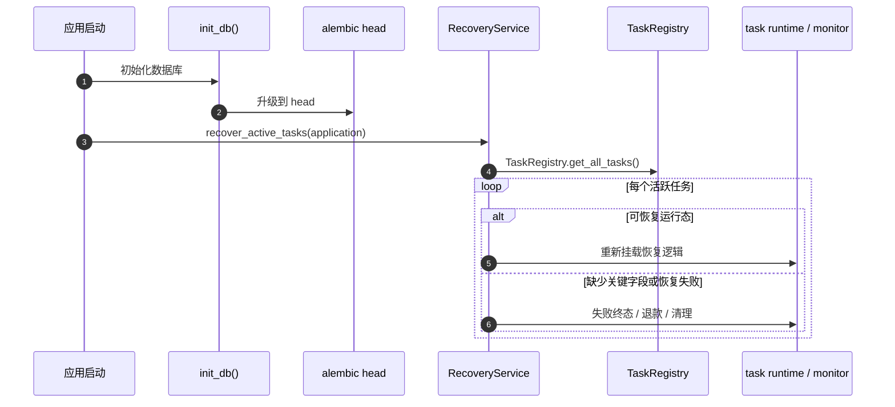

# 子模块: 容灾与持久化 (Database & Recovery)

## 1. 目标与范围

本模块负责两项底座能力：

- 数据库 ORM / Alembic 迁移与初始化
- 容器重启后的任务恢复、自愈与安全终态清理

目标是在系统异常退出、滚动更新或服务重启后，让任务、锁、退款与历史状态回到一致性的安全基准。

## 2. 当前恢复主链

## 3. 当前关键事实

- 恢复链路不再直接扫描旧的 `ActiveTasksTable` 字符串表名口径；当前统一通过 `TaskRegistry.get_all_tasks()` 获取活跃任务视图。
- 恢复逻辑以 `registry_task_id` 为本地恢复锚点；若存在 `backend_task_id`，则继续尝试恢复监控或执行 best-effort terminate。
- 若缺少关键运行态字段、任务已严重超时或恢复失败，应走失败终态、退款与 cleanup，而不是继续悬挂为“待恢复”。

## 4. 数据库初始化

### 4.1 初始化原则

- 表结构变更必须走 Alembic，不允许绕过迁移体系直接手工改线上 schema。
- 启动期数据库初始化失败属于阻断问题，应直接让服务启动失败并触发运维告警。

### 4.2 部署约束

- 测试优先：默认先通过测试栈验证迁移与恢复路径。
- 生产执行前必须确认迁移脚本、启动初始化与恢复逻辑在测试环境已通过。

## 5. 恢复与终止策略

### 5.1 可恢复路径

满足以下条件时，任务可继续恢复：

- registry 中存在合法任务记录
- 关键上下文字段仍可用
- 任务仍具有恢复价值

### 5.2 不可恢复路径

出现以下任一情况时，应直接进入失败终态 / 清理：

- 任务数据损坏
- backend 运行态已丢失且无法恢复
- 任务超时过久
- 恢复过程中再次抛错

此时应优先保证：

- 锁释放
- registry 清理
- 必要退款或 pending refund
- 对用户可见状态收口

## 6. 与 Web 历史/运行态的关系

恢复链路需要避免把“已不可恢复任务”重新伪装为运行态，否则会污染：

- Web stream not-found fallback
- 历史结果回查
- 本地 `active_tasks` 生命周期

因此，恢复失败后应尽快把任务推进到明确终态，避免 history 与 runtime 语义混淆。

## 7. 测试要求

- 覆盖数据库初始化幂等。
- 覆盖存在活跃任务时的恢复路径。
- 覆盖损坏任务数据、缺少 backend 信息、恢复异常时的退款与 cleanup。
- 若修改 `recovery_service.py`、`task_registry.py`、`task_core_runtime.py`，需同步复核 Web stream/history fallback 行为。

## 8. 运维与回滚

- 回滚数据库相关改动时，除了回滚 Alembic 版本，还要确认对应版本的恢复逻辑是否仍兼容当前 registry/task 数据。
- 本地 cloud-prod shadow 每次成功切换后只保留当前数据库和一个 immediate
  previous 数据库；更早的 previous 数据库不是长期备份。带日期的 dump 文件由
  `SHADOW_SYNC_RETENTION_DAYS` 独立管理，不能用 previous 数据库替代可校验备份。
- 若出现启动期迁移失败或恢复失败激增，应优先检查：
  - Alembic 迁移是否与目标代码版本匹配
  - registry 数据结构是否发生不兼容变化
  - runtime cleanup 是否因 provider/dependencies 改动而失效
