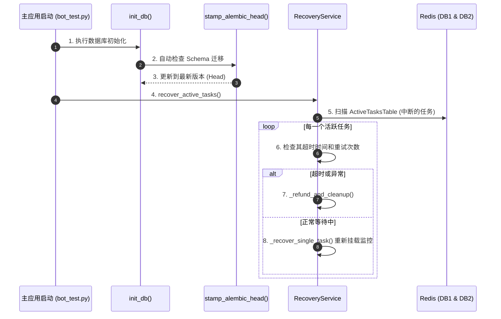

# 子模块: 容灾与持久化 (Database & Recovery)

## 1. 目标与范围
本模块负责两项基础职能：数据库的声明式 ORM 与 Alembic 迁移脚本的自动执行（`src/database/core.py`）；以及在系统容器重启后，对之前正在执行或排队的“中断任务”的扫描与断点续传/自愈处理（`src/services/recovery_service.py`）。其核心目的是保证系统在发生非预期崩溃或滚动更新时，用户的任务和资产状态能恢复到安全的一致性基准。

## 2. 架构图与调用链



## 3. 核心代码片段

### 自动数据库迁移与初始化 (src/database/core.py)
[`core.py:L27-L49`](file:///home/hfy/APP/All_bot/src/database/core.py#L27)
```python
async def init_db():
    """
    异步初始化数据库引擎，使用 Alembic 自动生成并应用表结构变更。
    严禁使用原生 SQL ALTER TABLE，必须通过此入口或 alembic revision 迁移。
    """
    try:
        # 这里通过 _run_sync 封装 alembic.command.upgrade('head')
        # ...
        await stamp_alembic_head()
        logger.info("Database initialized and migrations applied successfully.")
    except Exception as e:
        logger.error(f"Failed to initialize database: {e}")
        raise
```

### 容器重启后的任务断点恢复 (src/services/recovery_service.py)
[`recovery_service.py:L42-L68`](file:///home/hfy/APP/All_bot/src/services/recovery_service.py#L42)
```python
async def recover_active_tasks(application):
    """
    当 Telegram Bot 重启时（例如重新发布代码），
    恢复所有挂载在 Redis 上的中断任务的监控（或执行退款）。
    """
    from src.services.redis_client import redis_client
    
    tasks = await redis_client.db1.hgetall("ActiveTasksTable")
    if not tasks:
        return
        
    for task_id, task_data_json in tasks.items():
        try:
            task_data = json.loads(task_data_json)
            # 重新为任务挂载进度监听器（Pub/Sub）或清理超时的冗余任务
            await _recover_single_task(task_id, task_data, application)
        except Exception as e:
            # 执行异常退款处理
            await _refund_and_cleanup(task_id, task_data, None, "恢复任务失败")
```

## 4. 接口定义 (OpenAPI 3.0)

*本模块为内部框架底座支撑，随程序启动钩子执行，无对外 API。*

```yaml
Internal_Hook:
  on_startup:
    - Task: Database Initialization
      Action: "alembic upgrade head"
    - Task: Task Recovery
      Action: "recover_active_tasks(application)"
```

## 5. 单元与集成测试要求
- **覆盖率基准**：核心恢复与迁移脚本逻辑要求 **≥85%**。
- **核心用例**：
  1. `test_alembic_migration_idempotent`：连续调用两次 `init_db()`，断言第二次不会报错且 Schema 保持最新。
  2. `test_recover_single_task_success`：伪造一个 Redis 中的合法 Pending 任务，启动服务，断言其状态监控器被重新创建且最终顺利完结。
  3. `test_refund_and_cleanup_on_recovery`：伪造一个损坏的 JSON 格式或严重超时的任务记录，断言服务在启动时捕获异常并为用户执行了灵石退还和锁释放。

## 6. 部署与回滚步骤
- **部署**：
  在代码修改（尤其是 `src/database/models.py` 表结构变更）后，需要在宿主机执行 `alembic revision --autogenerate -m "..."`。随后重启 `docker-compose` 容器，`init_db` 将自动应用。
- **回滚**：
  如果数据库升级引发雪崩：
  1. 停止新容器。
  2. 执行 `alembic downgrade -1` 撤销最后一次表结构变更。
  3. 启动旧镜像容器。

## 7. 监控告警规则 (SLI/SLO)
- **SLI**：系统启动初始化失败率、任务恢复成功率。
- **SLO**：启动迁移 100% 成功，活跃任务 99% 成功恢复监听。
- **告警策略**：
  - **Critical**：若启动期间 `init_db()` 抛出 `ProgrammingError`（通常是锁表或字段冲突），服务直接崩溃并退出容器，需通过运维探针告警“Bot 容器无限重启”。
