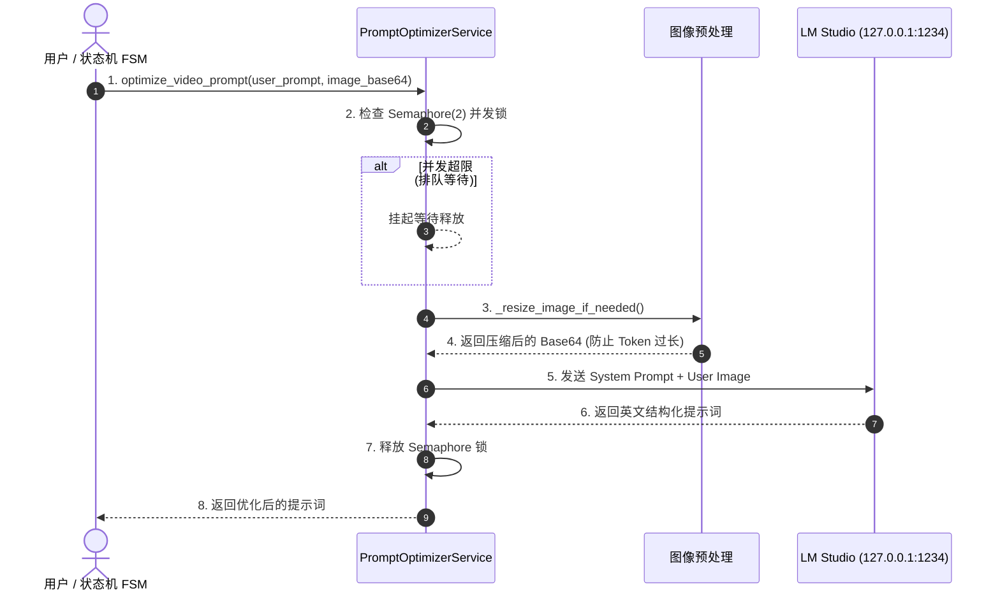

# 子模块: 提示词优化 (Prompt Optimization)

## 1. 目标与范围
本模块旨在提升用户在图生视频、文生图等高级任务中的生成效果。通过调用部署在本地（宿主机）的大语言模型（如 LM Studio 运行的 Qwen 模型），根据用户提供的基础提示词与参考图片，自动扩展和优化出适配底层 ComfyUI 模型的英文结构化提示词。本模块内置了 `asyncio.Semaphore` 机制，通过严格限制并发量来防范本地大模型爆显存（OOM）。

## 2. 架构图与调用链



## 3. 核心代码片段

### 并发限制与显存防爆 (src/services/prompt_optimizer_service.py)
[`prompt_optimizer_service.py:L37-L50`](file:///home/hfy/APP/All_bot/src/services/prompt_optimizer_service.py#L37)
```python
class PromptOptimizerService:
    # 核心安全红线：限制最多2个并发请求，防止大模型爆显存
    _semaphore = asyncio.Semaphore(2)

    @classmethod
    async def optimize_video_prompt(cls, user_prompt: str, image_base64: str) -> str:
        """调用本地大语言模型，结合图片优化视频提示词"""
        async with cls._semaphore:
            # 执行压缩
            optimized_base64 = cls._resize_image_if_needed(image_base64)
            
            prompt_template = "请根据提供的图片，扩写并优化为适合AI视频生成的英文提示词..."
            
            # 调用本地 LLM 接口
            # ...
            return optimized_prompt
```

## 4. 接口定义 (OpenAPI 3.0)

*注：此模块当前主要由 Bot 内部 FSM 直接通过函数调用，若未来暴露为 Web API，其定义如下：*

```yaml
openapi: 3.0.3
info:
  title: Prompt Optimization API
  version: 1.0.0
paths:
  /api/ai/optimize-prompt:
    post:
      summary: 智能提示词优化
      requestBody:
        required: true
        content:
          application/json:
            schema:
              type: object
              properties:
                prompt:
                  type: string
                image_base64:
                  type: string
      responses:
        '200':
          description: 返回优化后的英文提示词
          content:
            application/json:
              schema:
                type: object
                properties:
                  optimized_prompt:
                    type: string
        '429':
          description: 本地算力繁忙，请稍后重试
        '500':
          description: 大模型推理超时或异常
```

## 5. 单元与集成测试要求
- **覆盖率基准**：优化服务覆盖率要求 **≥85%**。
- **核心用例**：
  1. `test_semaphore_concurrency_limit`：使用 `asyncio.gather` 同时发起 5 个请求，断言前 2 个请求正常执行，后 3 个处于 pending 等待状态。
  2. `test_image_resize_downsampling`：传入一张 10MB 的 4K 分辨率图片，断言 `_resize_image_if_needed` 返回的 Base64 图片大小不超过 5MB 且长边被压缩至 1024。
  3. `test_llm_timeout_fallback`：模拟 LM Studio 接口 30 秒无响应，断言函数捕获 `TimeoutError` 并降级返回原始 `user_prompt`（或抛出友好提示）。

## 6. 部署与回滚步骤
- **部署**：
  该模块依赖宿主机的 `LM Studio`。
  1. 在宿主机后台通过 `lms server start --port 1234 --cors=true` 启动模型。
  2. 重启依赖它的服务（主 Bot 与 Web API）。
- **回滚**：
  当提示词服务引发阻塞时，临时将代码中的调用回退为 `return user_prompt`，并执行热更新。

## 7. 监控告警规则 (SLI/SLO)
- **SLI**：LLM 接口的响应时间（P95）与报错率。
- **SLO**：提示词优化成功率 > 95%，P95 响应时间 < 15 秒。
- **告警策略**：
  - **Warning**：如果连续 5 次 `aiohttp` 请求 1234 端口失败（Connection Refused），表示宿主机 LM Studio 服务崩溃，推送钉钉告警。
