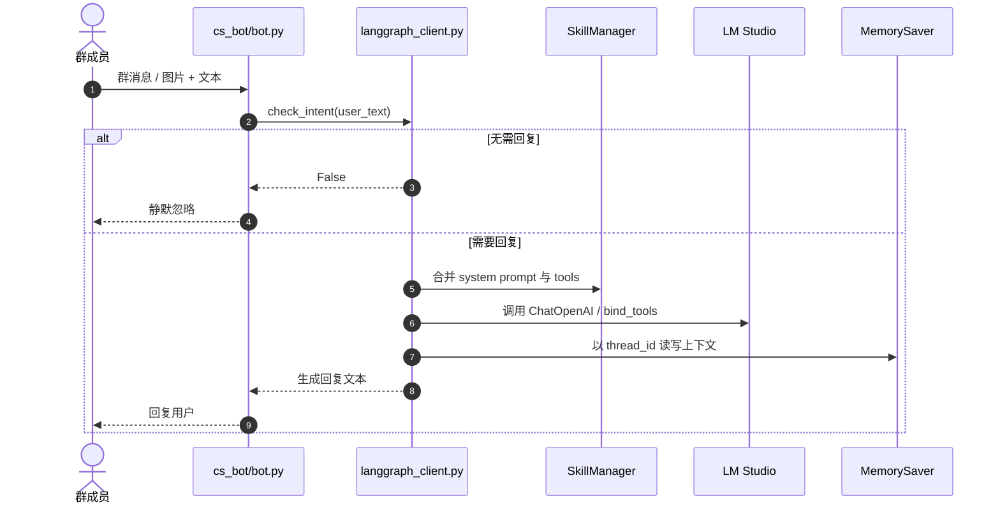

# 子模块: 智能客服 (CS Bot Agent)

## 1. 目标与范围
本模块描述独立 `cs_bot` 服务的当前实现。它基于 LangGraph、LM Studio 兼容 OpenAI 接口和本地技能目录工作，不再只是“单模型问答机器人”。当前职责包括：
- 群聊意图识别，避免无效打扰
- 基于 LangGraph 的多轮回复
- 动态加载 `cs_bot/skills` 里的工具与系统提示
- 区分文本对话与带图对话线程
- 使用内存型 `MemorySaver` 保存会话上下文

## 2. 当前链路

## 3. 已落地实现事实
- 模型接入通过 `ChatOpenAI(base_url=LLM_API_BASE, api_key='lm-studio')` 兼容层完成。
- `langgraph_client.py` 使用 `build_langgraph_app()` / `get_langgraph_runtime()` 懒初始化运行时，首次调用时才加载 `SkillManager`、绑定 tools 并编译图，避免模块 import 即连接或构造 LLM。
- `SkillManager` 会在运行时初始化时加载 `cs_bot/skills` 目录中的 prompt 与 tools，再统一绑定到 LLM。
- LangGraph 的状态只维护 `messages`；没有单独的 Redis 持久化记忆树。
- 当前记忆组件是 `MemorySaver()`，属于进程内存检查点；如果容器重启，会话历史不会天然持久化。
- 文本消息与图片消息使用不同 `thread_id`：
  - 文本：`str(chat_id)`
  - 图片：`f"{chat_id}_vision"`
- `check_intent()` 返回 0/1 风格结果，失败时默认不主动打扰群聊。

## 4. 与 Bot 层的耦合点
- 白名单群、消息入口与图片缓存等控制逻辑位于 `cs_bot/bot.py`。
- TG 大文件相关 monkey patch 的实际落点也在 `cs_bot/bot.py`，不是 LangGraph 客户端内部。
- 因此文档和技能中提到“CS Bot 能处理大文件”时，应明确区分：
  - `langgraph_client.py` 负责推理编排
  - `bot.py` 负责 Telegram 交互与补丁

## 5. 核心红线
- 不要把 `MemorySaver` 写成 Redis 持久化记忆；当前实现不是。
- 不要把技能能力写成“仅提示词优化服务”；当前主能力是客服问答与工具化 LangGraph 对话。
- 本地 LLM 故障时必须优雅降级，返回友好提示，不能把异常上抛到 Telegram 更新循环。
- 不要在 `langgraph_client.py` 模块导入阶段新增全局 LangGraph / LLM 初始化；新增入口应复用 `get_langgraph_runtime()`。

## 6. 测试关注面
- 意图识别对“闲聊 / 求助”区分
- 工具绑定后 LangGraph 的条件分支
- 图片消息与纯文本消息 thread_id 隔离
- LM Studio 不可用时的降级回复
