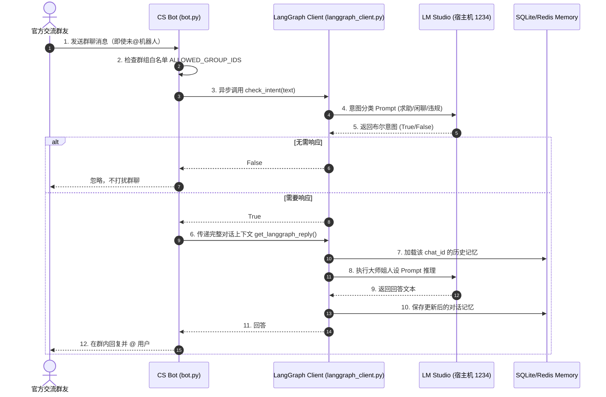
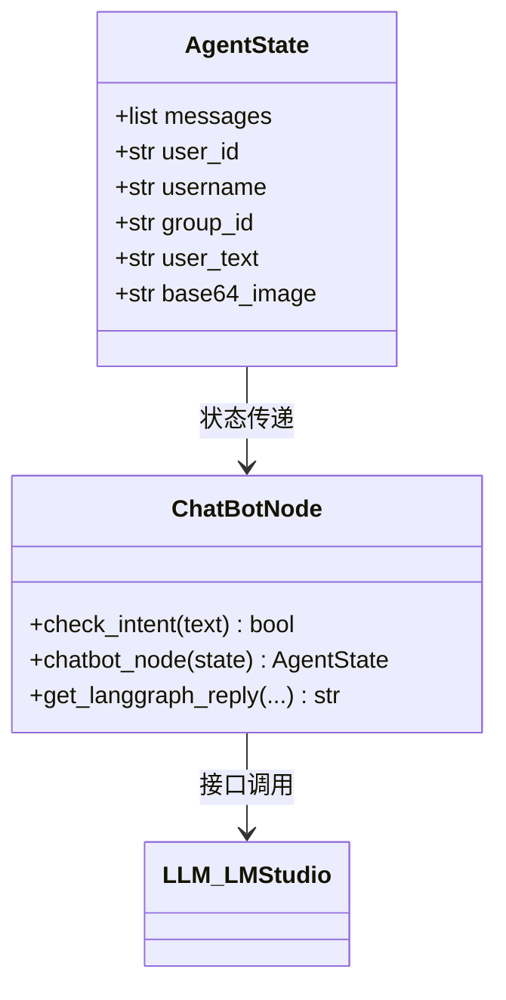

# 子模块: 智能客服 (CS Bot Agent)

## 1. 目标与范围
本模块包含基于 LangGraph 构建的 AI 专属社群客服机器人（“合欢宗大师姐”）。该 Agent 具备主动意图嗅探（Intent Sniffing）能力、防打扰白名单隔离机制以及长效记忆（MemorySaver）。它在不占用核心 ComfyUI 算力的情况下，调用部署在宿主机的本地 LLM（LM Studio），实现低成本的群聊答疑与新手引导。

## 2. 架构图与调用链





## 3. 核心代码片段

### 意图嗅探 (cs_bot/langgraph_client.py)
[`langgraph_client.py:L107-L128`](file:///home/hfy/APP/All_bot/cs_bot/langgraph_client.py#L107)
```python
async def check_intent(user_text: str) -> bool:
    """轻量级的意图分析，防止机器人在群里成为复读机"""
    if len(user_text.strip()) <= 3:
        return False
        
    prompt = f"""
    你是一个意图分析器。判断以下用户的发言是否在寻求帮助、询问系统问题或需要客服介入。
    发言：{user_text}
    只返回 'true' 或 'false'。
    """
    response = await llm.ainvoke([HumanMessage(content=prompt)])
    # 清洗并匹配
    result = response.content.strip().lower()
    return 'true' in result
```

### LangGraph 主推理节点 (cs_bot/langgraph_client.py)
[`langgraph_client.py:L49-L105`](file:///home/hfy/APP/All_bot/cs_bot/langgraph_client.py#L49)
```python
def chatbot_node(state: AgentState):
    """
    LangGraph 的核心处理节点。
    加载大师姐的 system prompt，结合用户的状态和历史记忆调用本地 LLM。
    """
    sys_prompt = SystemMessage(content=f"""
    你是合欢宗的内门大师姐，一个温柔、护短、懂技术的 AI 客服。
    当前群友 {state['username']} 遇到了问题，请结合你的知识库为其解答。
    ...
    """)
    
    # 组装完整的消息流
    messages = [sys_prompt] + state["messages"]
    
    # 调用宿主机 LM Studio 服务
    response = llm.invoke(messages)
    
    # 将新的回复推入状态字典中保存
    return {"messages": [response]}
```

## 4. 接口定义

### 关键环境变量 (.env)
- `CS_BOT_TOKEN`: 专属的 Telegram Bot Token
- `ALLOWED_GROUP_IDS`: 允许响应的群组 ID 列表（例如：`-1001234567890`），防越权私聊
- `LLM_API_BASE`: `http://127.0.0.1:1234/v1` (宿主机 LM Studio 服务地址)
- `LLM_MODEL`: `qwen2.5-7b-instruct`

## 5. 单元与集成测试要求
- **覆盖率基准**：意图分析与状态传递逻辑要求 **≥80%**。
- **核心用例**：
  1. `test_intent_sniffing_positive`：输入“怎么充值灵石”，断言 `check_intent` 返回 `True`。
  2. `test_intent_sniffing_negative`：输入“今天天气真好”或“哈哈”，断言返回 `False`。
  3. `test_group_whitelist_rejection`：模拟来自不在 `ALLOWED_GROUP_IDS` 列表中的群聊请求，断言 Bot 在消息处理器顶部直接 `return` 不处理。

## 6. 部署与回滚步骤
- **部署**：
  本服务必须使用 Docker Host 网络模式才能访问宿主机 `127.0.0.1` 上的本地大模型服务：
  ```bash
  cd cs_bot
  docker rm -f cs-bot
  docker-compose up -d --build
  ```
- **回滚**：使用旧版本代码重新执行 `--build` 即可。

## 7. 监控告警规则 (SLI/SLO)
- **SLI**：本地 LLM (LM Studio) 的 API 超时率与回复生成延迟。
- **SLO**：意图分析耗时 < 500ms，完整回复生成耗时 < 5 秒。
- **告警策略**：
  - **Warning**：如果 LangGraph 连续抛出 `Connection refused` 错误，表示宿主机的 LM Studio 服务宕机，需触发钉钉群告警并人工重启本地模型加载。
