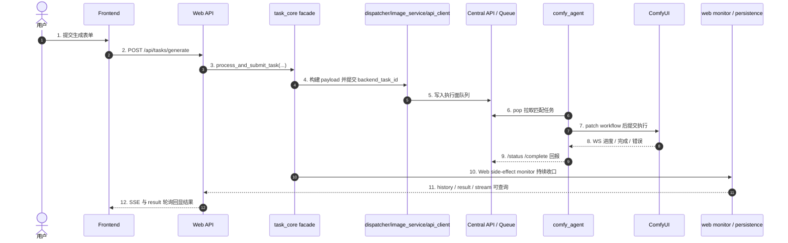

# 子模块: 生成任务全链路 (Task Full Chain)

## 1. 目标与适用场景
本文档用于说明当前系统中“生成任务”从前端发起，到 Web API 提交，到 `task_core` 派发，再到底层 Central API / Queue / Worker / ComfyUI 执行，以及状态回流、结果持久化、历史查询的完整链路。

适用场景：
- 新增一种新的生成任务类型
- 运维排查任务卡住、堆积、结果丢失、状态异常
- 排查 Web 端提交成功但 SSE / 结果 / 历史表现不一致
- 理解 `registry_task_id` 与 `backend_task_id` 的分工

本文档是对以下文档的补充而不是替代：
- `docs/子模块_任务调度_task_scheduler.md`
- `docs/子模块_中控API与节点通信_central_api.md`
- `docs/system_architecture_report.md`

## 2. 一句话主链
当前系统中更准确的生成任务主链是：

`Frontend Page/Form -> /api/tasks/generate -> task_submission_service -> task_core.process_and_submit_task(...) -> task_core_submission / task_dispatcher / image_service / api_client -> Central API / QueueManager -> comfy_agent -> ComfyUI -> status/complete 回流 -> Web monitor / history / result / SSE`

要点：
- Web 主入口是 `POST /api/tasks/generate`，不是旧的 generation params 风格接口
- `task_core` 是统一门面，负责业务编排，不是 Central API
- Central API 是执行面，不负责上游计费、并发锁和历史持久化
- Worker 通过主动 `pop` 拉取任务，不是上游直接把 workflow 推到 Worker

## 3. 分层职责图

## 4. 前端入口链路
### 4.1 表单与 payload 构造
前端生成页面负责收集用户输入，然后把输入转成统一提交 payload。

常见入口包括：
- `frontend/src/views/TextToImage.vue`
- 其他图生图、图生视频、换脸等页面
- 统一 payload 构造器，例如 `frontend/src/features/generation/buildGenerationTaskPayload.ts`

前端提交到后端时，核心字段通常包括：
- `task_type`
- `inputs`
- `prompt`
- `negative_prompt`
- `priority`
- `is_template`
- `source_post_id`

约束：
- 若是 Web 一等任务类型，前端必须提供稳定的 `task_type`
- 输入图片、LoRA、分辨率、时长等应统一收口到 `inputs`
- 新任务类型若要在主站展示为独立能力，前端页面、卡片入口、i18n 和历史/投稿/收藏相关展示也要一并补齐

### 4.2 任务提交与前端运行态
前端通常通过以下链路提交：
- `frontend/src/composables/useTaskStream.ts`
- `frontend/src/stores/tasks.ts`
- `frontend/src/stores/taskSessionState.ts`
- `frontend/src/stores/taskStreamTransport.ts`
- `frontend/src/stores/tasksRuntime.ts`

提交后会发生：
1. `useTaskStream.submitTask(...)` 调用 `POST /tasks/generate`
2. 后端返回 `task_id` 后，前端把该任务写入 `tasksStore`
3. `tasksStore.startListening(...)` 建立 `/tasks/{task_id}/stream`
4. 收到终态 `success` 后，前端转入 `/tasks/{task_id}/result` 轮询
5. 若历史已落库，也可能通过最近历史或详情弹层展示结果

前端当前的状态语义重点：
- `pending`: 已提交但还在排队
- `running`: Worker 已开始执行，允许展示进度
- `success`: SSE 终态成功，前端随后去拿结果 URL
- `failed`: 执行失败或回流失败
- `cancelled`: 用户取消或执行面确认取消

## 5. Web API 提交链路
### 5.1 主入口
Web 统一入口在：
- `src/web_api/routers/tasks.py`
- `POST /api/tasks/generate`

这个入口本身应保持薄壳，主要负责：
- 接收 `TaskGenerateRequest`
- 注入当前用户
- 转发到 service
- 把领域异常映射为 HTTP 状态码

### 5.2 提交 service
真正的 Web 提交 service 在：
- `src/web_api/services/task_submission_service.py`

当前职责：
- 把 `prompt` 补入 `req.inputs`
- 生成 Web 侧 `task_id`
- 设定 correlation id
- 调用 `process_and_submit_task(...)`
- 开启 `TaskSubmissionSideEffectPlan(attach_web_monitor=True)`
- 返回给前端 `pending` 初态和余额变化

这意味着 Web 成功返回给前端时，任务通常已经：
- 完成了计费检查
- 完成了并发锁检查
- 完成了 registry 注册
- 完成了 backend 提交
- 挂好了 Web monitor side effect

## 6. task_core 业务编排链路
### 6.1 统一门面
统一主门面是：
- `src/core/task_core.py`
- `process_and_submit_task(...)`

它不是简单转发，而是负责编排整个业务提交过程：
- 取策略 `StrategyFactory.get_strategy(task_type)`
- 计算任务成本
- 检查并发锁
- 扣减灵石
- 组装提交上下文
- 执行提交 Saga
- 挂载 side effect
- 在失败时退款并释放锁

当前 `process_and_submit_task(...)` 内部已继续拆成稳定步骤：
- `task_core_process_flow.build_prepared_task_submission_request(...)`
- `task_core_process_flow.prepare_task_submission_context(...)`
- `task_core_process_flow.maybe_deduct_submission_credits(...)`
- `task_core_process_flow.execute_task_submission_attempt(...)`
- `task_core_process_flow.release_submission_lock_if_needed(...)`

### 6.2 provider / dependency 边界
当前 `task_core` 采用 facade + provider/dependencies 结构：
- `src/core/task_core.py`
- `src/core/task_lifecycle_contract.py`
- `src/core/task_core_default_dependencies.py`
- `src/services/task_core_process_defaults.py`
- `src/core/task_core_service_providers.py`
- `src/core/task_core_submission.py`
- `src/core/task_core_process_flow.py`
- `src/services/task_lifecycle_runner.py`
- `src/services/task_web_side_effects.py`
- `src/services/task_web_lifecycle_monitor.py`
- `src/services/task_web_terminal_finalization.py`
- `src/core/task_core_runtime.py`

关键规则：
- `core` 内不应重新直连基础设施实现
- `task_core_default_dependencies.py` 只保留纯 builder；runtime-specific billing / strategy / Web side effect 装配已下沉到 `src/services/task_core_process_defaults.py`
- Bot / Web / stream 对 backend `done/error/cancelled` 终态判断应共享 `task_lifecycle_contract.py`
- Web 侧已按 `side effects -> lifecycle monitor -> terminal finalization` 三段拆开，入口分别位于 `task_web_side_effects.py`、`task_web_lifecycle_monitor.py`、`task_web_terminal_finalization.py`
- Bot `task_service_flow.py` 与 Web lifecycle monitor 现共享 `task_lifecycle_runner.py` 的 monitor->route 骨架；Web runtime monitor 与 `task_web_finalizer.py` 共享 terminal router
- 默认 provider 注册由应用入口承担，不由 `core` 模块导入时自动注册
- 单测优先走显式 `dependencies` 或 `*_func` seam

### 6.3 双 ID 语义
当前链路中始终同时存在两个 ID：

- `registry_task_id`
  - Web/Bot 对外主任务 ID
  - 用于前端 SSE、结果查询、历史、清理、恢复
  - 也是 `/api/tasks/generate` 返回给前端的 `task_id`

- `backend_task_id`
  - 真正派发到底层执行面的运行态 ID
  - 用于 Central API / Queue / Worker / backend cancel

排障红线：
- 任何运行态查询、取消、强制终止、僵尸清理都必须先确认当前用的是哪个 ID
- 前端和 Web API 对外接口大多围绕 `registry_task_id`
- 执行面、队列和 Worker 更多围绕 `backend_task_id`

## 7. dispatcher 到 backend 执行面的下发
### 7.1 按任务类型选择策略
下发前的任务类型分流主要在：
- `src/core/task_dispatcher.py`

这里决定：
- 用哪种策略计算价格
- 哪些输入文件需要先上传到存储
- 如何构造 metadata / payload
- 调用 `image_service` 的哪个提交方法

例如：
- `txt2img` 走 `submit_txt2img_task(...)`
- `i2i_pro` 和 `i2i_draw` 有独立提交方法
- `img2img_lora` 会带 `lora_name` 和 `lora_strength`
- 视频类会根据分辨率、时长转成底层所需尺寸和帧长

### 7.2 image_service / api_client
dispatcher 下游通常会继续经过：
- `src/services/image_service.py`
- `src/api_client.py`

职责划分：
- `task_dispatcher.py` 负责选择策略和高层任务语义
- `image_service.py` 负责按任务类型封装后端提交调用
- `api_client.py` 负责实际 HTTP 请求到底层执行面

注意：
- 当前 simple route 仍可能映射到 legacy `TaskType`，但 `txt2img` 已和其他任务一样通过标准 simple route 提交，并显式携带上游 `task_id`
- `image_service.py` / `api_client.py` 只负责把统一语义下沉到 Central API，不再由 `txt2img` 单独生成 backend task id

## 8. Central API / QueueManager 执行面
### 8.1 角色定位
Central API 是执行面，不是业务主入口。

核心文件包括：
- `backend/app/main.py`
- `backend/app/main_simple_task_routes.py`
- `backend/app/queue_manager.py`
- `backend/app/queue_manager_flow_helpers.py`
- `backend/app/routers/agent.py`

执行面负责：
- 接收 backend 任务
- 在 `comfy:task_events:{backend_task_id}` 发布运行态与终态事件；其中 `done/error` 终态事件应附带 `task_type`，并优先带上 `worker_id`、`created_at` 等最小详情，供 Dashboard / stream 消费端在上游 runtime cleanup 已发生时仍能完成观测落库
- 写入 pending 队列
- 维护 worker 心跳视图
- 处理 agent `pop`
- 接收运行态状态更新
- 接收完成上报
- best-effort cancel

### 8.2 simple task route 与特例
常规 simple task route 在：
- `backend/app/main_simple_task_routes.py`

这里把上游任务 key 映射到 Central API 的 `TaskType`。

当前 simple route 成员至少包括：
- `img2img`
- `img2img_lora`
- `face_swap`
- `video_edit`
- `face_video`
- `i2i_pro`
- `i2i_draw`
- `txt2img`
- `ltx_video`

其中 `txt2img` 当前通过 `/txt2img` simple route 进入执行面，Central API 内部仍映射到 legacy `TaskType.T2I_PORNMASTER_TURBO`。新增任务类型时，不要默认假设只改 `SIMPLE_TASK_TYPE_MAP` 就够，还要确认 request model、dispatcher 和 worker workflow 映射是否齐全。

### 8.3 QueueManager 的职责
QueueManager 负责执行面排队与 Worker 选择，关键职责包括：
- `enqueue_task`
- 维护 pending / running 任务
- 按可用类型给 Worker 分配任务
- 维护 worker heartbeat 与 task heartbeat
- 支持取消、dequeue、zombie 扫描和状态迁移

从系统语义上看：
- Web/Bot 提交成功不代表 Worker 已接单
- Worker 接单前，任务仍可能只停留在 pending 队列
- 没有匹配 `SUPPORTED_TASK_TYPES` 的 Worker 时，任务会持续排队

## 9. Worker / ComfyUI 执行链路
### 9.1 Worker 主循环
当前底层 Worker 主循环主要在：
- `workers/comfy_agent/agent_main.py`

启动后主要做三件事：
- `poll_loop()`: 向 Central API 拉取可执行任务
- `heartbeat_loop()`: 上报节点和任务心跳
- `ws_listener_loop()`: 监听 ComfyUI WebSocket 获取进度和终态

关键环境变量：
- `AGENT_ID`
- `SUPPORTED_TASK_TYPES`
- `MASTER_API_URL`
- `COMFY_API_URL`
- `COMFY_WS_URL`

运维含义：
- 某任务长时间 pending 时，要先看是否有 Worker 声明支持该任务类型
- Worker 存活但 `SUPPORTED_TASK_TYPES` 不匹配，任务依然不会被接单

### 9.2 输入准备
Worker 拉到任务后会先处理输入：
- 从 MinIO 下载输入图片或视频
- 把输入通过 ComfyUI API 上传到 ComfyUI input 区
- 补全 `image` / `image2` / `image3` / `face_image` / `body_image` / `video` 等参数

无输入的任务类型也必须确认 workflow patcher 对纯文本场景兼容，例如 `txt2img`。

### 9.3 workflow 选择与 patch
底层 workflow 选择依赖：
- `src/workflow_mapping_validation.py`
- `workers/comfy_agent/workflows/mappings.json`
- `workers/comfy_agent/workflow_patcher.py`

关键点：
- `TASK_TYPE_WORKFLOW_FILENAMES` 决定任务类型默认绑定哪个 workflow JSON
- `mappings.json` 决定输入参数如何映射到 workflow 节点
- `workflow_patcher.py` 负责把运行时参数打进具体 workflow

如果出现以下错误，优先看这三层：
- Worker 报 `Workflow for xxx not found`
- patch 后 ComfyUI 报节点输入缺失
- 某参数前端传了但底层 workflow 实际没吃到

### 9.4 执行与结果上传
Worker 执行流程：
1. 向 ComfyUI 提交 patched workflow，拿到 `prompt_id`
2. 通过 WebSocket 监听 `execution_start` / `progress` / `execution_success` / `execution_error`
3. 执行完成后从 ComfyUI history 或 view API 取回结果文件
4. 上传结果到 MinIO output bucket
5. 向 Central API 调 `/api/agent/task/complete`

执行失败则走：
- `/api/agent/task/status` 上报 `failed`

## 10. 状态回流与结果落地
### 10.1 Worker 到执行面
Worker 上报的关键回调包括：
- `/api/agent/task/status`
- `/api/agent/task/complete`
- `/api/agent/task/heartbeat`
- `/api/agent/task/task_heartbeat`

执行面据此更新：
- 任务状态
- 运行中进度
- 节点当前负载
- 完成结果路径

### 10.2 Web side-effect finalizer
Web 任务提交成功后，真正负责“收尾”的是：
- `src/services/task_web_side_effects.py`
- `src/services/task_web_lifecycle_monitor.py`
- `src/services/task_web_terminal_finalization.py`
- `src/services/task_web_finalizer.py`

当前口径是“持久化 finalizer + 恢复循环”：
- 提交成功时先由 `task_web_side_effects.py` 把收尾上下文写入 Redis `pending_web_finalizers`
- Web API 启动后持续运行 finalizer loop，按 `backend_task_id` 轮询终态
- 即使 Web 进程重启，只要任务已成功提交，后续仍可恢复成功持久化 / 退款 / cleanup

它负责把 backend 终态转为 Web 可消费的最终语义：
- `task_web_lifecycle_monitor.py` 负责构造 terminal snapshot
- `task_web_terminal_finalization.py` 成功时持久化历史
- 必要时进行 R2 warmup
- 失败时退款
- 取消时退款
- 最后释放并发锁并清理 registry 运行态

这也是为什么：
- router 不应该自己做历史落库
- 前端不应该自己做终态补偿
- 结果是否最终可见，不只取决于 Worker 是否执行成功，还取决于 finalizer/persistence 是否收口完成

### 10.3 SSE 与结果查询
Web 端当前运行态与结果查询链路分成两层：

- 运行态：
  - `GET /api/tasks/{task_id}/stream`
  - service 入口：`src/web_api/services/task_stream_api_service.py`

- 结果态：
  - `GET /api/tasks/{task_id}/result`
  - service 入口：`src/web_api/services/task_result_service.py`

重要语义：
- `stream` 对外接收的是 `registry_task_id`
- service 内部会尽量解析出真正的 `runtime_task_id` / `backend_task_id`
- 若运行态已消失但历史已存在，SSE 应返回可终止的 fallback 语义，而不是无限轮询
- `result` 对 Web 历史优先取公网可访问结果地址；若公网地址还未就绪，应返回 `pending_result`

## 11. 历史、收藏、投稿与结果可见性
对于 Web 一等任务类型，只打通底层执行链路通常还不够，还要看是否要进入这些链：
- `History` 落库
- 最近历史列表
- 收藏
- 投稿
- 详情弹层
- Gallery / My Favorites / My Submissions
- i18n 任务类型文案

如果一个任务“能生成但前端看不见”，常见不是 worker 问题，而是这些展示链没补齐。

## 12. 新任务类型添加清单
新增生成任务类型时，按下面顺序检查最稳妥。

### 12.1 前端层
- 是否需要新的页面、卡片入口、路由
- 是否补了 `task_type` 常量与文案
- 是否补了表单到 `inputs` 的 payload 构造
- 是否需要进入历史、收藏、投稿、详情、筛选 tabs

### 12.2 业务编排层
- `src/constants.py` 是否补了 mode、成本、名称映射
- `src/core/task_dispatcher.py` 是否为该类型接入正确策略
- `image_service.py` / `api_client.py` 是否新增对应提交方法
- 是否要走现有兼容链，还是应成为标准 simple route

### 12.3 Central API 层
- 若走 simple route，`backend/app/main_simple_task_routes.py` 是否补了 `SIMPLE_TASK_TYPE_MAP` 和路由
- 相关 Pydantic request / enum / handler 是否齐全
- QueueManager 是否能识别并分发该类型

### 12.4 Worker / workflow 层
- `src/workflow_mapping_validation.py` 是否补了 workflow 文件映射
- `workers/comfy_agent/workflows/` 是否新增 workflow JSON
- `workers/comfy_agent/workflows/mappings.json` 是否补了参数映射
- `workflow_patcher.py` 是否需要支持新参数
- 对应环境中的 Worker `SUPPORTED_TASK_TYPES` 是否包含该类型

### 12.5 收尾与展示层
- `task_result_service.py` 是否能正确返回公网可访问结果
- 历史、收藏、投稿、Gallery 筛选是否要纳入该类型
- 中英文 locale 是否补齐
- focused tests 和黄金路径回归是否补齐

## 13. 运维排障清单
### 13.1 前端提交直接失败
优先检查：
- `/api/tasks/generate` 返回码
- 是否触发 402 灵石不足
- 是否触发 429 并发锁限制
- `task_submission_service.py` 是否把必要字段写入了 `inputs`

### 13.2 一直 pending，不进入 running
优先检查：
- Central API 是否收到 backend 任务
- Queue 是否持续堆积
- 是否存在支持该 `task_type` 的 Worker
- Worker `SUPPORTED_TASK_TYPES` 是否匹配
- Worker heartbeat 是否正常

### 13.3 running 后卡死或长时间 1%
优先检查：
- Worker 日志
- ComfyUI WebSocket 是否正常
- ComfyUI workflow 是否真的开始执行
- `task_heartbeat` 是否仍持续更新
- 是否有取消请求未被 Worker 轮询到

### 13.4 SSE 提示“任务不存在或无权限”
优先检查：
- 当前查询的是 `registry_task_id` 还是 `backend_task_id`
- active task 中是否还保留该任务
- 历史是否已落库
- `task_stream_api_service.py` 是否正确把 `backend_task_id` 作为 runtime 查询 ID

### 13.5 历史有记录，但结果预览空白
优先检查：
- `History.output_file` 是否已写入
- Web 结果地址是否已切到公网可访问路径
- R2 公网地址是否已准备完成
- `/api/tasks/{task_id}/result` 当前返回的是 `success` 还是 `pending_result`

### 13.6 新任务类型在某环境不接单
优先检查：
- 该环境的 compose / env 里是否声明了该类型
- workflow JSON 是否已部署到对应 Worker
- `mappings.json` 是否同步到该环境
- 该类型是不是仍走 legacy 别名，而 Worker 只声明了新名字或反过来

## 14. 当前稳定结论
- Web 主入口是 `POST /api/tasks/generate`
- `task_core.process_and_submit_task(...)` 是统一业务提交门面
- `registry_task_id` 与 `backend_task_id` 必须显式区分
- `task_dispatcher.py` 决定任务类型如何下发到底层
- Central API 是执行面，不是业务编排面
- Worker 通过 `pop` 主动拉取任务并按 `SUPPORTED_TASK_TYPES` 过滤
- workflow 绑定关系由 `TASK_TYPE_WORKFLOW_FILENAMES + mappings.json + workflow_patcher.py` 共同决定
- Web 最终可见性不仅取决于 Worker 执行成功，还取决于 monitor、history、result 公网地址和前端展示链是否完整

## 15. 推荐联读文件
- `frontend/src/composables/useTaskStream.ts`
- `frontend/src/stores/tasks.ts`
- `src/web_api/routers/tasks.py`
- `src/web_api/services/task_submission_service.py`
- `src/web_api/services/task_stream_api_service.py`
- `src/web_api/services/task_result_service.py`
- `src/core/task_core.py`
- `src/core/task_core_submission.py`
- `src/services/task_web_lifecycle_monitor.py`
- `src/core/task_core_runtime.py`
- `src/core/task_dispatcher.py`
- `backend/app/main_simple_task_routes.py`
- `backend/app/queue_manager.py`
- `backend/app/routers/agent.py`
- `workers/comfy_agent/agent_main.py`
- `workers/comfy_agent/workflow_patcher.py`
- `src/workflow_mapping_validation.py`
