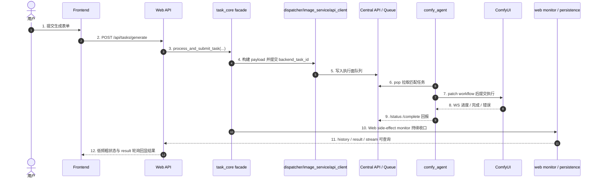

# 子模块: 生成任务全链路 (Task Full Chain)

## 1. 目标与适用场景
本文档用于说明当前系统中“生成任务”从前端发起，到 Web API 提交，到 `task_core` 派发，再到底层 Central API / Queue / Worker / ComfyUI 执行，以及状态回流、结果持久化、历史查询的完整链路。

适用场景：
- 新增一种新的生成任务类型
- 运维排查任务卡住、堆积、结果丢失、状态异常
- 排查 Web 端提交成功但 SSE / 结果 / 历史表现不一致
- 理解 `registry_task_id` 与 `backend_task_id` 的分工

本文档是对以下文档的补充而不是替代：
- `docs/子模块_任务调度_task_scheduler.md`
- `docs/子模块_中控API与节点通信_central_api.md`
- `docs/system_architecture_report.md`

## 2. 一句话主链
当前系统中更准确的生成任务主链是：

`Frontend Page/Form -> /api/tasks/generate -> task_submission_service -> task_core.process_and_submit_task(...) -> task_core_submission / task_dispatcher / image_service / api_client -> Central API / QueueManager -> comfy_agent（可经本地 relay/sidecar）-> ComfyUI -> status/complete 回流 -> Web monitor / history / coarse status / result`

要点：
- Web 主入口是 `POST /api/tasks/generate`，不是旧的 generation params 风格接口
- `task_core` 是统一门面，负责业务编排，不是 Central API
- Central API 是执行面，不负责上游计费、并发锁和历史持久化
- Worker 通过主动 `pop` 拉取任务，不是上游直接把 workflow 推到 Worker
- 新版 worker 的 `pop` 会带 `agent_id`；GPU Pool Controller 可把单个 worker 标记为 `draining/disabled`，用于模型同步、任务能力切换和 canary 前停止接新单
- `agent_id`、`draining/disabled`、GPU pool heartbeat 元数据只作用于 Worker Agent 层；它不会自动重启或替换目标 ComfyUI。`cloud_prod_worker_01` 的 agent 容器已支持新协议，但它调用的 `gpu-226:8188` 仍是宿主机 ComfyUI。
- 本地 relay/sidecar 只优化 worker 到云 Central/R2 的固定开销，不拥有队列事实；任务仍只有在 R2 上传成功且 Central `/complete` 成功后才算成功收口
- 本地 relay `/health` 是轻量存活检查，`/ready` 会检查云 Central 与上传 client；worker 到 relay/Central 的控制面半断持续超过默认阈值时，agent 会退出并交给 Docker restart。这个自愈只恢复 worker 进程，不改变任务成功必须 `/complete` 的语义
- 无法接入 Tailscale 的远程 Windows GPU 节点可使用 `remote_workers/` 独立 venv 包运行 bundled `comfy_agent` 与 `remote_relay`；它复用同一 Central `pop/status/complete/heartbeat` 语义，只是通过专用 Cloudflare Tunnel 域名访问云 Central

## 3. 分层职责图

## 4. 前端入口链路
### 4.1 表单与 payload 构造
前端生成页面负责收集用户输入，然后把输入转成统一提交 payload。

常见入口包括：
- `frontend/src/views/TextToImage.vue`
- 其他图生图、图生视频、换脸等页面
- 统一 payload 构造器，例如 `frontend/src/features/generation/buildGenerationTaskPayload.ts`

前端提交到后端时，核心字段通常包括：
- `task_type`
- `inputs`
- `prompt`
- `negative_prompt`
- `priority`
- `is_template`
- `source_post_id`

约束：
- 若是 Web 一等任务类型，前端必须提供稳定的 `task_type`
- 输入图片、LoRA、分辨率、时长等应统一收口到 `inputs`
- 新任务类型若要在主站展示为独立能力，前端页面、卡片入口、i18n 和历史/投稿/收藏相关展示也要一并补齐

### 4.2 任务提交与前端运行态
前端通常通过以下链路提交：
- `frontend/src/composables/useTaskStream.ts`
- `frontend/src/stores/tasks.ts`
- `frontend/src/stores/taskSessionState.ts`
- `frontend/src/stores/taskStreamTransport.ts`
- `frontend/src/stores/tasksRuntime.ts`

提交后会发生：
1. `useTaskStream.submitTask(...)` 调用 `POST /tasks/generate`
2. 后端返回 `task_id` 后，前端把该任务写入 `tasksStore`
3. `tasksStore.startStatusPolling(...)` 默认每 15 秒查询 `/tasks/{task_id}/status` 粗状态；pending 可显示队列位置，running 不显示生成百分比
4. 收到粗状态 `success` 后，前端转入 `/tasks/{task_id}/result` 轮询；结果 URL 未就绪时保持 `awaitingResult=true` 并展示“保存结果中”，当前轮询窗口约 120 次 * 1.5 秒，需覆盖视频 R2 warmup 可能超过 60 秒的情况
5. 若历史已落库，也可能通过最近历史或详情弹层展示结果

前端当前的状态语义重点：
- `pending`: 已提交但还在排队
- `running`: Worker 已开始执行，用户侧只展示“生成中”，不展示百分比
- `success`: 粗状态终态成功，前端随后去拿结果 URL
- `failed`: 执行失败或回流失败
- `cancelled`: 用户取消或执行面确认取消

## 5. Web API 提交链路
### 5.1 主入口
Web 统一入口在：
- `src/web_api/routers/tasks.py`
- `POST /api/tasks/generate`

这个入口本身应保持薄壳，主要负责：
- 接收 `TaskGenerateRequest`
- 注入当前用户
- 转发到 service
- 把领域异常映射为 HTTP 状态码

### 5.2 提交 service
真正的 Web 提交 service 在：
- `src/web_api/services/task_submission_service.py`

当前职责：
- 把 `prompt` 补入 `req.inputs`
- 生成 Web 侧 `task_id`
- 设定 correlation id
- 调用 `process_and_submit_task(...)`
- 开启 `TaskSubmissionSideEffectPlan(attach_web_monitor=True)`
- 返回给前端 `pending` 初态和余额变化

这意味着 Web 成功返回给前端时，任务通常已经：
- 完成了计费检查
- 完成了并发锁检查
- 完成了 registry 注册
- 完成了 backend 提交
- 挂好了 Web monitor side effect

## 6. task_core 业务编排链路
### 6.1 统一门面
统一主门面是：
- `src/core/task_core.py`
- `process_and_submit_task(...)`

它不是简单转发，而是负责编排整个业务提交过程：
- 取策略 `StrategyFactory.get_strategy(task_type)`
- 计算任务成本
- 检查并发锁
- 扣减灵石
- 组装提交上下文
- 执行提交 Saga
- 挂载 side effect
- 在失败时退款并释放锁

当前 `process_and_submit_task(...)` 内部已继续拆成稳定步骤：
- `task_core_process_flow.build_prepared_task_submission_request(...)`
- `task_core_process_flow.prepare_task_submission_context(...)`
- `task_core_process_flow.maybe_deduct_submission_credits(...)`
- `task_core_process_flow.execute_task_submission_attempt(...)`
- `task_core_process_flow.release_submission_lock_if_needed(...)`

### 6.2 provider / dependency 边界
当前 `task_core` 采用 facade + provider/dependencies 结构：
- `src/core/task_core.py`
- `src/core/task_lifecycle_contract.py`
- `src/core/task_core_default_dependencies.py`
- `src/task_core_process_defaults.py`
- `src/core/task_core_service_providers.py`
- `src/core/task_core_submission.py`
- `src/core/task_core_process_flow.py`
- `src/services/task_lifecycle_runner.py`
- `src/services/task_web_side_effects.py`
- `src/services/task_web_lifecycle_monitor.py`
- `src/services/task_web_terminal_finalization.py`
- `src/core/task_core_runtime.py`

关键规则：
- `core` 内不应重新直连基础设施实现
- `task_core_default_dependencies.py` 只保留纯 builder；runtime-specific billing / strategy / Web side effect 装配已下沉到 `src/task_core_process_defaults.py`
- Bot / Web / stream 对 backend `done/error/cancelled` 终态判断应共享 `task_lifecycle_contract.py`
- Web 侧已按 `side effects -> lifecycle monitor -> terminal finalization` 三段拆开，入口分别位于 `task_web_side_effects.py`、`task_web_lifecycle_monitor.py`、`task_web_terminal_finalization.py`
- Bot `task_service_flow.py` 与 Web lifecycle monitor 现共享 `task_lifecycle_runner.py` 的 monitor->route 骨架；Web runtime monitor 与 `task_web_finalizer.py` 共享 terminal router
- 默认 provider 注册由应用入口承担，不由 `core` 模块导入时自动注册
- 单测优先走显式 `dependencies` 或 `*_func` seam
- 当前 `TaskCoreServiceProviders` 与主要 capability 已补强 `Protocol` / 精确 `Callable` 类型；新增 provider/capability 时继续沿用显式契约，不要扩大弱类型字段
- provider 运行时注册仍依赖模块级全局状态，测试和离线路径应优先显式传入 dependencies，避免把模块级 patch 当成主测试策略

### 6.3 双 ID 语义
当前链路中始终同时存在两个 ID：

- `registry_task_id`
  - Web/Bot 对外主任务 ID
  - 用于前端 SSE、结果查询、历史、清理、恢复
  - 也是 `/api/tasks/generate` 返回给前端的 `task_id`

- `backend_task_id`
  - 真正派发到底层执行面的运行态 ID
  - 用于 Central API / Queue / Worker / backend cancel

排障红线：
- 任何运行态查询、取消、强制终止、僵尸清理都必须先确认当前用的是哪个 ID
- 前端和 Web API 对外接口大多围绕 `registry_task_id`
- 执行面、队列和 Worker 更多围绕 `backend_task_id`

## 7. dispatcher 到 backend 执行面的下发
### 7.1 按任务类型选择策略
下发前的任务类型分流主要在：
- `src/core/task_dispatcher.py`

这里决定：
- 用哪种策略计算价格
- 哪些输入文件需要先上传到存储
- 如何构造 metadata / payload
- 调用 `image_service` 的哪个提交方法

例如：
- `txt2img` 走 `submit_txt2img_task(...)`
- `i2i_pro` 和 `i2i_draw` 有独立提交方法
- `img2img_lora` 会带 `lora_name` 和 `lora_strength`
- 视频类会根据分辨率、时长转成底层所需尺寸和帧长

### 7.2 image_service / api_client
dispatcher 下游通常会继续经过：
- `src/services/image_service.py`
- `src/api_client.py`

职责划分：
- `task_dispatcher.py` 负责选择策略和高层任务语义
- `image_service.py` 负责按任务类型封装后端提交调用
- `api_client.py` 负责实际 HTTP 请求到底层执行面

注意：
- 当前 simple route 仍可能映射到 legacy `TaskType`，但 `txt2img` 已和其他任务一样通过标准 simple route 提交，并显式携带上游 `task_id`
- `image_service.py` / `api_client.py` 只负责把统一语义下沉到 Central API，不再由 `txt2img` 单独生成 backend task id
- Wan22 AIO 视频的稳定配置入口是 `src.domain_config.wan22_aio_video`。旧 `src.services.wan22_video_v2_config` / `src.services.wan22_video_v2_context` 兼容 re-export 已删除，不应作为新增逻辑的事实源。
- `custom_video` / `video_lora`、Telegram 懒人动图 mode 与 `wan22_video_v2` 是不同用户功能入口，但底层由 `Wan22AioVideoStrategy` 与共享 submit helper 收口：公开类型继续写历史和展示，执行面类型用于 Central API / Worker 路由。

## 8. Central API / QueueManager 执行面
### 8.1 角色定位
Central API 是执行面，不是业务主入口。
云正式当前运行在 `cloud-central-api-prod`，本地 `cloud-prod-comfy-agent-*` 通过 Tailscale 从云 Central 拉取任务。

核心文件包括：
- `backend/app/main.py`
- `backend/app/main_simple_task_routes.py`
- `backend/app/queue_manager.py`
- `backend/app/queue_manager_flow_helpers.py`
- `backend/app/routers/agent.py`

执行面负责：
- 接收 backend 任务
- 在 `comfy:task_events:{backend_task_id}` 发布运行态与终态事件；其中 `done/error` 终态事件应附带 `task_type`，并优先带上 `worker_id`、`created_at` 等最小详情，供 Dashboard / stream 消费端在上游 runtime cleanup 已发生时仍能完成观测落库
- 写入 pending 队列
- 维护 worker 心跳视图
- 处理 agent `pop`；V2 worker 可使用 `/api/agent/task/pop?cancel_lock=true` 在真实接单时写入 `cancel_locked=1`、`execution_phase=preparing`，表示任务已进入输入准备/执行流水线，后续用户取消应返回不可取消而不是写 `cancel_requested`
- 提供只读 agent `peek` 供 worker 预取输入；`peek` 不能改变 pending/running/status/heartbeat，真实接单仍必须走 `pop`
- 接收运行态状态更新
- 接收完成上报；终态回报采用 compare-and-clear 清理 agent `current_task_id`，避免旧任务后台 complete 清掉新任务展示
- best-effort cancel
- 提供 `/status/{backend_task_id}`、`/system/status` 与 `/system/workers` 观测快照；这些接口使用短 TTL/stale 缓存与同 key 单飞刷新来承压高频轮询，不参与真实调度、Worker `pop`、状态上报、完成回流或终态收口

### 8.2 simple task route 与特例
常规 simple task route 在：
- `backend/app/main_simple_task_routes.py`

这里把上游任务 key 映射到 Central API 的 `TaskType`。

当前稳定业务/执行类型至少包括：
- `img2img`
- `img2img_lora`
- `face_swap`
- `image_to_video`
- `face_video`
- `i2i_pro`
- `i2i_draw`
- `txt2img`
- `ltx_video`
- `wan22_video_v2`

`video_insert` / `video_edit` 不再作为新增业务类型或独立 workflow 方向，只作为 legacy route / Central / Worker alias 保留，最终必须归一到 `TaskType.IMAGE_TO_VIDEO` / execution `image_to_video`。

其中 `txt2img` 当前通过 `/txt2img` simple route 进入执行面，Central API 内部仍映射到 legacy `TaskType.T2I_PORNMASTER_TURBO`。旧图生视频的 `/image_to_video` 与 `/perfect_video_lora` 会入队到执行面 `TaskType.IMAGE_TO_VIDEO`，但上游历史类型仍保留 `custom_video` / `video_lora`；旧 `/perfect_video_insert` 与 `/perfect_video_edit` 只作为兼容 endpoint 保留，会把旧 width/height/frame length 归一为 Wan22 `resolution_preset` 与秒数后入队 `TaskType.IMAGE_TO_VIDEO`。Telegram 懒人动图的差异应停留在 FSM 内置 prompt 与历史 mode，不再对应独立 worker workflow。Wan22 AIO 当前明确分两档 profile：旧图生视频 `custom_video` / `video_lora` / Web 字面量 `image_to_video` / 懒人动图 mode / legacy `video_insert`、`video_edit` -> execution `image_to_video` -> `legacy_image_to_video` profile；图生视频 v2 `wan22_video_v2` -> execution `wan22_video_v2` -> `wan22_video_v2` profile。`i2i_pro` RunPod 是现有 ComfyUI runtime profile，不新增业务类型；它可同时声明 `SUPPORTED_TASK_TYPES=i2i_pro,t2i-pornmaster-turbo,face_swap`，其中 Web `txt2img` 通过 `TASK_TYPE_WORKFLOW_OVERRIDES` 读取 `txt2img_from_i2i_pro.json`，`face_swap` 读取 `face_swap_v2.json`。`face_swap_v2.json` 也是 workflow 替换，不是新业务类型；上游仍提交 `face_swap`。新增任务类型时，不要默认假设只改 `SIMPLE_TASK_TYPE_MAP` 就够，还要确认 request model、dispatcher 和 worker workflow 映射是否齐全。

### 8.3 QueueManager 的职责
QueueManager 负责执行面排队与 Worker 选择，关键职责包括：
- `enqueue_task`
- 维护 pending / running 任务
- 按可用类型给 Worker 分配任务
- 维护 worker heartbeat 与 task heartbeat
- 支持取消、dequeue、zombie 扫描和状态迁移；locked running 任务不可取消，legacy 未锁 running 任务仍保留 `cancel_requested` 兼容语义
- 支持 `peek_pending_tasks(...)` 只读扫描 pending 队列，供预取流水线观察“下一单候选”，但不做 reservation

从系统语义上看：
- Web/Bot 提交成功不代表 Worker 已接单
- Worker 接单前，任务仍可能只停留在 pending 队列
- 没有匹配 `SUPPORTED_TASK_TYPES` 的 Worker 时，任务会持续排队

## 9. Worker / ComfyUI 执行链路
### 9.1 Worker 主循环
当前底层 Worker 主循环主要在：
- `workers/comfy_agent/agent_main.py`
- `remote_workers/comfy_agent/agent_main.py` 是给非 Tailscale 远程 Windows 节点 sparse-checkout 使用的同源 bundled 副本

启动后主要做三件事：
- `poll_loop()`: 向 Central API 拉取可执行任务
- `heartbeat_loop()`: 上报节点和任务心跳
- `ws_listener_loop()`: 监听 ComfyUI WebSocket 获取进度和终态

关键环境变量：
- `AGENT_ID`
- `SUPPORTED_TASK_TYPES`
- `MASTER_API_URL`
- `COMFY_API_URL`
- `COMFY_WS_URL`
- `UPLOAD_SIDECAR_URL`
- `PREFETCH_ENABLED`
- `PREFETCH_DEPTH`
- `PREFETCH_TASK_TYPES`
- `PREFETCH_CACHE_DIR`
- `PIPELINE_ENABLED`
- `PIPELINE_MAX_RUNNING_TASKS`
- `PIPELINE_TASK_TYPES`
- `CANCEL_LOCK_ON_POP`
- `RESULT_SPOOL_DIR`

运维含义：
- 某任务长时间 pending 时，要先看是否有 Worker 声明支持该任务类型
- Worker 存活但 `SUPPORTED_TASK_TYPES` 不匹配，任务依然不会被接单
- RunPod `i2i_pro` worker 必须声明 `SUPPORTED_TASK_TYPES=i2i_pro,t2i-pornmaster-turbo,face_swap` 与 `POOL_RUNTIME_PROFILE=i2i_pro`，并设置 `TASK_TYPE_WORKFLOW_OVERRIDES={"t2i-pornmaster-turbo":"txt2img_from_i2i_pro.json","face_swap":"face_swap_v2.json"}`；cloud-test canary 会临时禁用同环境中支持这些执行类型的非 RunPod worker，结束后必须恢复。
- RunPod `scail2` worker 必须声明 `SUPPORTED_TASK_TYPES=scail2_action_transfer,scail2_video_replacement` 与 `POOL_RUNTIME_PROFILE=scail2`；cloud-test canary 会临时禁用同环境中支持这两个执行类型的非 RunPod worker（通常是 `cloud_worker_test_08`），结束后必须恢复。云正式可使用 gpu-002 slot0 LAN AIO agent `lan_aio_prod_gpu002_gpu0_scail2_01`，也可使用手动正式 RunPod `runpod_prod_scail2_manual_NN` 并行接单；正式 RunPod 必须写 `user-data-prod` 且模型只从 `allbot-model-cache` 同步。
- `image_to_video` 是旧图生视频 `custom_video` / `video_lora` 与 Telegram 懒人动图的执行面类型；生产 worker 接入新链路时必须支持 `image_to_video`。worker 继续声明 `video_insert` / `video_edit` 只用于兼容旧队列残留，不应被当作新任务能力扩展方向。

### 9.2 输入准备
Worker 拉到任务后会先处理输入：
- 从 MinIO 下载输入图片或视频
- 把输入通过 ComfyUI API 上传到 ComfyUI input 区
- 补全 `image` / `image2` / `image3` / `face_image` / `body_image` / `video` 等参数
- 输入下载优先使用 boto3 S3 client 读取当前 R2/MinIO 兼容对象存储，`MINIO_BOTO3_DOWNLOAD_ENABLED=false` 时可回退旧 MinIO SDK 路径；`MINIO_REGION` 未显式配置时，R2 endpoint 默认 `auto`，其它 MinIO endpoint 默认 `us-east-1`。
- 输入下载有两层超时保护：S3/MinIO HTTP 连接与读超时由 `MINIO_CONNECT_TIMEOUT_SECONDS`、`MINIO_READ_TIMEOUT_SECONDS`、`MINIO_HTTP_RETRY_TOTAL` 控制，连接池由 `MINIO_HTTP_POOL_MAXSIZE` 控制；整次输入文件下载由 `MINIO_DOWNLOAD_TIMEOUT_SECONDS`、`MINIO_DOWNLOAD_RETRY_ATTEMPTS`、`MINIO_DOWNLOAD_RETRY_DELAY_SECONDS` 控制。下载失败或超时会清理本地目标文件和 `.part.minio` 临时文件，并让任务进入失败补偿路径，避免 worker 长时间停在 `preparing` 而 ComfyUI 队列始终为空。
- 开启 `PREFETCH_ENABLED` 时，worker 会在当前 ComfyUI 执行期间通过 relay/Central `/api/agent/task/peek` 只读查看同类型下一单，并提前下载、规范化和上传输入。真实 `/pop` 后只有 `task_id` 命中预取缓存才复用；miss 或类型不匹配会丢弃缓存并回退原输入准备流程。预取阶段不做取消检查，不改变 Central 队列状态。
- 开启 `PIPELINE_ENABLED` 时，worker 不只依赖 peek：在本地 running slot 未满时会真实 `/pop?cancel_lock=true` 下一单，并在上一单 GPU 执行期间完成输入准备与 ComfyUI `queue_prompt`。默认每个 worker 最多持有 2 个 Central running 任务，pending 仍可取消，进入输入准备后不可取消。

无输入的任务类型也必须确认 workflow patcher 对纯文本场景兼容，例如 `txt2img`。

### 9.3 workflow 选择与 patch
底层 workflow 选择依赖：
- `src/workflow_mapping_validation.py`
- `workers/comfy_agent/workflows/mappings.json`
- `workers/comfy_agent/workflow_patcher.py`

关键点：
- `TASK_TYPE_WORKFLOW_FILENAMES` 决定任务类型默认绑定哪个 workflow JSON
- `TASK_TYPE_WORKFLOW_OVERRIDES` 可在单个 Worker 环境变量中覆盖某个 task type 的 workflow JSON，用于云测试/canary；未设置时仍走默认绑定，override 文件名必须留在 workflow 目录内
- RunPod 使用 `remote_workers/` bundle；当 `i2i_pro` profile 需要同时接 `i2i_pro/t2i-pornmaster-turbo/face_swap` 时，`remote_workers/src/workflow_mapping_validation.py` 必须支持 `TASK_TYPE_WORKFLOW_OVERRIDES`，且 `remote_workers/comfy_agent/workflows/` 必须包含 `txt2img_from_i2i_pro.json` 与 `face_swap_v2.json`。SCAIL-2 默认映射读取 `remote_workers/comfy_agent/workflows/SCAIL-2_Replacement_audio.api.json`、`SCAIL-2_Animation_multi-char_audio.api.json` 与 `SCAIL-2_FaceSwap_v10_firstframe_faceswap_replacement_audio.api.json`；只更新本地主 `workers/` 会让新建 RunPod Pod 继续读取旧默认 workflow。
- 当前 `face_swap` 在测试 worker1、正式 worker1 和 RunPod `i2i_pro` profile 中通过 override 指向 `face_swap_v2.json`。v2 使用 `i2i_pro` 的 Flux2/edit 节点与模型，去掉旧换脸专用 LoRA / DifferentialDiffusion；`mappings.json` 继续只写入 `face_image -> 2`、`body_image -> 3`，未设置 override 的其它 worker 仍走旧 `face_swap.json`。
- `mappings.json` 决定输入参数如何映射到 workflow 节点
- `workflow_patcher.py` 负责把运行时参数打进具体 workflow
- `image_to_video`、legacy `video_insert` / `video_edit` 与 `wan22_video_v2` 当前共用 `Wan22AioV82.json`，由 `_patch_wan22_aio_workflow(...)` 统一 patch。旧入口与懒人动图通过 `legacy_image_to_video` profile 注入主模型；旧 `video_lora` 会把 `{lora_name}_high_noise.safetensors` / `{lora_name}_low_noise.safetensors` 写入工作流 LoRA 槽，v2 始终清空额外 LoRA 槽。
- 对 `image_to_video` / `video_insert` / `video_edit` 这类共享 workflow 的 alias，`TASK_TYPE_WORKFLOW_FILENAMES`、`mappings.json` 和 `TASK_SPECIFIC_PATCHERS` 必须同轮更新，并同步 `workers/` 与 `remote_workers/`。只让挂载目录里的 workflow/mapping 先生效、但容器镜像中的 `workflow_task_patchers.py` 仍是旧版，会出现“读到新 `Wan22AioV82.json` 但仍按旧 patcher 提交”的半更新状态，典型表现是 ComfyUI `/prompt` 400、`LoadImage` 还在读取模板占位文件。
- V82 在 `2603` 最终帧序列后接 `265` 插帧；默认使用 `FL_RIFE` (`multiplier=4`)。patcher 检测到 `265` 后会把 `28` 视频输出、`2575` 帧数统计和 `2607` 尾帧提取都指向 `["265", 0]`，避免运行时覆盖导致插帧失效。历史生产 worker3 / `192.168.1.177:8189` 的 `FL_RIFE` 修复已随 gpu-177 旧链路退役；当前 image_to_video 入口是 gpu-177 GPU0 AIO `8190` 或其它同 profile 容量，必须由 AIO 镜像/manifest 提供 RIFE 缓存。
- Wan22 AIO 的 `5s/8s/10s` 时长最终由 worker patcher 写入 `2578.inputs.value`，再经 workflow 内部帧数公式得到 `81/129/161` 源帧；计费和 result meta 使用同一份 `src.domain_config.wan22_aio_video` duration 归一化。
- 旧图生视频 Web/Bot 历史类型仍是 `custom_video` / `video_lora`，懒人动图历史类型仍是其具体 mode；执行面 task type 才是 `image_to_video`。排障时需要同时确认上游历史类型、registry task type 和 backend task type。
- SCAIL-2 真实 task type 包括 `scail2_action_transfer`（动作迁移）、`scail2_video_replacement`（视频换人）以及 `scail2_face_swap_v2`（视频换脸 v10 two-stage）。Web payload 使用 `inputs.images=[参考图, 驱动视频]`、可选 `prompt`、`negative_prompt`、`duration`；Bot 入口在“视频生视频”二级菜单下，三类 SCAIL-2 任务都收集参考图、驱动视频和可选正向提示词，Bot 可跳过、Web 可留空，空值由 `normalize_scail2_positive_prompt(...)` 按 task type 补默认提示词。负面词使用默认值，驱动视频上限 40MB。dispatcher 会转换为 Central simple route 的 `image`、`video`、`prompt`、`negative_prompt`、`length`，并把 SCAIL-2 duration / negative prompt 写入提交元数据，Web 成功落库时进入 `extra_outputs.scail2_context`。SCAIL-2 Web/Bot 成功结果可投稿；Web 一键应用只复用原 motion/driving video，复用者重新上传 reference image，衍生任务必须保持 `allow_contribute=false`。业务 workflow 必须是 API format；当前三类任务默认覆盖到 audio/v10 workflow，其中 `scail2_face_swap_v2 -> SCAIL-2_FaceSwap_v10_firstframe_faceswap_replacement_audio.api.json`。v10 是两阶段流程：worker 先抽驱动视频第一帧，调用 `face_swap_v2.json` 把用户参考脸换到首帧，再把换脸后的首帧作为 SCAIL-2 reference image，并走视频换人式 `human` track / replacement workflow。worker patcher 固定 512x896、`force_rate=16`、`skip_first_frames=0`，5s/8s 分别写 `81/129`；动作迁移强制 `replacement_mode=false`，视频换人与视频换脸 v2 强制 `replacement_mode=true`。云测试执行 runtime 可以是 gpu-002 LAN AIO SCAIL-2 容器 `http://192.168.1.2:8190` + `cloud_worker_test_08`；云正式 LAN slot0 `lan_aio_prod_gpu002_gpu0_scail2_01` 接三类 SCAIL-2 任务并只写 `user-data-prod`，正式 RunPod `scail2` profile 仍只接动作迁移与视频换人。

如果出现以下错误，优先看这三层：
- Worker 报 `Workflow for xxx not found`
- patch 后 ComfyUI 报节点输入缺失
- 某参数前端传了但底层 workflow 实际没吃到

### 9.4 执行与结果上传
Worker 执行流程：
1. 真实 `/pop` 后进入输入准备；若使用 `cancel_lock=true`，该阶段起用户取消不再受理
2. 向 ComfyUI 提交 patched workflow，拿到 `prompt_id`
3. 通过 WebSocket 监听 `execution_start` / `progress` / `execution_success` / `execution_error`
4. `wait_for_task_completion(...)` 以 WebSocket 终态为快路径，同时在提交后约 45 秒开始周期性探测 ComfyUI `/history/{prompt_id}`，约每 12 秒探测一次；若 history 已有结果，会立即设置完成态，避免半活 WebSocket 让 Worker 等满旧的固定窗口
5. Worker 普通任务保留约 30 分钟硬超时，超时后先做最终 history 探测；若仍无结果则抛出 `TaskExecutionTimeoutError` 并按失败上报，避免超时后误进入成功收口。RunPod `wan22_video_v2` profile 默认使用约 10 分钟专属完成超时，timeout 时会 best-effort 调用 ComfyUI `/interrupt`，上报失败并退出 agent/container，让外层重启获得干净 ComfyUI 队列，避免继续接下一单叠在卡住的 prompt 后面
   - RunPod `wan22_video_v2` ComfyUI 启动 env 还默认带 `COMFY_EXTRA_ARGS=--disable-dynamic-vram`；若日志停在 `WanTEModel prepared for dynamic VRAM loading` 后无采样进展，先核验该 env 是否在新 Pod 中生效，再继续排查 workflow、模型或 GPU 规格。
6. 开启双槽 pipeline 时，当前任务 GPU 完成后会进入后台 finalizer；worker 可同时让下一单继续占用 ComfyUI/GPU 队列。WebSocket 事件按 `prompt_id -> TaskExecutionContext` 路由，heartbeat 会覆盖本地所有 running/finalizing context。
7. finalizer 从 ComfyUI history 或 view API 取回结果文件
8. `i2i_pro` 在上传前会对主结果做轻量质量闸门：若 ComfyUI success 但输出为纯黑/极暗图，或与参考输入过度相似，worker 会换 seed 重新提交一次；重试后仍退化则按失败上报，避免把黑图或近原图结果 `/complete` 给用户。
9. 上传结果到当前 output bucket。云正式/云测试 worker 可先把结果写入本地 `RESULT_SPOOL_DIR`，再交给本地 relay sidecar 上传 R2；未配置 `UPLOAD_SIDECAR_URL` 时继续由 worker 进程直接上传。
10. 向 Central API 调 `/api/agent/task/complete`。完成回报是任务收口的硬依赖：Worker 会对断连或 4xx/5xx 进行短退避重试，全部失败后必须抛错进入失败路径，不能吞掉异常后继续记录 `completed successfully`，否则会出现“结果已上传但 Central 仍按 heartbeat lost 判失败”的假完成。无论是否使用 sidecar，都必须先拿到 R2/S3 put 成功确认，再 `/complete`。
11. 向 Central API 调 `/api/agent/task/status` 的运行态上报也会做轻量重试；status 上报重试耗尽只记录错误，不应直接让当前生成任务失败。Dashboard 上看到的短暂状态缺口要和真正的任务终态失败区分开。

执行失败则走：
- `/api/agent/task/status` 上报 `failed`

维护口径：
- `workers/comfy_agent/agent_main.py` 已拆出输入准备、workflow 执行、结果物化、结果上报等 helper；旧 `process_task(...)` 仍保留串行兼容路径，双槽主链由 `_launch_pipeline_task(...)`、`_prepare_and_submit_task(...)` 与 `_finalize_execution(...)` 协作完成。
- `workers/local_relay/relay_main.py` 是本地 worker relay 与上传 sidecar；非终态 status 可本地 ACK 后合并转发，`pop/check/complete/failed/cancelled` 必须同步转发。`/health` 只表示进程存活，`/ready` 检查 Central 与上传 client，供宿主机 watchdog 判定是否精确恢复 relay；`/ready` 404 是旧运行版本信号，watchdog 只记录不重启。sidecar 上传失败时当前任务应走 failed/status 路径，不得提前 complete。
- 新增输出类型、失败补偿、取消检查、重试策略或上报语义时，优先把阶段逻辑下沉到对应 helper，并补 `tests/workers/test_comfy_agent.py` / `tests/workers/test_agent_result_materialization.py` focused tests。
- `_route_ws_event(...)` 仍承担多种 ComfyUI WebSocket 事件分发；新增事件类型时优先拆 handler map 或独立 handler，避免继续扩大单函数条件分支。

## 10. 状态回流与结果落地
### 10.1 Worker 到执行面
Worker 上报的关键回调包括：
- `/api/agent/task/status`
- `/api/agent/task/complete`
- `/api/agent/task/heartbeat`
- `/api/agent/task/task_heartbeat`
- `/api/agent/task/peek`（只读预取 hint，不是接单）
- `/api/agent/task/pop?cancel_lock=true`（真实接单并进入取消锁）

执行面据此更新：
- 任务状态
- 运行中进度
- 节点当前负载
- 完成结果路径

### 10.2 Web side-effect finalizer
Web 任务提交成功后，真正负责“收尾”的是：
- `src/services/task_web_side_effects.py`
- `src/services/task_web_lifecycle_monitor.py`
- `src/services/task_web_terminal_finalization.py`
- `src/services/task_web_finalizer.py`

当前口径是“持久化 finalizer + 恢复循环”：
- 提交成功时先由 `task_web_side_effects.py` 把收尾上下文写入 Redis `pending_web_finalizers`
- Web API 启动后持续运行 finalizer loop，按 `backend_task_id` 轮询终态
- 即使 Web 进程重启，只要任务已成功提交，后续仍可恢复成功持久化 / 退款 / cleanup
- 多 worker Web API 会同时运行 finalizer loop；处理单条 pending record 时必须先拿 Redis lock，并在锁后重新读取该 record。`hgetall` 的批量快照只能用于枚举候选 key，不能作为最终收口数据源。
- Web 成功历史持久化必须以 `user_id + task_id + source` 幂等；重复终态收口时更新/跳过已有 `History`，并跳过重复 R2 warmup，避免同一任务写出多条历史。
- Web 成功 finalizer 不能吞掉历史落库异常；`persist_successful_web_history` 失败必须抛出，让 Redis `pending_web_finalizers` 保持可重试，runtime cleanup 只能在历史持久化成功后执行。排查“ComfyUI 已生成但 Web 没结果”时，要同时查 pending finalizer、history 落库错误和 R2 对象。
- `History.type` 当前为 `String(64)`，用于保存真实业务 task type；新增长 task type（例如 SCAIL-2 的 `scail2_face_swap_v2`）时不得沿用旧的 20 字符假设，否则会出现结果对象已保存但历史插入失败。
- SCAIL-2 若出现“backend 已 done 且有 `result_path`，但 Web result/闪回瓶缺记录”，先确认 Alembic 已把库中 `history.type` 迁到 64，再使用 `scripts/recover_scail2_history_delivery.py` 分步恢复；脚本覆盖 `scail2_action_transfer`、`scail2_video_replacement` 与 `scail2_face_swap_v2` 的 `done + result_path` 任务。backend `error/cancelled`、无 `result_path`、无 History output 或无 Telegram 绑定只记审计/跳过，不退款、不手工插入 History、不重启 GPU/RunPod。
- 历史主动发送必须用统一媒体类型判断（`get_media_type_from_history` / `VIDEO_TASK_TYPES`），不能只靠 `"video" in history.type`；`scail2_action_transfer` 和 `scail2_face_swap_v2` 都必须按 `sendVideo` 发送。

它负责把 backend 终态转为 Web 可消费的最终语义：
- `task_web_lifecycle_monitor.py` 负责构造 terminal snapshot
- `task_web_terminal_finalization.py` 成功时持久化历史
- 必要时进行 R2 warmup
- 失败时退款
- 取消时退款
- 最后释放并发锁并清理 registry 运行态

这也是为什么：
- router 不应该自己做历史落库
- 前端不应该自己做终态补偿
- 结果是否最终可见，不只取决于 Worker 是否执行成功，还取决于 finalizer/persistence 是否收口完成

### 10.3 粗状态、SSE 与结果查询
Web 端当前用户侧运行态与结果查询链路分成三层：

- 用户侧粗状态：
  - `GET /api/tasks/{task_id}/status`
  - service 入口：`src/web_api/services/task_runtime_api_service.py`
  - 默认由前端每 15 秒低频轮询；pending 可返回 `queue_pos` 展示队列位置，running 不返回/不展示生成百分比，success 后转入 result 轮询

- 兼容实时流：
  - `GET /api/tasks/{task_id}/stream`
  - service 入口：`src/web_api/services/task_stream_api_service.py`
  - 后端 SSE 与 Redis Pub/Sub 能力保留，但不再作为 Web 前端默认用户侧进度展示路径

- 结果态：
  - `GET /api/tasks/{task_id}/result`
  - service 入口：`src/web_api/services/task_result_service.py`

重要语义：
- `status` / `stream` / `result` 对外接收的都是 `registry_task_id`
- service 内部会尽量解析出真正的 `runtime_task_id` / `backend_task_id`
- 用户侧不展示生成百分比；Central 和 Worker 内部仍可写入完整 progress/status/heartbeat，供 monitor、排障和终态收口使用
- 若运行态已消失但历史已存在，SSE 应返回可终止的 fallback 语义，而不是无限轮询
- SSE 不能只依赖 Redis Pub/Sub 事件。Pub/Sub 是进度快路径；Web API 订阅、读取或关闭 Pub/Sub 失败时不得让 SSE 冒 ASGI Exception，同一连接应继续通过 Central `/status/{backend_task_id}` 补偿轮询到终态。任务进入 `running` 后仍需周期性查询 Central `/status/{backend_task_id}`，用于补偿终态事件丢失、Web 连接断开重连或 worker 回报路径异常时的前端收口。Web API 会对同一 `api_base + backend_task_id` 的 status 拉取做约 2 秒共享缓存，避免多个浏览器连接重复打 Central；同一任务状态/队列位置/进度连续不变时，Web SSE 补偿轮询会从 pending 约 5 秒、running 约 10 秒逐步退避到默认最多约 20 秒，状态变化后恢复初始间隔。
- Central `/status/{backend_task_id}` 是单任务观测接口，默认约 2 秒 TTL、4 秒 stale 窗口，并有最大条目数上限；过期刷新期间可短暂返回旧快照，真实任务分发、Worker 上报、完成回流和 cancel 仍走实时路径。排查时若看到前端状态晚几秒进入终态，应结合 Redis 事件、Central `complete` 日志和 Web monitor 落库判断。可用 `TASK_STATUS_CACHE_TTL_SECONDS`、`TASK_STATUS_CACHE_STALE_SECONDS`、`TASK_STATUS_CACHE_MAX_ENTRIES` 调整。
- Central `/system/status` 与 `/system/workers` 是 Dashboard/Bot 的观测接口，使用短 TTL/stale 快照缓存；它们不参与真实任务分发和终态收口。Dashboard 对 active task 的 backend status 聚合默认再做约 5 秒缓存；Bot 用户侧任务进度默认不再订阅 Pub/Sub，而是每 15 秒 HTTP polling 粗状态，pending 队列位置变化可编辑消息，running 不按 progress 百分比反复编辑。
- `result` 对 Web 历史优先取 R2 公网结果地址；延迟敏感路径必须用 R2 公网 HEAD 快探测并在查对象存储前释放 DB 只读事务，不能用慢 S3 API HEAD 阻塞请求。R2 warmup 未就绪时，图片可对任务本人返回短有效期 MinIO presigned fallback；视频不走 MinIO 代理 fallback，应返回 `pending_result` 等下一轮轮询拿 R2。前端结果轮询窗口必须覆盖分钟级 R2 warmup，避免 `awaitingResult` / “保存结果中” 阶段被视频拉流、R2 HEAD 阻塞或短轮询窗口拖成网络失败/不返回结果。

## 11. 历史、收藏、投稿与结果可见性
对于 Web 一等任务类型，只打通底层执行链路通常还不够，还要看是否要进入这些链：
- `History` 落库
- 最近历史列表
- 收藏
- 投稿
- 详情弹层
- Gallery / My Favorites / My Submissions
- i18n 任务类型文案

如果一个任务“能生成但前端看不见”，常见不是 worker 问题，而是这些展示链没补齐。

## 12. 新任务类型添加清单
新增生成任务类型时，按下面顺序检查最稳妥。

### 12.1 前端层
- 是否需要新的页面、卡片入口、路由
- 是否补了 `task_type` 常量与文案
- 是否补了表单到 `inputs` 的 payload 构造
- 是否需要进入历史、收藏、投稿、详情、筛选 tabs

### 12.2 业务编排层
- `src/constants.py` 是否补了 mode、成本、名称映射
- `src/core/task_dispatcher.py` 是否为该类型接入正确策略
- `image_service.py` / `api_client.py` 是否新增对应提交方法
- 是否要走现有兼容链，还是应成为标准 simple route

### 12.3 Central API 层
- 若走 simple route，`backend/app/main_simple_task_routes.py` 是否补了 `SIMPLE_TASK_TYPE_MAP` 和路由
- 相关 Pydantic request / enum / handler 是否齐全
- QueueManager 是否能识别并分发该类型

### 12.4 Worker / workflow 层
- `src/workflow_mapping_validation.py` 是否补了 workflow 文件映射
- `workers/comfy_agent/workflows/` 是否新增 workflow JSON
- `workers/comfy_agent/workflows/mappings.json` 是否补了参数映射
- `workflow_patcher.py` 是否需要支持新参数
- 对应环境中的 Worker `SUPPORTED_TASK_TYPES` 是否包含该类型

### 12.5 收尾与展示层
- `task_result_service.py` 是否能正确返回公网可访问结果
- 历史、收藏、投稿、Gallery 筛选是否要纳入该类型
- 中英文 locale 是否补齐
- focused tests 和黄金路径回归是否补齐

## 13. 运维排障清单
### 13.1 前端提交直接失败
优先检查：
- `/api/tasks/generate` 返回码
- 是否触发 402 灵石不足
- 是否触发 429 并发锁限制
- `task_submission_service.py` 是否把必要字段写入了 `inputs`

### 13.2 一直 pending，不进入 running
优先检查：
- Central API 是否收到 backend 任务
- `/system/status` 是否只是观测缓存滞后；真实判断应结合 worker 日志、Central `pop/status/complete` 访问日志与队列指标
- Queue 是否持续堆积
- 是否存在支持该 `task_type` 的 Worker
- Worker `SUPPORTED_TASK_TYPES` 是否匹配
- Worker heartbeat 是否正常
- 若 Queue 已归零、目标 worker 显示 `running` 且 `execution_phase=preparing`，但 ComfyUI `/queue` 为空，这不是“没有接单”，而是卡在输入准备阶段。优先查 worker 对象存储下载日志、`/tmp/input/*.part.minio` 临时文件增长情况、R2/MinIO 读延迟和 `MINIO_DOWNLOAD_*` 超时配置。

### 13.3 running 后卡死或长时间 1%
优先检查：
- Worker 日志
- ComfyUI WebSocket 是否正常
- ComfyUI workflow 是否真的开始执行
- `task_heartbeat` 是否仍持续更新
- 是否有取消请求未被 Worker 轮询到

### 13.4 SSE 提示“任务不存在或无权限”
优先检查：
- 当前查询的是 `registry_task_id` 还是 `backend_task_id`
- active task 中是否还保留该任务
- 历史是否已落库
- `task_stream_api_service.py` 是否正确把 `backend_task_id` 作为 runtime 查询 ID

### 13.5 历史有记录，但结果预览空白
优先检查：
- `History.output_file` 是否已写入
- Web 结果地址是否能通过 R2 或 owner-only MinIO 短签解析
- R2 公网地址是否已准备完成；R2 未 ready 时 `/result` 图片可返回 MinIO fallback，视频应继续 `pending_result`，同时检查 R2 公网 HEAD 快探测是否被短超时保护
- `/api/tasks/{task_id}/result` 当前返回的是 `success` 还是 `pending_result`

### 13.6 新任务类型在某环境不接单
优先检查：
- 该环境的 compose / env 里是否声明了该类型
- workflow JSON 是否已部署到对应 Worker
- `mappings.json` 是否同步到该环境
- 该类型是不是仍走 legacy 别名，而 Worker 只声明了新名字或反过来

## 14. 当前稳定结论
- Web 主入口是 `POST /api/tasks/generate`
- `task_core.process_and_submit_task(...)` 是统一业务提交门面
- `registry_task_id` 与 `backend_task_id` 必须显式区分
- `task_dispatcher.py` 决定任务类型如何下发到底层
- Central API 是执行面，不是业务编排面
- Worker 通过 `pop` 主动拉取任务并按 `SUPPORTED_TASK_TYPES` 过滤
- workflow 默认绑定关系由 `TASK_TYPE_WORKFLOW_FILENAMES + mappings.json + workflow_patcher.py` 共同决定；单 Worker 可用 `TASK_TYPE_WORKFLOW_OVERRIDES` 做测试/canary 覆盖
- Web 最终可见性不仅取决于 Worker 执行成功，还取决于 monitor、history、result 公网地址和前端展示链是否完整

## 15. 推荐联读文件
- `frontend/src/composables/useTaskStream.ts`
- `frontend/src/stores/tasks.ts`
- `src/web_api/routers/tasks.py`
- `src/web_api/services/task_submission_service.py`
- `src/web_api/services/task_stream_api_service.py`
- `src/web_api/services/task_result_service.py`
- `src/core/task_core.py`
- `src/core/task_core_submission.py`
- `src/services/task_web_lifecycle_monitor.py`
- `src/core/task_core_runtime.py`
- `src/core/task_dispatcher.py`
- `backend/app/main_simple_task_routes.py`
- `backend/app/queue_manager.py`
- `backend/app/routers/agent.py`
- `workers/comfy_agent/agent_main.py`
- `workers/comfy_agent/workflow_patcher.py`
- `src/workflow_mapping_validation.py`
