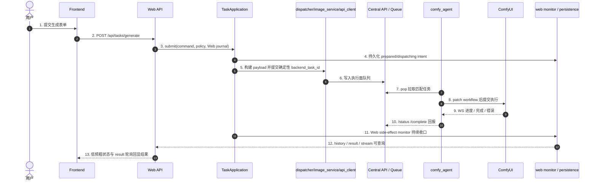

# 子模块: 生成任务全链路 (Task Full Chain)

MiniMax H3 执行面使用 T2V/I2V/FLF2V/REF2V 四个独立业务/执行类型，统一走既有 Web submission Saga、Central
队列、Worker workflow patch、结果上传和终态退款，不以 LTX alias 入队。输入数量、
计费和 workflow 契约见 `docs/子模块_MiniMaxH3视频服务_minimax_h3.md`。REF2V 可携带
一个高层 `reference_audio`，Worker 将其映射到 `ref_audios.ref_audio_0`；Web/Bot 仅提醒
用户可写 `<Audio 1>`，服务端与 Worker 不检查或注入该标记。

> 当前 `i2i_pro` 与专属 `face_swap` Worker profile 都可承接 Central 的 `face_swap` 与 `face_swap_v2`，并通过显式 workflow override 将两者运行到 `face_swap_v2.json`。上游 API、计费、退款和业务类型不变；旧远程 V1 执行池已退役。

## 1. 目标与适用场景

本文档用于说明当前系统中“生成任务”从前端发起，到 Web API 提交，到 `task_core` 派发，再到底层 Central API / Queue / Worker / ComfyUI 执行，以及状态回流、结果持久化、历史查询的完整链路。

适用场景：

- 新增一种新的生成任务类型
- 运维排查任务卡住、堆积、结果丢失、状态异常
- 排查 Web 端提交成功但 SSE / 结果 / 历史表现不一致
- 理解 `registry_task_id` 与 `backend_task_id` 的分工

本文档是对以下文档的补充而不是替代：

- `docs/子模块_任务调度_task_scheduler.md`
- `docs/子模块_中控API与节点通信_central_api.md`
- `docs/system_architecture_report.md`

## 2. 一句话主链

当前系统中更准确的生成任务主链是：

`Frontend -> Web API -> TaskApplication -> dispatcher -> Central -> Worker -> ComfyUI -> finalizer / History`

要点：

- Web 主入口是 `POST /api/tasks/generate`，不是旧的 generation params 风格接口
- `task_core` 是统一门面，负责业务编排，不是 Central API
- Central API 是执行面，不负责上游计费、并发锁和历史持久化
- Worker 通过主动 `pop` 拉取任务，不是上游直接把 workflow 推到 Worker
- 新版 worker 的 `pop` 会带 `agent_id`；Central 在返回已出队任务前记录一个待确认的 delivery claim。若响应途中断线，同一 agent 的下一次 `pop` 会重放该 running claim，并刷新任务 heartbeat；Worker 首次 status/heartbeat 会确认 delivery 并清除重放标记。该语义只覆盖“已出队但响应未送达”的窄窗口，不把已确认的 pipeline claim 串行化。
- GPU Pool Controller 可把单个 worker 标记为 `draining/disabled`，用于模型同步、任务能力切换和 canary 前停止接新单
- `agent_id`、`draining/disabled`、GPU pool heartbeat 元数据只作用于 Worker Agent 层；它不会自动重启或替换目标 ComfyUI。`cloud_prod_worker_01` 的 agent 容器已支持新协议，但它调用的 `gpu-226:8188` 仍是宿主机 ComfyUI。
- relay 只优化 worker 到 Central/R2 的开销，不拥有队列事实；Worker
  先写 `staging/worker-results/...`，Central 将已校验对象复制为
  `task-results/...` 后才接受 `/complete`
- 本地 relay `/health` 是轻量存活检查，`/ready` 会检查云 Central 与上传 client；worker 到 relay/Central 的控制面半断持续超过默认阈值时，agent 会退出并交给 Docker restart。这个自愈只恢复 worker 进程，不改变任务成功必须 `/complete` 的语义
- RunPod 镜像内的 `workers/runpod_runtime/` 通过 `runpod_relay` 访问专用 Central 域名，并复用同一 `pop/status/complete/heartbeat` 语义
- LAN-only `all` worker 在一次 `pop` 中携带 19 个支持类型，Central 仍按这些
  类型的全局 queue score 选择最早任务。它不会改变 execution type、根任务
  ID、计费、History、Gallery 或退款；流水线只让一个 Comfy 执行与一个预取、
  一个交付阶段安全重叠。

## 3. 分层职责图

## 4. 前端入口链路

### 4.1 表单与 payload 构造

前端生成页面负责收集用户输入，然后把输入转成统一提交 payload。

常见入口包括：

- `frontend/src/views/CustomFeatures.vue`
- 旧图生图、图生视频、换脸等 URL 的兼容重定向
- 统一 payload 构造器，例如 `frontend/src/features/generation/buildGenerationTaskPayload.ts`

前端提交到后端时，核心字段通常包括：

- `task_type`
- `inputs`
- `prompt`
- `negative_prompt`
- `priority`
- `is_template`
- `source_post_id`

约束：

- 若是 Web 一等任务类型，前端必须提供稳定的 `task_type`
- 输入图片、LoRA、分辨率、时长等应统一收口到 `inputs`
- 新任务类型若要在主站展示为独立能力，前端页面、卡片入口、i18n 和历史/投稿/收藏相关展示也要一并补齐

### 4.2 任务提交与前端运行态

前端通常通过以下链路提交：

- `frontend/src/composables/useTaskSubmission.ts`
- `frontend/src/stores/tasks.ts`
- `frontend/src/stores/taskSessionState.ts`
- `frontend/src/stores/tasksRuntime.ts`

提交后会发生：

1. `useTaskSubmission.submitTask(...)` 调用 `POST /tasks/generate`；提交提示从共享
   i18n 读取，composable 名称不再暗示已经退出生产调用的 SSE transport
2. 后端返回 `task_id` 后，前端把该任务写入 `tasksStore`
   - Web 不使用悬浮任务数量做并发准入；身份对应的并发额度由后端
     `check_concurrency_lock(...)` 权威判断，避免付费身份额度提升后仍被客户端旧上限拦截
   - `tasksStore` 跟踪并展示后端已经接纳的全部非终态任务；新任务到来时可以自动收起
     旧的终态气泡，但不得丢弃仍在 pending/running 的任务
3. `tasksStore.startStatusPolling(...)` 默认每 15 秒查询 `/tasks/{task_id}/status` 粗状态；pending 可显示队列位置，running 不显示生成百分比
4. 收到粗状态 `success` 后，前端转入 `/tasks/{task_id}/result` 轮询；结果 URL 未就绪时保持 `awaitingResult=true` 并展示“保存结果中”，当前轮询窗口约 120 次 * 1.5 秒，需覆盖视频 R2 warmup 可能超过 60 秒的情况。页面从后台/BFCache 恢复、重新联网或重新打开后必须按持久化任务状态主动续接 result/status polling，并以任务 ID 去重，不能让浏览器冻结的旧 timer 导致“保存中”永远不进入完成态。
5. 若历史已落库，也可能通过最近历史或详情弹层展示结果
6. pending 悬浮任务的关闭按钮按用户撤销处理，调用 `/tasks/cancel/{registry_task_id}`；非 pending 关闭按钮仅收起本地悬浮任务，不代表后端取消

`record_history=false` 的人物子图以
`CharacterReferenceView.task_id/status/preview_url` 收口；通用 status 的 404 不能覆盖
ready。全局人物 store 按服务端并发额度补位、逐图注册悬浮任务，不绑定页面生命周期；
四个必需槽位 ready 后服务端自动合成面板。

前端当前的状态语义重点：

- `pending`: 已提交但还在排队
- `running`: Worker 已开始执行，用户侧只展示“生成中”，不展示百分比
- `success`: 粗状态终态成功，前端随后去拿结果 URL
- `failed`: 执行失败或回流失败
- `cancelled`: 用户取消或执行面确认取消

## 5. Web API 提交链路

### 5.1 主入口

Web 统一入口在：

- `src/web_api/routers/tasks.py`
- `POST /api/tasks/generate`

该入口只做 schema、用户注入、service 转发和 HTTP 异常映射。

### 5.2 提交 service

真正的 Web 提交 service 在：

- `src/web_api/services/task_submission_service.py`
- `src/web_api/services/web_submission_preparation.py`

准入、角色引用、输入归一和 free-edit/scail2 pipeline policy 收口到
`web_submission_preparation.py`；编排 service 仅保留 ID、素材 promotion、
application 调用与失败清理。

职责：

- 先执行 Web 入口级禁用任务检查；`i2i_draw` 局部重绘当前在 Web 端关闭，会在生成 `task_id`、扣费和入队前返回领域错误
- 从启动时显式装配的 `TaskApplication` 调用 `submit(command, policy, journal)`
- 通过 `WebSubmissionIntentJournal` 在派发前持久化完整 intent
- 开启 `TaskSubmissionSideEffectPlan(attach_web_monitor=True)`
- 返回给前端 `pending` 初态和余额变化

当低阶外门用户因目标 Worker 执行池的 projected pending 达到容量上限而被拒绝时，`billing_core` 会经 task core 抛出 `QueueCapacityError`。`POST /api/tasks/generate` 将其映射为 HTTP 429，并返回结构化 `detail.code=GENERATION_QUEUE_FULL`；Vue 根据该 code 展示“当前任务队列已满”、可改用其他任务，以及仅适用于外门练气期及以下用户的充值升级身份提示。其它并发限制仍使用普通 429，避免将用户自身并发已满或其它接口限流误称为执行池满载。

跨用户 staging 引用抛 `StagedInputOwnershipError` 并固定映射 HTTP 403；不得暴露对象 key 或来源用户 ID，其它 promotion 失败仍是内部错误。

这意味着 Web 成功返回给前端时，任务通常已经：

- 完成了计费检查
- 完成了并发锁检查
- 完成了 registry 注册
- 完成了 backend 提交
- 挂好了 Web monitor side effect
- 或已进入 `reconciling`，前端仍按返回的同一 task ID 继续轮询

人物一致性文生视频是一个服务端组合特例：客户端只提交 `character_id`、画面
prompt 与可选音频 prompt。提交 service 在扣费前按 owner 解析已就绪人物参考表和
必填人物描述；worker 按 `Reference sheet:`、`Generated video:`、可选 `#Audio`
三段组成最终 conditioning。客户端不能直接指定参考表路径或覆盖已保存人物描述。

## 6. task_core 业务编排链路

### 6.1 统一门面

统一主门面是：

- `src/core/task_application.py`
- `TaskApplication.submit(command, policy, journal)`

它不是简单转发，而是负责编排整个业务提交过程：

- 取策略 `StrategyFactory.get_strategy(task_type)`
- 计算任务成本
- 检查并发锁
- 扣减灵石
- 组装提交上下文
- 执行提交 Saga
- 挂载 side effect
- 在失败时退款并释放锁

生产 Web/Bot/QQCC/Dashboard 已全部使用该门面。旧 `process_and_submit_task(...)`
只保留为要求显式 dependencies 的测试/兼容适配器；输入准备、扣费、派发、补偿
和锁释放由 `task_core_process_flow.py` 的阶段函数实现。其输入门禁先归一策略
输入，再于扣费/派发前提升 staging，覆盖 Bot/Web `face_swap`。

### 6.2 provider / dependency 边界

当前 `task_core` 采用 facade + provider/dependencies 结构：

- `src/core/task_core.py`
- `src/core/task_lifecycle_contract.py`
- `src/core/task_core_default_dependencies.py`
- `src/task_core_process_defaults.py`
- `src/core/task_core_service_providers.py`
- `src/core/task_core_submission.py`
- `src/core/task_core_process_flow.py`
- `src/services/task_lifecycle_runner.py`
- `src/services/task_web_side_effects.py`
- `src/services/task_web_lifecycle_monitor.py`
- `src/services/task_web_terminal_finalization.py`
- `src/core/task_core_runtime.py`

关键规则：

- `core` 内不应重新直连基础设施实现
- `task_core_default_dependencies.py` 只保留纯 builder；runtime-specific billing / strategy / Web side effect 装配已下沉到 `src/task_core_process_defaults.py`
- Bot / Web / stream 对 backend `done/error/cancelled` 终态判断应共享 `task_lifecycle_contract.py`
- Web 侧已按 `side effects -> lifecycle monitor -> terminal finalization` 三段拆开，入口分别位于 `task_web_side_effects.py`、`task_web_lifecycle_monitor.py`、`task_web_terminal_finalization.py`
- Bot `task_service_flow.py` 与 Web lifecycle monitor 现共享 `task_lifecycle_runner.py` 的 monitor->route 骨架；Web runtime monitor 与 `task_web_finalizer.py` 共享 terminal router
- 默认 provider 注册由应用入口承担，不由 `core` 模块导入时自动注册
- 单测优先走显式 `dependencies` 或 `*_func` seam
- 当前 `TaskCoreServiceProviders` 与主要 capability 已补强 `Protocol` / 精确 `Callable` 类型；新增 provider/capability 时继续沿用显式契约，不要扩大弱类型字段
- provider 运行时注册仍依赖模块级全局状态，测试和离线路径应优先显式传入 dependencies，避免把模块级 patch 当成主测试策略

### 6.3 双 ID 语义

当前链路中始终同时存在两个 ID：

- `registry_task_id`
  - Web/Bot 对外主任务 ID
  - 用于前端 SSE、结果查询、历史、清理、恢复
  - 也是 `/api/tasks/generate` 返回给前端的 `task_id`

- `backend_task_id`
  - 真正派发到底层执行面的运行态 ID
  - 用于 Central API / Queue / Worker / backend cancel

排障红线：

- 任何运行态查询、取消、强制终止、僵尸清理都必须先确认当前用的是哪个 ID
- 前端和 Web API 对外接口大多围绕 `registry_task_id`
- 执行面、队列和 Worker 更多围绕 `backend_task_id`

### 6.4 Bot 取消与优先级控制

Bot task flow 允许入口层在不改变数据库结构和 worker workflow 的前提下，通过 `TaskSubmissionPolicy` 传入两个任务控制语义：

- `base_priority`: 默认 `0`，透传到现有 Central 队列优先级计算；QQCC 链式 continuation 子任务使用 `100` 表达“排在第一”。
- `user_cancel_allowed`: 默认 `true`，写入 active task registry；`false` 时用户取消入口直接返回 `not_cancellable`，不调用 Central cancel，也不触发退款。

Telegram 展示层还有对应的 `allow_cancel`，用于控制 pending/submitted 状态是否展示 `cancel_task_*` 按钮。隐藏按钮只是用户体验层，权威边界仍在 `cancel_user_task(...)` 读取 active registry 的 `user_cancel_allowed`。

QQCC 懒人 Bot 的链式 AI绘图/AI动图复用这一通用语义：第一个真实子任务普通排队且 pending 可取消；后续后处理绘图、内部原图换脸、尾帧链后续步骤和最终首尾帧视频作为同一链路 continuation，高优先级入队且不可用户取消。主 Bot、Web、普通单任务 QQCC 功能和 worker 执行协议不因此改变。

Bot presentation context 另有 `show_queue_status`，默认 `true`。QQCC AI绘图、AI动图与 AI视频的第 2 个及以后真实子任务设为 `false`：初始提交直接使用现有图片/视频“生成中”，monitor 收到 pending 或队列位置变化仍保持生成中且无取消按钮，成功/失败/退款终态不受影响。图片、旧视频、Wan22 与 LTX actor 入口都只透传该展示标志，Central 优先级、计费、任务顺序和 Worker 协议完全不读取它。

QQCC `AI视频` 也复用 quick video plan：无尾帧引用时直接由 actor 参数入口提交 LTX I2V；有引用时把最终阶段记录为 durable continuation 的 `ltx_video` executor，以原始输入和当前尾帧提交 FLF2V。提交前按尾帧链加 LTX 时长统一核费，任一中间阶段失败不创建最终视频任务；私有 Bot checkpoint 继续保存原始输入、当前输出和 delivery 状态。

QQCC `AI动图` / `AI视频` 的 `next_scene_id` 在 quick video plan 中解析为完整有序 `qqcc_chain_segments` 快照，主 Bot 计划始终为空。根场景 `credit_cost=null` 时，全链费用是各视频段与各自尾帧绘图链费用之和；根场景配置固定总价时只在首个真实任务用 `cost_override` 一次扣除，后续段、尾帧绘图和内部换脸全部 `deduct_quota=false`，被引用场景自己的价格不参与计算。自动拼接不产生 task type 或费用。第一段沿用普通队列，后续段 `base_priority=100`、`show_queue_status=false`、`user_cancel_allowed=false`。官方 runner 用每段返回视频提取下一首帧，并在后续失败时拼接成功前缀；固定价链同时按根价全额幂等退款。私有 continuation 把 Worker `last_frame` CAS 写为下一输入、保留视频引用，并持久化根计费锚点，最终 `delivery_pending` 执行同一拼接。最终 History 的 `_qqcc_video_scene_chain` 保存根场景、场景/任务顺序、计划/完成段数和 partial 标志；中间 History 只用于审计。

尾帧提取与最终拼接依赖控制面运行镜像内的 `ffmpeg`、`ffprobe`，不依赖
Worker workflow。`qqcc-bot`、`private-bot-worker`、`qqcc-config-backend`、
`dashboard-backend` 四个真实消费者继承 `python-media-runtime-base`，镜像
focused smoke 对各最终 digest 执行双工具验证。runner 还必须区分
`generation` 与 `tail_frame` 失败阶段：已成功扣费并产出视频、但尾帧提取
失败时，不得把该段误报为“生成失败”。

### 6.5 QQCC 私有 Bot 的租户归属

私有 Bot 复用同一 `TaskApplication`、用户表、余额、会员和 Central/worker 执行链，
并由 `PrivateBotSubmissionJournal` 把 debit/dispatch/compensation 映射到持久 ledger。
发起任务的 Telegram 访客先解析为自己的 `internal_user_id`，扣费和权限不归 owner；租户身份只通过 `client_type=bot:qqcc-private:<private_bot_id>` 区分配置、active task recovery 与 Telegram 结果投递。

Webhook update 先由 Web API 校验后写 `${REDIS_PREFIX}private_qqcc_bot:webhook:updates`。private worker 对同一 Bot 顺序处理、不同 Bot 并行处理；启动恢复只解析 exact private client type 并把任务交回相应 Application。官方 `bot:qqcc` 与不同 private ID 不能相互恢复。暂停/禁用只停止新任务，已扣费任务继续沿原实例 client type 完成，账本与退款规则不变。

私有 active registry 额外保存 `_bot_task_recovery` presentation contract，恢复时还原 `send_result`、用户可见 task type/prompt、输入索引、结果 metadata、完成文案和语言。私有旧记录缺 contract 时 fail closed，隐藏中间输出也不得被恢复器当最终结果发送。QQCC 私有多阶段 continuation 使用 Redis checkpoint 持久化原始输入、stage plan、确定性 submission sequence/registry ID、当前输出与状态；active registry 内 `_private_qqcc_continuation` 关联 chain/stage/executor fence。中间阶段结果必须先 CAS 推进 checkpoint 再 cleanup；最终阶段先记录 `delivery_pending`，delivery owner 发送 Telegram 成功后再 CAS delivered。checkpoint 不可用时保留 paid registry/用户锁，不先发送；worker 启动及周期扫描在 TaskRegistry 为空时仍续跑 ready/delivery checkpoint，租约丢失取消旧 owner，running orphan 在旧锁失效后 rewind。私有多步绘图、内部原图换脸和尾帧视频链因此与官方 `bot:qqcc` 保持同等功能，但仍使用 exact tenant `client_type`。

`_bot_task_recovery` 同时保存非默认的 `show_queue_status=false`；官方 QQCC continuation 也生成这一恢复 contract。私有 durable stage plan 在每个 `task_kwargs` 中保留首步 `true`、后续 `false`，序列化/反序列化和重启续跑后展示策略不变。

## 7. dispatcher 到 backend 执行面的下发

### 7.1 按任务类型选择策略

下发前的任务类型分流主要在：

- `src/core/task_dispatcher.py`
- `src/domain_config/task_type_registry.py`（任务类型唯一人工维护源；驱动 Gallery/apply、Central simple task、workflow facts 和前端只读生成合约，dispatcher 策略仍由 core 显式装配）

这里决定：

- 用哪种策略计算价格
- 哪些输入文件需要先上传到存储
- 如何构造 metadata / payload
- 调用 `image_service` 的哪个提交方法

`task_type_registry.py` 记录 public type、legacy alias、执行面 task type、Central type、workflow filename、RunPod profile、视频/Gallery/apply 能力与成本。它提供稳定 query helper，并驱动 Gallery 可投稿类型、展示配置、apply 输入复用白名单、Central simple task 映射、workflow filename facts，以及 `frontend/src/generated/taskTypeContract.ts`。前端生成提交会先用该只读合约验证 `task_type`，未知类型在发出 HTTP 前失败；生成文件由 `scripts/generate_task_type_contract.py` 确定性产出，禁止手改。`tests/config/test_task_type_registry.py` 校验既有领域事实，`tests/config/test_task_type_contract.py` 再双向约束 Central Enum、RunPod profile、Worker mapping 与生成文件。Worker resolver 对未知类型或缺 workflow 的 registry 类型显式失败，不再猜测同名 JSON。

用户展示层另行把 registry 的 public type、legacy alias、执行/内部阶段类型归一为稳定 `task_type.*` 展示 key。Web 历史、队列、详情、用户主页、Gallery 卡片和 Bot 结果只渲染共享中英文 locale；未知类型统一回退“生成任务/其他任务”，不得回显原始 task type。Dashboard、日志与 Central/Worker 协议仍保留原始诊断值。

新任务完成时，`History.prompt` 只保存提示词正文；模型公共 ID、强度、分辨率和时长合并写入 `extra_outputs._generation_context`，执行 payload 的 `lora_name/lora_strength`、费用和 workflow 均不变。History、Gallery、解锁/复制、一键应用、Telegram 私聊、主 Bot 与 QQCC/私有 Bot 恢复投递统一通过 presenter 输出干净 prompt 与可选 `prompt_model`。历史数据不批量迁移：读取时优先结构化上下文，缺失时兼容剥离并解析旧系统前缀。

例如：

- `txt2img` 走 `submit_txt2img_task(...)`
- `i2i_pro` 和 `i2i_draw` 有独立提交方法；注意这是 dispatcher/Bot/执行面能力说明，Web API 当前会在 `task_submission_service` 入口拒绝 `i2i_draw`
- `img2img_lora` 会带 `lora_name` 和 `lora_strength`
- Web 与主 Bot 的自由P图 v2.5 公开逻辑类型为 `free_edit_v2_5`，接受 1 或 2 张原图且不传 LoRA：单图扣 3 灵石并映射到 `pornmaster_flux2_edit_bf16`，双图扣 7 灵石并映射到仅内部使用的 `pornmaster_flux2_multi_edit_bf16`；其它数量在扣费前拒绝。内部双图类型复用既有 multiple-images workflow、BF16 模型与同一 GPU profile。任务完成后直接返回并统一以 `free_edit_v2_5` 写 History，不创建 `face_swap` continuation。
- Web 自由P图 v3 入口使用 `edit_v3`，只接受 1 张原图并提交逻辑类型 `pornmaster_flux2_edit_bf16`，固定扣 5 灵石且不传 LoRA。Web finalizer 在同一业务 `task_id` 下先等待 BF16 编辑，再用确定性的第二阶段 backend ID 提交 `face_swap_v2`（原图做人脸、BF16 结果做 body）；第二阶段不重复扣费且不可取消，只将最终换脸结果写入一条 `pornmaster_flux2_edit_bf16` History，输入只保留用户原图。主 Bot 的 v3 同样维持 BF16→V2 原脸恢复两阶段语义。
- `all` worker 同时支持这些内部阶段不代表把它们合并为一个 Comfy workflow：
  视频换脸仍是 `face_swap_v2 → scail2_face_swap_v2`，自由 P 图 v3 仍是
  `pornmaster_flux2_edit_bf16 → face_swap_v2`。continuation、隐藏中间结果、
  根计费锚点、确定性 stage ID 和幂等退款继续由现有控制面持有。
- Web finalizer 的 Redis pending 记录用 `continuation={version,kind,stage,stage2_task_type,stage2_backend_task_id,original_image,stage1_result_path}` 持久化两阶段进度，`stage2_task_type` 固定为 `face_swap_v2`；升级前缺少该字段或残留旧 `face_swap` 标签的 v3 记录也强制按 V2 恢复。先落盘 dispatch intent、再切换 active registry backend ID、最后提交确定性第二阶段 ID；因此重启或重复扫描不会重复扣费、重复提交或重复退款。任一执行阶段终止失败均以根业务 `task_id` 的既有幂等退款键退还 5 灵石。
- Web API 拒绝新的 `pornmaster_flux2_single_edit` / `pornmaster_flux2_multi_edit` 直接提交并提示刷新使用 v3；Bot 与 QQCC 的历史 v2 执行兼容仍保留，不得用 Web 下线规则删除 core/dispatcher/worker 能力。
- v2.5 与 v3 共用 `pornmaster_flux2_edit_bf16` 执行队列和 autoscaler profile；队列/运维展示必须明确标记“v2.5 + v3 共用执行池”，但不得把逻辑 History 类型合并或迁移。
- QQCC 自由P图 v3 使用配置 engine `free_edit_v3`，单图提交独立执行类型 `pornmaster_flux2_edit_bf16`，固定费用 6；Central 正式入口 `/api/v1/pornmaster_flux2_edit_bf16` 已于 2026-07-12 通过单服务 force-recreate 生效，任务可进入同名队列并由 gpu-226 BF16 worker 承接。
- 视频类会根据分辨率、时长转成底层所需尺寸和帧长

### 7.2 image_service / api_client

dispatcher 下游通常会继续经过：

- `src/services/image_service.py`
- `src/api_client.py`

职责划分：

- `task_dispatcher.py` 负责选择策略和高层任务语义
- `image_service.py` 负责按任务类型封装后端提交调用
- `api_client.py` 负责实际 HTTP 请求到底层执行面

注意：

- 当前 simple route 仍可能映射到 legacy `TaskType`，但 `txt2img` 已和其他任务一样通过标准 simple route 提交，并显式携带上游 `task_id`
- `image_service.py` / `api_client.py` 只负责把统一语义下沉到 Central API，不再由 `txt2img` 单独生成 backend task id
- `api_client.py` 的 breaker 按 `submit/status/media` 隔离；4xx 不计失败，网络错误、超时和 5xx 才计入。Central Redis transient 503 由上游忙碌处理；单任务 status 404 是预期缺失，只记 DEBUG。
- Web 只在 active registry 确认归属后查询 Central；传输错误、超时或 status breaker 打开时，按 registry 返回保守 `pending/running`，History 终态优先。404 不计 breaker/ERROR；其它错误保留 `error_type`。R2 deletion gate 默认关闭，增量 prune 静默返回且不记录用户 ID。
- Wan22 AIO 视频的稳定配置入口是 `src.domain_config.wan22_aio_video`。旧 `src.services.wan22_video_v2_config` / `src.services.wan22_video_v2_context` 兼容 re-export 已删除，不应作为新增逻辑的事实源。
- `custom_video` / `video_lora`、Telegram 懒人动图 mode 与 `wan22_video_v2` 是不同用户功能入口，但底层由 `Wan22AioVideoStrategy` 与共享 submit helper 收口：公开类型继续写历史和展示，执行面类型用于 Central API / Worker 路由。

## 8. Central API / QueueManager 执行面

### 8.1 角色定位

Central API 是执行面，不是业务主入口。
云正式当前运行在 `cloud-central-api-prod`，本地 `cloud-prod-comfy-agent-*` 通过 Tailscale 从云 Central 拉取任务。

核心文件包括：

- `backend/app/main.py`
- `backend/app/main_simple_task_routes.py`
- `backend/app/queue_manager.py`
- `backend/app/queue_manager_flow_helpers.py`
- `backend/app/routers/agent.py`

执行面负责：

- 接收 backend 任务
- 在 `comfy:task_events:{backend_task_id}` 发布运行态与终态事件；其中 `done/error` 终态事件应附带 `task_type`，并优先带上 `worker_id`、`created_at` 等最小详情，供 Dashboard / stream 消费端在上游 runtime cleanup 已发生时仍能完成观测落库
- 写入 pending 队列
- 维护 worker 心跳视图
- 处理 agent `pop`；V2 worker 可使用 `/api/agent/task/pop?cancel_lock=true` 在真实接单时写入 `cancel_locked=1`、`execution_phase=preparing`，表示任务已进入输入准备/执行流水线，后续用户取消应返回不可取消而不是写 `cancel_requested`
- 提供只读 agent `peek` 供 worker 预取输入；`peek` 不能改变 pending/running/status/heartbeat，真实接单仍必须走 `pop`
- 接收运行态状态更新
- 接收完成上报；终态回报采用 compare-and-clear 清理 agent `current_task_id`，避免旧任务后台 complete 清掉新任务展示
- best-effort cancel
- 提供 `/status/{backend_task_id}`、`/system/status` 与 `/system/workers` 短缓存快照；这些接口使用短 TTL/stale 缓存与同 key 单飞刷新来承压高频轮询，不参与真实调度、Worker `pop`、状态上报、完成回流或终态收口。`/system/status.queue_pressure_by_worker_profile` 例外地作为低阶外门用户的快照式扣费前准入信号，但不提供强一致容量预约；`queue_by_type_details` 仍只按 Central pending 队列的 `created_at` / `priority` 计算每类任务免费与付费最长等待，供 Bot/监控轻量展示使用，不查询订单或低信任身份
- 使用统一 Redis 连接工厂创建共享 Redis 客户端，默认开启短超时、健康检查、TCP keepalive 和 timeout retry；Redis transient retry 耗尽时返回 503 + `Retry-After: 2`，上游按“当前服务器繁忙”路径补偿或重试

### 8.2 simple task route 与特例

常规 simple task route 在：

- `backend/app/main_simple_task_routes.py`

这里把上游任务 key 映射到 Central API 的 `TaskType`。

当前稳定业务/执行类型至少包括：

- `img2img`
- `img2img_lora`
- `face_swap`
- `face_swap_v2`
- `image_to_video`
- `face_video`
- `i2i_pro`
- `i2i_draw`
- `txt2img`
- `ltx_video`
- `ltx_video_flf2v`
- `ltx_video_v2v_audio`
- `wan22_video_v2`
- `pornmaster_flux2_single_edit`
- `pornmaster_flux2_multi_edit`

`video_insert` / `video_edit` 不再作为新增业务类型或独立 workflow 方向，只作为 legacy route / Central / Worker alias 保留，最终必须归一到 `TaskType.IMAGE_TO_VIDEO` / execution `image_to_video`。

PornMaster Flux2 图片编辑是测试期新增执行类型，simple route 为 `/api/v1/pornmaster_flux2_single_edit` 与 `/api/v1/pornmaster_flux2_multi_edit`，请求体复用 `Img2ImgRequest`。worker 必须声明同名 `SUPPORTED_TASK_TYPES`，避免落回旧 `img2img` / `img2img_lora` 队列。

其中 `txt2img` 当前通过 `/txt2img` simple route 进入执行面，Central API 内部仍映射到 legacy `TaskType.T2I_PORNMASTER_TURBO`。旧图生视频的 `/image_to_video` 与 `/perfect_video_lora` 会入队到执行面 `TaskType.IMAGE_TO_VIDEO`，但上游历史类型仍保留 `custom_video` / `video_lora`；旧 `/perfect_video_insert` 与 `/perfect_video_edit` 只作为兼容 endpoint 保留，会把旧 width/height/frame length 归一为 Wan22 `resolution_preset` 与秒数后入队 `TaskType.IMAGE_TO_VIDEO`。Telegram 懒人动图的差异应停留在 FSM 内置 prompt 与历史 mode，不再对应独立 worker workflow。Wan22 AIO 当前明确分两档 profile：旧图生视频 `custom_video` / `video_lora` / Web 字面量 `image_to_video` / 懒人动图 mode / legacy `video_insert`、`video_edit` -> execution `image_to_video` -> `legacy_image_to_video` profile；图生视频 v2 `wan22_video_v2` -> execution `wan22_video_v2` -> `wan22_video_v2` profile。LTX 高级图生视频用户侧历史与画廊仍归为 `ltx_video`；当前 Bot/Web 用户入口只开放单首帧和首尾帧，dispatcher 分别走 `ltx_video` 与 `ltx_video_flf2v`。底层 `ltx_video_v2v_audio` 仍作为输入视频+文本配音的历史/队列兼容执行类型保留，但 Web 练功房不再提供 `ltx_video_audio` 前端内部模式，Bot 层也不再注册旧 `ltx_mode_v2v_audio` 回调、`WAIT_VIDEO` 状态或视频上传 handler。LoRA/附加模型仍沿用 LTX 最多 3 个 `lora_items` 的既有注入规则。LTX 当前结果若带 `extra_outputs.last_frame`，练功房结果区可直接把尾帧载入下一段起始帧做扩展生成，Bot 结果消息也会进入同一续段语义。LTX 扩展提交会携带 `ltx_prev_task_id` / `ltx_chain_task_ids`，Web finalizer 或 Bot completion 持久化为 `extra_outputs._ltx_context`，结果响应暴露为 `result_meta.ltx_*`；续段结果可通过 `/users/history/{task_id}/ltx-chain/stitch` 拼接整条链，Bot 第二段起通过结果按钮 `ltx_stitch_chain:<task_id>` 触发同一整链拼接，拼接记录用 `extra_outputs.ltx_chain_stitch` 标记且不再展示扩展按钮。图片换脸执行面现分为两种 Central 类型：`POST /face_swap` 提交 V1，使用 `face_swap.json`、默认成本 2，快速/随机/历史重生成与旧 Gallery 应用保持该类型；`POST /face_swap_v2` 提交 V2，复用相同双图 request 契约，使用 `face_swap_v2.json`、默认成本 2，并由 `i2i_pro` profile 承接。自由P图 v3 与 QQCC 原脸恢复只在内部阶段调用 V2，History 仍保留上层业务类型。幻想换脸是单图+提示词的 `i2i_pro` 复合业务，继续按 6 灵石提交，不能替换为双图 V2。`scail2_action_transfer_long` 现在只作为 SCAIL-2 动作迁移 10/15/20s 的隐藏执行类型，使用 simple route `/api/v1/scail2_action_transfer_long` 和 `SCAIL-2_Animation_WAN-Context-Windows.api.json`；用户侧 task type、History、Gallery 和模板应用仍归并为 `scail2_action_transfer`。新增任务类型时，不要默认假设只改 `SIMPLE_TASK_TYPE_MAP` 就够，还要确认 request model、dispatcher、worker workflow 映射与只读 task type registry 是否齐全。

LTX I2V、FLF2V 和 V2V Audio 请求链都接受可选 `negative_prompt`。Web/QQCC/actor 入口先 trim，非空才进入 task inputs；API client 同样只在非空时发送。worker 的本地与远端 mapping 将它写入节点 `29.text`，字段缺省时不得修改 workflow 原值。现有 Telegram 高级 LTX FSM 不收集该字段。

测试专用高级图生视频 v2 的 `ltx_video_v2` / `ltx_video_v2_flf2v`
使用 `1280x704` 规格并支持 5/10/15/20 秒。Task Core 不得将该宽高的
1280 长边误认为旧通用 `1024p + >=10s` 高资源组合；豁免只属于 LTX
任务类型，其它视频类型仍在扣费和入队前拒绝该组合。

SCAIL-2 长动作迁移的 Context Windows workflow 保持 81/29 窗口与 `standard_static`
调度，`freenoise=true`。这会恢复较快生成路径，但长动作迁移仍可能出现后续窗口复用前段噪声导致的动作循环。

### 8.3 QueueManager 的职责

QueueManager 负责执行面排队与 Worker 选择，关键职责包括：

- `enqueue_task`
- 维护 pending / running 任务
- 按可用类型给 Worker 分配任务
- 维护 worker heartbeat 与 task heartbeat
- 支持取消、dequeue、zombie 扫描和状态迁移；locked running 任务不可取消，legacy 未锁 running 任务仍保留 `cancel_requested` 兼容语义
- zombie 按 `worker_id` 归因；实例一小时 6 单 heartbeat-lost 后自动
  `disabled` 30 分钟，只阻止新 pop。
- 通用/手工 `clean_zombies()` 必须无条件跳过 `bot:qqcc-private:<id>`；私有任务只能由 submission ledger、monitor lease 与租户 Application 感知的 `clean_private_qqcc_zombies()` 收口，避免重复退款或串租户投递
- 支持 `peek_pending_tasks(...)` 只读扫描 pending 队列，供预取流水线观察“下一单候选”，但不做 reservation

从系统语义上看：

- Web/Bot 提交成功不代表 Worker 已接单
- Worker 接单前，任务仍可能只停留在 pending 队列
- 没有匹配 `SUPPORTED_TASK_TYPES` 的 Worker 时，任务会持续排队
- `enqueue_task` 使用 Redis transaction pipeline 写入 task hash、TTL 和 pending zset，并对连接瞬断做有限 retry；`zpopmin` 真实出队不做盲 retry，避免连接未知态下重复弹单

## 9. Worker / ComfyUI 执行链路

### 9.1 Worker 主循环

当前底层 Worker 主循环主要在：

- `workers/comfy_agent/agent_main.py`
- LAN/RunPod 镜像直接复制该 canonical package；`runpod_runtime` 只留适配脚本

启动后主要做三件事：

- `poll_loop()`: 向 Central API 拉取可执行任务
- `heartbeat_loop()`: 上报节点和任务心跳
- `ws_listener_loop()`: 监听 ComfyUI WebSocket 获取进度和终态

关键环境变量：

- `AGENT_ID`
- `SUPPORTED_TASK_TYPES`
- `PREFERRED_TASK_TYPES`
- `MASTER_API_URL`
- `COMFY_API_URL`
- `COMFY_WS_URL`
- `UPLOAD_SIDECAR_URL`
- `PREFETCH_ENABLED`
- `PREFETCH_DEPTH`
- `PREFETCH_TASK_TYPES`
- `PREFETCH_CACHE_DIR`
- `PREFETCH_CACHE_MAX_AGE_SECONDS`
- `PREFETCH_CONSUME_WAIT_SECONDS`
- `PREFETCH_RESERVE_TASK`
- `PIPELINE_ENABLED`
- `PIPELINE_MAX_RUNNING_TASKS`
- `PIPELINE_MAX_CLAIMED_TASKS`
- `PIPELINE_DELIVERY_CONCURRENCY`
- `PIPELINE_TASK_TYPES`
- `CANCEL_LOCK_ON_POP`
- `RESULT_SPOOL_DIR`

运维含义：

- 某任务长时间 pending 时，要先看是否有 Worker 声明支持该任务类型
- Worker 存活但 `SUPPORTED_TASK_TYPES` 不匹配，任务依然不会被接单
- `PREFERRED_TASK_TYPES` 默认空且不发送新 query；非空时 Worker 启动即校验它是 `SUPPORTED_TASK_TYPES` 的子集，并在每次领取时只发送当前 pipeline 类型交集内的 preferred。Central 会先取 preferred 组内 score 最早任务，没有 preferred 才取 fallback 组内 score 最早任务；旧 Worker 和空配置 Worker 的领取行为不变。
- RunPod `i2i_pro` worker 必须声明 `SUPPORTED_TASK_TYPES=i2i_pro,t2i-pornmaster-turbo,face_swap_v2,face_swap` 与 `POOL_RUNTIME_PROFILE=i2i_pro`，并设置 `TASK_TYPE_WORKFLOW_OVERRIDES={"t2i-pornmaster-turbo":"txt2img_from_i2i_pro.json","face_swap_v2":"face_swap_v2.json","face_swap":"face_swap_v2.json"}`。legacy `face_swap` 的公开类型和 Central 队列不变，独立调用计费为 2 灵石；实际执行 V1/V2 由接单 worker 决定。i2i-pro canary 必须依次提交 `i2i_pro`、`t2i-pornmaster-turbo`、`face_swap_v2` 和 legacy `face_swap`，不能只凭 supported-types 环境变量声明兼容；每项 canary 都必须观察到目标 agent 的 pop evidence，被其它 worker 接取或未观察到接单者时必须失败。cloud-test canary 会临时禁用同环境中支持这些执行类型的非 RunPod worker，结束后必须恢复。
- RunPod `scail2` worker 必须声明 `SUPPORTED_TASK_TYPES=scail2_action_transfer,scail2_video_replacement` 与 `POOL_RUNTIME_PROFILE=scail2`；cloud-test canary 会临时禁用同环境中支持这两个执行类型的非 RunPod worker（通常是 `cloud_worker_test_08`），结束后必须恢复。云测试 LAN worker8 可额外声明 `scail2_action_transfer_long` 并指向 context-window API workflow，但该类型不进入正式 RunPod profile。云正式可使用 gpu-002 slot0 LAN AIO agent `lan_aio_prod_gpu002_gpu0_scail2_01`，也可使用手动正式 RunPod `runpod_prod_scail2_manual_NN` 并行接单；正式 RunPod 必须写 `user-data-prod` 且模型只从 `allbot-model-cache` 同步。
- RunPod `ltx_video` worker 必须声明 `SUPPORTED_TASK_TYPES=ltx_video,ltx_video_flf2v,ltx_video_v2v_audio` 与 `POOL_RUNTIME_PROFILE=ltx_video`；正式 RunPod 使用 `runpod_prod_ltx_video_manual_NN`、`user-data-prod`、`allbot-model-cache/ltx_video/2026-06-10/manifest.json` 和 10Eros v1.2 workflow override，canary 完成后仍保持 disabled，手动 enable 后才接高级图生视频订单。
- `image_to_video` 是旧图生视频 `custom_video` / `video_lora` 与 Telegram 懒人动图的执行面类型；生产 worker 接入新链路时必须支持 `image_to_video`。worker 继续声明 `video_insert` / `video_edit` 只用于兼容旧队列残留，不应被当作新任务能力扩展方向。
- LTX 高级图生视频 worker 仍建议同时声明 `SUPPORTED_TASK_TYPES=ltx_video,ltx_video_flf2v,ltx_video_v2v_audio`，其中 `ltx_video_v2v_audio` 仅作历史/队列兼容；当前 Web/Bot 用户入口只会提交单首帧或首尾帧。

### 9.2 输入准备

Worker 拉到任务后会先处理输入：

- 从 MinIO 下载输入图片或视频；图片按解码格式校验，JPEG/PNG/WebP
  保留压缩字节和真实后缀，需转向或转换模式时才重编码
- 把输入上传到 ComfyUI input 区；媒体上传由
  `COMFY_UPLOAD_TIMEOUT_SECONDS`（默认 300 秒）独立限时并有界重试
- 补全 `image` / `image2` / `image3` / `face_image` / `body_image` / `video` 等参数
- 输入下载优先使用 boto3 S3 client 读取当前 R2/MinIO 兼容对象存储，`MINIO_BOTO3_DOWNLOAD_ENABLED=false` 时可回退旧 MinIO SDK 路径；`MINIO_REGION` 未显式配置时，R2 endpoint 默认 `auto`，其它 MinIO endpoint 默认 `us-east-1`。
- 输入下载的 S3/MinIO 连接、读取、重试与连接池分别由 `MINIO_CONNECT_TIMEOUT_SECONDS`、`MINIO_READ_TIMEOUT_SECONDS`、`MINIO_HTTP_RETRY_TOTAL`、`MINIO_HTTP_POOL_MAXSIZE` 控制；整次下载由 `MINIO_DOWNLOAD_TIMEOUT_SECONDS` 和对应 retry/delay 控制。失败会清理目标与 `.part.minio` 临时文件并进入补偿路径。
- `PREFETCH_ENABLED` 在当前 ComfyUI 执行期间准备下一单；候选是 supported、prefetch 与 pipeline 类型交集，由 Central 按既有 score 选择。默认 `/peek` 只读观察，`/pop` 后仅 `task_id` 命中才复用缓存。
- `PREFETCH_CACHE_DIR` 独立于内存索引收口：启动后立即并周期删除超过 `PREFETCH_CACHE_MAX_AGE_SECONDS`（默认 86400）的重启孤儿，保护当前 execution 和 `_prefetch_cache` 引用；扫描不得越出本 Agent 缓存根。
- `PREFETCH_RESERVE_TASK=true` 用原子 `/pop?cancel_lock=true` 本地预接一单，当前单结束后直接执行，避免多 Worker 重复预拉；预接单会提前 running 且短暂不可取消，不要求修改 Central。
- flex Worker 启用 preferred 后，预取集合必须只包含 preferred 类型。gpu-002
  的 `scail2_flex` supported 为四类 SCAIL-2 加
  `img2img,img2img_lora`，但 `PREFETCH_TASK_TYPES` 只能放四类 SCAIL-2，
  不得 reserve fallback，否则 fallback 会在后续 preferred 到达前已经进入
  running，无法被新协议抢占。本规则不授权自动切换任何存量 GPU Worker。
- `PREFETCH_CONSUME_WAIT_SECONDS` 只限制下一单等待未完成预取的时间；超时后取消下载，已预接任务改走正常准备，不再 pop。正式 LAN 和后续新建 RunPod 默认深度 1、reserve、等待 10 秒，类型跟随 supported；等待期间 heartbeat 使用 `set_current=false`。该契约不修改存量 RunPod。
- `PIPELINE_ENABLED` 在 Comfy 槽未满时真实 pop 并提前准备/排队。running、claimed（含 reserved/delivery）和交付并发分别由三个 `PIPELINE_*` 上限约束；`gpu_done` 只释放计算槽，上传并收到 `/complete` 后才终态。
- Central claim 是 at-least-once；Worker 以 `backend_task_id` 幂等执行。活跃 task 重投只确认 heartbeat/claim，不得重复准备、`queue_prompt`、finalizer、上传或 complete；重启后本地 execution 不存在时可恢复接纳。单进程保持 `task_id -> execution -> prompt_id -> finalizer` 一一对应。
- 不可变 GPU artifact 必须在构建期安装并校验 Worker Python 依赖。baked entrypoint 启动时只做本地 import 验证，依赖完整就跳过 `pip install`；依赖缺失则 fail closed，禁止把生产 Worker 的可启动性依赖于节点当时能否访问 PyPI。
- 有界重叠分两档。快速图片 `img2img/img2img_lora`、`i2i_pro`、`pornmaster_flux2_edit_bf16` 使用 `image_claim3_comfy2_delivery1_v1`，claimed/Comfy/delivery 为 `3/2/1`；媒体 `all`、`image_to_video`、`ltx_video`、`ltx_t2v`、`minimax_h3`、`scail2`、`scail2_flex`、`wan22_video_v2` 使用 `media_claim2_comfy1_delivery1_v1`，上限为 `2/1/1`。`Comfy=1` 只限制 GPU 并发，不关闭后台流水线；前一单进入 `gpu_done` 后下一单即可计算。LAN render 与后续新建 RunPod 注入同一策略，存量 RunPod 不改。数字环境保留旧 Worker 的串行回滚默认 `1/2/1`；`bf16_lan_claim3_comfy2_delivery1` 仅是兼容别名。

无输入的任务类型也必须确认 workflow patcher 对纯文本场景兼容，例如 `txt2img`。

### 9.3 workflow 选择与 patch

底层 workflow 选择依赖：

- `src/workflow_mapping_validation.py`
- `workers/comfy_agent/workflows/mappings.json`
- `workers/comfy_agent/workflow_patcher.py`

关键点：

- `TASK_TYPE_WORKFLOW_FILENAMES` 决定任务类型默认绑定哪个 workflow JSON
- `TASK_TYPE_WORKFLOW_OVERRIDES` 可在单个 Worker 环境变量中覆盖某个 task type 的 workflow JSON，用于云测试/canary；未设置时仍走默认绑定，override 文件名必须留在 workflow 目录内
- GPU profile 把 canonical `workers/comfy_agent`、根 `src`、`shared` 与薄 runtime adapter 组合到 `/opt/allbot/runtime/runpod_worker`，并嵌入 Git SHA、package/mapping hash；Pod 不访问 AllBot Git。profile 所需 override/workflow 必须在构建时 fail closed，源码变化只有重建 exact digest 才生效。
- `face_swap_v2` 使用 `i2i_pro` 的 Flux2/edit 节点与模型，去掉旧换脸专用 LoRA / DifferentialDiffusion；`mappings.json` 对两个业务类型都只写入 `face_image -> 2`、`body_image -> 3`。当前 i2i_pro/专属 face-swap profile 对 `face_swap` 和 `face_swap_v2` 都执行 `face_swap_v2.json`。
- `mappings.json` 决定输入参数如何映射到 workflow 节点
- `workflow_patcher.py` 负责把运行时参数打进具体 workflow
- `image_to_video`、legacy `video_insert` / `video_edit` 与 `wan22_video_v2` 共用 `Wan22AioV82.json`。Wan22 请求优先读取最多 5 个 `{name,strength}`，无列表时兼容 `lora_name/lora_strength`；patcher 清空旧槽后按序写入节点 `26`/`18` 的高/低噪双文件。主 Bot 仍保持既有单模型入口，QQCC 官方/私有场景可配置 5 项；v2 使用相同注入规则。
- 共享 workflow alias 的 `TASK_TYPE_WORKFLOW_FILENAMES`、`mappings.json` 与 `TASK_SPECIFIC_PATCHERS` 必须同轮更新 canonical tree。生产禁止局部 bind mount，否则会形成新 workflow + 旧 patcher 的半更新并导致 `/prompt` 400。
- V82 在 `2603` 最终帧序列后接 `265` 插帧；默认使用 `FL_RIFE` (`multiplier=4`)。patcher 检测到 `265` 后会把 `28` 视频输出、`2575` 帧数统计和 `2607` 尾帧提取都指向 `["265", 0]`，避免运行时覆盖导致插帧失效。历史生产 worker3 / `192.168.1.177:8189` 的 `FL_RIFE` 修复已随 gpu-177 旧链路退役；gpu-177 GPU0 AIO `8190` 当前按 `image_to_video` profile 渲染，gpu-177 GPU1 Wan22 v2 在 2026-07-01 正确切换后首单 OOM（status 137）并标记 `blocked_oom_32gb`，`wan22_video_v2` 需要使用 RunPod 或 48GB+ LAN 容量。所有 Wan22 AIO 容量都必须由 AIO 镜像/manifest 提供 RIFE 缓存。
- Wan22 AIO 的 `5s/8s/10s` 时长最终由 worker patcher 写入 `2578.inputs.value`，再经 workflow 内部帧数公式得到 `81/129/161` 源帧；计费和 result meta 使用同一份 `src.domain_config.wan22_aio_video` duration 归一化。
- 旧图生视频 Web/Bot 历史类型仍是 `custom_video` / `video_lora`，懒人动图历史类型仍是其具体 mode；执行面 task type 才是 `image_to_video`。排障时需要同时确认上游历史类型、registry task type 和 backend task type。
- LTX API workflow 唯一事实源是 `workers/comfy_agent/workflows`。FLF2V 的第二张图注入 end-frame slot；V2V Audio 读取输入视频并沿用音频连接；两者保存 `extra_outputs.last_frame`。真实口型/音轨仍以目标 `/object_info`、生成结果和 `ffprobe` 为准。
- SCAIL-2 用户侧任务类型包括 `scail2_action_transfer`（动作迁移）、`scail2_video_replacement`（视频换人）以及 `scail2_face_swap_v2`（视频换脸 v10 two-stage）；内部保留 `scail2_action_transfer_long` 作为动作迁移 10/15/20s 的隐藏 Central/Worker 执行类型。Web payload 使用 `inputs.images=[参考图, 驱动视频]`、可选 `prompt`、`negative_prompt`、`duration`；Bot 入口在“视频生视频”二级菜单下，SCAIL-2 任务都收集参考图、驱动视频和可选正向提示词，Bot 可跳过、Web 可留空，空值由 `normalize_scail2_positive_prompt(...)` 按 task type 补默认提示词。负面词使用默认值，驱动视频上限 40MB。公开动作迁移支持 `5s/8s/10s/15s/20s`，计费 `40/80/120/180/260` 灵石；视频换人和视频换脸 v2 仍只支持 `5s/8s`，计费 `40/80` 灵石。业务/History/Gallery 记录长动作迁移仍写 `scail2_action_transfer`；dispatcher 在提交 Central 前按 duration 选择执行类型：`5s/8s -> scail2_action_transfer -> SCAIL-2_Animation_multi-char_audio.api.json`，`10s/15s/20s -> scail2_action_transfer_long -> SCAIL-2_Animation_WAN-Context-Windows.api.json`。长时长只按 `16fps * 秒数 + 1` 写 `161/241/321` 帧，不开放无限长度输入。SCAIL-2 Web/Bot 成功结果可投稿；Web 一键应用只复用原 motion/driving video，复用者重新上传 reference image，衍生任务必须保持 `allow_contribute=false`；旧 `scail2_action_transfer_long` 历史/广场/模板数据展示和筛选归并为“动作迁移”。业务 workflow 必须是 API format；当前正式 LAN 四任务默认覆盖到 audio/context-window/v10 workflow，其中 `scail2_action_transfer_long -> SCAIL-2_Animation_WAN-Context-Windows.api.json`，`scail2_face_swap_v2 -> SCAIL-2_FaceSwap_v10_firstframe_faceswap_replacement_audio.api.json`。v10 workflow 只消费已经完成图片换脸的首帧，把它作为 SCAIL-2 reference image，并走视频换人式 `human` track / replacement workflow；首帧提取与标准 `face_swap_v2` 属于进入 SCAIL 队列前的控制面第一阶段。worker patcher 固定 512x896、`force_rate=16`、`skip_first_frames=0`；动作迁移执行类型强制 `replacement_mode=false`，视频换人与视频换脸 v2 强制 `replacement_mode=true`。云测试执行 runtime 可以是 gpu-002 LAN AIO SCAIL-2 容器 `http://192.168.1.2:8190` + `cloud_worker_test_08`；云正式 LAN slot0 `lan_aio_prod_gpu002_gpu0_scail2_01` 接四类 SCAIL-2 执行任务并只写 `user-data-prod`，正式 RunPod `scail2` profile 仍只接动作迁移与视频换人。
- SCAIL-2 长动作迁移的 Context Windows 节点当前保持 `freenoise=true`；`workflow_task_patchers.py` 会对 `scail2_action_transfer_long` 再次写入该值，避免 workflow 重导出后把 FreeNoise 关闭。该选择优先减少长时长生成耗时，代价是动作循环类伪影风险可能回归。
- 视频换脸使用标准 Central 两阶段 continuation：共享服务从 Bot 本地视频或 Web 对象键抽取首帧，第一阶段 `face_swap_v2` 固定优先级 100；成功后先持久化 intent 并切换 TaskRegistry，再以确定性 backend ID、根任务正常 `final_priority` 提交 `reference_preprocessed=true` 的 SCAIL-2 阶段。根业务 ID、原始 `[人脸参考图, 驱动视频]`、40/80 灵石扣费与最终 History/Gallery 类型保持不变；第一阶段可取消，第二阶段不可取消，中间图不投递/不落历史。恢复逻辑先查询确定性阶段 ID，存在时禁止重复提交。Central 请求模型与 Worker workflow execution 都会拒绝缺少严格 `reference_preprocessed=true` 的视频换脸第二阶段；SCAIL-2 Worker 只执行 replacement workflow，不加载 `face_swap_v2.json`、不创建辅助 ComfyClient、不访问外部 8188。

如果出现以下错误，优先看这三层：

- Worker 报 `Workflow for xxx not found`
- patch 后 ComfyUI 报节点输入缺失
- 某参数前端传了但底层 workflow 实际没吃到

### 9.4 执行与结果上传

Worker 执行流程：

1. 真实 `/pop` 后进入输入准备；若使用 `cancel_lock=true`，该阶段起用户取消不再受理
2. 向 ComfyUI 提交 patched workflow，拿到 `prompt_id`
3. WebSocket 监听执行终态；准备阶段断线不终止无 `prompt_id` 的任务，提交前仍由 HTTP readiness 门禁
4. `wait_for_task_completion(...)` 以 WebSocket 终态为快路径，提交约 45 秒后每约 12 秒探测 ComfyUI `/history/{prompt_id}`；history 有结果即完成，避免半活 WebSocket 让 Worker 等满固定窗口
5. Worker 普通任务保留约 30 分钟硬超时，超时后先做最终 history 探测；若仍无结果则抛出 `TaskExecutionTimeoutError` 并按失败上报，避免超时后误进入成功收口。RunPod `wan22_video_v2` profile 默认使用约 10 分钟专属完成超时，timeout 时会 best-effort 调用 ComfyUI `/interrupt`，上报失败并退出 agent/container，让外层重启获得干净 ComfyUI 队列，避免继续接下一单叠在卡住的 prompt 后面
   - RunPod `wan22_video_v2` ComfyUI 启动 env 还默认带 `COMFY_EXTRA_ARGS=--disable-dynamic-vram`；若日志停在 `WanTEModel prepared for dynamic VRAM loading` 后无采样进展，先核验该 env 是否在新 Pod 中生效，再继续排查 workflow、模型或 GPU 规格。
6. 开启有界 pipeline 时，当前任务收到 `gpu_done` 后释放 Comfy inflight 并等待独立交付槽；worker 可同时让下一单继续占用 ComfyUI/GPU 队列。WebSocket 事件按 `prompt_id -> TaskExecutionContext` 路由，heartbeat 覆盖本地 preparing/queued/running/gpu_done/delivering context。
7. 拿到交付槽后，finalizer 从 ComfyUI history 或 view API 取回结果文件
8. `i2i_pro` 在上传前会对主结果做轻量质量闸门：若 ComfyUI success 但输出为纯黑/极暗图，或与参考输入过度相似，worker 会换 seed 重新提交一次；重试后仍退化则按失败上报，避免把黑图或近原图结果 `/complete` 给用户。
9. 将结果上传到 `staging/worker-results/{backend_task_id}/...`。云正式/云测试
   worker 可先写入 `RESULT_SPOOL_DIR`，再交给 relay sidecar
   上传 R2；未配置 `UPLOAD_SIDECAR_URL` 时由 worker 直接上传。两条路径都必须
   上报本地实测的 SHA-256、字节数、content type 与实际媒体
   `width/height/duration`；维度字段为 optional 以兼容旧 Worker。
   - Worker 到本机 sidecar 的 loopback 请求只限制 connect/write/pool 等本地传输阶段，不设置独立 read deadline；R2 put 的超时与有界重试由 sidecar/MinIO adapter 统一拥有。禁止让 agent 的较短 read timeout 抢先于仍在执行的 sidecar 上传，否则会形成“Central 已报失败、R2 稍后成功”的冲突终态。
10. 向 Central API 调 `/api/agent/task/complete`。Central 先把 staging 服务端复制到
    `task-results/{backend_task_id}/primary.<ext>` 及 `extras/...`。有 provider
    原生 checksum 时 staging 零读取校验，否则只完整流读一次；copy 写入可信
    SHA metadata，durable 目标只做 HEAD，不再二次完整读取。完成后的
    `result_asset` 随 Redis task/status 继续传给 Web finalizer。
    Worker 会对断连或 4xx/5xx 进行短退避重试，
    全部失败后必须抛错进入失败路径。
11. 向 Central API 调 `/api/agent/task/status` 的运行态上报也会做轻量重试；status 上报重试耗尽只记录错误，不应直接让当前生成任务失败。Dashboard 上看到的短暂状态缺口要和真正的任务终态失败区分开。

执行失败则走：

- `/api/agent/task/status` 上报 `failed`

维护口径：

- `workers/comfy_agent/agent_main.py` 继续作为启动、shutdown、loop orchestration 和依赖组装 shell；健康/隔离与控制面恢复已下沉到 `agent_health.py`，Central 上报和 retry 下沉到 `agent_reporting_client.py`，预取生命周期下沉到 `agent_prefetch_manager.py`，双槽 pop/prepare/submit 与后台 finalizer 调度下沉到 `agent_pipeline_coordinator.py`，等待完成、quality retry、结果物化、sidecar/R2 上传、complete/fail/cancel 回报和 timeout interrupt 下沉到 `agent_finalizer.py`。旧 `_record_*`、`report_*`、`_prefetch_*`、`_launch_pipeline_task(...)`、`_prepare_and_submit_task(...)`、`_finalize_execution(...)` 方法名保留为薄委托。
- `pipeline_slots.py` 声明 profile policy 的 claimed/Comfy/delivery 上限；镜像嵌入
  Git SHA、package/mapping hash，Worker 启动核验并随 heartbeat 报告
- 输入准备、workflow 执行、结果物化、结果上报等底层 helper 已拆出；旧 `process_task(...)` 仍保留串行兼容路径，串行路径通过 coordinator prepare/submit 后同步调用 finalizer，双槽主链通过 coordinator 启动后台 finalizer。
- `workers/local_relay/relay_main.py` 是本地 worker relay 与上传 sidecar；非终态 status 可本地 ACK 后合并转发，`pop/check/complete/failed/cancelled` 必须同步转发。`/health` 只表示进程存活，`/ready` 检查 Central 与上传 client，供宿主机 watchdog 判定是否精确恢复 relay；`/ready` 404 是旧运行版本信号，watchdog 只记录不重启。sidecar 上传失败时当前任务应走 failed/status 路径，不得提前 complete。
- 新增输出类型、失败补偿、取消检查、重试策略或上报语义时，优先把阶段逻辑下沉到对应 helper，并补 `tests/workers/test_comfy_agent.py` / `tests/workers/test_agent_result_materialization.py` focused tests。
- `_route_ws_event(...)` 仍承担多种 ComfyUI WebSocket 事件分发；新增事件类型时优先拆 handler map 或独立 handler，避免继续扩大单函数条件分支。

## 10. 状态回流与结果落地

### 10.1 Worker 到执行面

Worker 上报的关键回调包括：

- `/api/agent/task/status`
- `/api/agent/task/complete`
- `/api/agent/task/heartbeat`
- `/api/agent/task/task_heartbeat`
- `/api/agent/task/peek`（只读预取 hint，不是接单）
- `/api/agent/task/pop?cancel_lock=true`（真实接单并进入取消锁）

执行面据此更新：

- 任务状态
- 运行中进度
- 节点当前负载
- 完成结果路径

### 10.2 Web side-effect finalizer

Web 任务提交成功后，真正负责“收尾”的是：

- `src/services/task_web_side_effects.py`
- `src/services/task_web_lifecycle_monitor.py`
- `src/services/task_web_terminal_finalization.py`
- `src/services/task_web_finalizer.py`

当前口径是“持久化 finalizer + 恢复循环”：

- `WebSubmissionIntentJournal` 派发前写 version 2 intent，派发后转
  `accepted`
- phase 为 `prepared -> dispatching -> accepted -> terminal`，歧义为
  `reconciling`；无版本旧 record 仍可收口
- apply 在 `accepted` 后记录，`apply_recorded` 抑制重复
- finalizer Hash 保存 record；due ZSET 至多取 100 个到期 ID，不用 `HGETALL`
- 即使 Web 进程重启，只要任务已成功提交，后续仍可恢复成功持久化 / 退款 / cleanup
- 多 worker 拿 lease 后读 Hash；非终态改 due score，终态清 record/due/index，
  崩溃靠 lease 过期恢复
- Pub/Sub 终态经 backend index 设 due-now；ZSET兜底，旧 Hash 以 bounded
  `HSCAN` + `ZADD NX` 补索引
- Web 成功历史持久化必须以 `user_id + task_id + source` 幂等；重复终态收口时更新/跳过已有 `History`，并跳过重复 R2 warmup，避免同一任务写出多条历史。
- 新协议 Web 结果若同时满足
  `task-results/{backend_task_id}/...`、object key 一致、SHA/size/content type
  完整且实际维度齐全，History 直接引用 durable key，不再调用结果下载或媒体探测。
  该路径不复制原件到 `history/`，只生成相邻缩略图，并写
  `canonical_r2_media_materialization_completed`。旧结果保留下载/探测与 History
  warmup，写 `history_r2_compatibility_warmup_completed` 和
  `compat.r2.history_media_prefix`；fallback 在 Probe→Copy→Switch 和零命中后退出。
- Central 完成契约同时支持 `result_kind=media + result_path` 与 `result_kind=text + result_text + result_meta`。共享 terminal router 判定成功时，媒体结果仍要求非空 `result_path`，文本结果则要求 `result_kind=text` 和非空 `result_text`；不得用媒体路径条件把成功文本误路由为失败退款。`prompt_optimize` 文本终态由 Web finalizer 按 owner 写入 24 小时 Redis result store，跳过 History/R2/Gallery；媒体任务继续保持原结果路径和 History 语义。Worker 上报文本结果时必须携带 Profile/Template refs 和字段白名单元数据，Web 在存储前再次 fail closed 校验。
- `prompt_optimize` 终态前可由 `text_delta` 和 Web SSE 展示预览。快照按 backend ID
  保存、registry ID 做 owner fence；sequence 幂等。仅完整 JSON 校验和 `/complete`
  可成功，部分输出后失败仍按根 ID 退款。
- Prompt Optimizer 进入 Web 全局任务；任务/草稿保留
  24 小时，可切页/刷新/重开。registry 清理后从 owner-fenced result store 恢复；
  无 History 不报 404，不覆盖已变化的输入。
- Web 成功 finalizer 不能吞掉历史落库异常；`persist_successful_web_history` 失败必须抛出，让 Redis `pending_web_finalizers` 保持可重试，runtime cleanup 只能在历史持久化成功后执行。排查“ComfyUI 已生成但 Web 没结果”时，要同时查 pending finalizer、history 落库错误和 R2 对象。
- 人物参考子图等私有资产通过 `TaskPersistencePostprocessPlan(record_history=false)` 继续完成结果物化，但跳过 History、生成次数和 Web history warmup；`persist_successful_web_history_default(...)` 必须接收并透传该 plan，不能在默认门面丢失这一终态契约。
- `History.type` 当前为 `String(64)`，用于保存真实业务 task type；新增长 task type（例如 SCAIL-2 的 `scail2_face_swap_v2`）时不得沿用旧的 20 字符假设，否则会出现结果对象已保存但历史插入失败。
- SCAIL-2 若出现“backend 已 done 且有 `result_path`，但 Web result/闪回瓶缺记录”，先确认 Alembic 已把库中 `history.type` 迁到 64，再使用 `scripts/recover_scail2_history_delivery.py` 分步恢复；脚本覆盖 `scail2_action_transfer`、`scail2_action_transfer_long`、`scail2_video_replacement` 与 `scail2_face_swap_v2` 的 `done + result_path` 任务。backend `error/cancelled`、无 `result_path`、无 History output 或无 Telegram 绑定只记审计/跳过，不退款、不手工插入 History、不重启 GPU/RunPod。
- 历史主动发送必须用统一媒体类型判断（`get_media_type_from_history` / `VIDEO_TASK_TYPES`），不能只靠 `"video" in history.type`；`scail2_action_transfer` 和 `scail2_face_swap_v2` 都必须按 `sendVideo` 发送。

它负责把 backend 终态转为 Web 可消费的最终语义：

- `task_web_lifecycle_monitor.py` 负责构造 terminal snapshot
- `task_web_terminal_finalization.py` 成功时持久化历史
- 必要时进行 R2 warmup
- 失败时退款
- 取消时退款
- 最后释放并发锁并清理 registry 运行态

这也是为什么：

- router 不应该自己做历史落库
- 前端不应该自己做终态补偿
- 结果是否最终可见，不只取决于 Worker 是否执行成功，还取决于 finalizer/persistence 是否收口完成
- accepted 写失败时返回 `submission_state=reconciling`，不退款、删
  registry 或重复 dispatch。Central 404 连续 3 次且跨度不少于 60 秒才判定
  未接纳；超时、5xx、断网不计数，超过 15 分钟只告警。

### 10.3 粗状态、SSE 与结果查询

Web 端当前用户侧运行态与结果查询链路分成三层：

- 用户侧粗状态：
  - `GET /api/tasks/{task_id}/status`
  - service 入口：`src/web_api/services/task_runtime_api_service.py`
  - 默认由前端每 15 秒低频轮询；pending 对外仍返回 `queue_pos` 字段，但该字段是用户展示用的同任务类型队列位置（0-based），running 不返回/不展示生成百分比，success 后转入 result 轮询

- 兼容实时流：
  - `GET /api/tasks/{task_id}/stream`
  - service 入口：`src/web_api/services/task_stream_api_service.py`
  - 后端 SSE 与 Redis Pub/Sub 能力保留，但公共 Web 已删除无生产调用的 SSE
    client/stream handle；前端只走 status/result polling

- 结果态：
  - `GET /api/tasks/{task_id}/result`
  - service 入口：`src/web_api/services/task_result_service.py`

重要语义：

- `status` / `stream` / `result` 对外接收的都是 `registry_task_id`
- service 内部会尽量解析出真正的 `runtime_task_id` / `backend_task_id`
- 用户侧取消入口对外接收 `registry_task_id`；core 会解析 active registry 中的 `backend_task_id` 发给 Central。active registry 同时记录 `credits_deducted`，confirmed cancel 退款必须按该字段判断，不能只看 `cost`。Central 返回 `state=cancelled` 时表示 pending 已确认取消，Web/Bot 侧必须立即走 `finalize_task_cancellation`，完成退款、并发锁释放和 active registry 清理；若仅返回 `cancellation_requested`，说明运行中任务只进入等待执行端确认阶段，不得提前退款或清理 active registry
- `refund_user_cancel` 是账本级幂等副作用。取消 finalizer 会基于 `registry_task_id` 生成 `task_refund:refund_user_cancel:<registry_task_id>`，并写入 `user_logs.extra_info.credit_idempotency_key`；账本层在同一用户行锁事务内先查该 key，命中时跳过加余额和重复日志。用户取消接口、Web monitor、Web finalizer 恢复或 Bot 侧重复收口同一 `cancelled` 任务时，只允许第一次真正退款。
- 用户侧不展示生成百分比；Central 和 Worker 内部仍可写入完整 progress/status/heartbeat，供 monitor、排障和终态收口使用
- 若运行态已消失但历史已存在，SSE 应返回可终止的 fallback 语义，而不是无限轮询
- SSE 不能只依赖 Redis Pub/Sub 事件。Pub/Sub 是进度快路径；Web API 订阅、读取或关闭 Pub/Sub 失败时不得让 SSE 冒 ASGI Exception，同一连接应继续通过 Central `/status/{backend_task_id}` 补偿轮询到终态。任务进入 `running` 后仍需周期性查询 Central `/status/{backend_task_id}`，用于补偿终态事件丢失、Web 连接断开重连或 worker 回报路径异常时的前端收口。Web API 会对同一 `api_base + backend_task_id` 的 status 拉取做约 2 秒共享缓存，避免多个浏览器连接重复打 Central；同一任务状态/队列位置/进度连续不变时，Web SSE 补偿轮询会从 pending 约 5 秒、running 约 10 秒逐步退避到默认最多约 20 秒，状态变化后恢复初始间隔。
- Central `/status/{backend_task_id}` 是单任务观测接口，默认约 2 秒 TTL、4 秒 stale 窗口，并有最大条目数上限；过期刷新期间可短暂返回旧快照，真实任务分发、Worker 上报、完成回流和 cancel 仍走实时路径。Central 原始 pending 响应里的 `queue_pos` 是全局队列位置；调用方传 `include_type_position=true` 时会额外返回同任务类型内的 `queue_type_pos`。当前 Bot 任务进度、Web 粗状态和 Web SSE fallback 都请求 `include_type_position=true`，用户态展示优先使用 `queue_type_pos`，缺失时回退全局 `queue_pos`；Web 对外字段名仍保持 `queue_pos` 以兼容前端。排查时若看到前端状态晚几秒进入终态，应结合 Redis 事件、Central `complete` 日志和 Web monitor 落库判断。可用 `TASK_STATUS_CACHE_TTL_SECONDS`、`TASK_STATUS_CACHE_STALE_SECONDS`、`TASK_STATUS_CACHE_MAX_ENTRIES` 调整。
- Central `/system/status` 与 `/system/workers` 是 Dashboard/Bot 的观测接口，使用短 TTL/stale 快照缓存；它们不参与真实任务分发和终态收口。Dashboard 对 active task 的 backend status 聚合默认再做约 5 秒缓存；Bot 用户侧任务进度默认不再订阅 Pub/Sub，而是每 15 秒 HTTP polling 粗状态，pending 同任务类型队列位置变化可编辑消息，running 不按 progress 百分比反复编辑。
- `result` 对 Web 历史优先取 R2 公网结果地址；延迟敏感路径必须用 R2 公网 HEAD 快探测并在查对象存储前释放 DB 只读事务，不能用慢 S3 API HEAD 阻塞请求。R2 warmup 未就绪时，图片可对任务本人返回短有效期 MinIO presigned fallback；视频不走 MinIO 代理 fallback，应返回 `pending_result` 等下一轮轮询拿 R2。前端结果轮询窗口必须覆盖分钟级 R2 warmup，避免 `awaitingResult` / “保存结果中” 阶段被视频拉流、R2 HEAD 阻塞或短轮询窗口拖成网络失败/不返回结果。

## 11. 历史、收藏、投稿与结果可见性

对于 Web 一等任务类型，只打通底层执行链路通常还不够，还要看是否要进入这些链：

- `History` 落库
- 最近历史列表
- 收藏
- 投稿
- 详情弹层
- Gallery / My Favorites / My Submissions
- i18n 任务类型文案

如果一个任务“能生成但前端看不见”，常见不是 worker 问题，而是这些展示链没补齐。

## 12. 新任务类型添加清单

新增生成任务类型时，按下面顺序检查最稳妥。

### 12.1 前端层

- 是否需要新的页面、卡片入口、路由
- 是否补了 `task_type` 常量与文案
- 是否补了表单到 `inputs` 的 payload 构造
- 是否需要进入历史、收藏、投稿、详情、筛选 tabs

### 12.2 业务编排层

- `src/constants.py` 是否补了 mode、成本、名称映射
- `src/core/task_dispatcher.py` 是否为该类型接入正确策略
- `image_service.py` / `api_client.py` 是否新增对应提交方法
- 是否要走现有兼容链，还是应成为标准 simple route

### 12.3 Central API 层

- 若走 simple route，`src/domain_config/task_type_registry.py` 是否补了 `central_type`，且 `backend/app/main_simple_task_routes.py` 是否补了 task key 和路由
- 相关 Pydantic request / enum / handler 是否齐全
- QueueManager 是否能识别并分发该类型

### 12.4 Worker / workflow 层

- `src/domain_config/task_type_registry.py` 是否补了 `workflow_filename`，且 `src/workflow_mapping_validation.py` 是否能从 registry 派生到该 workflow 文件映射
- `workers/comfy_agent/workflows/` 是否新增 workflow JSON
- `workers/comfy_agent/workflows/mappings.json` 是否补了参数映射
- `workflow_patcher.py` 是否需要支持新参数
- 对应环境中的 Worker `SUPPORTED_TASK_TYPES` 是否包含该类型

### 12.5 Registry 门禁

- `src/domain_config/task_type_registry.py` 是否补了 public type、alias、execution type、Central type、workflow filename、RunPod profile、Gallery/apply 与成本字段
- `tests/config/test_task_type_registry.py` 是否覆盖该任务类型与相关 alias
- registry 与 `src/constants.py`、`SIMPLE_TASK_TYPE_MAP`、`TASK_TYPE_WORKFLOW_FILENAMES`、RunPod profile 支持类型是否一致

### 12.6 收尾与展示层

- `task_result_service.py` 是否能正确返回公网可访问结果
- 历史、收藏、投稿、Gallery 筛选是否要纳入该类型
- 中英文 locale 是否补齐
- focused tests 和黄金路径回归是否补齐

## 13. 运维排障清单

### 13.1 前端提交直接失败

优先检查：

- `/api/tasks/generate` 返回码
- 是否触发 402 灵石不足
- 是否触发 429 并发锁限制
- `task_submission_service.py` 是否把必要字段写入了 `inputs`

### 13.2 一直 pending，不进入 running

优先检查：

- Central API 是否收到 backend 任务
- `/system/status` 是否只是观测缓存滞后；真实判断应结合 worker 日志、Central `pop/status/complete` 访问日志与队列指标
- Queue 是否持续堆积
- 是否存在支持该 `task_type` 的 Worker
- Worker `SUPPORTED_TASK_TYPES` 是否匹配
- Worker heartbeat 是否正常
- 若 Queue 已归零、目标 worker 显示 `running` 且 `execution_phase=preparing`，但 ComfyUI `/queue` 为空，这不是“没有接单”，而是卡在输入准备阶段。优先查 worker 对象存储下载日志、`/tmp/input/*.part.minio` 临时文件增长情况、R2/MinIO 读延迟和 `MINIO_DOWNLOAD_*` 超时配置。

### 13.3 running 后卡死或长时间 1%

优先检查：

- Worker 日志
- ComfyUI WebSocket 是否正常
- ComfyUI workflow 是否真的开始执行
- `task_heartbeat` 是否仍持续更新
- 是否有取消请求未被 Worker 轮询到

### 13.4 SSE 提示“任务不存在或无权限”

优先检查：

- 当前查询的是 `registry_task_id` 还是 `backend_task_id`
- active task 中是否还保留该任务
- 历史是否已落库
- `task_stream_api_service.py` 是否正确把 `backend_task_id` 作为 runtime 查询 ID

### 13.5 历史有记录，但结果预览空白

优先检查：

- `History.output_file` 是否已写入
- Web 结果地址是否能通过 R2 或 owner-only MinIO 短签解析
- R2 公网地址是否已准备完成；R2 未 ready 时 `/result` 图片可返回 MinIO fallback，视频应继续 `pending_result`，同时检查 R2 公网 HEAD 快探测是否被短超时保护
- `/api/tasks/{task_id}/result` 当前返回的是 `success` 还是 `pending_result`

### 13.6 新任务类型在某环境不接单

优先检查：

- 该环境的 compose / env 里是否声明了该类型
- workflow JSON 是否已部署到对应 Worker
- `mappings.json` 是否同步到该环境
- 该类型是不是仍走 legacy 别名，而 Worker 只声明了新名字或反过来

## 14. 当前稳定结论

- Web 主入口是 `POST /api/tasks/generate`
- `TaskApplication.submit(command, policy, journal)` 是统一业务提交门面，入口未显式装配时 fail closed
- `registry_task_id` 与 `backend_task_id` 必须显式区分
- `task_dispatcher.py` 决定任务类型如何下发到底层
- Central API 是执行面，不是业务编排面
- Worker 通过 `pop` 主动拉取任务并按 `SUPPORTED_TASK_TYPES` 过滤
- workflow 默认绑定关系由 `TASK_TYPE_WORKFLOW_FILENAMES + mappings.json + workflow_patcher.py` 共同决定；单 Worker 可用 `TASK_TYPE_WORKFLOW_OVERRIDES` 做测试/canary 覆盖
- Web 最终可见性不仅取决于 Worker 执行成功，还取决于 monitor、history、result 公网地址和前端展示链是否完整
- `ltx25_video_upscale` 支持单视频、最长 20 秒；服务端核验时长和分辨率，只允许
  高于源视频、最高 2K 的 720p/1080p/2K 档，按 5/10/36 灵石每秒计费。Web/Bot
  入口默认关闭，开关、可见性和独立 GPU profile 就绪后才允许提交。

## 15. 推荐联读文件

按任务场景从 `allbot-task-engine` 的“按需阅读”表选择任务调度、Central、黄金
路径或模型专项文档；代码入口以上文章各节列出的当前 facade/router/Worker 为准，
不在末尾维护第二份易漂移文件清单。
